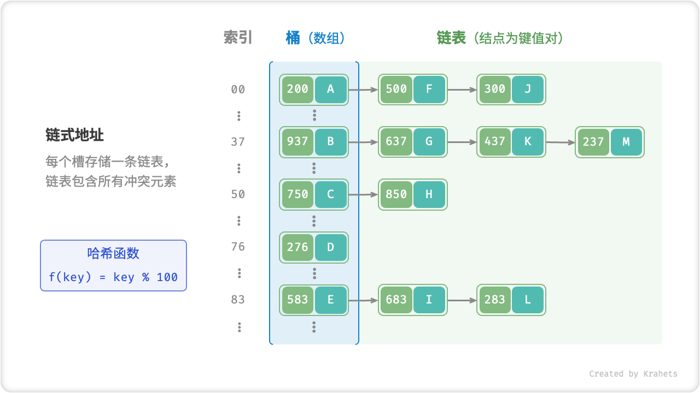
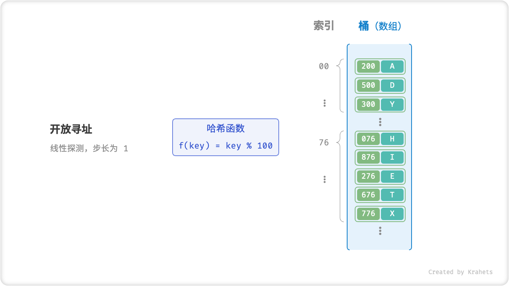

# 哈希冲突

理想情况下，哈希函数应该为每个输入产生唯一的输出，使得 key 和 value 一一对应。而实际上，往往存在向哈希函数输入不同的 key 而产生相同输出的情况，这种情况被称为「哈希冲突 Hash Collision」。哈希冲突会导致查询结果错误，从而严重影响哈希表的可用性。

那么，为什么会出现哈希冲突呢？本质上看，**由于哈希函数的输入空间往往远大于输出空间**，因此不可避免地会出现多个输入产生相同输出的情况，即为哈希冲突。比如，输入空间是全体整数，输出空间是一个固定大小的桶（数组）的索引范围，那么必定会有多个整数同时映射到一个桶索引。

为了缓解哈希冲突，一方面，**我们可以通过哈希表扩容来减小冲突概率**。极端情况下，当输入空间和输出空间大小相等时，哈希表就等价于数组了，可谓“大力出奇迹”。

另一方面，**考虑通过优化哈希表的表示方式以缓解哈希冲突**，常见的方法有「链式地址」和「开放寻址」。

## 哈希表扩容

「负载因子 Load Factor」定义为 **哈希表中元素数量除以桶槽数量（即数组大小）**，代表哈希冲突的严重程度。

**负载因子常用作哈希表扩容的触发条件**。比如在 Java 中，当负载因子 $> 0.75$ 时则触发扩容，将 HashMap 大小扩充至原先的 $2$ 倍。

与数组扩容类似，**哈希表扩容操作的开销很大**，因为需要将所有键值对从原哈希表依次移动至新哈希表。

## 链式地址

在原始哈希表中，桶内的每个地址只能存储一个元素（即键值对）。**考虑将单个元素转化成一个链表，将所有冲突元素都存储在一个链表中**。

链式地址下，哈希表操作方法为：

- **查询元素**：先将 key 输入到哈希函数得到桶内索引，即可访问链表头结点，再通过遍历链表查找对应 value 。
- **添加元素**：先通过哈希函数访问链表头部，再将结点（即键值对）添加到链表头部即可。
- **删除元素**：同样先根据哈希函数结果访问链表头部，再遍历链表查找对应结点，删除之即可。

链式地址虽然解决了哈希冲突问题，但仍存在局限性，包括：

- **占用空间变大**，因为链表或二叉树包含结点指针，相比于数组更加耗费内存空间；
- **查询效率降低**，因为需要线性遍历链表来查找对应元素；

为了提升操作效率，**可以把「链表」转化为「AVL 树」或「红黑树」**，将查询操作的时间复杂度优化至 $O(\log n)$ 。

## 开放寻址

「开放寻址」不引入额外数据结构，而是通过“多次探测”来解决哈希冲突。根据探测方法的不同，主要分为 **线性探测、平方探测、多次哈希**。

### 线性探测

「线性探测」使用固定步长的线性查找来解决哈希冲突。

**插入元素**：如果出现哈希冲突，则从冲突位置向后线性遍历（步长一般取 1 ），直到找到一个空位，则将元素插入到该空位中。

**查找元素**：若出现哈希冲突，则使用相同步长执行线性查找，会遇到两种情况：

1. 找到对应元素，返回 value 即可；
2. 若遇到空位，则说明查找键值对不在哈希表中；

线性探测存在以下缺陷：

- **不能直接删除元素**。删除元素会导致桶内出现一个空位，在查找其他元素时，该空位有可能导致程序认为元素不存在（即上述第 `2.` 种情况）。因此需要借助一个标志位来标记删除元素。
- **容易产生聚集**。桶内被占用的连续位置越长，这些连续位置发生哈希冲突的可能性越大，从而进一步促进这一位置的“聚堆生长”，最终导致增删查改操作效率的劣化。

### 多次哈希

顾名思义，「多次哈希」的思路是使用多个哈希函数 $f_1(x)$ , $f_2(x)$ , $f_3(x)$ , $\cdots$ 进行探测。

**插入元素**：若哈希函数 $f_1(x)$ 出现冲突，则尝试 $f_2(x)$ ，以此类推……直到找到空位后插入元素。

**查找元素**：以相同的哈希函数顺序查找，存在两种情况：

1. 找到目标元素，则返回之；
2. 到空位或已尝试所有哈希函数，说明哈希表中无此元素；

相比于「线性探测」，「多次哈希」方法更不容易产生聚集，代价是多个哈希函数增加了额外计算量。

!!! note "工业界方案"

    Java 采用「链式地址」。在 JDK 1.8 之后，HashMap 内数组长度大于 64 时，长度大于 8 的链表会被转化为「红黑树」，以提升查找性能。

    Python 采用「开放寻址」。字典 dict 使用伪随机数进行探测。 
