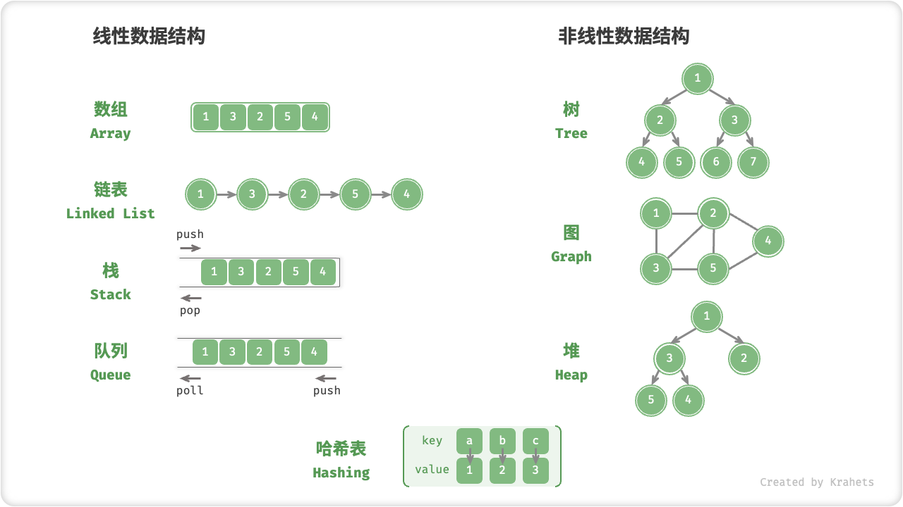
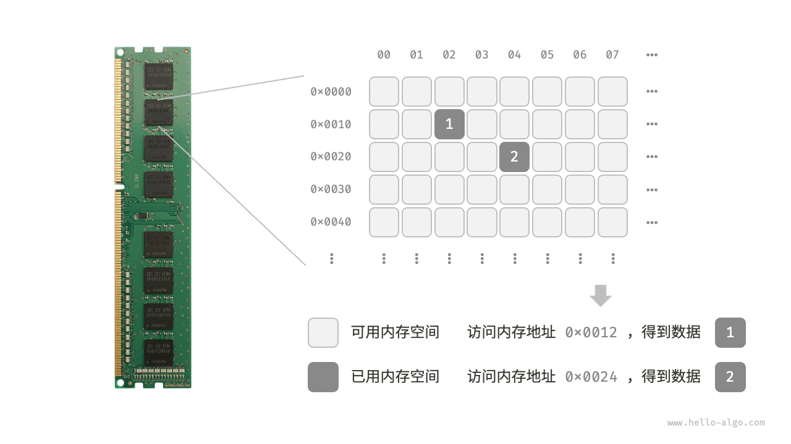
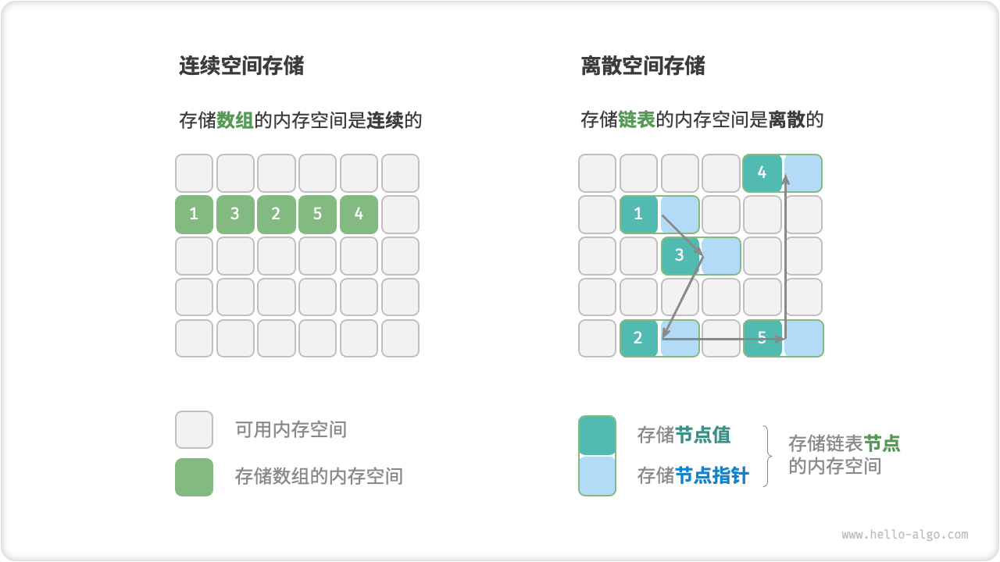

# 数据结构分类

常见的数据结构包括数组、链表、栈、队列、哈希表、树、堆、图，它们可以从“逻辑结构”和“物理结构”两个维度进行分类。

## 逻辑结构：线性与非线性

**逻辑结构揭示了数据元素之间的逻辑关系**。在数组和链表中，数据按照顺序依次排列，体现了数据之间的线性关系；而在树中，数据从顶部向下按层次排列，表现出祖先与后代之间的派生关系；图则由节点和边构成，反映了复杂的网络关系。

如下图所示，逻辑结构可被分为“线性”和“非线性”两大类。线性结构比较直观，指数据在逻辑关系上呈线性排列；非线性结构则相反，呈非线性排列。

- **线性数据结构**：数组、链表、栈、队列、哈希表。
- **非线性数据结构**：树、堆、图、哈希表。

非线性数据结构可以进一步被划分为树形结构和网状结构。

- **线性结构**：数组、链表、队列、栈、哈希表，元素之间是一对一的顺序关系。
- **树形结构**：树、堆、哈希表，元素之间是一对多的关系。
- **网状结构**：图，元素之间是多对多的关系。

## 物理结构：连续与离散

在计算机中，内存和硬盘是两种主要的存储硬件设备。硬盘主要用于长期存储数据，容量较大（通常可达到 TB 级别）、速度较慢。内存用于运行程序时暂存数据，速度较快，但容量较小（通常为 GB 级别）。

**在算法运行过程中，相关数据都存储在内存中**。下图展示了一个计算机内存条，其中每个黑色方块都包含一块内存空间。我们可以将内存想象成一个巨大的 Excel 表格，其中每个单元格都可以存储一定大小的数据，在算法运行时，所有数据都被存储在这些单元格中。

**系统通过内存地址来访问目标位置的数据**。如下图所示，计算机根据特定规则为表格中的每个单元格分配编号，确保每个内存空间都有唯一的内存地址。有了这些地址，程序便可以访问内存中的数据。

内存是所有程序的共享资源，当某块内存被某个程序占用时，则无法被其他程序同时使用了。**因此在数据结构与算法的设计中，内存资源是一个重要的考虑因素**。比如，算法所占用的内存峰值不应超过系统剩余空闲内存；如果缺少连续大块的内存空间，那么所选用的数据结构必须能够存储在离散的内存空间内。

如下图所示，**物理结构反映了数据在计算机内存中的存储方式**，可分为连续空间存储（数组）和离散空间存储（链表）。物理结构从底层决定了数据的访问、更新、增删等操作方法，同时在时间效率和空间效率方面呈现出互补的特点。

值得说明的是，**所有数据结构都是基于数组、链表或二者的组合实现的**。例如，栈和队列既可以使用数组实现，也可以使用链表实现；而哈希表的实现可能同时包含数组和链表。

- **基于数组可实现**：栈、队列、哈希表、树、堆、图、矩阵、张量（维度 $\geq 3$ 的数组）等。
- **基于链表可实现**：栈、队列、哈希表、树、堆、图等。

基于数组实现的数据结构也被称为“静态数据结构”，这意味着此类数据结构在初始化后长度不可变。相对应地，基于链表实现的数据结构被称为“动态数据结构”，这类数据结构在初始化后，仍可以在程序运行过程中对其长度进行调整。

!!! tip

    如果你感觉物理结构理解起来有困难，建议先阅读下一章“数组与链表”，然后再回顾本节内容。
