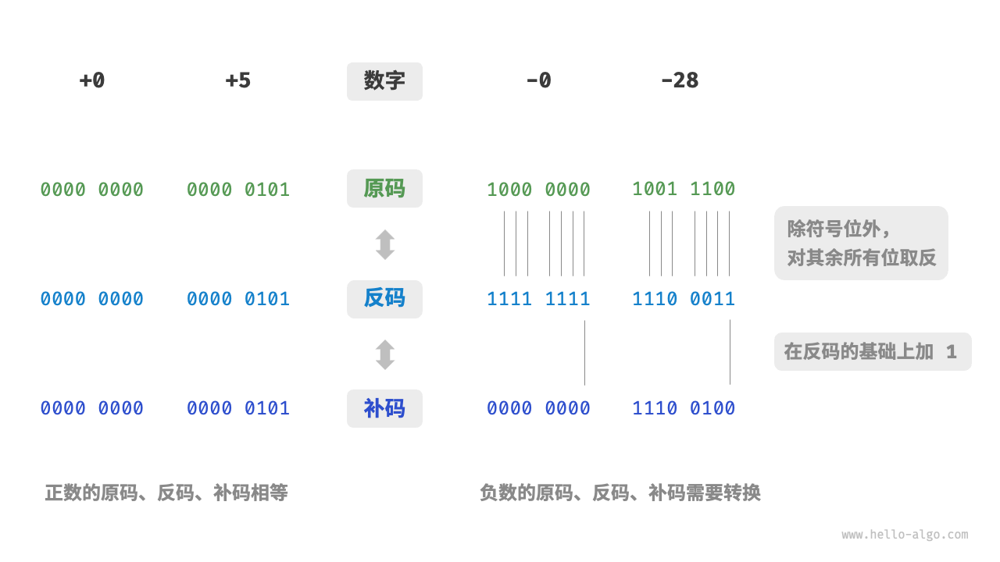
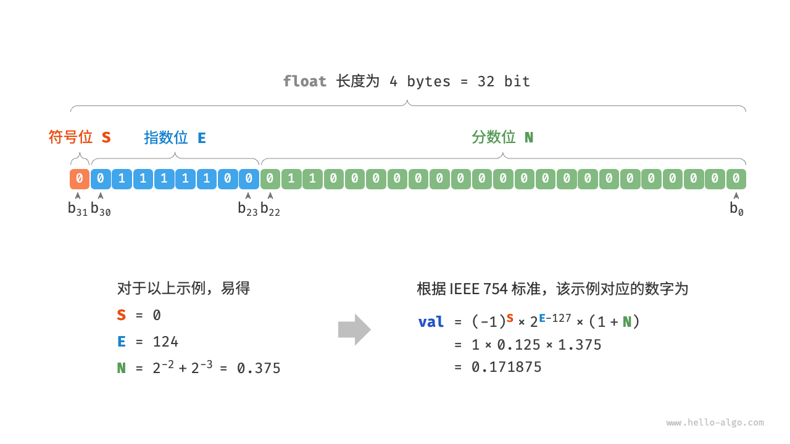

# 数字编码 *

!!! note

    在本书中，标题带有 * 符号的是选读章节。如果你时间有限或感到理解困难，可以先跳过，等学完必读章节后再单独攻克。

## 原码、反码和补码

在上一节的表格中我们发现，所有整数类型能够表示的负数都比正数多一个，例如 `byte` 的取值范围是 $[-128, 127]$ 。这个现象比较反直觉，它的内在原因涉及原码、反码、补码的相关知识。

首先需要指出，**数字是以“补码”的形式存储在计算机中的**。在分析这样做的原因之前，首先给出三者的定义。

- **原码**：我们将数字的二进制表示的最高位视为符号位，其中 $0$ 表示正数，$1$ 表示负数，其余位表示数字的值。
- **反码**：正数的反码与其原码相同，负数的反码是对其原码除符号位外的所有位取反。
- **补码**：正数的补码与其原码相同，负数的补码是在其反码的基础上加 $1$ 。

下图展示了原码、反码和补码之间的转换方法。

<u>原码（sign-magnitude）</u>虽然最直观，但存在一些局限性。一方面，**负数的原码不能直接用于运算**。例如在原码下计算 $1 + (-2)$ ，得到的结果是 $-3$ ，这显然是不对的。

$$
\begin{aligned}
& 1 + (-2) \newline
& \rightarrow 0000 \; 0001 + 1000 \; 0010 \newline
& = 1000 \; 0011 \newline
& \rightarrow -3
\end{aligned}
$$

为了解决此问题，计算机引入了<u>反码（1's complement）</u>。如果我们先将原码转换为反码，并在反码下计算 $1 + (-2)$ ，最后将结果从反码转换回原码，则可得到正确结果 $-1$ 。

$$
\begin{aligned}
& 1 + (-2) \newline
& \rightarrow 0000 \; 0001 \; \text{(原码)} + 1000 \; 0010 \; \text{(原码)} \newline
& = 0000 \; 0001 \; \text{(反码)} + 1111  \; 1101 \; \text{(反码)} \newline
& = 1111 \; 1110 \; \text{(反码)} \newline
& = 1000 \; 0001 \; \text{(原码)} \newline
& \rightarrow -1
\end{aligned}
$$

另一方面，**数字零的原码有 $+0$ 和 $-0$ 两种表示方式**。这意味着数字零对应两个不同的二进制编码，这可能会带来歧义。比如在条件判断中，如果没有区分正零和负零，则可能会导致判断结果出错。而如果我们想处理正零和负零歧义，则需要引入额外的判断操作，这可能会降低计算机的运算效率。

$$
\begin{aligned}
+0 & \rightarrow 0000 \; 0000 \newline
-0 & \rightarrow 1000 \; 0000
\end{aligned}
$$

与原码一样，反码也存在正负零歧义问题，因此计算机进一步引入了<u>补码（2's complement）</u>。我们先来观察一下负零的原码、反码、补码的转换过程：

$$
\begin{aligned}
-0 \rightarrow \; & 1000 \; 0000 \; \text{(原码)} \newline
= \; & 1111 \; 1111 \; \text{(反码)} \newline
= 1 \; & 0000 \; 0000 \; \text{(补码)} \newline
\end{aligned}
$$

在负零的反码基础上加 $1$ 会产生进位，但 `byte` 类型的长度只有 8 位，因此溢出到第 9 位的 $1$ 会被舍弃。也就是说，**负零的补码为 $0000 \; 0000$ ，与正零的补码相同**。这意味着在补码表示中只存在一个零，正负零歧义从而得到解决。

还剩最后一个疑惑：`byte` 类型的取值范围是 $[-128, 127]$ ，多出来的一个负数 $-128$ 是如何得到的呢？我们注意到，区间 $[-127, +127]$ 内的所有整数都有对应的原码、反码和补码，并且原码和补码之间可以互相转换。

然而，**补码 $1000 \; 0000$ 是一个例外，它并没有对应的原码**。根据转换方法，我们得到该补码的原码为 $0000 \; 0000$ 。这显然是矛盾的，因为该原码表示数字 $0$ ，它的补码应该是自身。计算机规定这个特殊的补码 $1000 \; 0000$ 代表 $-128$ 。实际上，$(-1) + (-127)$ 在补码下的计算结果就是 $-128$ 。

$$
\begin{aligned}
& (-127) + (-1) \newline
& \rightarrow 1111 \; 1111 \; \text{(原码)} + 1000 \; 0001 \; \text{(原码)} \newline
& = 1000 \; 0000 \; \text{(反码)} + 1111  \; 1110 \; \text{(反码)} \newline
& = 1000 \; 0001 \; \text{(补码)} + 1111  \; 1111 \; \text{(补码)} \newline
& = 1000 \; 0000 \; \text{(补码)} \newline
& \rightarrow -128
\end{aligned}
$$

你可能已经发现了，上述所有计算都是加法运算。这暗示着一个重要事实：**计算机内部的硬件电路主要是基于加法运算设计的**。这是因为加法运算相对于其他运算（比如乘法、除法和减法）来说，硬件实现起来更简单，更容易进行并行化处理，运算速度更快。

请注意，这并不意味着计算机只能做加法。**通过将加法与一些基本逻辑运算结合，计算机能够实现各种其他的数学运算**。例如，计算减法 $a - b$ 可以转换为计算加法 $a + (-b)$ ；计算乘法和除法可以转换为计算多次加法或减法。

现在我们可以总结出计算机使用补码的原因：基于补码表示，计算机可以用同样的电路和操作来处理正数和负数的加法，不需要设计特殊的硬件电路来处理减法，并且无须特别处理正负零的歧义问题。这大大简化了硬件设计，提高了运算效率。

补码的设计非常精妙，因篇幅关系我们就先介绍到这里，建议有兴趣的读者进一步深入了解。

## 浮点数编码

细心的你可能会发现：`int` 和 `float` 长度相同，都是 4 字节 ，但为什么 `float` 的取值范围远大于 `int` ？这非常反直觉，因为按理说 `float` 需要表示小数，取值范围应该变小才对。

实际上，**这是因为浮点数 `float` 采用了不同的表示方式**。记一个 32 比特长度的二进制数为：

$$
b_{31} b_{30} b_{29} \ldots b_2 b_1 b_0
$$

根据 IEEE 754 标准，32-bit 长度的 `float` 由以下三个部分构成。

- 符号位 $\mathrm{S}$ ：占 1 位 ，对应 $b_{31}$ 。
- 指数位 $\mathrm{E}$ ：占 8 位 ，对应 $b_{30} b_{29} \ldots b_{23}$ 。
- 分数位 $\mathrm{N}$ ：占 23 位 ，对应 $b_{22} b_{21} \ldots b_0$ 。

二进制数 `float` 对应值的计算方法为：

$$
\text {val} = (-1)^{b_{31}} \times 2^{\left(b_{30} b_{29} \ldots b_{23}\right)_2-127} \times\left(1 . b_{22} b_{21} \ldots b_0\right)_2
$$

转化到十进制下的计算公式为：

$$
\text {val}=(-1)^{\mathrm{S}} \times 2^{\mathrm{E} -127} \times (1 + \mathrm{N})
$$

其中各项的取值范围为：

$$
\begin{aligned}
\mathrm{S} \in & \{ 0, 1\}, \quad \mathrm{E} \in \{ 1, 2, \dots, 254 \} \newline
(1 + \mathrm{N}) = & (1 + \sum_{i=1}^{23} b_{23-i} 2^{-i}) \subset [1, 2 - 2^{-23}]
\end{aligned}
$$

观察上图，给定一个示例数据 $\mathrm{S} = 0$ ， $\mathrm{E} = 124$ ，$\mathrm{N} = 2^{-2} + 2^{-3} = 0.375$ ，则有：

$$
\text { val } = (-1)^0 \times 2^{124 - 127} \times (1 + 0.375) = 0.171875
$$

现在我们可以回答最初的问题：**`float` 的表示方式包含指数位，导致其取值范围远大于 `int`** 。根据以上计算，`float` 可表示的最大正数为 $2^{254 - 127} \times (2 - 2^{-23}) \approx 3.4 \times 10^{38}$ ，切换符号位便可得到最小负数。

**尽管浮点数 `float` 扩展了取值范围，但其副作用是牺牲了精度**。整数类型 `int` 将全部 32 比特用于表示数字，数字是均匀分布的；而由于指数位的存在，浮点数 `float` 的数值越大，相邻两个数字之间的差值就会趋向越大。

如下表所示，指数位 $\mathrm{E} = 0$ 和 $\mathrm{E} = 255$ 具有特殊含义，**用于表示零、无穷大、$\mathrm{NaN}$ 等**。

 表 <id> &nbsp; 指数位含义 

| 指数位 E           | 分数位 $\mathrm{N} = 0$ | 分数位 $\mathrm{N} \ne 0$ | 计算公式                                                               |
| ------------------ | ----------------------- | ------------------------- | ---------------------------------------------------------------------- |
| $0$                | $\pm 0$                 | 次正规数                  | $(-1)^{\mathrm{S}} \times 2^{-126} \times (0.\mathrm{N})$              |
| $1, 2, \dots, 254$ | 正规数                  | 正规数                    | $(-1)^{\mathrm{S}} \times 2^{(\mathrm{E} -127)} \times (1.\mathrm{N})$ |
| $255$              | $\pm \infty$            | $\mathrm{NaN}$            |                                                                        |

值得说明的是，次正规数显著提升了浮点数的精度。最小正正规数为 $2^{-126}$ ，最小正次正规数为 $2^{-126} \times 2^{-23}$ 。

双精度 `double` 也采用类似于 `float` 的表示方法，在此不做赘述。
