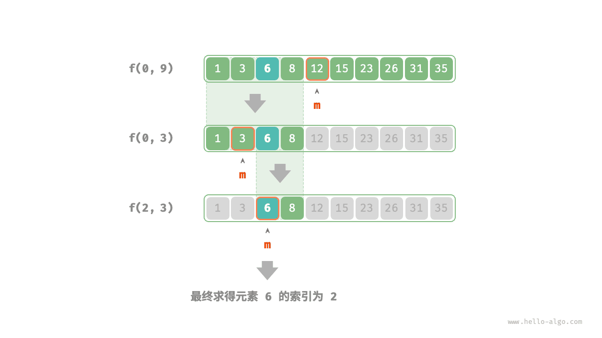

# 分治搜索策略

我们已经学过，搜索算法分为两大类：暴力搜索、自适应搜索。暴力搜索的时间复杂度为 $O(n)$ 。自适应搜索利用特有的数据组织形式或先验信息，可达到 $O(\log n)$ 甚至 $O(1)$ 的时间复杂度。

### 基于分治的搜索算法

实际上，**$O(\log n)$ 的搜索算法通常都是基于分治策略实现的**，例如：

- 二分查找的每一步都将问题（在数组中搜索目标元素）分解为一个小问题（在数组的一半中搜索目标元素），这个过程一直持续到数组为空或找到目标元素为止。
- 树是分治关系的代表，在二叉搜索树、AVL 树、堆等数据结构中，各种操作的时间复杂度皆为 $O(\log n)$ 。

分治之所以能够提升搜索效率，是因为暴力搜索每轮只能排除一个选项，**而基于分治的搜索每轮可以排除一半选项**。

### 基于分治实现二分

接下来，我们尝试从分治策略的角度分析二分查找的性质：

- **问题可以被分解**：二分查找递归地将原问题（在数组中进行查找）分解为子问题（在数组的一半中进行查找），这是通过比较中间元素和目标元素来实现的。
- **子问题是独立的**：在二分查找中，每轮只处理一个子问题，它不受另外子问题的影响。
- **子问题的解无需合并**：二分查找旨在查找一个特定元素，因此不需要将子问题的解进行合并。当子问题得到解决时，原问题也会同时得到解决。

在之前章节中，我们基于递推（迭代）实现二分查找。现在，我们尝试基于递归分治来实现它。

问题定义为：**在数组 `nums` 的区间 $[i, j]$ 内查找元素 `target`** ，记为 $f(i, j)$ 。

设数组长度为 $n$ ，则二分查找的流程为：从原问题 $f(0, n-1)$ 开始，每轮排除一半索引区间，递归求解规模减小一半的子问题，直至找到 `target` 或区间为空时返回。

下图展示了在数组中二分查找目标元素 $6$ 的分治过程。



如下代码所示，我们声明一个递归函数 `dfs()` 来求解问题 $f(i, j)$ 。

=== "Java"

    ```java title="binary_search_recur.java"
    [class]{binary_search_recur}-[func]{dfs}

    [class]{binary_search_recur}-[func]{binarySearch}
    ```

=== "C++"

    ```cpp title="binary_search_recur.cpp"
    [class]{}-[func]{dfs}

    [class]{}-[func]{binarySearch}
    ```

=== "Python"

    ```python title="binary_search_recur.py"
    [class]{}-[func]{dfs}

    [class]{}-[func]{binary_search}
    ```

=== "Go"

    ```go title="binary_search_recur.go"
    [class]{}-[func]{dfs}

    [class]{}-[func]{binarySearch}
    ```

=== "JavaScript"

    ```javascript title="binary_search_recur.js"
    [class]{}-[func]{dfs}

    [class]{}-[func]{binarySearch}
    ```

=== "TypeScript"

    ```typescript title="binary_search_recur.ts"
    [class]{}-[func]{dfs}

    [class]{}-[func]{binarySearch}
    ```

=== "C"

    ```c title="binary_search_recur.c"
    [class]{}-[func]{dfs}

    [class]{}-[func]{binarySearch}
    ```

=== "C#"

    ```csharp title="binary_search_recur.cs"
    [class]{binary_search_recur}-[func]{dfs}

    [class]{binary_search_recur}-[func]{binarySearch}
    ```

=== "Swift"

    ```swift title="binary_search_recur.swift"
    [class]{}-[func]{dfs}

    [class]{}-[func]{binarySearch}
    ```

=== "Zig"

    ```zig title="binary_search_recur.zig"
    [class]{}-[func]{dfs}

    [class]{}-[func]{binarySearch}
    ```

=== "Dart"

    ```dart title="binary_search_recur.dart"
    [class]{}-[func]{dfs}

    [class]{}-[func]{binarySearch}
    ```
