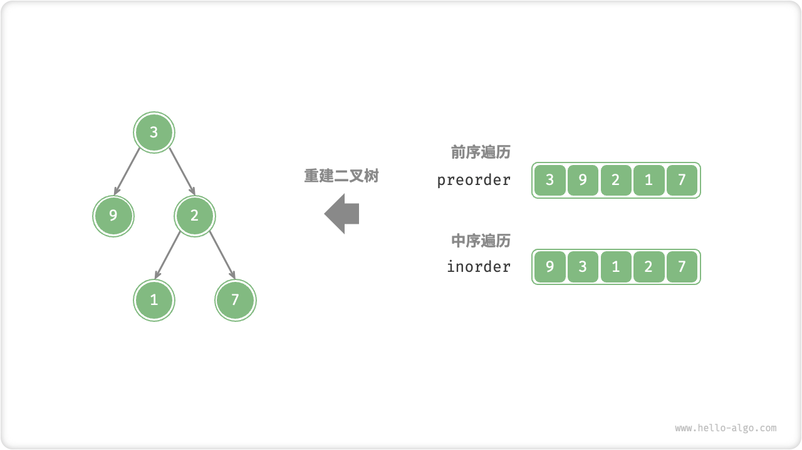
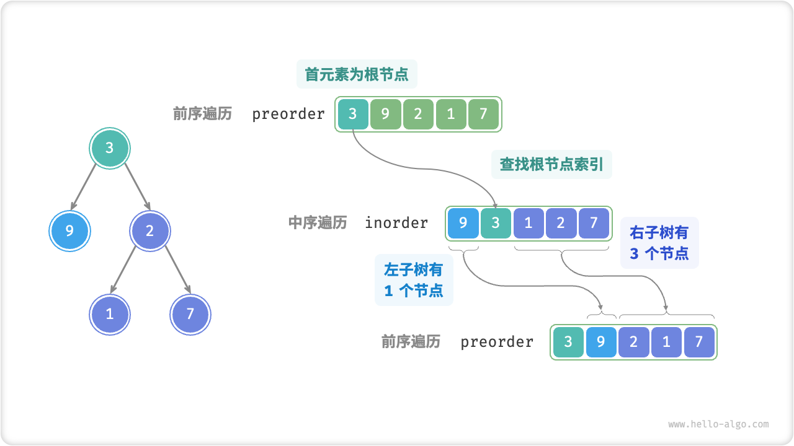
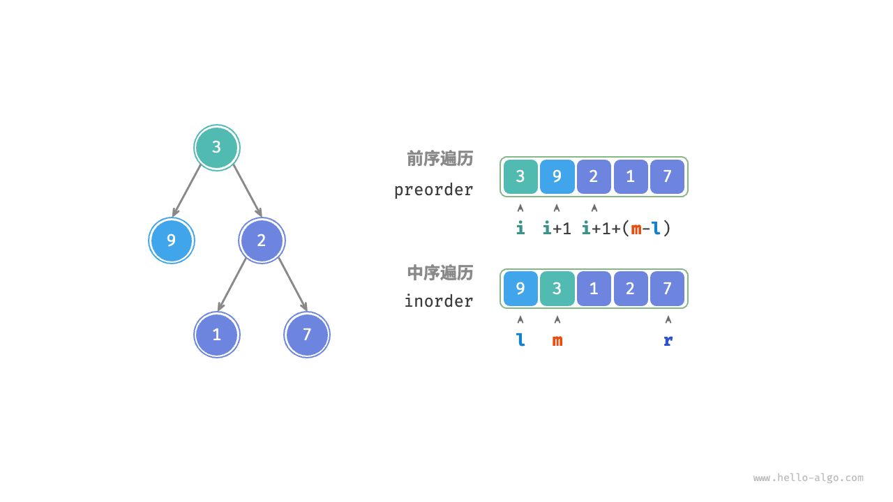
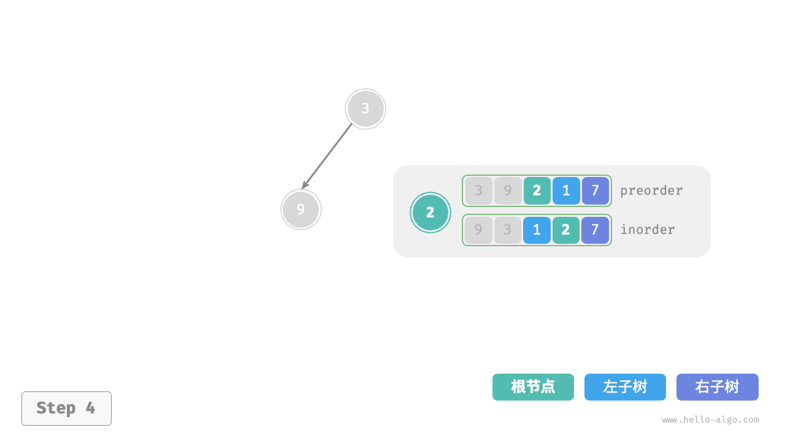
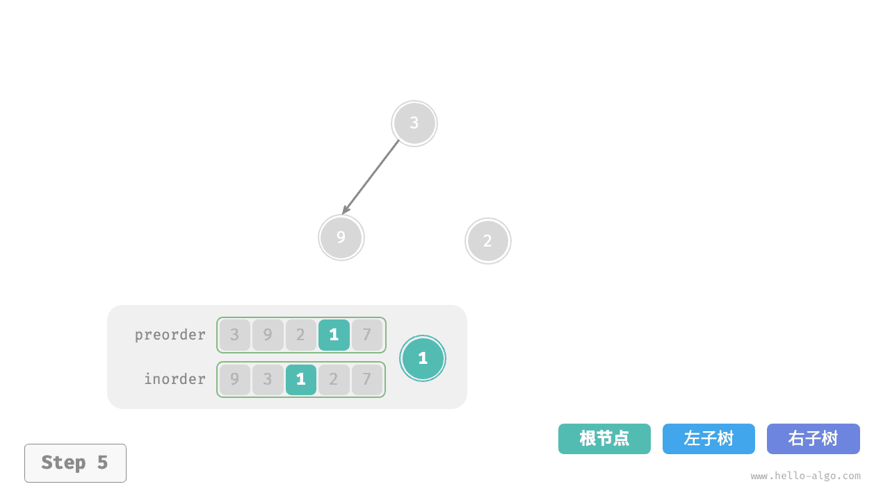
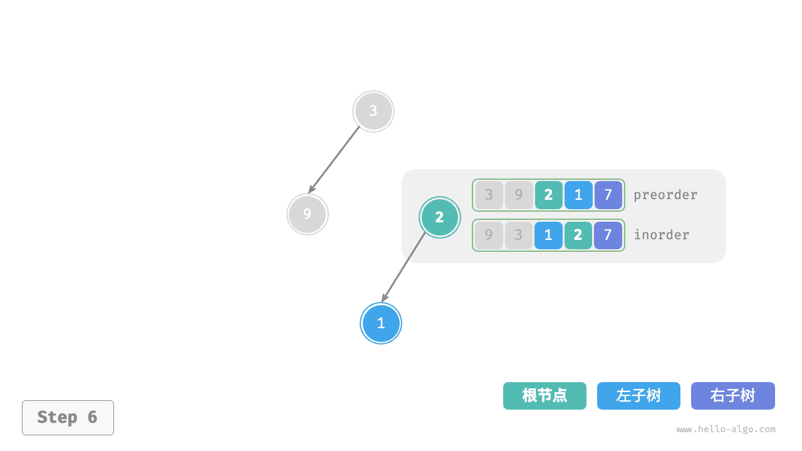
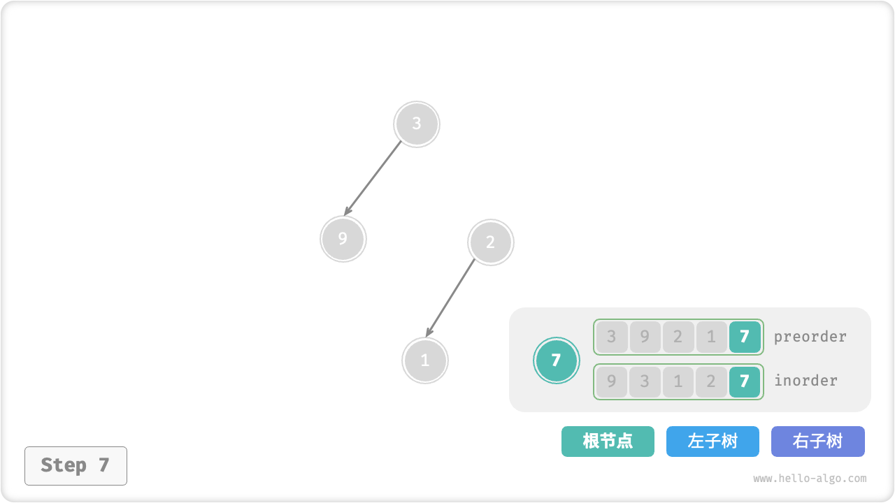
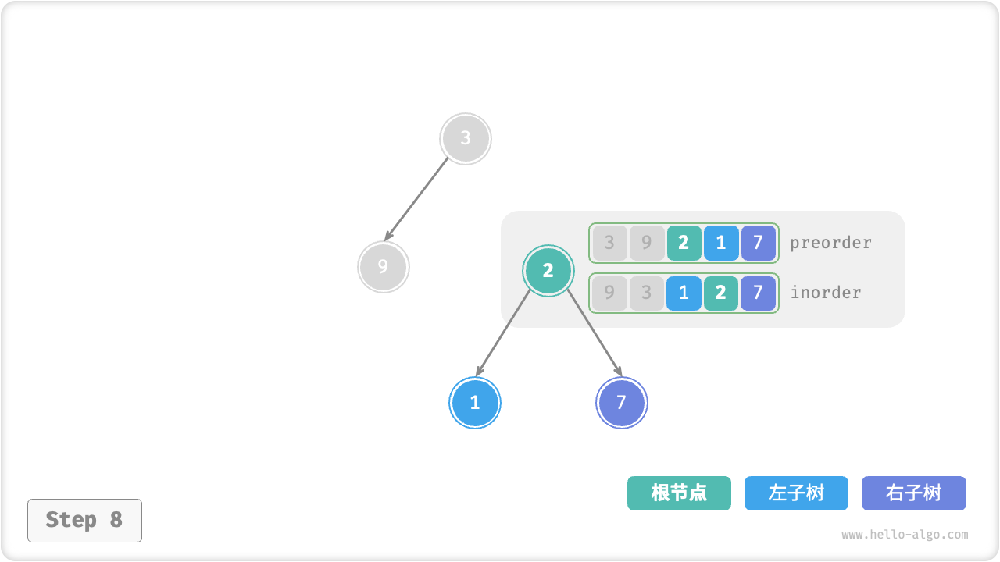
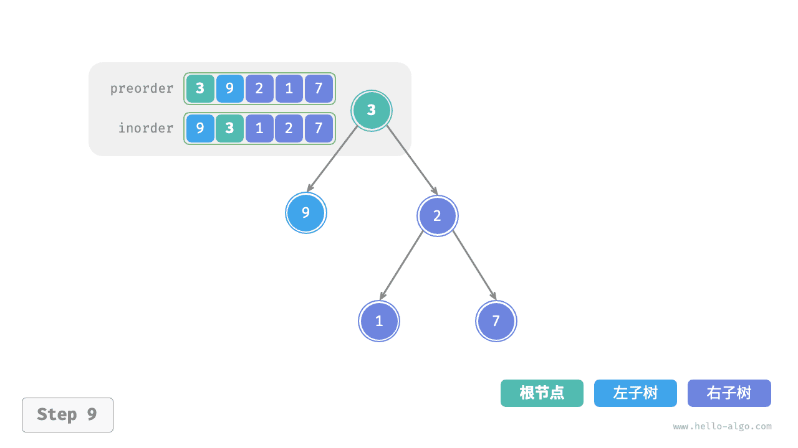

# 构建二叉树问题

!!! question

    给定一棵二叉树的前序遍历 `preorder` 和中序遍历 `inorder` ，请从中构建二叉树，返回二叉树的根节点。假设二叉树中没有值重复的节点（如下图所示）。



### 判断是否为分治问题

原问题定义为从 `preorder` 和 `inorder` 构建二叉树，是一个典型的分治问题。

- **问题可以分解**：从分治的角度切入，我们可以将原问题划分为两个子问题：构建左子树、构建右子树，加上一步操作：初始化根节点。而对于每棵子树（子问题），我们仍然可以复用以上划分方法，将其划分为更小的子树（子问题），直至达到最小子问题（空子树）时终止。
- **子问题是独立的**：左子树和右子树是相互独立的，它们之间没有交集。在构建左子树时，我们只需关注中序遍历和前序遍历中与左子树对应的部分。右子树同理。
- **子问题的解可以合并**：一旦得到了左子树和右子树（子问题的解），我们就可以将它们链接到根节点上，得到原问题的解。

### 如何划分子树

根据以上分析，这道题可以使用分治来求解，**但如何通过前序遍历 `preorder` 和中序遍历 `inorder` 来划分左子树和右子树呢**？

根据定义，`preorder` 和 `inorder` 都可以划分为三个部分。

- 前序遍历：`[ 根节点 | 左子树 | 右子树 ]` ，例如上图的树对应 `[ 3 | 9 | 2 1 7 ]` 。
- 中序遍历：`[ 左子树 | 根节点 ｜ 右子树 ]` ，例如上图的树对应 `[ 9 | 3 | 1 2 7 ]` 。

以上图数据为例，我们可以通过下图所示的步骤得到划分结果。

1. 前序遍历的首元素 3 是根节点的值。
2. 查找根节点 3 在 `inorder` 中的索引，利用该索引可将 `inorder` 划分为 `[ 9 | 3 ｜ 1 2 7 ]` 。
3. 根据 `inorder` 的划分结果，易得左子树和右子树的节点数量分别为 1 和 3 ，从而可将 `preorder` 划分为 `[ 3 | 9 | 2 1 7 ]` 。



### 基于变量描述子树区间

根据以上划分方法，**我们已经得到根节点、左子树、右子树在 `preorder` 和 `inorder` 中的索引区间**。而为了描述这些索引区间，我们需要借助几个指针变量。

- 将当前树的根节点在 `preorder` 中的索引记为 $i$ 。
- 将当前树的根节点在 `inorder` 中的索引记为 $m$ 。
- 将当前树在 `inorder` 中的索引区间记为 $[l, r]$ 。

如下表所示，通过以上变量即可表示根节点在 `preorder` 中的索引，以及子树在 `inorder` 中的索引区间。

<p align="center"> 表 <id> &nbsp; 根节点和子树在前序遍历和中序遍历中的索引 </p>

|        | 根节点在 `preorder` 中的索引 | 子树在 `inorder` 中的索引区间 |
| ------ | ---------------------------- | ----------------------------- |
| 当前树 | $i$                          | $[l, r]$                      |
| 左子树 | $i + 1$                      | $[l, m-1]$                    |
| 右子树 | $i + 1 + (m - l)$            | $[m+1, r]$                    |

请注意，右子树根节点索引中的 $(m-l)$ 的含义是“左子树的节点数量”，建议结合下图理解。



### 代码实现

为了提升查询 $m$ 的效率，我们借助一个哈希表 `hmap` 来存储数组 `inorder` 中元素到索引的映射：

```src
[file]{build_tree}-[class]{}-[func]{build_tree}
```

下图展示了构建二叉树的递归过程，各个节点是在向下“递”的过程中建立的，而各条边（引用）是在向上“归”的过程中建立的。

=== "<1>"
    

=== "<2>"
    

=== "<3>"
    

=== "<4>"
    

=== "<5>"
    

=== "<6>"
    

=== "<7>"
    

=== "<8>"
    

=== "<9>"
    

每个递归函数内的前序遍历 `preorder` 和中序遍历 `inorder` 的划分结果如下图所示。


设树的节点数量为 $n$ ，初始化每一个节点（执行一个递归函数 `dfs()` ）使用 $O(1)$ 时间。**因此总体时间复杂度为 $O(n)$** 。

哈希表存储 `inorder` 元素到索引的映射，空间复杂度为 $O(n)$ 。在最差情况下，即二叉树退化为链表时，递归深度达到 $n$ ，使用 $O(n)$ 的栈帧空间。**因此总体空间复杂度为 $O(n)$** 。
