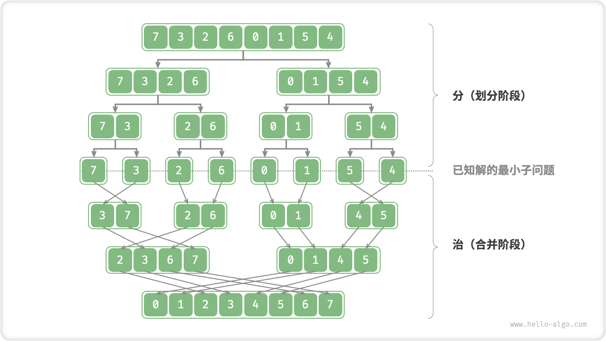
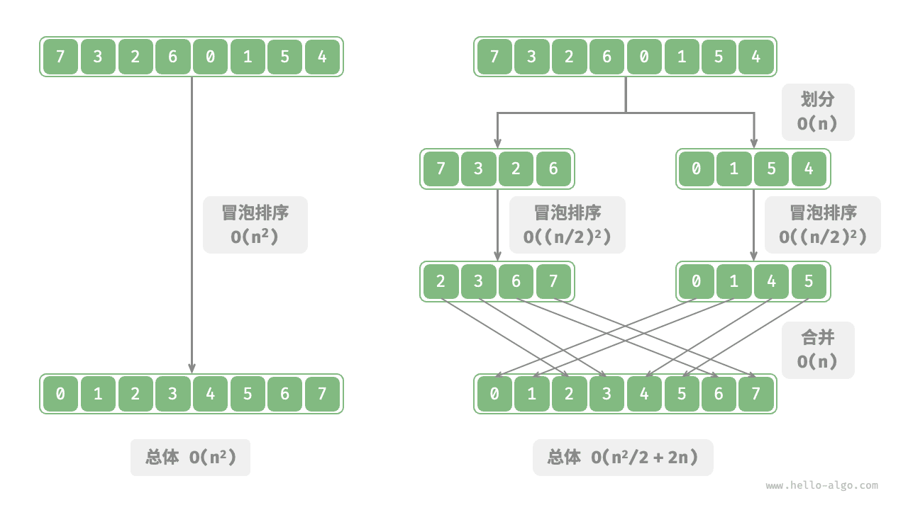
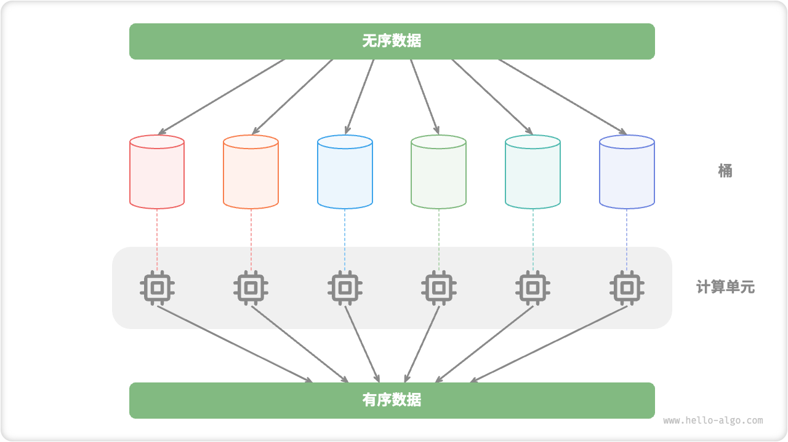

# 分治算法

<u>分治（divide and conquer）</u>，全称分而治之，是一种非常重要且常见的算法策略。分治通常基于递归实现，包括“分”和“治”两个步骤。

1. **分（划分阶段）**：递归地将原问题分解为两个或多个子问题，直至到达最小子问题时终止。
2. **治（合并阶段）**：从已知解的最小子问题开始，从底至顶地将子问题的解进行合并，从而构建出原问题的解。

如下图所示，“归并排序”是分治策略的典型应用之一。

1. **分**：递归地将原数组（原问题）划分为两个子数组（子问题），直到子数组只剩一个元素（最小子问题）。
2. **治**：从底至顶地将有序的子数组（子问题的解）进行合并，从而得到有序的原数组（原问题的解）。

## 如何判断分治问题

一个问题是否适合使用分治解决，通常可以参考以下几个判断依据。

1. **问题可以分解**：原问题可以分解成规模更小、类似的子问题，以及能够以相同方式递归地进行划分。
2. **子问题是独立的**：子问题之间没有重叠，互不依赖，可以独立解决。
3. **子问题的解可以合并**：原问题的解通过合并子问题的解得来。

显然，归并排序满足以上三个判断依据。

1. **问题可以分解**：递归地将数组（原问题）划分为两个子数组（子问题）。
2. **子问题是独立的**：每个子数组都可以独立地进行排序（子问题可以独立进行求解）。
3. **子问题的解可以合并**：两个有序子数组（子问题的解）可以合并为一个有序数组（原问题的解）。

## 通过分治提升效率

**分治不仅可以有效地解决算法问题，往往还可以提升算法效率**。在排序算法中，快速排序、归并排序、堆排序相较于选择、冒泡、插入排序更快，就是因为它们应用了分治策略。

那么，我们不禁发问：**为什么分治可以提升算法效率，其底层逻辑是什么**？换句话说，将大问题分解为多个子问题、解决子问题、将子问题的解合并为原问题的解，这几步的效率为什么比直接解决原问题的效率更高？这个问题可以从操作数量和并行计算两方面来讨论。

### 操作数量优化

以“冒泡排序”为例，其处理一个长度为 $n$ 的数组需要 $O(n^2)$ 时间。假设我们按照下图所示的方式，将数组从中点处分为两个子数组，则划分需要 $O(n)$ 时间，排序每个子数组需要 $O((n / 2)^2)$ 时间，合并两个子数组需要 $O(n)$ 时间，总体时间复杂度为：

$$
O(n + (\frac{n}{2})^2 \times 2 + n) = O(\frac{n^2}{2} + 2n)
$$

接下来，我们计算以下不等式，其左边和右边分别为划分前和划分后的操作总数：

$$
\begin{aligned}
n^2 & > \frac{n^2}{2} + 2n \newline
n^2 - \frac{n^2}{2} - 2n & > 0 \newline
n(n - 4) & > 0
\end{aligned}
$$

**这意味着当 $n > 4$ 时，划分后的操作数量更少，排序效率应该更高**。请注意，划分后的时间复杂度仍然是平方阶 $O(n^2)$ ，只是复杂度中的常数项变小了。

进一步想，**如果我们把子数组不断地再从中点处划分为两个子数组**，直至子数组只剩一个元素时停止划分呢？这种思路实际上就是“归并排序”，时间复杂度为 $O(n \log n)$ 。

再思考，**如果我们多设置几个划分点**，将原数组平均划分为 $k$ 个子数组呢？这种情况与“桶排序”非常类似，它非常适合排序海量数据，理论上时间复杂度可以达到 $O(n + k)$ 。

### 并行计算优化

我们知道，分治生成的子问题是相互独立的，**因此通常可以并行解决**。也就是说，分治不仅可以降低算法的时间复杂度，**还有利于操作系统的并行优化**。

并行优化在多核或多处理器的环境中尤其有效，因为系统可以同时处理多个子问题，更加充分地利用计算资源，从而显著减少总体的运行时间。

比如在下图所示的“桶排序”中，我们将海量的数据平均分配到各个桶中，则可将所有桶的排序任务分散到各个计算单元，完成后再合并结果。

## 分治常见应用

一方面，分治可以用来解决许多经典算法问题。

- **寻找最近点对**：该算法首先将点集分成两部分，然后分别找出两部分中的最近点对，最后找出跨越两部分的最近点对。
- **大整数乘法**：例如 Karatsuba 算法，它将大整数乘法分解为几个较小的整数的乘法和加法。
- **矩阵乘法**：例如 Strassen 算法，它将大矩阵乘法分解为多个小矩阵的乘法和加法。
- **汉诺塔问题**：汉诺塔问题可以通过递归解决，这是典型的分治策略应用。
- **求解逆序对**：在一个序列中，如果前面的数字大于后面的数字，那么这两个数字构成一个逆序对。求解逆序对问题可以利用分治的思想，借助归并排序进行求解。

另一方面，分治在算法和数据结构的设计中应用得非常广泛。

- **二分查找**：二分查找是将有序数组从中点索引处分为两部分，然后根据目标值与中间元素值比较结果，决定排除哪一半区间，并在剩余区间执行相同的二分操作。
- **归并排序**：本节开头已介绍，不再赘述。
- **快速排序**：快速排序是选取一个基准值，然后把数组分为两个子数组，一个子数组的元素比基准值小，另一子数组的元素比基准值大，再对这两部分进行相同的划分操作，直至子数组只剩下一个元素。
- **桶排序**：桶排序的基本思想是将数据分散到多个桶，然后对每个桶内的元素进行排序，最后将各个桶的元素依次取出，从而得到一个有序数组。
- **树**：例如二叉搜索树、AVL 树、红黑树、B 树、B+ 树等，它们的查找、插入和删除等操作都可以视为分治策略的应用。
- **堆**：堆是一种特殊的完全二叉树，其各种操作，如插入、删除和堆化，实际上都隐含了分治的思想。
- **哈希表**：虽然哈希表并不直接应用分治，但某些哈希冲突解决方案间接应用了分治策略，例如，链式地址中的长链表会被转化为红黑树，以提升查询效率。

可以看出，**分治是一种“润物细无声”的算法思想**，隐含在各种算法与数据结构之中。
