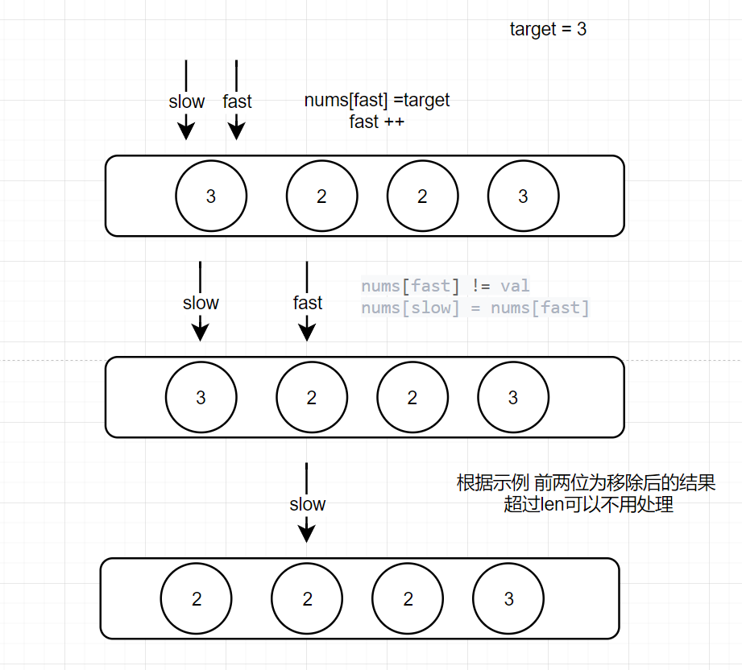
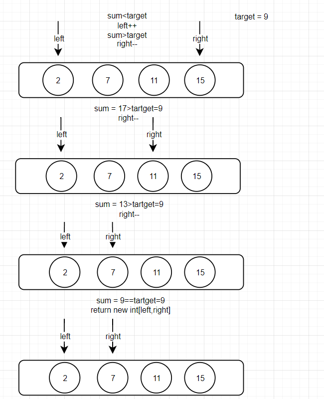

# 算法技巧：双指针

## 双指针思想的理解	

​    	双指针主要用于遍历数组，两个指针指向不同的元素，从而协同完成任务。双指针可以从不同的方向向中间逼近，即**左右指针**，也可以朝着同一个方向遍历，即**快慢指针**。

通俗的说，就是在（数组，链表）遍历中，我们使用两个指针进行操作。所以双指针问题基本有以下几个细节：

1. 双指针的初始位置。
2. 双指针的移动方法。
3. 遍历的结束条件。

## 快慢指针

​			**快慢指针** 指的是两个指针从同一侧开始遍历数组，将这两个指针分别定义为`快指针（fast）`和`慢指针（slow）`，两个指针以不同的策略移动，直到两个指针的值相等（或其他特殊条件）为止，如快指针（fast）每次增长两个，慢指针（slow）每次增长一个。

**PS**：

慢指针（slow）一般指向数组的第一个元素
快指针（fast）一般指向数组的第一个元素

用一个小案例理解快慢指针在数组中的作用

### [移除数组中的元素](https://leetcode.cn/problems/remove-element/)

有一个数组nums 我们需要根据输入的 `target`来移除数组中的元素，不需要考虑数组中超出新长度后面的元素

例如数组内容是：[3, 2, 2, 3]   target = 3

那么函数返回的长度应该是 2 （取出3之后只需要数组前两位是正确的也就是 [2,2] 就算成功 后续的不用考虑）

### 示例思路图




根据示例图思路我们此时再讲述快慢双指针的使用方法 :

1. 一般来说 fast指针与slow指针的按照区间前后移动 在移动的过程中去处理数据

2. 其实快慢指针的移动区间不一定是非要 fast+2 slow+1 区间可以根据不同需要灵活变化

3. 一般来说使用快慢双指针的复杂度是 O(N)

### 解题 Code

=== "Java"

    ```java title="double_pointer.java"
       public static void main(String[] args) {
            int[] arr = {3,2,2,3};
            int res = removeElement(arr, 3);
            System.out.println("有效长度"+res+" :"+" 数组内的数据"+ Arrays.toString(arr));
        }
    
        // 快慢指针案例
        static int removeElement(int[] nums, int val) {
            int fast = 0, slow = 0;
            while (fast < nums.length) {
                // 如果等于target那么fast++，slow记录命中的下表等到fast找到不等于的时候替换slow
                if (nums[fast] != val) {
                    nums[slow] = nums[fast];
                    slow++;
                }
                fast++;
            }
            return slow;
        }
    ```


## 左右指针

这里引用一道入门的数组题目的双指针解法来理解对撞双指针

### [两数之和 II](https://leetcode.cn/problems/two-sum-ii-input-array-is-sorted/)

给你一个下标从 **1** 开始的整数数组 `numbers` ，该数组已按 **非递减顺序排列**和一个整数目标值 target，请你在该数组中找出 和为目标值 target  的那 两个 整数，并返回它们的数组下标。

你可以假设每种输入只会对应一个答案。但是，数组中同一个元素在答案里不能重复出现。

**示例 ：**

输入：nums = [2,7,11,15], target = 9
输出：[0,1]
解释：因为 nums[0] + nums[1] == 9 ，返回 [0, 1] 

### 示例思路图



根据示例图思路我们此时再讲述相向左右双指针的使用方法 :

1. 根据条件判断去调整left和right指针的位置 来达到想要的效果

2. 一般来说使用左右双指针的复杂度是 O(N)

### 解题 Code

=== "Java"

    ```java title="double_pointer.java"
       public static void main(String[] args) {
            int[] arr = {2,7,11,15};
            int[] result = twoSum(arr, 9);
            System.out.println("结果集:"+ Arrays.toString(result));
        }
    
       // 相向左右指针案例
        static int[] twoSum(int[] nums, int target) {
            // 一左一右两个指针相向而行
            int left = 0, right = nums.length - 1;
            while (left < right) {
                int sum = nums[left] + nums[right];
                if (sum == target) {
                    return new int[]{left, right};
                } else if (sum < target) {
                    left++; // 让 sum 大一点
                } else if (sum > target) {
                    right--; // 让 sum 小一点
                }
            }
            return new int[]{-1, -1};
        }
    ```

## 总结

快慢指针和左右指针都是使用双指针的技巧:

1. 快慢指针一般应用于需要遍历比较或者是数组，链表的元素操作

2. 左右指针一般应用于数组内的元素操作上

双指针的技巧就是为了简化我们在遍历的时候函数的复杂度，很多需要嵌套循环才能解决的问题 用双指针往往可以获得优化。