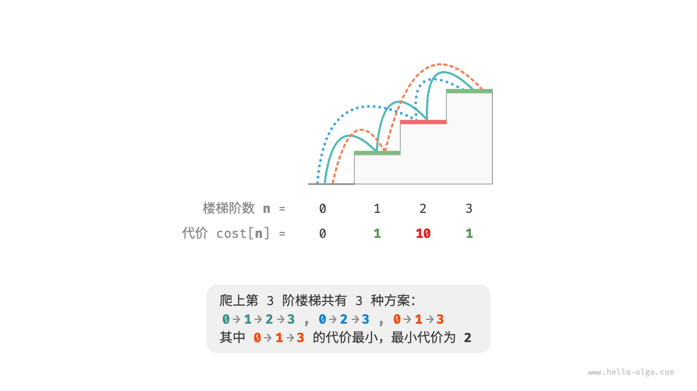
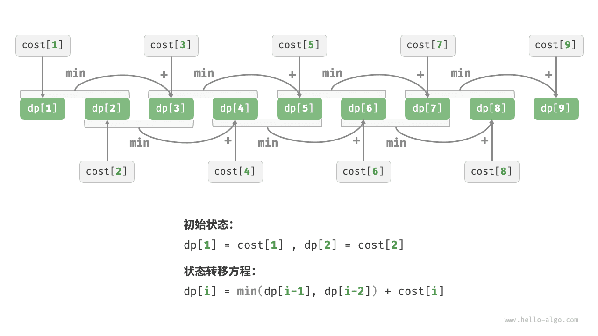
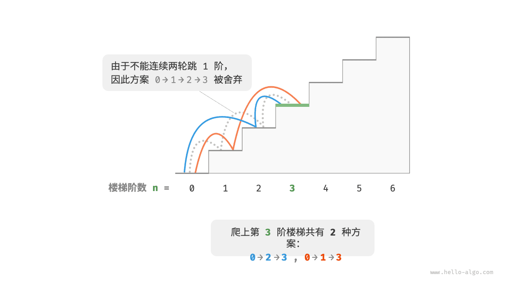

# 动态规划问题特性

在上一节中，我们学习了动态规划是如何通过子问题分解来求解原问题的。实际上，子问题分解是一种通用的算法思路，在分治、动态规划、回溯中的侧重点不同。

- 分治算法递归地将原问题划分为多个相互独立的子问题，直至最小子问题，并在回溯中合并子问题的解，最终得到原问题的解。
- 动态规划也对问题进行递归分解，但与分治算法的主要区别是，动态规划中的子问题是相互依赖的，在分解过程中会出现许多重叠子问题。
- 回溯算法在尝试和回退中穷举所有可能的解，并通过剪枝避免不必要的搜索分支。原问题的解由一系列决策步骤构成，我们可以将每个决策步骤之前的子序列看作一个子问题。

实际上，动态规划常用来求解最优化问题，它们不仅包含重叠子问题，还具有另外两大特性：最优子结构、无后效性。

## 最优子结构

我们对爬楼梯问题稍作改动，使之更加适合展示最优子结构概念。

!!! question "爬楼梯最小代价"

    给定一个楼梯，你每步可以上 $1$ 阶或者 $2$ 阶，每一阶楼梯上都贴有一个非负整数，表示你在该台阶所需要付出的代价。给定一个非负整数数组 $cost$ ，其中 $cost[i]$ 表示在第 $i$ 个台阶需要付出的代价，$cost[0]$ 为地面（起始点）。请计算最少需要付出多少代价才能到达顶部？

如下图所示，若第 $1$、$2$、$3$ 阶的代价分别为 $1$、$10$、$1$ ，则从地面爬到第 $3$ 阶的最小代价为 $2$ 。



设 $dp[i]$ 为爬到第 $i$ 阶累计付出的代价，由于第 $i$ 阶只可能从 $i - 1$ 阶或 $i - 2$ 阶走来，因此 $dp[i]$ 只可能等于 $dp[i - 1] + cost[i]$ 或 $dp[i - 2] + cost[i]$ 。为了尽可能减少代价，我们应该选择两者中较小的那一个：

$$
dp[i] = \min(dp[i-1], dp[i-2]) + cost[i]
$$

这便可以引出最优子结构的含义：**原问题的最优解是从子问题的最优解构建得来的**。

本题显然具有最优子结构：我们从两个子问题最优解 $dp[i-1]$ 和 $dp[i-2]$ 中挑选出较优的那一个，并用它构建出原问题 $dp[i]$ 的最优解。

那么，上一节的爬楼梯题目有没有最优子结构呢？它的目标是求解方案数量，看似是一个计数问题，但如果换一种问法：“求解最大方案数量”。我们意外地发现，**虽然题目修改前后是等价的，但最优子结构浮现出来了**：第 $n$ 阶最大方案数量等于第 $n-1$ 阶和第 $n-2$ 阶最大方案数量之和。所以说，最优子结构的解释方式比较灵活，在不同问题中会有不同的含义。

根据状态转移方程，以及初始状态 $dp[1] = cost[1]$ 和 $dp[2] = cost[2]$ ，我们就可以得到动态规划代码：

```src
[file]{min_cost_climbing_stairs_dp}-[class]{}-[func]{min_cost_climbing_stairs_dp}
```

下图展示了以上代码的动态规划过程。



本题也可以进行空间优化，将一维压缩至零维，使得空间复杂度从 $O(n)$ 降至 $O(1)$ ：

```src
[file]{min_cost_climbing_stairs_dp}-[class]{}-[func]{min_cost_climbing_stairs_dp_comp}
```

## 无后效性

无后效性是动态规划能够有效解决问题的重要特性之一，其定义为：**给定一个确定的状态，它的未来发展只与当前状态有关，而与过去经历的所有状态无关**。

以爬楼梯问题为例，给定状态 $i$ ，它会发展出状态 $i+1$ 和状态 $i+2$ ，分别对应跳 $1$ 步和跳 $2$ 步。在做出这两种选择时，我们无须考虑状态 $i$ 之前的状态，它们对状态 $i$ 的未来没有影响。

然而，如果我们给爬楼梯问题添加一个约束，情况就不一样了。

!!! question "带约束爬楼梯"

    给定一个共有 $n$ 阶的楼梯，你每步可以上 $1$ 阶或者 $2$ 阶，**但不能连续两轮跳 $1$ 阶**，请问有多少种方案可以爬到楼顶？

如下图所示，爬上第 $3$ 阶仅剩 $2$ 种可行方案，其中连续三次跳 $1$ 阶的方案不满足约束条件，因此被舍弃。



在该问题中，如果上一轮是跳 $1$ 阶上来的，那么下一轮就必须跳 $2$ 阶。这意味着，**下一步选择不能由当前状态（当前所在楼梯阶数）独立决定，还和前一个状态（上一轮所在楼梯阶数）有关**。

不难发现，此问题已不满足无后效性，状态转移方程 $dp[i] = dp[i-1] + dp[i-2]$ 也失效了，因为 $dp[i-1]$ 代表本轮跳 $1$ 阶，但其中包含了许多“上一轮是跳 $1$ 阶上来的”方案，而为了满足约束，我们就不能将 $dp[i-1]$ 直接计入 $dp[i]$ 中。

为此，我们需要扩展状态定义：**状态 $[i, j]$ 表示处在第 $i$ 阶并且上一轮跳了 $j$ 阶**，其中 $j \in \{1, 2\}$ 。此状态定义有效地区分了上一轮跳了 $1$ 阶还是 $2$ 阶，我们可以据此判断当前状态是从何而来的。

- 当上一轮跳了 $1$ 阶时，上上一轮只能选择跳 $2$ 阶，即 $dp[i, 1]$ 只能从 $dp[i-1, 2]$ 转移过来。
- 当上一轮跳了 $2$ 阶时，上上一轮可选择跳 $1$ 阶或跳 $2$ 阶，即 $dp[i, 2]$ 可以从 $dp[i-2, 1]$ 或 $dp[i-2, 2]$ 转移过来。

如下图所示，在该定义下，$dp[i, j]$ 表示状态 $[i, j]$ 对应的方案数。此时状态转移方程为：

$$
\begin{cases}
dp[i, 1] = dp[i-1, 2] \\
dp[i, 2] = dp[i-2, 1] + dp[i-2, 2]
\end{cases}
$$


最终，返回 $dp[n, 1] + dp[n, 2]$ 即可，两者之和代表爬到第 $n$ 阶的方案总数：

```src
[file]{climbing_stairs_constraint_dp}-[class]{}-[func]{climbing_stairs_constraint_dp}
```

在上面的案例中，由于仅需多考虑前面一个状态，因此我们仍然可以通过扩展状态定义，使得问题重新满足无后效性。然而，某些问题具有非常严重的“有后效性”。

!!! question "爬楼梯与障碍生成"

    给定一个共有 $n$ 阶的楼梯，你每步可以上 $1$ 阶或者 $2$ 阶。**规定当爬到第 $i$ 阶时，系统自动会在第 $2i$ 阶上放上障碍物，之后所有轮都不允许跳到第 $2i$ 阶上**。例如，前两轮分别跳到了第 $2$、$3$ 阶上，则之后就不能跳到第 $4$、$6$ 阶上。请问有多少种方案可以爬到楼顶？

在这个问题中，下次跳跃依赖过去所有的状态，因为每一次跳跃都会在更高的阶梯上设置障碍，并影响未来的跳跃。对于这类问题，动态规划往往难以解决。

实际上，许多复杂的组合优化问题（例如旅行商问题）不满足无后效性。对于这类问题，我们通常会选择使用其他方法，例如启发式搜索、遗传算法、强化学习等，从而在有限时间内得到可用的局部最优解。
