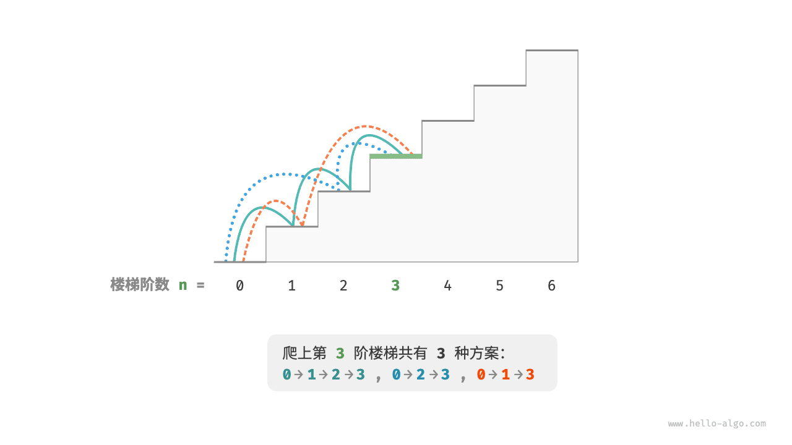
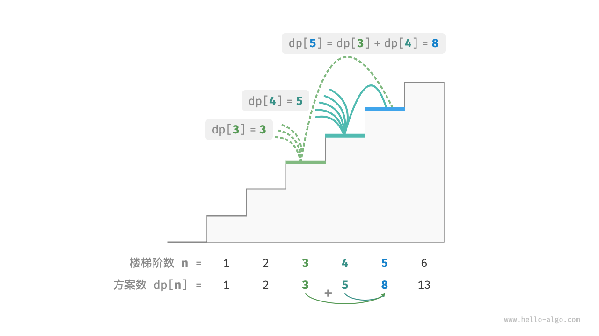
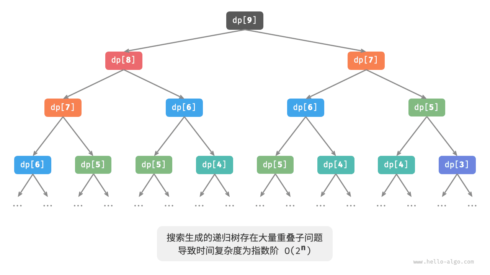
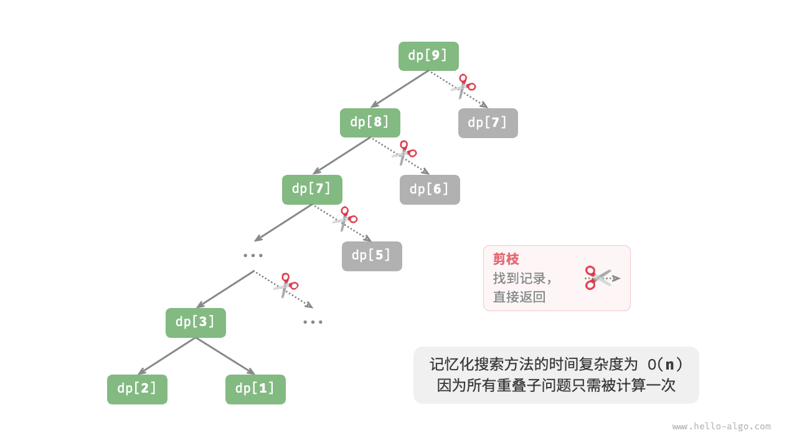
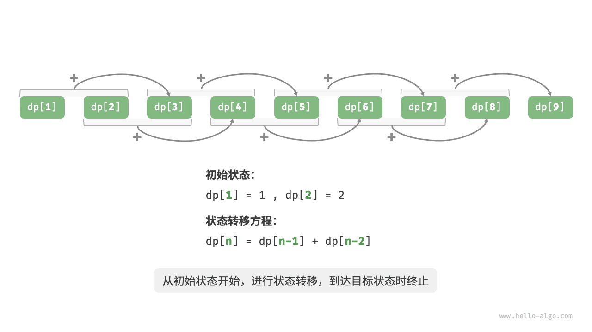

# 初识动态规划

「动态规划 Dynamic Programming」是一种通过将复杂问题分解为更简单的子问题方式来求解问题的方法，通常用来求解最优方案的相关问题，例如寻找最短路径、最大利润、最少时间等。

然而，并非所有的最优化问题都适合用动态规划来解决。**只有当问题具有重叠子问题和最优子结构时，动态规划才能发挥出其优势**。

在本节，我们先从两个经典例题入手，总览动态规划的主要特征，包括：

1. 如何使用回溯算法（穷举）来求解动态规划问题。重叠子问题是什么，以及如何解决由它带来的时间复杂度过高的问题。
2. 最优子结构的定义，以及它在动态规划问题中的表现形式。
3. 动态规划中的主要术语，状态压缩的含义与实现方式。

## 重叠子问题

!!! question "爬楼梯"

    给定一个共有 $n$ 阶的楼梯，你每步可以上 $1$ 阶或者 $2$ 阶，请问有多少种方案可以爬到楼顶。

如下图所示，对于一个 $3$ 阶楼梯，共有 $3$ 种方案可以爬到楼顶。



**不考虑效率的前提下，动态规划问题理论上都可以使用回溯算法解决**，因为回溯算法本质上就是穷举，它能够遍历决策树的所有可能的状态，并从中记录需要的解。

对于本题，我们可以将爬楼梯想象为一个多轮选择的过程：从地面出发，每轮选择上 $1$ 阶或 $2$ 阶，每当到达楼梯顶部时就将方案数量加 $1$ 。

=== "Java"

    ```java title="climbing_stairs_backtrack.java"
    [class]{climbing_stairs_backtrack}-[func]{backtrack}

    [class]{climbing_stairs_backtrack}-[func]{climbingStairsBacktrack}
    ```

=== "C++"

    ```cpp title="climbing_stairs_backtrack.cpp"
    [class]{}-[func]{backtrack}

    [class]{}-[func]{climbingStairsBacktrack}
    ```

=== "Python"

    ```python title="climbing_stairs_backtrack.py"
    [class]{}-[func]{backtrack}

    [class]{}-[func]{climbing_stairs_backtrack}
    ```

=== "Go"

    ```go title="climbing_stairs_backtrack.go"
    [class]{}-[func]{backtrack}

    [class]{}-[func]{climbingStairsBacktrack}
    ```

=== "JavaScript"

    ```javascript title="climbing_stairs_backtrack.js"
    [class]{}-[func]{backtrack}

    [class]{}-[func]{climbingStairsBacktrack}
    ```

=== "TypeScript"

    ```typescript title="climbing_stairs_backtrack.ts"
    [class]{}-[func]{backtrack}

    [class]{}-[func]{climbingStairsBacktrack}
    ```

=== "C"

    ```c title="climbing_stairs_backtrack.c"
    [class]{}-[func]{backtrack}

    [class]{}-[func]{climbingStairsBacktrack}
    ```

=== "C#"

    ```csharp title="climbing_stairs_backtrack.cs"
    [class]{climbing_stairs_backtrack}-[func]{backtrack}

    [class]{climbing_stairs_backtrack}-[func]{climbingStairsBacktrack}
    ```

=== "Swift"

    ```swift title="climbing_stairs_backtrack.swift"
    [class]{}-[func]{backtrack}

    [class]{}-[func]{climbingStairsBacktrack}
    ```

=== "Zig"

    ```zig title="climbing_stairs_backtrack.zig"
    [class]{}-[func]{backtrack}

    [class]{}-[func]{climbingStairsBacktrack}
    ```

=== "Dart"

    ```dart title="climbing_stairs_backtrack.dart"
    [class]{}-[func]{backtrack}

    [class]{}-[func]{climbingStairsBacktrack}
    ```

### 方法一：搜索

然而，这道题并不是典型的回溯问题，而更适合从分治的角度进行解析：

- 在分治算法中，原问题被分解为较小的子问题，通过组合子问题的解得到原问题的解。例如，归并排序将一个长数组从顶至底地划分为两个短数组，再从底至顶地将已排序的短数组进行排序。
- 在动态规划中，原问题的解往往依赖于其子问题的解。这些子问题的解不仅揭示了问题的局部最优解，而且还通过特定的递推关系链接起来，共同构建出原问题的全局最优解。

对于本题，设爬到第 $i$ 阶共有 $dp[i]$ 种方案，那么 $dp[i]$ 就是原问题，其子问题包括 $dp[i-1]$ , $dp[i-2]$ , $\cdots$ , $dp[2]$ , $dp[1]$ 。

由于每轮只能上 $1$ 阶或 $2$ 阶，因此当我们站在第 $i$ 阶楼梯上时，上一轮只可能站在第 $i - 1$ 阶或第 $i - 2$ 阶上，换句话说，我们只能从第 $i -1$ 阶或第 $i - 2$ 阶前往第 $i$ 阶。因此，**爬到第 $i - 1$ 阶的方案数加上爬到第 $i - 2$ 阶的方案数就等于爬到第 $i$ 阶的方案数**，即：

$$
dp[i] = dp[i-1] + dp[i-2]
$$



基于此递推公式，我们可以写出递归代码：以 $dp[n]$ 为起始点，**从顶至底地将一个较大问题拆解为两个较小问题**，直至到达最小子问题 $dp[1]$ 和 $dp[2]$ 时返回。其中，最小子问题的解是已知的，即爬到第 $1$ , $2$ 阶分别有 $1$ , $2$ 种方案。

虽然以下代码也属于深度优先搜索，但比标准回溯算法代码简洁很多，这体现了从分治角度考虑这道题的优势。

=== "Java"

    ```java title="climbing_stairs_dfs.java"
    [class]{climbing_stairs_dfs}-[func]{dfs}

    [class]{climbing_stairs_dfs}-[func]{climbingStairsDFS}
    ```

=== "C++"

    ```cpp title="climbing_stairs_dfs.cpp"
    [class]{}-[func]{dfs}

    [class]{}-[func]{climbingStairsDFS}
    ```

=== "Python"

    ```python title="climbing_stairs_dfs.py"
    [class]{}-[func]{dfs}

    [class]{}-[func]{climbing_stairs_dfs}
    ```

=== "Go"

    ```go title="climbing_stairs_dfs.go"
    [class]{}-[func]{dfs}

    [class]{}-[func]{climbingStairsDFS}
    ```

=== "JavaScript"

    ```javascript title="climbing_stairs_dfs.js"
    [class]{}-[func]{dfs}

    [class]{}-[func]{climbingStairsDFS}
    ```

=== "TypeScript"

    ```typescript title="climbing_stairs_dfs.ts"
    [class]{}-[func]{dfs}

    [class]{}-[func]{climbingStairsDFS}
    ```

=== "C"

    ```c title="climbing_stairs_dfs.c"
    [class]{}-[func]{dfs}

    [class]{}-[func]{climbingStairsDFS}
    ```

=== "C#"

    ```csharp title="climbing_stairs_dfs.cs"
    [class]{climbing_stairs_dfs}-[func]{dfs}

    [class]{climbing_stairs_dfs}-[func]{climbingStairsDFS}
    ```

=== "Swift"

    ```swift title="climbing_stairs_dfs.swift"
    [class]{}-[func]{dfs}

    [class]{}-[func]{climbingStairsDFS}
    ```

=== "Zig"

    ```zig title="climbing_stairs_dfs.zig"
    [class]{}-[func]{dfs}

    [class]{}-[func]{climbingStairsDFS}
    ```

=== "Dart"

    ```dart title="climbing_stairs_dfs.dart"
    [class]{}-[func]{dfs}

    [class]{}-[func]{climbingStairsDFS}
    ```

下图展示了该方法形成的递归树。对于问题 $dp[n]$ ，递归树的深度为 $n$ ，时间复杂度为 $O(2^n)$ 。指数阶的运行时间增长地非常快，如果我们输入一个比较大的 $n$ ，则会陷入漫长的等待之中。



实际上，**指数阶的时间复杂度是由于「重叠子问题」导致的**。例如，问题 $dp[9]$ 被分解为子问题 $dp[8]$ 和 $dp[7]$ ，问题 $dp[8]$ 被分解为子问题 $dp[7]$ 和 $dp[6]$ ，两者都包含子问题 $dp[7]$ ，而子问题中又包含更小的重叠子问题，子子孙孙无穷尽也，绝大部分计算资源都浪费在这些重叠的问题上。

### 方法二：记忆化搜索

为了提升算法效率，**我们希望所有的重叠子问题只被计算一次**。具体来说，考虑借助一个数组 `mem` 来记录每个子问题的解。当首次计算 $dp[i]$ 时，我们将其记录至 `mem[i]` ；当再次需要计算 $dp[i]$ 时，我们便可直接从 `mem[i]` 中获取结果，从而实现将重叠子问题剪枝。这种方法被称为“记忆化搜索”。

=== "Java"

    ```java title="climbing_stairs_dfs_mem.java"
    [class]{climbing_stairs_dfs_mem}-[func]{dfs}

    [class]{climbing_stairs_dfs_mem}-[func]{climbingStairsDFSMem}
    ```

=== "C++"

    ```cpp title="climbing_stairs_dfs_mem.cpp"
    [class]{}-[func]{dfs}

    [class]{}-[func]{climbingStairsDFSMem}
    ```

=== "Python"

    ```python title="climbing_stairs_dfs_mem.py"
    [class]{}-[func]{dfs}

    [class]{}-[func]{climbing_stairs_dfs_mem}
    ```

=== "Go"

    ```go title="climbing_stairs_dfs_mem.go"
    [class]{}-[func]{dfs}

    [class]{}-[func]{climbingStairsDFSMem}
    ```

=== "JavaScript"

    ```javascript title="climbing_stairs_dfs_mem.js"
    [class]{}-[func]{dfs}

    [class]{}-[func]{climbingStairsDFSMem}
    ```

=== "TypeScript"

    ```typescript title="climbing_stairs_dfs_mem.ts"
    [class]{}-[func]{dfs}

    [class]{}-[func]{climbingStairsDFSMem}
    ```

=== "C"

    ```c title="climbing_stairs_dfs_mem.c"
    [class]{}-[func]{dfs}

    [class]{}-[func]{climbingStairsDFSMem}
    ```

=== "C#"

    ```csharp title="climbing_stairs_dfs_mem.cs"
    [class]{climbing_stairs_dfs_mem}-[func]{dfs}

    [class]{climbing_stairs_dfs_mem}-[func]{climbingStairsDFSMem}
    ```

=== "Swift"

    ```swift title="climbing_stairs_dfs_mem.swift"
    [class]{}-[func]{dfs}

    [class]{}-[func]{climbingStairsDFSMem}
    ```

=== "Zig"

    ```zig title="climbing_stairs_dfs_mem.zig"
    [class]{}-[func]{dfs}

    [class]{}-[func]{climbingStairsDFSMem}
    ```

=== "Dart"

    ```dart title="climbing_stairs_dfs_mem.dart"
    [class]{}-[func]{dfs}

    [class]{}-[func]{climbingStairsDFSMem}
    ```

观察下图，经过记忆化处理后，所有子问题都只需被计算一次，时间复杂度为 $O(n)$ ，这是一个巨大的飞跃。实际上，如果不考虑递归带来的额外开销，记忆化搜索解法已经几乎等同于动态规划解法的时间效率。



### 方法三：动态规划

**记忆化搜索是一种“从顶至底”的方法**：我们从原问题（根节点）开始，递归地将较大子问题分解为较小子问题，直至解已知的最小子问题（叶节点）；最终通过回溯将子问题的解逐层收集，得到原问题的解。

**我们也可以直接“从底至顶”进行求解**：从最小子问题开始，迭代地求解较大子问题，直至得到原问题的解。这便是动态规划。

由于没有回溯过程，动态规划可以直接基于循环实现。我们初始化一个数组 `dp` 来存储子问题的解，从最小子问题开始，逐步求解较大子问题。在以下代码中，数组 `dp` 起到了记忆化搜索中数组 `mem` 相同的记录作用。

=== "Java"

    ```java title="climbing_stairs_dp.java"
    [class]{climbing_stairs_dp}-[func]{climbingStairsDP}
    ```

=== "C++"

    ```cpp title="climbing_stairs_dp.cpp"
    [class]{}-[func]{climbingStairsDP}
    ```

=== "Python"

    ```python title="climbing_stairs_dp.py"
    [class]{}-[func]{climbing_stairs_dp}
    ```

=== "Go"

    ```go title="climbing_stairs_dp.go"
    [class]{}-[func]{climbingStairsDP}
    ```

=== "JavaScript"

    ```javascript title="climbing_stairs_dp.js"
    [class]{}-[func]{climbingStairsDP}
    ```

=== "TypeScript"

    ```typescript title="climbing_stairs_dp.ts"
    [class]{}-[func]{climbingStairsDP}
    ```

=== "C"

    ```c title="climbing_stairs_dp.c"
    [class]{}-[func]{climbingStairsDP}
    ```

=== "C#"

    ```csharp title="climbing_stairs_dp.cs"
    [class]{climbing_stairs_dp}-[func]{climbingStairsDP}
    ```

=== "Swift"

    ```swift title="climbing_stairs_dp.swift"
    [class]{}-[func]{climbingStairsDP}
    ```

=== "Zig"

    ```zig title="climbing_stairs_dp.zig"
    [class]{}-[func]{climbingStairsDP}
    ```

=== "Dart"

    ```dart title="climbing_stairs_dp.dart"
    [class]{}-[func]{climbingStairsDP}
    ```



在动态规划中，我们通常将 $dp$ 数组称为「状态列表」，将最小子问题对应的状态（即 $dp[1]$ , $dp[2]$ ）称为「初始状态」，将 $dp[i] = dp[i-1] + dp[i-2]$ 称为「状态转移方程」。这些名词出现频率很高，请你务必理解并记住。

细心的你可能发现，由于 $dp[i]$ 只与 $dp[i-1]$ 和 $dp[i-2]$ 有关，因此我们无需使用一个数组 `dp` 来存储所有状态，只需两个变量滚动前进即可。如以下代码所示，由于省去了数组 `dp` 占用的空间，因此空间复杂度从 $O(n)$ 降低至 $O(1)$ 。

=== "Java"

    ```java title="climbing_stairs_dp.java"
    [class]{climbing_stairs_dp}-[func]{climbingStairsDPComp}
    ```

=== "C++"

    ```cpp title="climbing_stairs_dp.cpp"
    [class]{}-[func]{climbingStairsDPComp}
    ```

=== "Python"

    ```python title="climbing_stairs_dp.py"
    [class]{}-[func]{climbing_stairs_dp_comp}
    ```

=== "Go"

    ```go title="climbing_stairs_dp.go"
    [class]{}-[func]{climbingStairsDPComp}
    ```

=== "JavaScript"

    ```javascript title="climbing_stairs_dp.js"
    [class]{}-[func]{climbingStairsDPComp}
    ```

=== "TypeScript"

    ```typescript title="climbing_stairs_dp.ts"
    [class]{}-[func]{climbingStairsDPComp}
    ```

=== "C"

    ```c title="climbing_stairs_dp.c"
    [class]{}-[func]{climbingStairsDPComp}
    ```

=== "C#"

    ```csharp title="climbing_stairs_dp.cs"
    [class]{climbing_stairs_dp}-[func]{climbingStairsDPComp}
    ```

=== "Swift"

    ```swift title="climbing_stairs_dp.swift"
    [class]{}-[func]{climbingStairsDPComp}
    ```

=== "Zig"

    ```zig title="climbing_stairs_dp.zig"
    [class]{}-[func]{climbingStairsDPComp}
    ```

=== "Dart"

    ```dart title="climbing_stairs_dp.dart"
    [class]{}-[func]{climbingStairsDPComp}
    ```

**这种做法被称为「状态压缩」**。在许多动态规划问题中，当前状态仅与前面有限个状态有关，不必保存所有的历史状态，这时我们可以通过状态压缩的技巧，只保留必要的状态，通过“降维”来节省内存空间。

## 最优子结构

爬楼梯问题很好地展示了重叠子问题。接下来，我们对题目稍作改动，使之更加适合展示最优子结构概念。

!!! question "爬楼梯最小代价"

    给定一个楼梯，你每步可以上 $1$ 阶或者 $2$ 阶，每一阶楼梯上都贴有一个非负整数，表示你在该台阶所需要付出的代价。给定一个非负整数数组 $cost$ ，其中 $cost[i]$ 表示在第 $i$ 个台阶需要付出的代价，$cost[0]$ 为地面起始点。请计算最少需要付出多少代价才能到达顶部？

如下图所示，若第 $1$ , $2$ , $3$ 阶的代价分别为 $1$ , $10$ , $1$ ，则从地面爬到第 $3$ 阶的最小代价为 $2$ 。


设 $dp[i]$ 为爬到第 $i$ 阶累计付出的代价，由于第 $i$ 阶只可能从 $i - 1$ 阶或 $i - 2$ 阶走来，因此 $dp[i]$ 只可能等于 $dp[i - 1] + cost[i]$ 或 $dp[i - 2] + cost[i]$ 。为了尽可能减少代价，我们应该选择两者中较小的那一个，即：

$$
dp[i] = \min(dp[i-1], dp[i-2]) + cost[i]
$$

这便可以引出「最优子结构」的含义：**原问题的最优解是从子问题的最优解构建得来的**。对于本题，我们从两个子问题最优解 $dp[i-1]$ , $dp[i-2]$ 中挑选出较优的那一个，并用它构建出原问题 $dp[i]$ 的最优解。

那么，上道爬楼梯题目有没有最优子结构呢？它要求解的是方案数量，看似是一个计数问题，但如果换一种问法：求解最大方案数量。我们惊喜地发现，**虽然题目修改前后是等价的，但最优子结构浮现出来了**：第 $n$ 阶最大方案数量等于第 $n-1$ 阶和第 $n-2$ 阶最大方案数量之和。所以说，最优子结构的是一个比较宽泛的概念，在不同问题中会有不同的含义。

根据以上状态转移方程，以及初始状态 $dp[1] = cost[1]$ , $dp[2] = cost[2]$ ，我们可以得出动态规划解题代码。

=== "Java"

    ```java title="min_cost_climbing_stairs_dp.java"
    [class]{min_cost_climbing_stairs_dp}-[func]{minCostClimbingStairsDP}
    ```

=== "C++"

    ```cpp title="min_cost_climbing_stairs_dp.cpp"
    [class]{}-[func]{minCostClimbingStairsDP}
    ```

=== "Python"

    ```python title="min_cost_climbing_stairs_dp.py"
    [class]{}-[func]{min_cost_climbing_stairs_dp}
    ```

=== "Go"

    ```go title="min_cost_climbing_stairs_dp.go"
    [class]{}-[func]{minCostClimbingStairsDP}
    ```

=== "JavaScript"

    ```javascript title="min_cost_climbing_stairs_dp.js"
    [class]{}-[func]{minCostClimbingStairsDP}
    ```

=== "TypeScript"

    ```typescript title="min_cost_climbing_stairs_dp.ts"
    [class]{}-[func]{minCostClimbingStairsDP}
    ```

=== "C"

    ```c title="min_cost_climbing_stairs_dp.c"
    [class]{}-[func]{minCostClimbingStairsDP}
    ```

=== "C#"

    ```csharp title="min_cost_climbing_stairs_dp.cs"
    [class]{min_cost_climbing_stairs_dp}-[func]{minCostClimbingStairsDP}
    ```

=== "Swift"

    ```swift title="min_cost_climbing_stairs_dp.swift"
    [class]{}-[func]{minCostClimbingStairsDP}
    ```

=== "Zig"

    ```zig title="min_cost_climbing_stairs_dp.zig"
    [class]{}-[func]{minCostClimbingStairsDP}
    ```

=== "Dart"

    ```dart title="min_cost_climbing_stairs_dp.dart"
    [class]{}-[func]{minCostClimbingStairsDP}
    ```


这道题同样也可以进行状态压缩，将一维压缩至零维，使得空间复杂度从 $O(n)$ 降低至 $O(1)$ 。

=== "Java"

    ```java title="min_cost_climbing_stairs_dp.java"
    [class]{min_cost_climbing_stairs_dp}-[func]{minCostClimbingStairsDPComp}
    ```

=== "C++"

    ```cpp title="min_cost_climbing_stairs_dp.cpp"
    [class]{}-[func]{minCostClimbingStairsDPComp}
    ```

=== "Python"

    ```python title="min_cost_climbing_stairs_dp.py"
    [class]{}-[func]{min_cost_climbing_stairs_dp_comp}
    ```

=== "Go"

    ```go title="min_cost_climbing_stairs_dp.go"
    [class]{}-[func]{minCostClimbingStairsDPComp}
    ```

=== "JavaScript"

    ```javascript title="min_cost_climbing_stairs_dp.js"
    [class]{}-[func]{minCostClimbingStairsDPComp}
    ```

=== "TypeScript"

    ```typescript title="min_cost_climbing_stairs_dp.ts"
    [class]{}-[func]{minCostClimbingStairsDPComp}
    ```

=== "C"

    ```c title="min_cost_climbing_stairs_dp.c"
    [class]{}-[func]{minCostClimbingStairsDPComp}
    ```

=== "C#"

    ```csharp title="min_cost_climbing_stairs_dp.cs"
    [class]{min_cost_climbing_stairs_dp}-[func]{minCostClimbingStairsDPComp}
    ```

=== "Swift"

    ```swift title="min_cost_climbing_stairs_dp.swift"
    [class]{}-[func]{minCostClimbingStairsDPComp}
    ```

=== "Zig"

    ```zig title="min_cost_climbing_stairs_dp.zig"
    [class]{}-[func]{minCostClimbingStairsDPComp}
    ```

=== "Dart"

    ```dart title="min_cost_climbing_stairs_dp.dart"
    [class]{}-[func]{minCostClimbingStairsDPComp}
    ```
