# 0-1 背包问题

背包问题是一个非常好的动态规划入门题目，是动态规划中最常见的问题形式。其具有很多变种，例如 0-1 背包问题、完全背包问题、多重背包问题等。

在本节中，我们先来求解最常见的 0-1 背包问题。

!!! question

    给定 $n$ 个物品，第 $i$ 个物品的重量为 $wgt[i-1]$、价值为 $val[i-1]$ ，和一个容量为 $cap$ 的背包。每个物品只能选择一次，问在限定背包容量下能放入物品的最大价值。

观察下图，由于物品编号 $i$ 从 $1$ 开始计数，数组索引从 $0$ 开始计数，因此物品 $i$ 对应重量 $wgt[i-1]$ 和价值 $val[i-1]$ 。

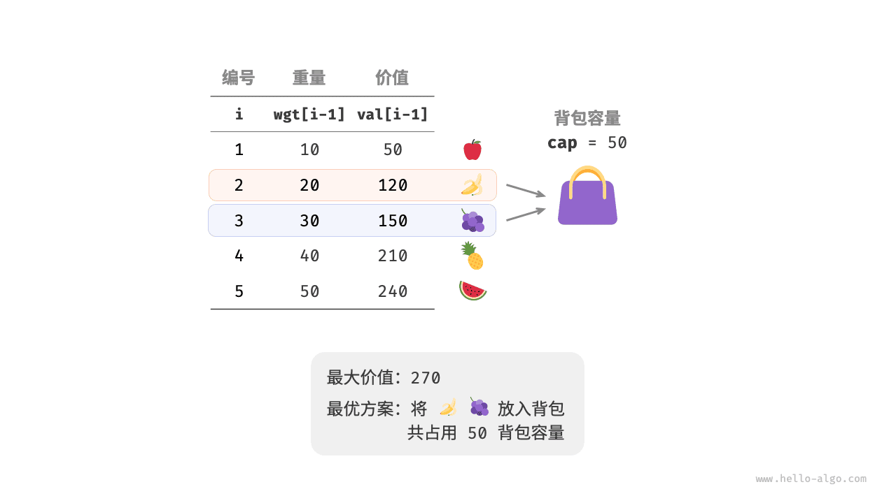

我们可以将 0-1 背包问题看作一个由 $n$ 轮决策组成的过程，对于每个物体都有不放入和放入两种决策，因此该问题满足决策树模型。

该问题的目标是求解“在限定背包容量下能放入物品的最大价值”，因此较大概率是一个动态规划问题。

**第一步：思考每轮的决策，定义状态，从而得到 $dp$ 表**

对于每个物品来说，不放入背包，背包容量不变；放入背包，背包容量减小。由此可得状态定义：当前物品编号 $i$ 和背包容量 $c$ ，记为 $[i, c]$ 。

状态 $[i, c]$ 对应的子问题为：**前 $i$ 个物品在容量为 $c$ 的背包中的最大价值**，记为 $dp[i, c]$ 。

待求解的是 $dp[n, cap]$ ，因此需要一个尺寸为 $(n+1) \times (cap+1)$ 的二维 $dp$ 表。

**第二步：找出最优子结构，进而推导出状态转移方程**

当我们做出物品 $i$ 的决策后，剩余的是前 $i-1$ 个物品决策的子问题，可分为以下两种情况。

- **不放入物品 $i$** ：背包容量不变，状态变化为 $[i-1, c]$ 。
- **放入物品 $i$** ：背包容量减少 $wgt[i-1]$ ，价值增加 $val[i-1]$ ，状态变化为 $[i-1, c-wgt[i-1]]$ 。

上述分析向我们揭示了本题的最优子结构：**最大价值 $dp[i, c]$ 等于不放入物品 $i$ 和放入物品 $i$ 两种方案中价值更大的那一个**。由此可推导出状态转移方程：

$$
dp[i, c] = \max(dp[i-1, c], dp[i-1, c - wgt[i-1]] + val[i-1])
$$

需要注意的是，若当前物品重量 $wgt[i - 1]$ 超出剩余背包容量 $c$ ，则只能选择不放入背包。

**第三步：确定边界条件和状态转移顺序**

当无物品或背包容量为 $0$ 时最大价值为 $0$ ，即首列 $dp[i, 0]$ 和首行 $dp[0, c]$ 都等于 $0$ 。

当前状态 $[i, c]$ 从上方的状态 $[i-1, c]$ 和左上方的状态 $[i-1, c-wgt[i-1]]$ 转移而来，因此通过两层循环正序遍历整个 $dp$ 表即可。

根据以上分析，我们接下来按顺序实现暴力搜索、记忆化搜索、动态规划解法。

### 方法一：暴力搜索

搜索代码包含以下要素。

- **递归参数**：状态 $[i, c]$ 。
- **返回值**：子问题的解 $dp[i, c]$ 。
- **终止条件**：当物品编号越界 $i = 0$ 或背包剩余容量为 $0$ 时，终止递归并返回价值 $0$ 。
- **剪枝**：若当前物品重量超出背包剩余容量，则只能选择不放入背包。

```src
[file]{knapsack}-[class]{}-[func]{knapsack_dfs}
```

如下图所示，由于每个物品都会产生不选和选两条搜索分支，因此时间复杂度为 $O(2^n)$ 。

观察递归树，容易发现其中存在重叠子问题，例如 $dp[1, 10]$ 等。而当物品较多、背包容量较大，尤其是相同重量的物品较多时，重叠子问题的数量将会大幅增多。

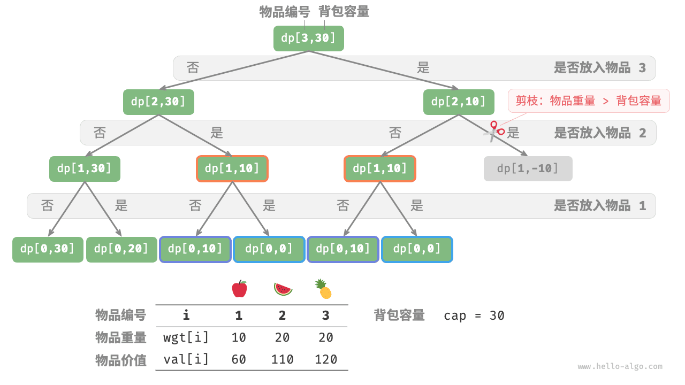

### 方法二：记忆化搜索

为了保证重叠子问题只被计算一次，我们借助记忆列表 `mem` 来记录子问题的解，其中 `mem[i][c]` 对应 $dp[i, c]$ 。

引入记忆化之后，**时间复杂度取决于子问题数量**，也就是 $O(n \times cap)$ 。实现代码如下：

```src
[file]{knapsack}-[class]{}-[func]{knapsack_dfs_mem}
```

下图展示了在记忆化搜索中被剪掉的搜索分支。

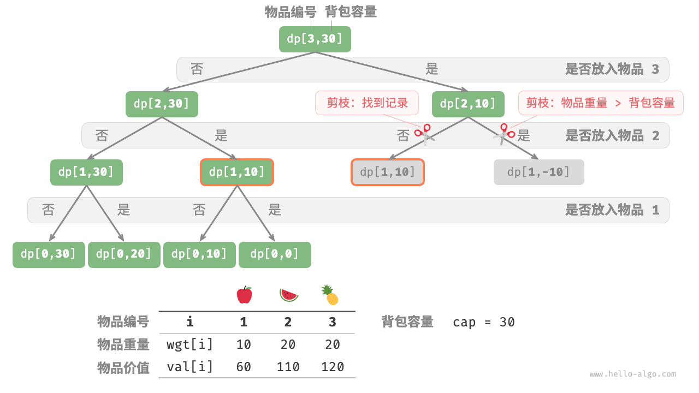

### 方法三：动态规划

动态规划实质上就是在状态转移中填充 $dp$ 表的过程，代码如下所示：

```src
[file]{knapsack}-[class]{}-[func]{knapsack_dp}
```

如下图所示，时间复杂度和空间复杂度都由数组 `dp` 大小决定，即 $O(n \times cap)$ 。

=== "<1>"
    

=== "<2>"
    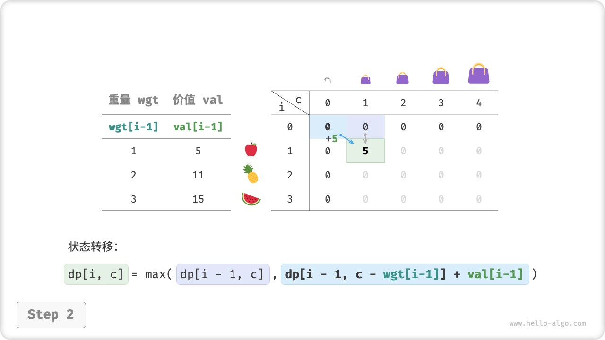

=== "<3>"
    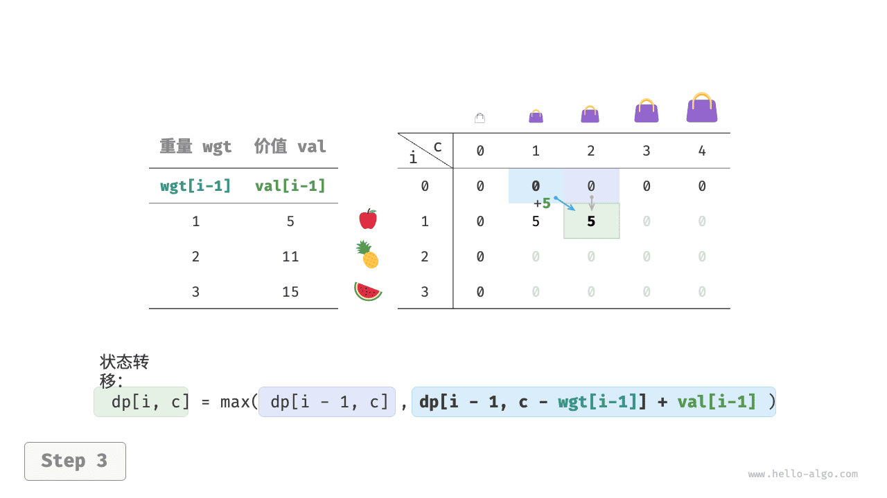

=== "<4>"
    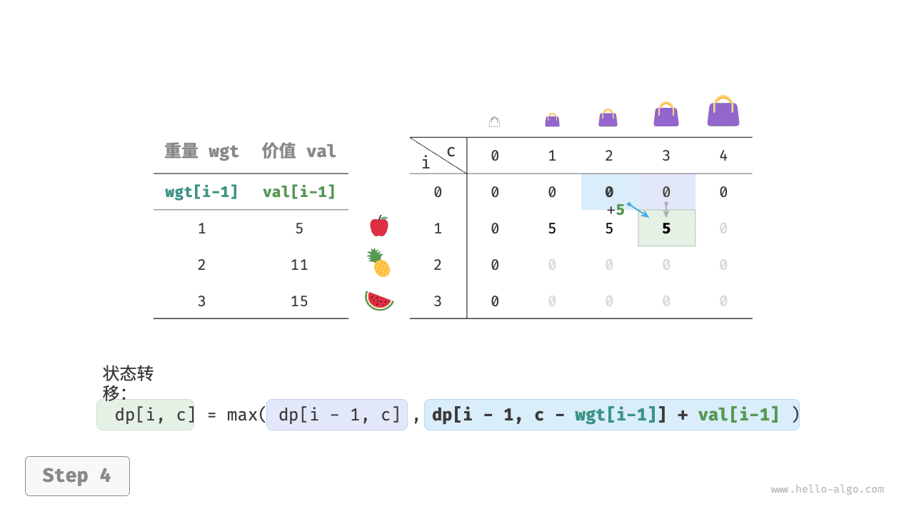

=== "<5>"
    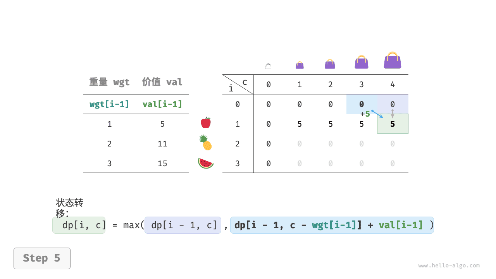

=== "<6>"
    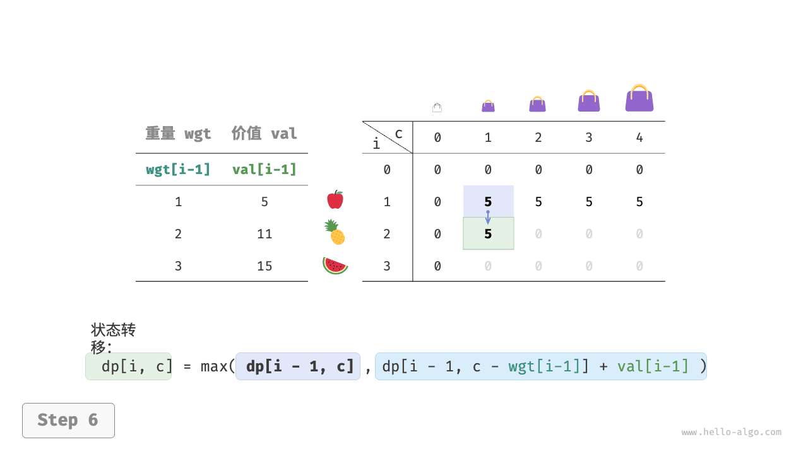

=== "<7>"
    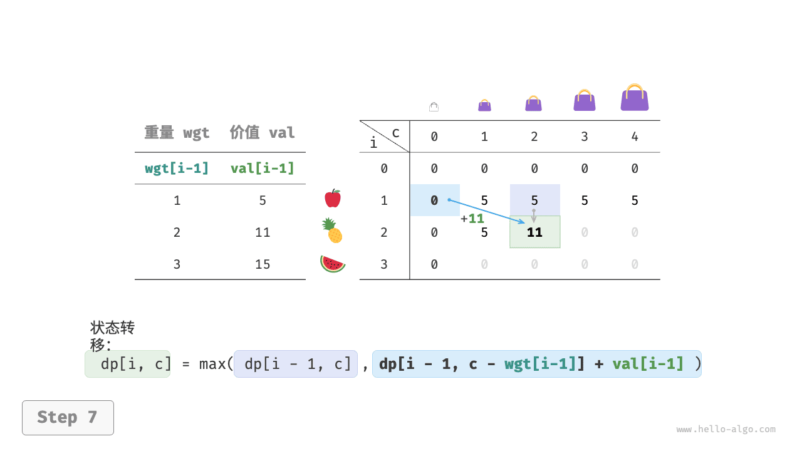

=== "<8>"
    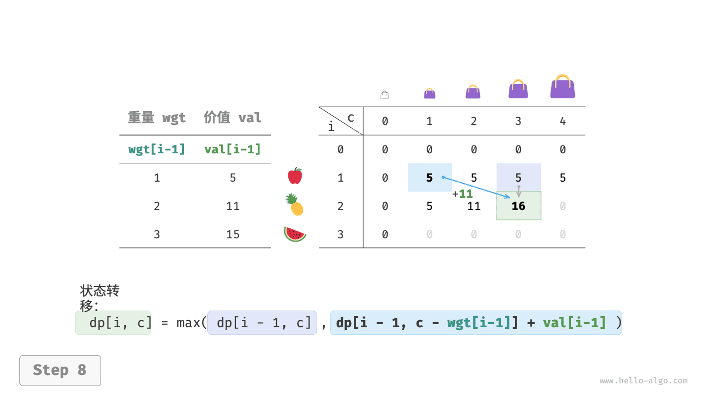

=== "<9>"
    

=== "<10>"
    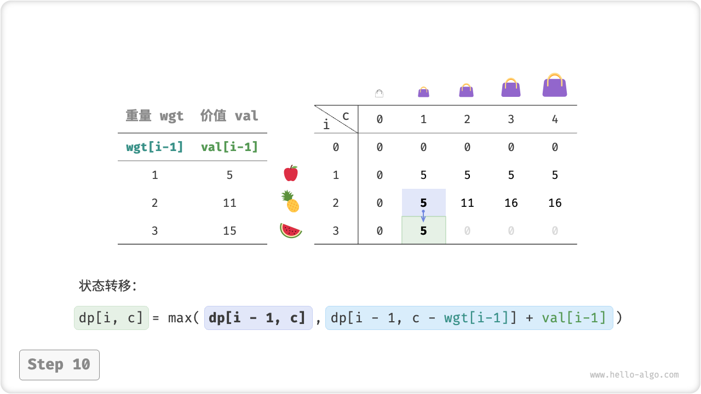

=== "<11>"
    

=== "<12>"
    

=== "<13>"
    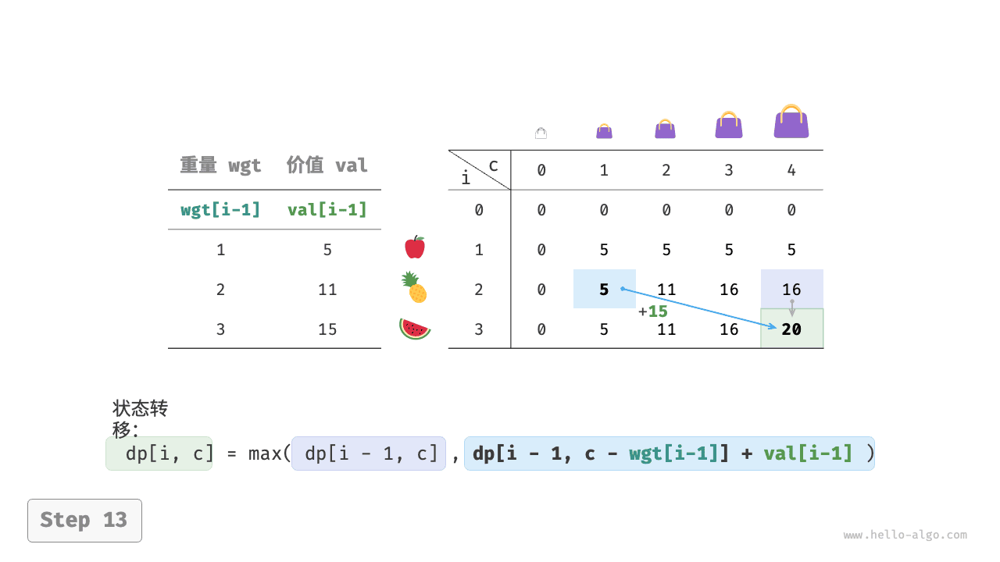

=== "<14>"
    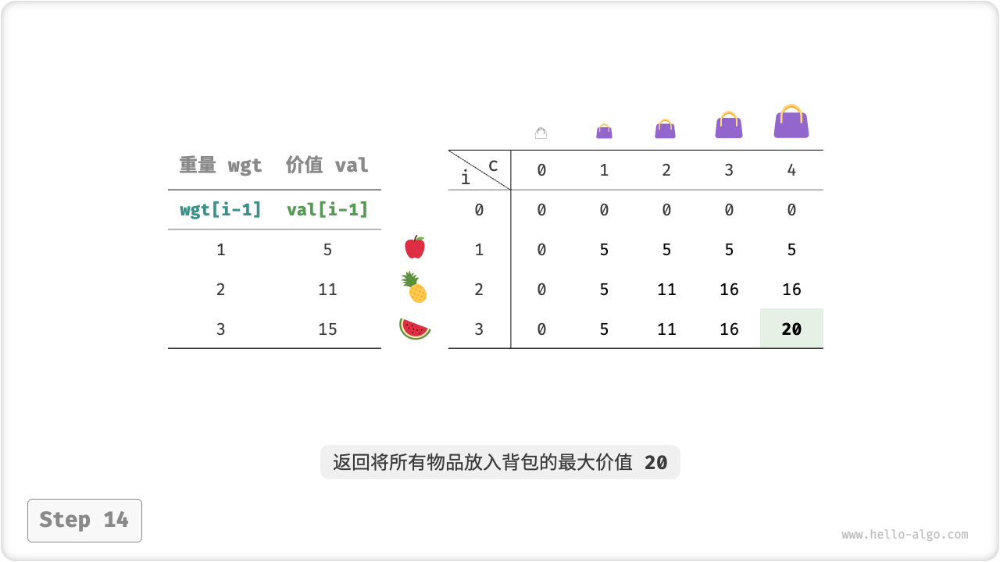

### 空间优化

由于每个状态都只与其上一行的状态有关，因此我们可以使用两个数组滚动前进，将空间复杂度从 $O(n^2)$ 降至 $O(n)$ 。

进一步思考，我们能否仅用一个数组实现空间优化呢？观察可知，每个状态都是由正上方或左上方的格子转移过来的。假设只有一个数组，当开始遍历第 $i$ 行时，该数组存储的仍然是第 $i-1$ 行的状态。

- 如果采取正序遍历，那么遍历到 $dp[i, j]$ 时，左上方 $dp[i-1, 1]$ ~ $dp[i-1, j-1]$ 值可能已经被覆盖，此时就无法得到正确的状态转移结果。
- 如果采取倒序遍历，则不会发生覆盖问题，状态转移可以正确进行。

下图展示了在单个数组下从第 $i = 1$ 行转换至第 $i = 2$ 行的过程。请思考正序遍历和倒序遍历的区别。

=== "<1>"
    

=== "<2>"
    

=== "<3>"
    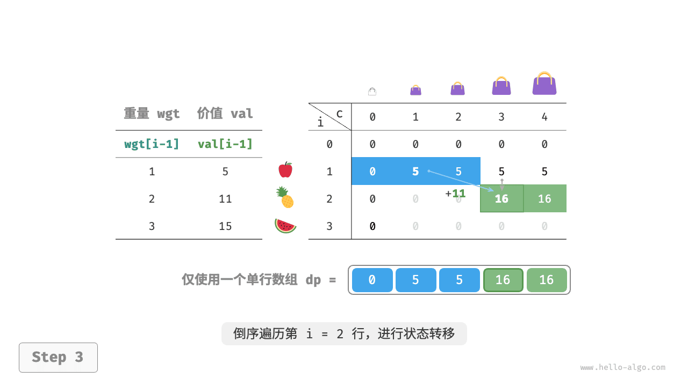

=== "<4>"
    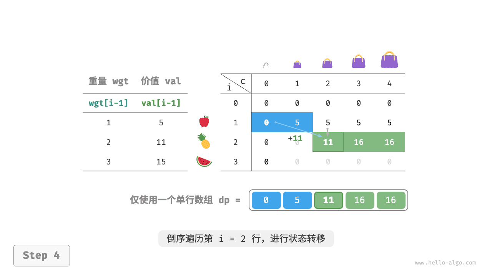

=== "<5>"
    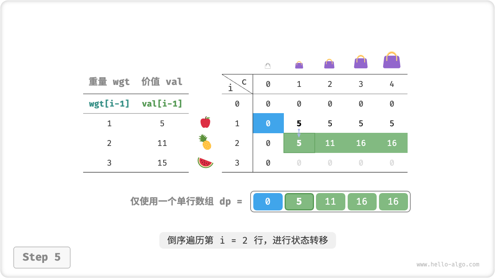

=== "<6>"
    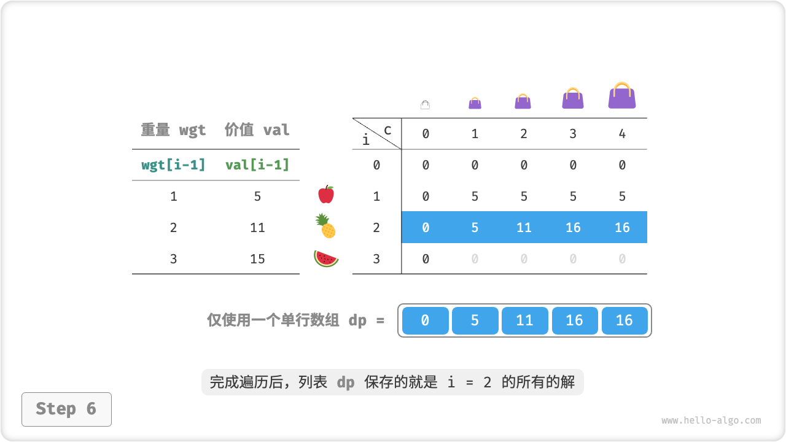

在代码实现中，我们仅需将数组 `dp` 的第一维 $i$ 直接删除，并且把内循环更改为倒序遍历即可：

```src
[file]{knapsack}-[class]{}-[func]{knapsack_dp_comp}
```
