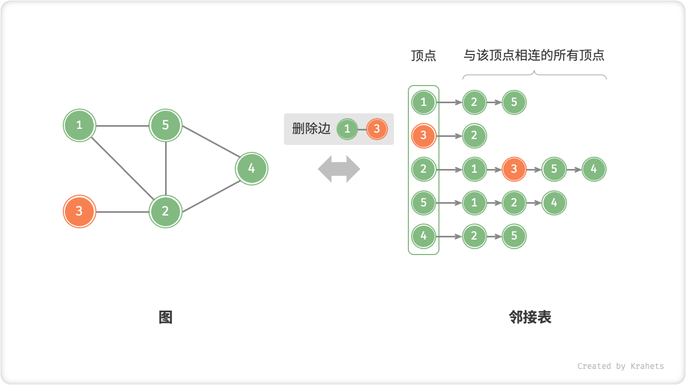

# 图

「图 Graph」是一种非线性数据结构，由「顶点 Vertex」和「边 Edge」组成。我们可将图 $G$ 抽象地表示为一组顶点 $V$ 和一组边 $E$ 的集合。例如，以下表示一个包含 5 个顶点和 7 条边的图

$$
\begin{aligned}
V & = \{ 1, 2, 3, 4, 5 \} \newline
E & = \{ (1,2), (1,3), (1,5), (2,3), (2,4), (2,5), (4,5) \} \newline
G & = \{ V, E \} \newline
\end{aligned}
$$


那么，图与其他数据结构的关系是什么？如果我们把「顶点」看作结点，把「边」看作连接各个结点的指针，则可将「图」看成一种从「链表」拓展而来的数据结构。**相比线性关系（链表）和分治关系（树），网络关系（图）的自由度更高，也从而更为复杂**。

## 图常见类型

根据边是否有方向，分为「无向图 Undirected Graph」和「有向图 Directed Graph」。

- 在无向图中，边表示两结点之间“双向”的连接关系，例如微信或 QQ 中的“好友关系”；
- 在有向图中，边是有方向的，即 $A \rightarrow B$ 和 $A \leftarrow B$ 两个方向的边是相互独立的，例如微博或抖音上的“关注”与“被关注”关系；


根据所有顶点是否连通，分为「连通图 Connected Graph」和「非连通图 Disconnected Graph」。

- 对于连通图，从某个结点出发，可以到达其余任意结点；
- 对于非连通图，从某个结点出发，至少有一个结点无法到达；


我们可以给边添加“权重”变量，得到「有权图 Weighted Graph」。例如，在王者荣耀等游戏中，系统会根据共同游戏时间来计算玩家之间的“亲密度”，这种亲密度网络就可以使用有权图来表示。


## 图常用术语

- 「邻接 Adjacency」：当两顶点之间有边相连时，称此两顶点“邻接”。
- 「路径 Path」：从顶点 A 到顶点 B 走过的边构成的序列，被称为从 A 到 B 的“路径”。
- 「度 Degree」表示一个顶点具有多少条边。对于有向图，「入度 In-Degree」表示有多少条边指向该顶点，「出度 Out-Degree」表示有多少条边从该顶点指出。

## 图的表示

图的常用表示方法有「邻接矩阵」和「邻接表」。以下皆使用无边图来举例。

### 邻接矩阵

设图的顶点数量为 $n$ ，「邻接矩阵 Adjacency Matrix」使用一个 $n \times n$ 大小的矩阵来表示图，每一行（列）代表一个顶点，矩阵元素代表边，使用 $1$ 或 $0$ 来表示两个顶点之间有边或无边。


邻接矩阵具有以下性质：

- 顶点不能与自身相连，因而邻接矩阵主对角线元素没有意义。
- 「无向图」两个方向的边等价，此时邻接矩阵关于主对角线对称。
- 将邻接矩阵的元素从 $1$ , $0$ 替换为权重，则能够表示「有权图」。

使用邻接矩阵表示图时，我们可以直接通过访问矩阵元素来获取边，因此增删查操作的效率很高，时间复杂度均为 $O(1)$ 。然而，矩阵的空间复杂度为 $O(n^2)$ ，内存占用较大。

### 邻接表

「邻接表 Adjacency List」使用 $n$ 个链表来表示图，链表结点表示顶点。第 $i$ 条链表对应顶点 $i$ ，其中存储了所有与该顶点相连的顶点。


邻接表仅存储存在的边，而边的总数往往远小于 $n^2$ ，因此更加节省空间。但是，因为在邻接表中需要通过遍历链表来查找边，所以其时间效率不如邻接矩阵。

观察上图发现，**邻接表结构与哈希表「链地址法」非常相似，因此我们也可以用类似方法来优化效率**。比如，当链表较长时，可以把链表转化为「AVL 树」，从而将时间效率从 $O(n)$ 优化至 $O(\log n)$ ，还可以通过中序遍历获取有序序列；还可以将链表转化为 HashSet（即哈希表），将时间复杂度降低至 $O(1)$ ，。

## 图基础操作

以下分别介绍图在「邻接矩阵」和「邻接表」表示下的基础操作。

### 基于邻接矩阵的实现

设图的顶点总数为 $n$ ，则有：

- **添加或删除边**：直接在邻接矩阵中修改指定边的对应元素即可，使用 $O(1)$ 时间。而由于是无向图，因此需要同时更新两个方向的边。
- **添加顶点**：在邻接矩阵的尾部添加一行一列，并全部填 $0$ 即可，使用 $O(n)$ 时间。
- **删除顶点**：在邻接矩阵中删除一行一列。当删除首行首列时达到最差情况，需要将 $(n-1)^2$ 个元素“向左上移动”，从而使用 $O(n^2)$ 时间。
- **初始化**：传入 $n$ 个顶点，初始化长度为 $n$ 的顶点列表 `vertices` ，使用 $O(n)$ 时间；初始化 $n \times n$ 大小的邻接矩阵 `adjMat` ，使用 $O(n^2)$ 时间。

=== "初始化邻接矩阵"
    

=== "添加边"
    

=== "删除边"
    

=== "添加顶点"
    

=== "删除顶点"
    

以下是基于邻接矩阵表示图的实现代码。

=== "Java"

    ```java title="graph_adjacency_matrix.java"
    /* 基于邻接矩阵实现的无向图类 */
    class GraphAdjMat {
        List<Integer> vertices;     // 顶点列表，元素代表“顶点值”，索引代表“顶点索引”
        List<List<Integer>> adjMat; // 邻接矩阵，行列索引对应“顶点索引”
    
        /* 构造函数 */
        public GraphAdjMat(int[] vertices, int[][] edges) {
            this.vertices = new ArrayList<>();
            this.adjMat = new ArrayList<>();
            // 添加顶点
            for (int val : vertices) {
                addVertex(val);
            }
            // 添加边
            // 请注意，edges 元素代表顶点索引，即对应 vertices 元素索引
            for (int[] e : edges) {
                addEdge(e[0], e[1]);
            }
        }
    
        /* 获取顶点数量 */
        public int size() {
            return vertices.size();
        }
    
        /* 添加顶点 */
        public void addVertex(int val) {
            int n = size();
            // 向顶点列表中添加新顶点的值
            vertices.add(val);
            // 在邻接矩阵中添加一行
            List<Integer> newRow = new ArrayList<>(n);
            for (int j = 0; j < n; j++) {
                newRow.add(0);
            }
            adjMat.add(newRow);
            // 在邻接矩阵中添加一列
            for (List<Integer> row : adjMat) {
                row.add(0);
            }
        }
    
        /* 删除顶点 */
        public void removeVertex(int index) {
            if (index >= size())
                throw new IndexOutOfBoundsException();
            // 在顶点列表中移除索引 index 的顶点
            vertices.remove(index);
            // 在邻接矩阵中删除索引 index 的行
            adjMat.remove(index);
            // 在邻接矩阵中删除索引 index 的列
            for (List<Integer> row : adjMat) {
                row.remove(index);
            }
        }
    
        /* 添加边 */
        // 参数 i, j 对应 vertices 元素索引
        public void addEdge(int i, int j) {
            // 索引越界与相等处理
            if (i < 0 || j < 0 || i >= size() || j >= size() || i == j)
                throw new IndexOutOfBoundsException();
            // 在无向图中，邻接矩阵沿主对角线对称，即满足 (i, j) == (j, i)
            adjMat.get(i).set(j, 1);
            adjMat.get(j).set(i, 1);
        }
    
        /* 删除边 */
        // 参数 i, j 对应 vertices 元素索引
        public void removeEdge(int i, int j) {
            // 索引越界与相等处理
            if (i < 0 || j < 0 || i >= size() || j >= size() || i == j)
                throw new IndexOutOfBoundsException();
            adjMat.get(i).set(j, 0);
            adjMat.get(j).set(i, 0);
        }
    }
    ```

=== "C++"

    ```cpp title="graph_adjacency_matrix.cpp"

    ```

=== "Python"

    ```python title="graph_adjacency_matrix.py"

    ```

=== "Go"

    ```go title="graph_adjacency_matrix.go"

    ```

=== "JavaScript"

    ```js title="graph_adjacency_matrix.js"

    ```

=== "TypeScript"

    ```typescript title="graph_adjacency_matrix.ts"

    ```

=== "C"

    ```c title="graph_adjacency_matrix.c"

    ```

=== "C#"

    ```csharp title="graph_adjacency_matrix.cs"

    ```

=== "Swift"

    ```swift title="graph_adjacency_matrix.swift"

    ```

### 基于邻接表的实现

设图的顶点总数为 $n$ 、边总数为 $m$ ，则有：

- **添加边**：在顶点对应链表的尾部添加边即可，使用 $O(1)$ 时间。因为是无向图，所以需要同时添加两个方向的边。
- **删除边**：在顶点对应链表中查询与删除指定边，使用 $O(m)$ 时间。与添加边一样，需要同时删除两个方向的边。
- **添加顶点**：在邻接表中添加一个链表即可，并以新增顶点为链表头结点，使用 $O(1)$ 时间。
- **删除顶点**：需要遍历整个邻接表，删除包含指定顶点的所有边，使用 $O(n + m)$ 时间。
- **初始化**：需要在邻接表中建立 $n$ 个结点和 $2m$ 条边，使用 $O(n + m)$ 时间。

=== "初始化邻接表"
    

=== "添加边"
    

=== "删除边"
    

=== "添加顶点"
    

=== "删除顶点"
    

基于邻接表实现图的代码如下所示。

=== "Java"

    ```java title="graph_adjacency_list.java"
    /* 顶点类 */
    class Vertex {
        int val;
        public Vertex(int val) {
            this.val = val;
        }
    }
    
    /* 基于邻接表实现的无向图类 */
    class GraphAdjList {
        // 请注意，vertices 和 adjList 中存储的都是 Vertex 对象
        Map<Vertex, Set<Vertex>> adjList; // 邻接表（使用哈希表实现）
    
        /* 构造函数 */
        public GraphAdjList(Vertex[][] edges) {
            this.adjList = new HashMap<>();
            // 添加所有顶点和边
            for (Vertex[] edge : edges) {
                addVertex(edge[0]);
                addVertex(edge[1]);
                addEdge(edge[0], edge[1]);
            }
        }
    
        /* 获取顶点数量 */
        public int size() {
            return adjList.size();
        }
    
        /* 添加边 */
        public void addEdge(Vertex vet1, Vertex vet2) {
            if (!adjList.containsKey(vet1) || !adjList.containsKey(vet2) || vet1 == vet2)
                throw new IllegalArgumentException();
            // 添加边 vet1 - vet2
            adjList.get(vet1).add(vet2);
            adjList.get(vet2).add(vet1);
        }
    
        /* 删除边 */
        public void removeEdge(Vertex vet1, Vertex vet2) {
            if (!adjList.containsKey(vet1) || !adjList.containsKey(vet2) || vet1 == vet2)
                throw new IllegalArgumentException();
            // 删除边 vet1 - vet2
            adjList.get(vet1).remove(vet2);
            adjList.get(vet2).remove(vet1);
        }
    
        /* 添加顶点 */
        public void addVertex(Vertex vet) {
            if (adjList.containsKey(vet))
                return;
            // 在邻接表中添加一个新链表（即 HashSet）
            adjList.put(vet, new HashSet<>());
        }
    
        /* 删除顶点 */
        public void removeVertex(Vertex vet) {
            if (!adjList.containsKey(vet))
                throw new IllegalArgumentException();
            // 在邻接表中删除顶点 vet 对应的链表（即 HashSet）
            adjList.remove(vet);
            // 遍历其它顶点的链表（即 HashSet），删除所有包含 vet 的边
            for (Set<Vertex> set : adjList.values()) {
                set.remove(vet);
            }
        }
    }
    ```

=== "C++"

    ```cpp title="graph_adjacency_list.cpp"

    ```

=== "Python"

    ```python title="graph_adjacency_list.py"

    ```

=== "Go"

    ```go title="graph_adjacency_list.go"

    ```

=== "JavaScript"

    ```js title="graph_adjacency_list.js"

    ```

=== "TypeScript"

    ```typescript title="graph_adjacency_list.ts"

    ```

=== "C"

    ```c title="graph_adjacency_list.c"

    ```

=== "C#"

    ```csharp title="graph_adjacency_list.cs"

    ```

=== "Swift"

    ```swift title="graph_adjacency_list.swift"

    ```

### 效率对比

设图中共有 $n$ 个顶点和 $m$ 条边，下表为邻接矩阵和邻接表的时间和空间效率对比。

<div class="center-table" markdown>

|              | 邻接矩阵 | 邻接表（链表） | 邻接表（哈希表） |
| ------------ | -------- | -------------- | ---------------- |
| 判断是否邻接 | $O(1)$   | $O(m)$         | $O(1)$           |
| 添加边       | $O(1)$   | $O(1)$         | $O(1)$           |
| 删除边       | $O(1)$   | $O(m)$         | $O(1)$           |
| 添加顶点     | $O(n)$   | $O(1)$         | $O(1)$           |
| 删除顶点     | $O(n^2)$ | $O(n + m)$     | $O(n)$           |
| 内存空间占用 | $O(n^2)$ | $O(n + m)$     | $O(n + m)$       |

</div>

观察上表，貌似邻接表（哈希表）的时间与空间效率最优。但实际上，在邻接矩阵中操作边的效率更高，只需要一次数组访问或赋值操作即可。总结以上，**邻接矩阵体现“以空间换时间”，邻接表体现“以时间换空间”**。

## 图常见应用

现实中的许多系统都可以使用图来建模，对应的待求解问题也可以被约化为图计算问题。

<div class="center-table" markdown>

|          | 顶点 | 边                   | 图计算问题   |
| -------- | ---- | -------------------- | ------------ |
| 社交网络 | 用户 | 好友关系             | 潜在好友推荐 |
| 地铁线路 | 站点 | 站点间的连通性       | 最短路线推荐 |
| 太阳系   | 星体 | 星体间的万有引力作用 | 行星轨道计算 |

</div>
