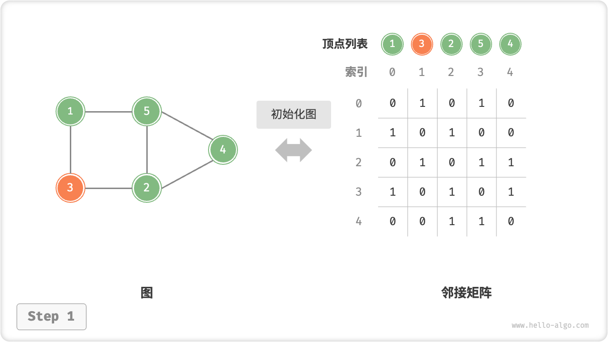
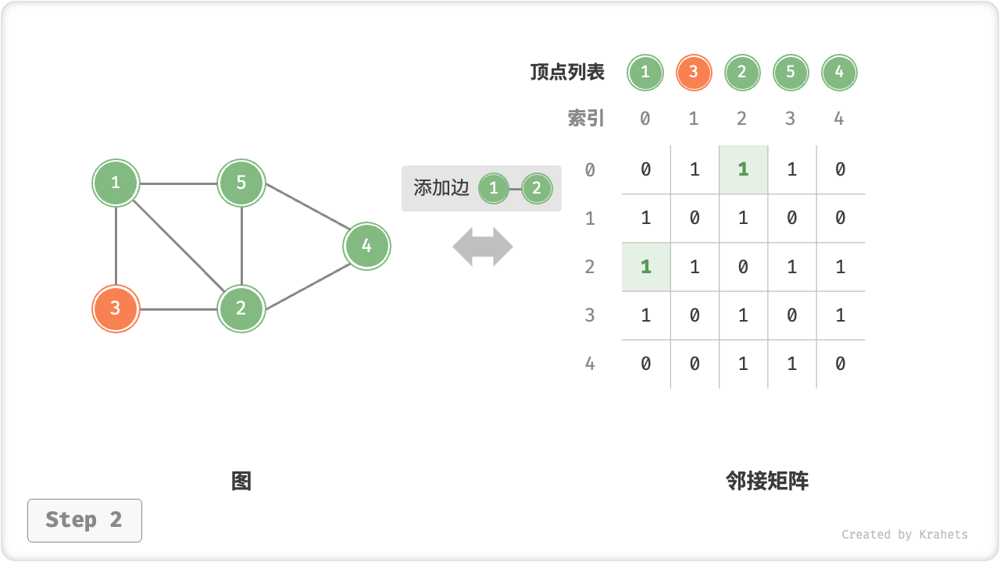
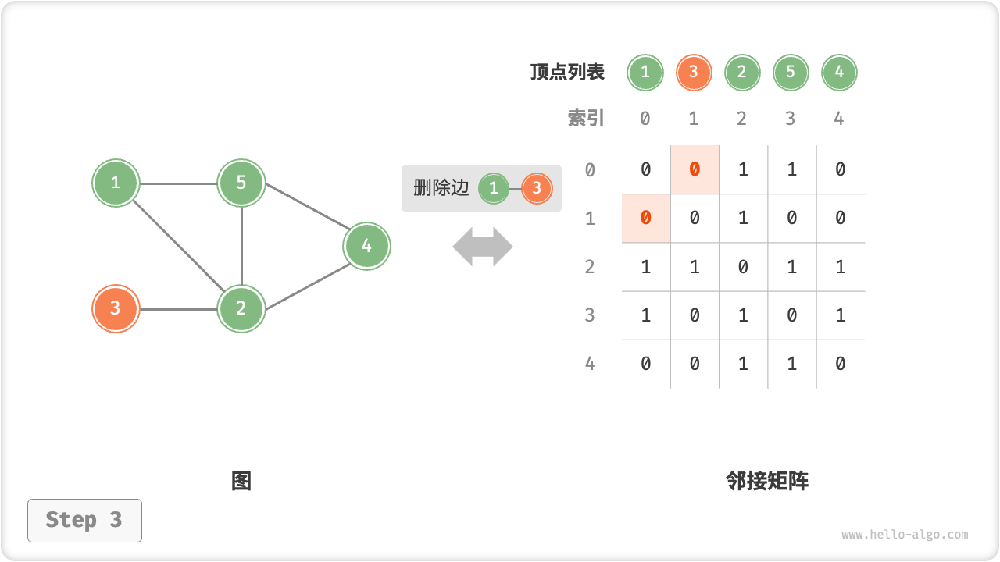
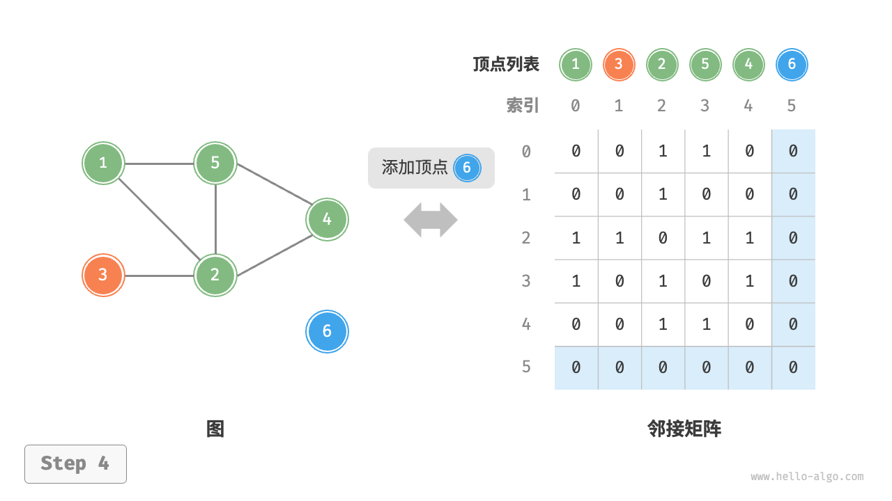
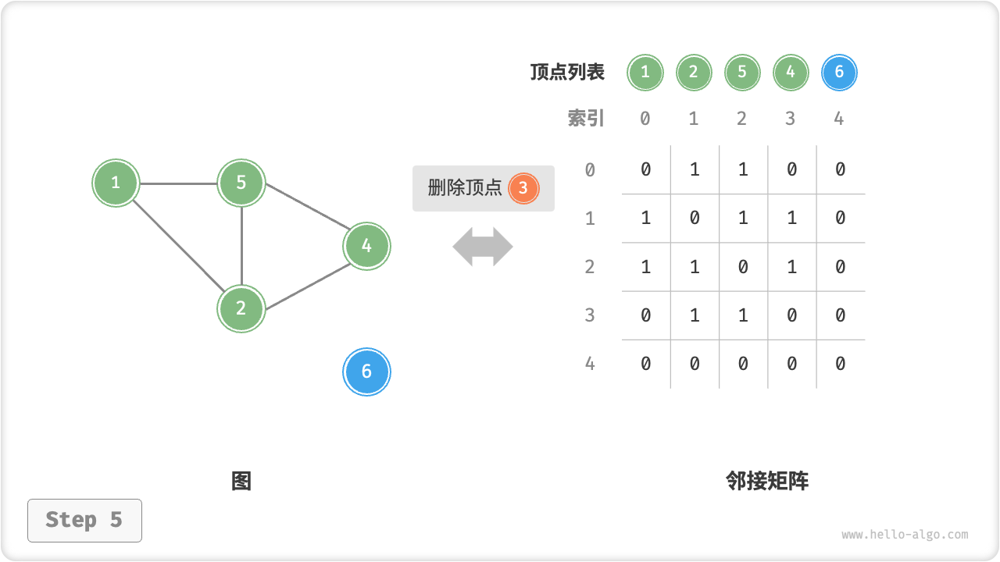
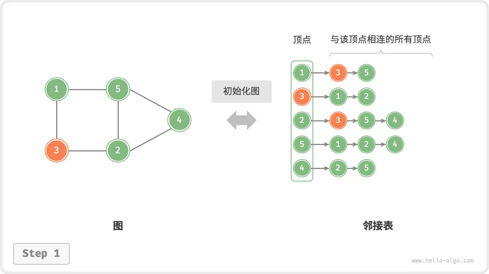
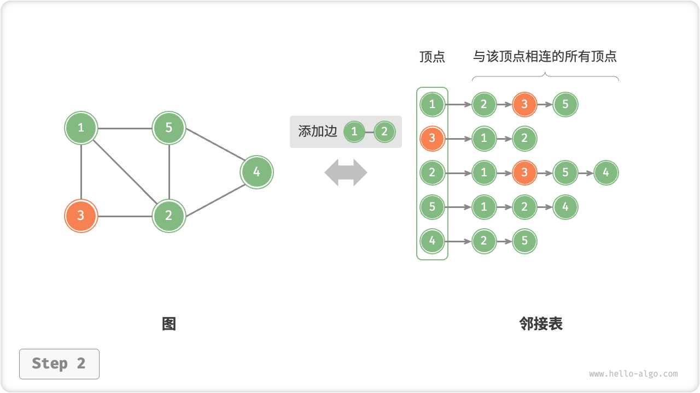
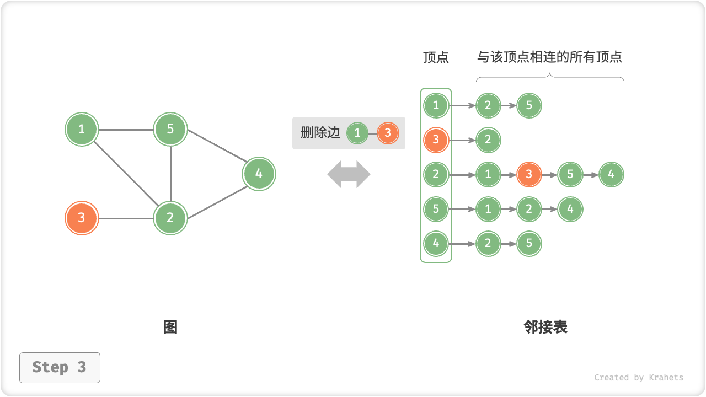
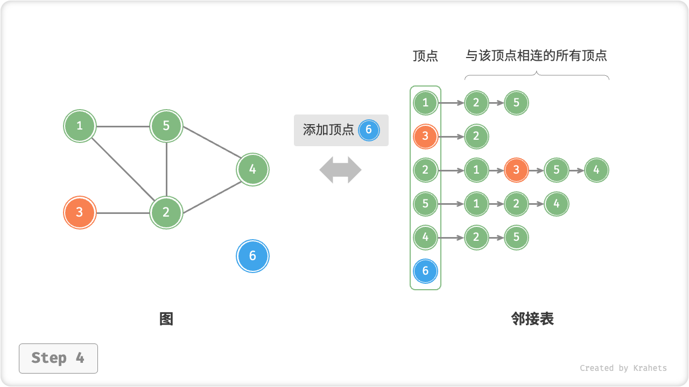

# 图基础操作

图的基础操作可分为对“边”的操作和对“顶点”的操作。在“邻接矩阵”和“邻接表”两种表示方法下，实现方式有所不同。

## 基于邻接矩阵的实现

给定一个顶点数量为 $n$ 的无向图，则各种操作的实现方式如下图所示。

- **添加或删除边**：直接在邻接矩阵中修改指定的边即可，使用 $O(1)$ 时间。而由于是无向图，因此需要同时更新两个方向的边。
- **添加顶点**：在邻接矩阵的尾部添加一行一列，并全部填 $0$ 即可，使用 $O(n)$ 时间。
- **删除顶点**：在邻接矩阵中删除一行一列。当删除首行首列时达到最差情况，需要将 $(n-1)^2$ 个元素“向左上移动”，从而使用 $O(n^2)$ 时间。
- **初始化**：传入 $n$ 个顶点，初始化长度为 $n$ 的顶点列表 `vertices` ，使用 $O(n)$ 时间；初始化 $n \times n$ 大小的邻接矩阵 `adjMat` ，使用 $O(n^2)$ 时间。

=== "初始化邻接矩阵"
    

=== "添加边"
    

=== "删除边"
    

=== "添加顶点"
    

=== "删除顶点"
    

以下是基于邻接矩阵表示图的实现代码。

=== "Python"

    ```python title="graph_adjacency_matrix.py"
    [class]{GraphAdjMat}-[func]{}
    ```

=== "C++"

    ```cpp title="graph_adjacency_matrix.cpp"
    [class]{GraphAdjMat}-[func]{}
    ```

=== "Java"

    ```java title="graph_adjacency_matrix.java"
    [class]{GraphAdjMat}-[func]{}
    ```

=== "C#"

    ```csharp title="graph_adjacency_matrix.cs"
    [class]{GraphAdjMat}-[func]{}
    ```

=== "Go"

    ```go title="graph_adjacency_matrix.go"
    [class]{graphAdjMat}-[func]{}
    ```

=== "Swift"

    ```swift title="graph_adjacency_matrix.swift"
    [class]{GraphAdjMat}-[func]{}
    ```

=== "JS"

    ```javascript title="graph_adjacency_matrix.js"
    [class]{GraphAdjMat}-[func]{}
    ```

=== "TS"

    ```typescript title="graph_adjacency_matrix.ts"
    [class]{GraphAdjMat}-[func]{}
    ```

=== "Dart"

    ```dart title="graph_adjacency_matrix.dart"
    [class]{GraphAdjMat}-[func]{}
    ```

=== "Rust"

    ```rust title="graph_adjacency_matrix.rs"
    [class]{GraphAdjMat}-[func]{}
    ```

=== "C"

    ```c title="graph_adjacency_matrix.c"
    [class]{graphAdjMat}-[func]{}
    ```

=== "Zig"

    ```zig title="graph_adjacency_matrix.zig"

    ```

## 基于邻接表的实现

设无向图的顶点总数为 $n$、边总数为 $m$ ，则可根据下图所示的方法实现各种操作。

- **添加边**：在顶点对应链表的末尾添加边即可，使用 $O(1)$ 时间。因为是无向图，所以需要同时添加两个方向的边。
- **删除边**：在顶点对应链表中查找并删除指定边，使用 $O(m)$ 时间。在无向图中，需要同时删除两个方向的边。
- **添加顶点**：在邻接表中添加一个链表，并将新增顶点作为链表头节点，使用 $O(1)$ 时间。
- **删除顶点**：需遍历整个邻接表，删除包含指定顶点的所有边，使用 $O(n + m)$ 时间。
- **初始化**：在邻接表中创建 $n$ 个顶点和 $2m$ 条边，使用 $O(n + m)$ 时间。

=== "初始化邻接表"
    

=== "添加边"
    

=== "删除边"
    

=== "添加顶点"
    

=== "删除顶点"
    

以下是基于邻接表实现图的代码示例。细心的同学可能注意到，**我们在邻接表中使用 `Vertex` 节点类来表示顶点**，而这样做是有原因的。

1. 如果我们选择通过顶点值来区分不同顶点，那么值重复的顶点将无法被区分。
2. 如果类似邻接矩阵那样，使用顶点列表索引来区分不同顶点。那么，假设我们想要删除索引为 $i$ 的顶点，则需要遍历整个邻接表，将其中 $> i$ 的索引全部减 $1$ ，这样操作效率较低。
3. 因此我们考虑引入顶点类 `Vertex` ，使得每个顶点都是唯一的对象，此时删除顶点时就无须改动其余顶点了。

=== "Python"

    ```python title="graph_adjacency_list.py"
    [class]{GraphAdjList}-[func]{}
    ```

=== "C++"

    ```cpp title="graph_adjacency_list.cpp"
    [class]{GraphAdjList}-[func]{}
    ```

=== "Java"

    ```java title="graph_adjacency_list.java"
    [class]{GraphAdjList}-[func]{}
    ```

=== "C#"

    ```csharp title="graph_adjacency_list.cs"
    [class]{GraphAdjList}-[func]{}
    ```

=== "Go"

    ```go title="graph_adjacency_list.go"
    [class]{graphAdjList}-[func]{}
    ```

=== "Swift"

    ```swift title="graph_adjacency_list.swift"
    [class]{GraphAdjList}-[func]{}
    ```

=== "JS"

    ```javascript title="graph_adjacency_list.js"
    [class]{GraphAdjList}-[func]{}
    ```

=== "TS"

    ```typescript title="graph_adjacency_list.ts"
    [class]{GraphAdjList}-[func]{}
    ```

=== "Dart"

    ```dart title="graph_adjacency_list.dart"
    [class]{GraphAdjList}-[func]{}
    ```

=== "Rust"

    ```rust title="graph_adjacency_list.rs"
    [class]{GraphAdjList}-[func]{}
    ```

=== "C"

    ```c title="graph_adjacency_list.c"
    [class]{graphAdjList}-[func]{}
    ```

=== "Zig"

    ```zig title="graph_adjacency_list.zig"
    [class]{GraphAdjList}-[func]{}
    ```

## 效率对比

设图中共有 $n$ 个顶点和 $m$ 条边，下表对比了邻接矩阵和邻接表的时间和空间效率。

<p align="center"> 表 <id> &nbsp; 邻接矩阵与邻接表对比 </p>

|              | 邻接矩阵 | 邻接表（链表） | 邻接表（哈希表） |
| ------------ | -------- | -------------- | ---------------- |
| 判断是否邻接 | $O(1)$   | $O(m)$         | $O(1)$           |
| 添加边       | $O(1)$   | $O(1)$         | $O(1)$           |
| 删除边       | $O(1)$   | $O(m)$         | $O(1)$           |
| 添加顶点     | $O(n)$   | $O(1)$         | $O(1)$           |
| 删除顶点     | $O(n^2)$ | $O(n + m)$     | $O(n)$           |
| 内存空间占用 | $O(n^2)$ | $O(n + m)$     | $O(n + m)$       |

观察上表，似乎邻接表（哈希表）的时间与空间效率最优。但实际上，在邻接矩阵中操作边的效率更高，只需要一次数组访问或赋值操作即可。综合来看，邻接矩阵体现了“以空间换时间”的原则，而邻接表体现了“以时间换空间”的原则。
