# 图的遍历

树代表的是“一对多”的关系，而图则具有更高的自由度，可以表示任意的“多对多”关系。因此，我们可以把树看作是图的一种特例。显然，**树的遍历操作也是图的遍历操作的一种特例**。

图和树都都需要应用搜索算法来实现遍历操作。图的遍历方式可分为两种：「广度优先遍历 breadth-first traversal」和「深度优先遍历 depth-first traversal」。它们也常被称为「广度优先搜索 breadth-first search」和「深度优先搜索 depth-first search」，简称 BFS 和 DFS 。

## 广度优先遍历

**广度优先遍历是一种由近及远的遍历方式，从某个节点出发，始终优先访问距离最近的顶点，并一层层向外扩张**。如下图所示，从左上角顶点出发，先遍历该顶点的所有邻接顶点，然后遍历下一个顶点的所有邻接顶点，以此类推，直至所有顶点访问完毕。

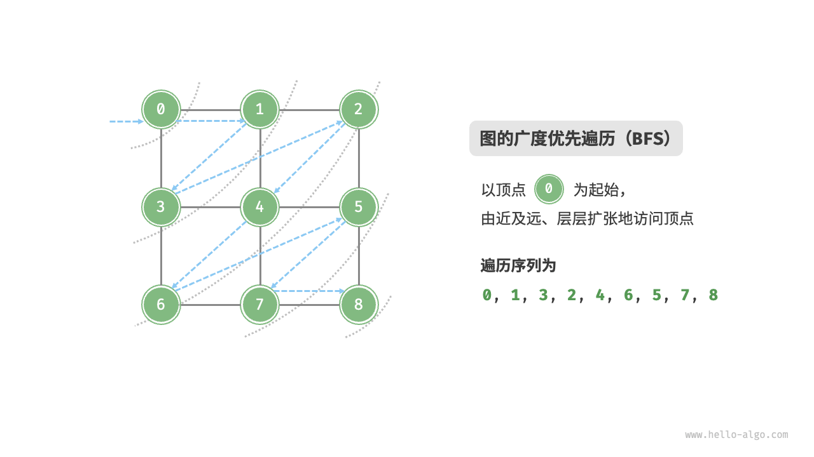

### 算法实现

BFS 通常借助队列来实现。队列具有“先入先出”的性质，这与 BFS 的“由近及远”的思想异曲同工。

1. 将遍历起始顶点 `startVet` 加入队列，并开启循环。
2. 在循环的每轮迭代中，弹出队首顶点并记录访问，然后将该顶点的所有邻接顶点加入到队列尾部。
3. 循环步骤 `2.` ，直到所有顶点被访问完成后结束。

为了防止重复遍历顶点，我们需要借助一个哈希表 `visited` 来记录哪些节点已被访问。

=== "Python"

    ```python title="graph_bfs.py"
    [class]{}-[func]{graph_bfs}
    ```

=== "C++"

    ```cpp title="graph_bfs.cpp"
    [class]{}-[func]{graphBFS}
    ```

=== "Java"

    ```java title="graph_bfs.java"
    [class]{graph_bfs}-[func]{graphBFS}
    ```

=== "C#"

    ```csharp title="graph_bfs.cs"
    [class]{graph_bfs}-[func]{graphBFS}
    ```

=== "Go"

    ```go title="graph_bfs.go"
    [class]{}-[func]{graphBFS}
    ```

=== "Swift"

    ```swift title="graph_bfs.swift"
    [class]{}-[func]{graphBFS}
    ```

=== "JS"

    ```javascript title="graph_bfs.js"
    [class]{}-[func]{graphBFS}
    ```

=== "TS"

    ```typescript title="graph_bfs.ts"
    [class]{}-[func]{graphBFS}
    ```

=== "Dart"

    ```dart title="graph_bfs.dart"
    [class]{}-[func]{graphBFS}
    ```

=== "Rust"

    ```rust title="graph_bfs.rs"
    [class]{}-[func]{graph_bfs}
    ```

=== "C"

    ```c title="graph_bfs.c"
    [class]{}-[func]{graphBFS}
    ```

=== "Zig"

    ```zig title="graph_bfs.zig"
    [class]{}-[func]{graphBFS}
    ```

代码相对抽象，建议对照下图来加深理解。

=== "<1>"
    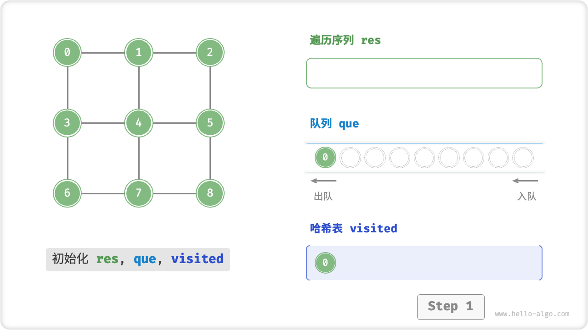

=== "<2>"
    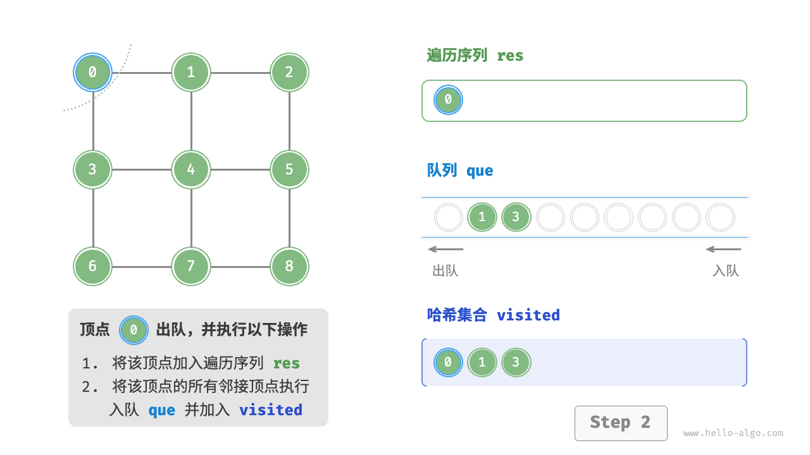

=== "<3>"
    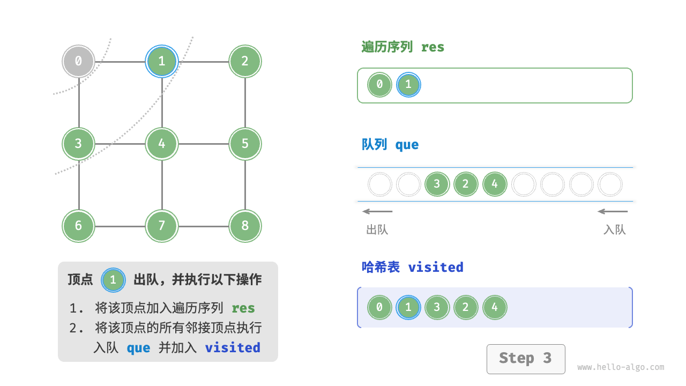

=== "<4>"
    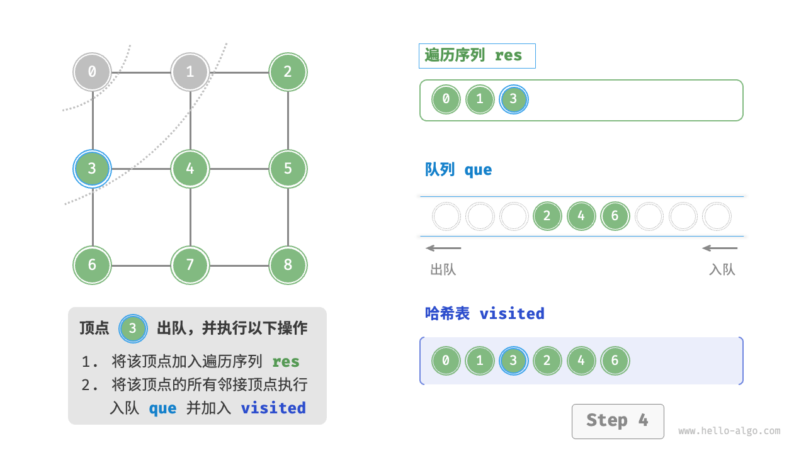

=== "<5>"
    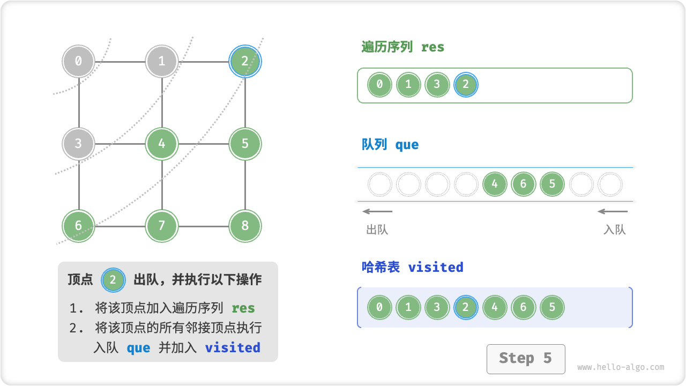

=== "<6>"
    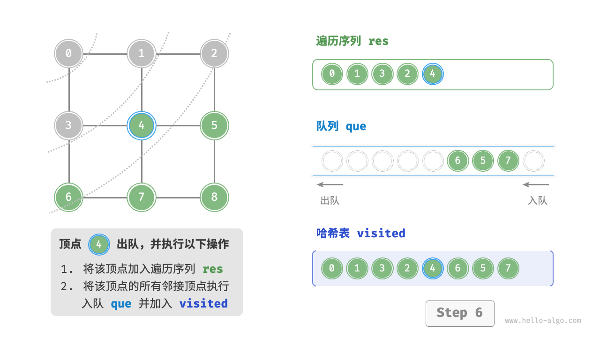

=== "<7>"
    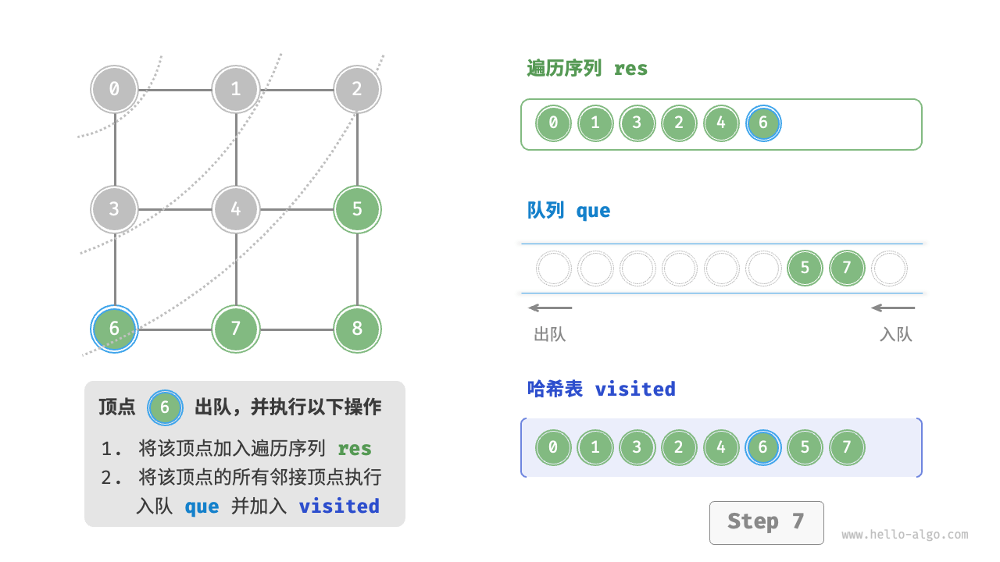

=== "<8>"
    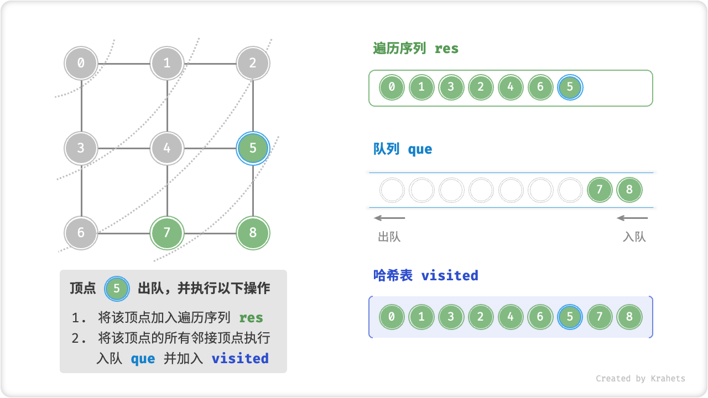

=== "<9>"
    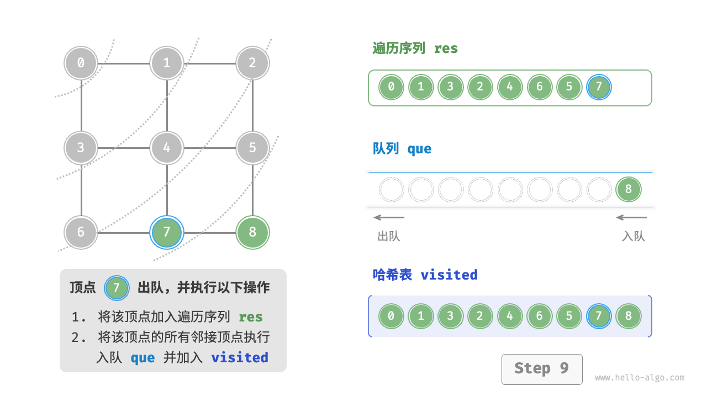

=== "<10>"
    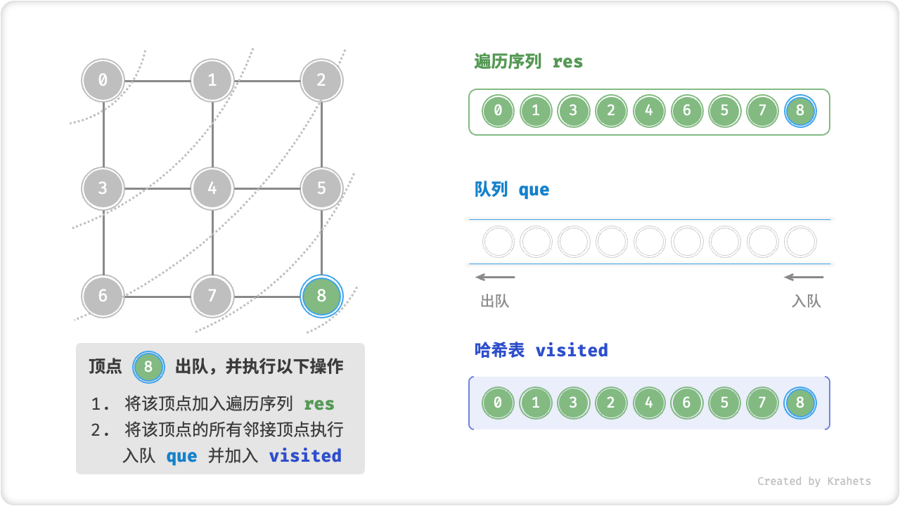

=== "<11>"
    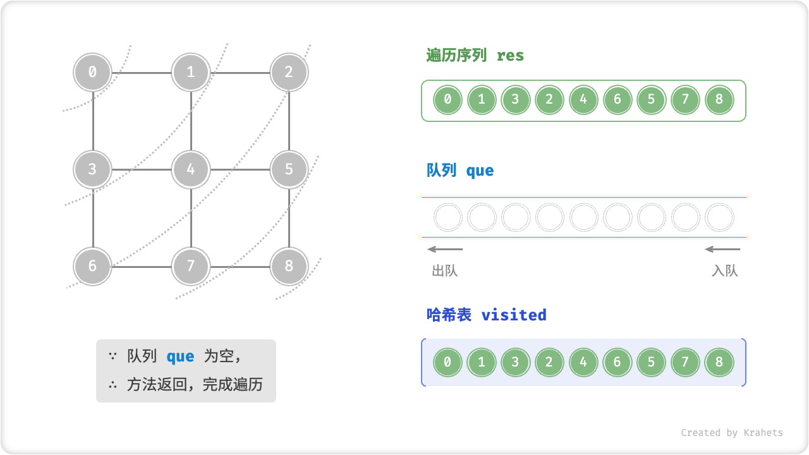

!!! question "广度优先遍历的序列是否唯一？"

    不唯一。广度优先遍历只要求按“由近及远”的顺序遍历，**而多个相同距离的顶点的遍历顺序是允许被任意打乱的**。以上图为例，顶点 $1$、$3$ 的访问顺序可以交换、顶点 $2$、$4$、$6$ 的访问顺序也可以任意交换。

### 复杂度分析

**时间复杂度：** 所有顶点都会入队并出队一次，使用 $O(|V|)$ 时间；在遍历邻接顶点的过程中，由于是无向图，因此所有边都会被访问 $2$ 次，使用 $O(2|E|)$ 时间；总体使用 $O(|V| + |E|)$ 时间。

**空间复杂度：** 列表 `res` ，哈希表 `visited` ，队列 `que` 中的顶点数量最多为 $|V|$ ，使用 $O(|V|)$ 空间。

## 深度优先遍历

**深度优先遍历是一种优先走到底、无路可走再回头的遍历方式**。如下图所示，从左上角顶点出发，访问当前顶点的某个邻接顶点，直到走到尽头时返回，再继续走到尽头并返回，以此类推，直至所有顶点遍历完成。

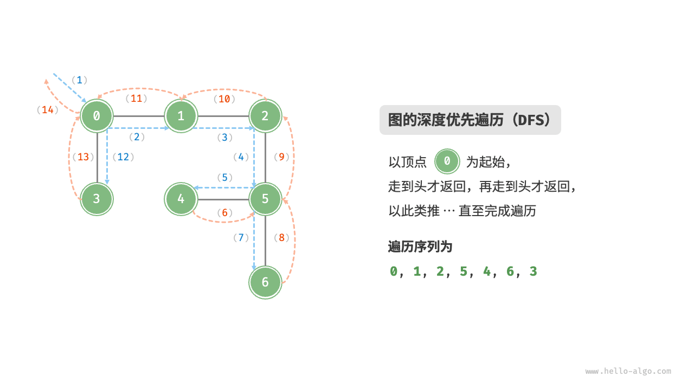

### 算法实现

这种“走到尽头再返回”的算法范式通常基于递归来实现。与广度优先遍历类似，在深度优先遍历中我们也需要借助一个哈希表 `visited` 来记录已被访问的顶点，以避免重复访问顶点。

=== "Python"

    ```python title="graph_dfs.py"
    [class]{}-[func]{dfs}

    [class]{}-[func]{graph_dfs}
    ```

=== "C++"

    ```cpp title="graph_dfs.cpp"
    [class]{}-[func]{dfs}

    [class]{}-[func]{graphDFS}
    ```

=== "Java"

    ```java title="graph_dfs.java"
    [class]{graph_dfs}-[func]{dfs}

    [class]{graph_dfs}-[func]{graphDFS}
    ```

=== "C#"

    ```csharp title="graph_dfs.cs"
    [class]{graph_dfs}-[func]{dfs}

    [class]{graph_dfs}-[func]{graphDFS}
    ```

=== "Go"

    ```go title="graph_dfs.go"
    [class]{}-[func]{dfs}

    [class]{}-[func]{graphDFS}
    ```

=== "Swift"

    ```swift title="graph_dfs.swift"
    [class]{}-[func]{dfs}

    [class]{}-[func]{graphDFS}
    ```

=== "JS"

    ```javascript title="graph_dfs.js"
    [class]{}-[func]{dfs}

    [class]{}-[func]{graphDFS}
    ```

=== "TS"

    ```typescript title="graph_dfs.ts"
    [class]{}-[func]{dfs}

    [class]{}-[func]{graphDFS}
    ```

=== "Dart"

    ```dart title="graph_dfs.dart"
    [class]{}-[func]{dfs}

    [class]{}-[func]{graphDFS}
    ```

=== "Rust"

    ```rust title="graph_dfs.rs"
    [class]{}-[func]{dfs}

    [class]{}-[func]{graph_dfs}
    ```

=== "C"

    ```c title="graph_dfs.c"
    [class]{}-[func]{dfs}

    [class]{}-[func]{graphDFS}
    ```

=== "Zig"

    ```zig title="graph_dfs.zig"
    [class]{}-[func]{dfs}

    [class]{}-[func]{graphDFS}
    ```

深度优先遍历的算法流程如下图所示。

- **直虚线代表向下递推**，表示开启了一个新的递归方法来访问新顶点。
- **曲虚线代表向上回溯**，表示此递归方法已经返回，回溯到了开启此递归方法的位置。

为了加深理解，建议将图示与代码结合起来，在脑中（或者用笔画下来）模拟整个 DFS 过程，包括每个递归方法何时开启、何时返回。

=== "<1>"
    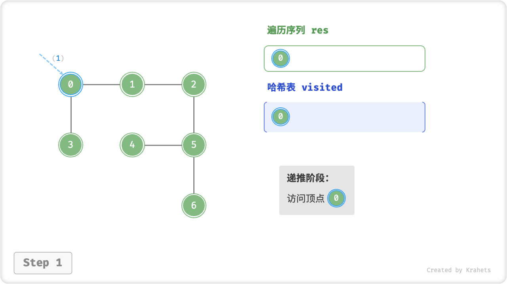

=== "<2>"
    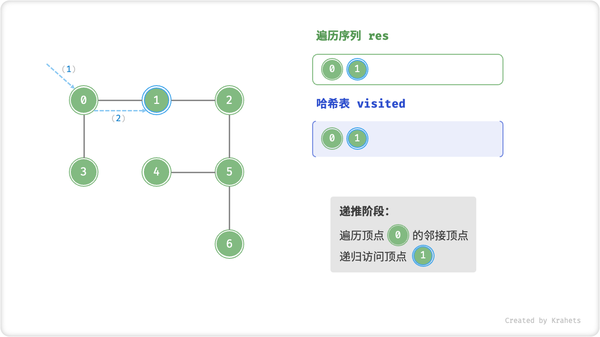

=== "<3>"
    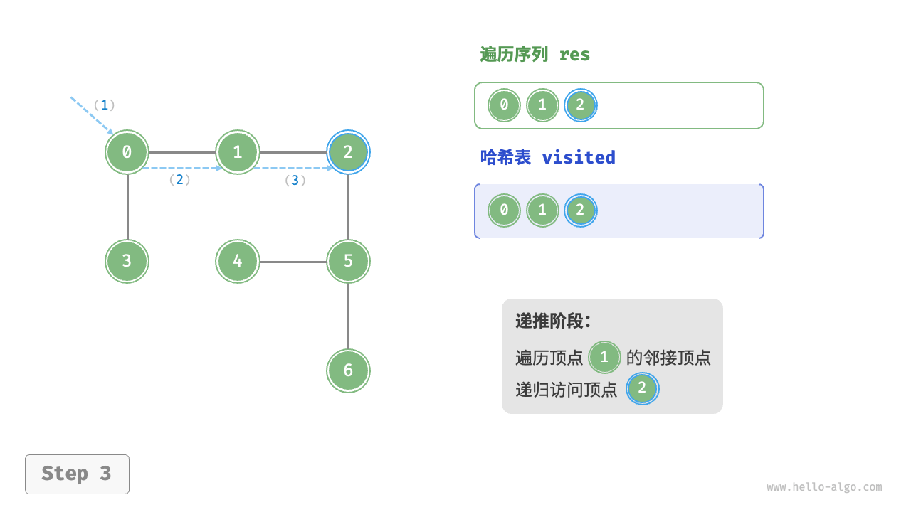

=== "<4>"
    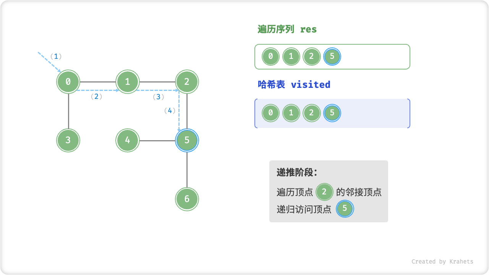

=== "<5>"
    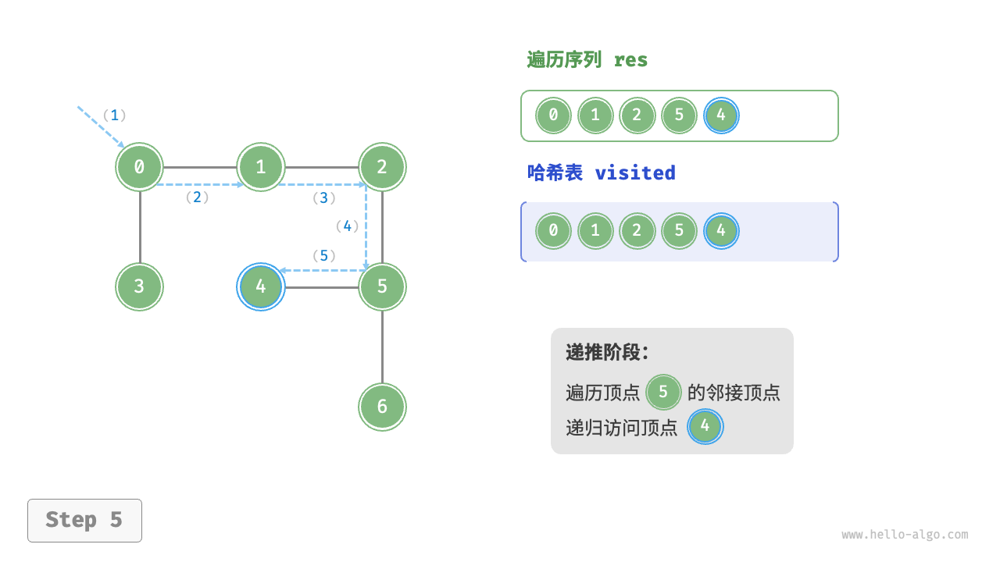

=== "<6>"
    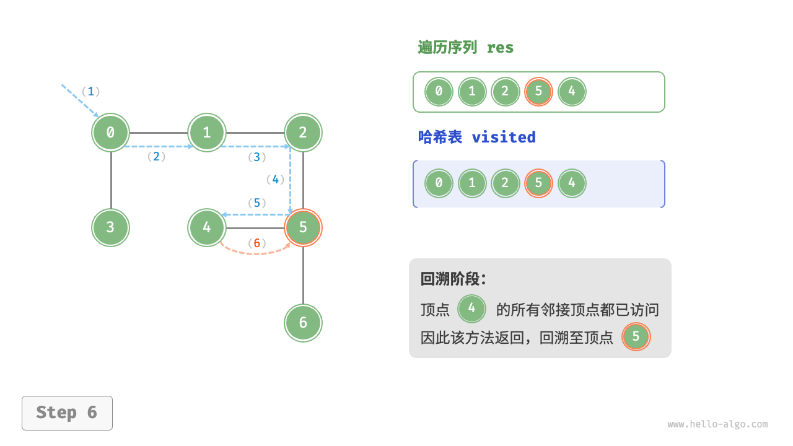

=== "<7>"
    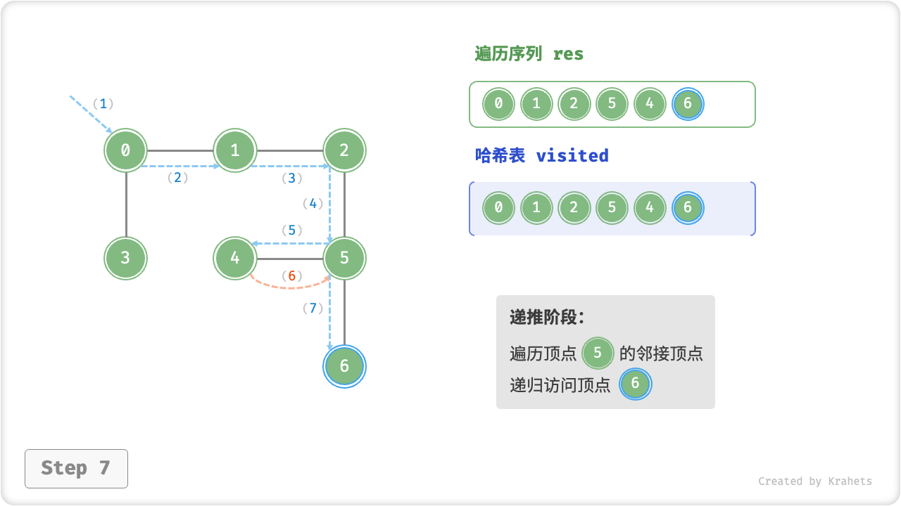

=== "<8>"
    

=== "<9>"
    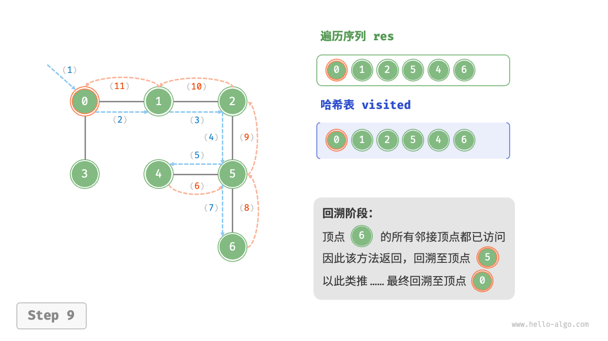

=== "<10>"
    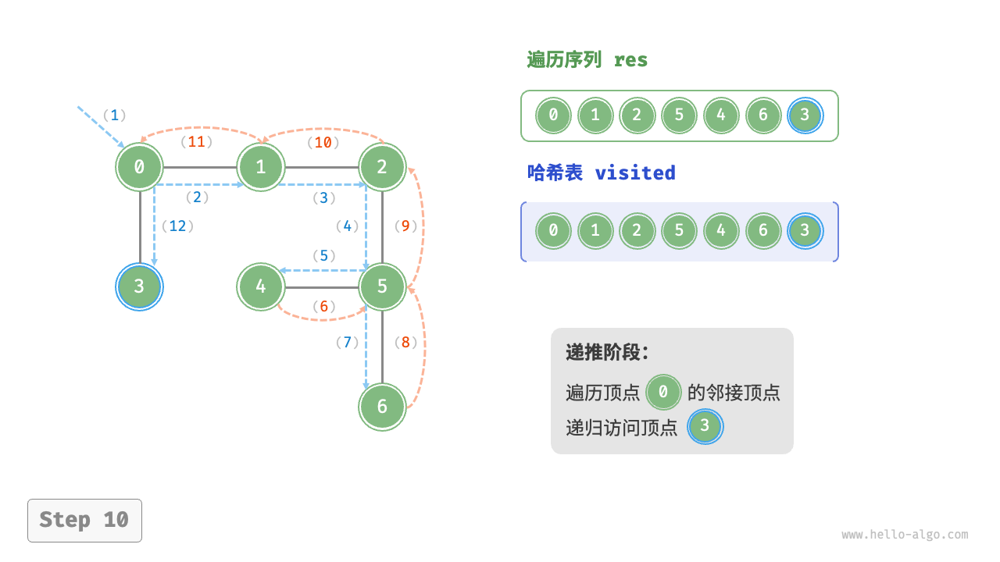

=== "<11>"
    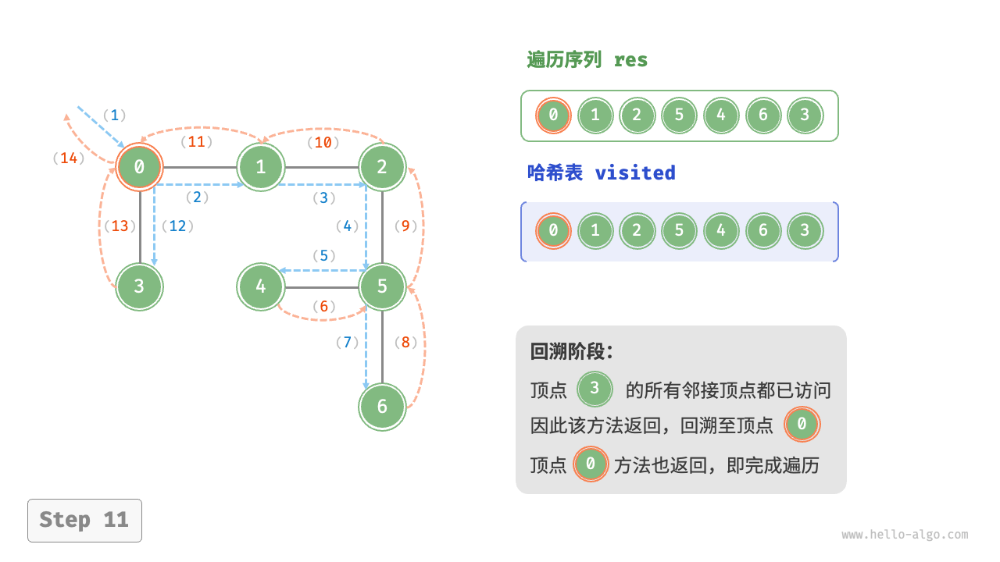

!!! question "深度优先遍历的序列是否唯一？"

    与广度优先遍历类似，深度优先遍历序列的顺序也不是唯一的。给定某顶点，先往哪个方向探索都可以，即邻接顶点的顺序可以任意打乱，都是深度优先遍历。
    
    以树的遍历为例，“根 $\rightarrow$ 左 $\rightarrow$ 右”、“左 $\rightarrow$ 根 $\rightarrow$ 右”、“左 $\rightarrow$ 右 $\rightarrow$ 根”分别对应前序、中序、后序遍历，它们展示了三种不同的遍历优先级，然而这三者都属于深度优先遍历。

### 复杂度分析

**时间复杂度：** 所有顶点都会被访问 $1$ 次，使用 $O(|V|)$ 时间；所有边都会被访问 $2$ 次，使用 $O(2|E|)$ 时间；总体使用 $O(|V| + |E|)$ 时间。

**空间复杂度：** 列表 `res` ，哈希表 `visited` 顶点数量最多为 $|V|$ ，递归深度最大为 $|V|$ ，因此使用 $O(|V|)$ 空间。
