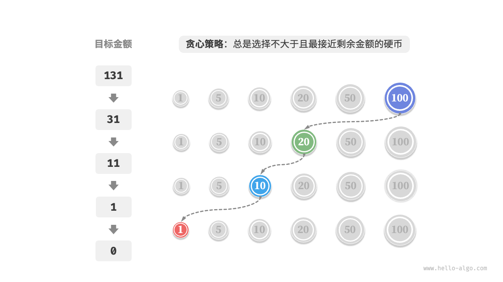
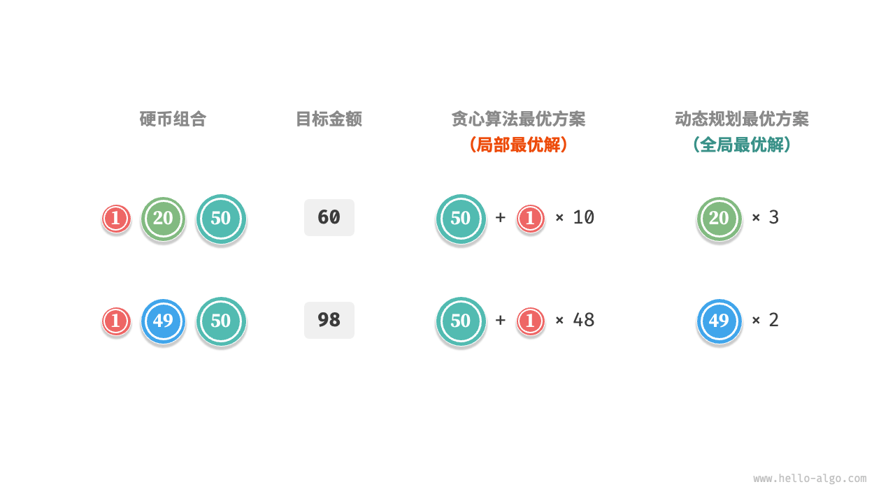

# 15.1 &nbsp; 贪心算法

「贪心算法 greedy algorithm」是一种常见的解决优化问题的算法，其基本思想是在问题的每个决策阶段，都选择当前看起来最优的选择，即贪心地做出局部最优的决策，以期获得全局最优解。贪心算法简洁且高效，在许多实际问题中有着广泛的应用。

贪心算法和动态规划都常用于解决优化问题。它们之间存在一些相似之处，比如都依赖最优子结构性质，但工作原理不同。

- 动态规划会根据之前阶段的所有决策来考虑当前决策，并使用过去子问题的解来构建当前子问题的解。
- 贪心算法不会考虑过去的决策，而是一路向前地进行贪心选择，不断缩小问题范围，直至问题被解决。

我们先通过例题“零钱兑换”了解贪心算法的工作原理。这道题已经在“完全背包问题”章节中介绍过，相信你对它并不陌生。

!!! question

    给定 $n$ 种硬币，第 $i$ 种硬币的面值为 $coins[i - 1]$ ，目标金额为 $amt$ ，每种硬币可以重复选取，问能够凑出目标金额的最少硬币数量。如果无法凑出目标金额，则返回 $-1$ 。

本题采取的贪心策略如图 15-1 所示。给定目标金额，**我们贪心地选择不大于且最接近它的硬币**，不断循环该步骤，直至凑出目标金额为止。

{ class="animation-figure" }

<p align="center"> 图 15-1 &nbsp; 零钱兑换的贪心策略 </p>

实现代码如下所示：

=== "Python"

    ```python title="coin_change_greedy.py"
    def coin_change_greedy(coins: list[int], amt: int) -> int:
        """零钱兑换：贪心"""
        # 假设 coins 列表有序
        i = len(coins) - 1
        count = 0
        # 循环进行贪心选择，直到无剩余金额
        while amt > 0:
            # 找到小于且最接近剩余金额的硬币
            while i > 0 and coins[i] > amt:
                i -= 1
            # 选择 coins[i]
            amt -= coins[i]
            count += 1
        # 若未找到可行方案，则返回 -1
        return count if amt == 0 else -1
    ```

=== "C++"

    ```cpp title="coin_change_greedy.cpp"
    /* 零钱兑换：贪心 */
    int coinChangeGreedy(vector<int> &coins, int amt) {
        // 假设 coins 列表有序
        int i = coins.size() - 1;
        int count = 0;
        // 循环进行贪心选择，直到无剩余金额
        while (amt > 0) {
            // 找到小于且最接近剩余金额的硬币
            while (i > 0 && coins[i] > amt) {
                i--;
            }
            // 选择 coins[i]
            amt -= coins[i];
            count++;
        }
        // 若未找到可行方案，则返回 -1
        return amt == 0 ? count : -1;
    }
    ```

=== "Java"

    ```java title="coin_change_greedy.java"
    /* 零钱兑换：贪心 */
    int coinChangeGreedy(int[] coins, int amt) {
        // 假设 coins 列表有序
        int i = coins.length - 1;
        int count = 0;
        // 循环进行贪心选择，直到无剩余金额
        while (amt > 0) {
            // 找到小于且最接近剩余金额的硬币
            while (i > 0 && coins[i] > amt) {
                i--;
            }
            // 选择 coins[i]
            amt -= coins[i];
            count++;
        }
        // 若未找到可行方案，则返回 -1
        return amt == 0 ? count : -1;
    }
    ```

=== "C#"

    ```csharp title="coin_change_greedy.cs"
    /* 零钱兑换：贪心 */
    int CoinChangeGreedy(int[] coins, int amt) {
        // 假设 coins 列表有序
        int i = coins.Length - 1;
        int count = 0;
        // 循环进行贪心选择，直到无剩余金额
        while (amt > 0) {
            // 找到小于且最接近剩余金额的硬币
            while (i > 0 && coins[i] > amt) {
                i--;
            }
            // 选择 coins[i]
            amt -= coins[i];
            count++;
        }
        // 若未找到可行方案，则返回 -1
        return amt == 0 ? count : -1;
    }
    ```

=== "Go"

    ```go title="coin_change_greedy.go"
    /* 零钱兑换：贪心 */
    func coinChangeGreedy(coins []int, amt int) int {
        // 假设 coins 列表有序
        i := len(coins) - 1
        count := 0
        // 循环进行贪心选择，直到无剩余金额
        for amt > 0 {
            // 找到小于且最接近剩余金额的硬币
            for i > 0 && coins[i] > amt {
                i--
            }
            // 选择 coins[i]
            amt -= coins[i]
            count++
        }
        // 若未找到可行方案，则返回 -1
        if amt != 0 {
            return -1
        }
        return count
    }
    ```

=== "Swift"

    ```swift title="coin_change_greedy.swift"
    /* 零钱兑换：贪心 */
    func coinChangeGreedy(coins: [Int], amt: Int) -> Int {
        // 假设 coins 列表有序
        var i = coins.count - 1
        var count = 0
        var amt = amt
        // 循环进行贪心选择，直到无剩余金额
        while amt > 0 {
            // 找到小于且最接近剩余金额的硬币
            while i > 0 && coins[i] > amt {
                i -= 1
            }
            // 选择 coins[i]
            amt -= coins[i]
            count += 1
        }
        // 若未找到可行方案，则返回 -1
        return amt == 0 ? count : -1
    }
    ```

=== "JS"

    ```javascript title="coin_change_greedy.js"
    /* 零钱兑换：贪心 */
    function coinChangeGreedy(coins, amt) {
        // 假设 coins 数组有序
        let i = coins.length - 1;
        let count = 0;
        // 循环进行贪心选择，直到无剩余金额
        while (amt > 0) {
            // 找到小于且最接近剩余金额的硬币
            while (i > 0 && coins[i] > amt) {
                i--;
            }
            // 选择 coins[i]
            amt -= coins[i];
            count++;
        }
        // 若未找到可行方案，则返回 -1
        return amt === 0 ? count : -1;
    }
    ```

=== "TS"

    ```typescript title="coin_change_greedy.ts"
    /* 零钱兑换：贪心 */
    function coinChangeGreedy(coins: number[], amt: number): number {
        // 假设 coins 数组有序
        let i = coins.length - 1;
        let count = 0;
        // 循环进行贪心选择，直到无剩余金额
        while (amt > 0) {
            // 找到小于且最接近剩余金额的硬币
            while (i > 0 && coins[i] > amt) {
                i--;
            }
            // 选择 coins[i]
            amt -= coins[i];
            count++;
        }
        // 若未找到可行方案，则返回 -1
        return amt === 0 ? count : -1;
    }
    ```

=== "Dart"

    ```dart title="coin_change_greedy.dart"
    /* 零钱兑换：贪心 */
    int coinChangeGreedy(List<int> coins, int amt) {
      // 假设 coins 列表有序
      int i = coins.length - 1;
      int count = 0;
      // 循环进行贪心选择，直到无剩余金额
      while (amt > 0) {
        // 找到小于且最接近剩余金额的硬币
        while (i > 0 && coins[i] > amt) {
          i--;
        }
        // 选择 coins[i]
        amt -= coins[i];
        count++;
      }
      // 若未找到可行方案，则返回 -1
      return amt == 0 ? count : -1;
    }
    ```

=== "Rust"

    ```rust title="coin_change_greedy.rs"
    /* 零钱兑换：贪心 */
    fn coin_change_greedy(coins: &[i32], mut amt: i32) -> i32 {
        // 假设 coins 列表有序
        let mut i = coins.len() - 1;
        let mut count = 0;
        // 循环进行贪心选择，直到无剩余金额
        while amt > 0 {
            // 找到小于且最接近剩余金额的硬币
            while i > 0 && coins[i] > amt {
                i -= 1;
            }
            // 选择 coins[i]
            amt -= coins[i];
            count += 1;
        }
        // 若未找到可行方案，则返回 -1
        if amt == 0 {
            count
        } else {
            -1
        }
    }
    ```

=== "C"

    ```c title="coin_change_greedy.c"
    /* 零钱兑换：贪心 */
    int coinChangeGreedy(int *coins, int size, int amt) {
        // 假设 coins 列表有序
        int i = size - 1;
        int count = 0;
        // 循环进行贪心选择，直到无剩余金额
        while (amt > 0) {
            // 找到小于且最接近剩余金额的硬币
            while (i > 0 && coins[i] > amt) {
                i--;
            }
            // 选择 coins[i]
            amt -= coins[i];
            count++;
        }
        // 若未找到可行方案，则返回 -1
        return amt == 0 ? count : -1;
    }
    ```

=== "Kotlin"

    ```kotlin title="coin_change_greedy.kt"
    /* 零钱兑换：贪心 */
    fun coinChangeGreedy(coins: IntArray, amt: Int): Int {
        // 假设 coins 列表有序
        var am = amt
        var i = coins.size - 1
        var count = 0
        // 循环进行贪心选择，直到无剩余金额
        while (am > 0) {
            // 找到小于且最接近剩余金额的硬币
            while (i > 0 && coins[i] > am) {
                i--
            }
            // 选择 coins[i]
            am -= coins[i]
            count++
        }
        // 若未找到可行方案，则返回 -1
        return if (am == 0) count else -1
    }
    ```

=== "Zig"

    ```zig title="coin_change_greedy.zig"
    [class]{}-[func]{coinChangeGreedy}
    ```

??? pythontutor "可视化运行"

    <div style="height: 549px; width: 100%;"><iframe class="pythontutor-iframe" src="https://pythontutor.com/iframe-embed.html#code=def%20coin_change_greedy%28coins%3A%20list%5Bint%5D,%20amt%3A%20int%29%20-%3E%20int%3A%0A%20%20%20%20%22%22%22%E9%9B%B6%E9%92%B1%E5%85%91%E6%8D%A2%EF%BC%9A%E8%B4%AA%E5%BF%83%22%22%22%0A%20%20%20%20%23%20%E5%81%87%E8%AE%BE%20coins%20%E5%88%97%E8%A1%A8%E6%9C%89%E5%BA%8F%0A%20%20%20%20i%20%3D%20len%28coins%29%20-%201%0A%20%20%20%20count%20%3D%200%0A%20%20%20%20%23%20%E5%BE%AA%E7%8E%AF%E8%BF%9B%E8%A1%8C%E8%B4%AA%E5%BF%83%E9%80%89%E6%8B%A9%EF%BC%8C%E7%9B%B4%E5%88%B0%E6%97%A0%E5%89%A9%E4%BD%99%E9%87%91%E9%A2%9D%0A%20%20%20%20while%20amt%20%3E%200%3A%0A%20%20%20%20%20%20%20%20%23%20%E6%89%BE%E5%88%B0%E5%B0%8F%E4%BA%8E%E4%B8%94%E6%9C%80%E6%8E%A5%E8%BF%91%E5%89%A9%E4%BD%99%E9%87%91%E9%A2%9D%E7%9A%84%E7%A1%AC%E5%B8%81%0A%20%20%20%20%20%20%20%20while%20i%20%3E%200%20and%20coins%5Bi%5D%20%3E%20amt%3A%0A%20%20%20%20%20%20%20%20%20%20%20%20i%20-%3D%201%0A%20%20%20%20%20%20%20%20%23%20%E9%80%89%E6%8B%A9%20coins%5Bi%5D%0A%20%20%20%20%20%20%20%20amt%20-%3D%20coins%5Bi%5D%0A%20%20%20%20%20%20%20%20count%20%2B%3D%201%0A%20%20%20%20%23%20%E8%8B%A5%E6%9C%AA%E6%89%BE%E5%88%B0%E5%8F%AF%E8%A1%8C%E6%96%B9%E6%A1%88%EF%BC%8C%E5%88%99%E8%BF%94%E5%9B%9E%20-1%0A%20%20%20%20return%20count%20if%20amt%20%3D%3D%200%20else%20-1%0A%0A%0A%22%22%22Driver%20Code%22%22%22%0Aif%20__name__%20%3D%3D%20%22__main__%22%3A%0A%20%20%20%20%23%20%E8%B4%AA%E5%BF%83%EF%BC%9A%E8%83%BD%E5%A4%9F%E4%BF%9D%E8%AF%81%E6%89%BE%E5%88%B0%E5%85%A8%E5%B1%80%E6%9C%80%E4%BC%98%E8%A7%A3%0A%20%20%20%20coins%20%3D%20%5B1,%205,%2010,%2020,%2050,%20100%5D%0A%20%20%20%20amt%20%3D%20186%0A%20%20%20%20res%20%3D%20coin_change_greedy%28coins,%20amt%29%0A%20%20%20%20print%28f%22%5Cncoins%20%3D%20%7Bcoins%7D,%20amt%20%3D%20%7Bamt%7D%22%29%0A%20%20%20%20print%28f%22%E5%87%91%E5%88%B0%20%7Bamt%7D%20%E6%89%80%E9%9C%80%E7%9A%84%E6%9C%80%E5%B0%91%E7%A1%AC%E5%B8%81%E6%95%B0%E9%87%8F%E4%B8%BA%20%7Bres%7D%22%29%0A%0A%20%20%20%20%23%20%E8%B4%AA%E5%BF%83%EF%BC%9A%E6%97%A0%E6%B3%95%E4%BF%9D%E8%AF%81%E6%89%BE%E5%88%B0%E5%85%A8%E5%B1%80%E6%9C%80%E4%BC%98%E8%A7%A3%0A%20%20%20%20coins%20%3D%20%5B1,%2020,%2050%5D%0A%20%20%20%20amt%20%3D%2060%0A%20%20%20%20res%20%3D%20coin_change_greedy%28coins,%20amt%29%0A%20%20%20%20print%28f%22%5Cncoins%20%3D%20%7Bcoins%7D,%20amt%20%3D%20%7Bamt%7D%22%29%0A%20%20%20%20print%28f%22%E5%87%91%E5%88%B0%20%7Bamt%7D%20%E6%89%80%E9%9C%80%E7%9A%84%E6%9C%80%E5%B0%91%E7%A1%AC%E5%B8%81%E6%95%B0%E9%87%8F%E4%B8%BA%20%7Bres%7D%22%29%0A%20%20%20%20print%28f%22%E5%AE%9E%E9%99%85%E4%B8%8A%E9%9C%80%E8%A6%81%E7%9A%84%E6%9C%80%E5%B0%91%E6%95%B0%E9%87%8F%E4%B8%BA%203%20%EF%BC%8C%E5%8D%B3%2020%20%2B%2020%20%2B%2020%22%29&codeDivHeight=472&codeDivWidth=350&cumulative=false&curInstr=5&heapPrimitives=nevernest&origin=opt-frontend.js&py=311&rawInputLstJSON=%5B%5D&textReferences=false"> </iframe></div>
    <div style="margin-top: 5px;"><a href="https://pythontutor.com/iframe-embed.html#code=def%20coin_change_greedy%28coins%3A%20list%5Bint%5D,%20amt%3A%20int%29%20-%3E%20int%3A%0A%20%20%20%20%22%22%22%E9%9B%B6%E9%92%B1%E5%85%91%E6%8D%A2%EF%BC%9A%E8%B4%AA%E5%BF%83%22%22%22%0A%20%20%20%20%23%20%E5%81%87%E8%AE%BE%20coins%20%E5%88%97%E8%A1%A8%E6%9C%89%E5%BA%8F%0A%20%20%20%20i%20%3D%20len%28coins%29%20-%201%0A%20%20%20%20count%20%3D%200%0A%20%20%20%20%23%20%E5%BE%AA%E7%8E%AF%E8%BF%9B%E8%A1%8C%E8%B4%AA%E5%BF%83%E9%80%89%E6%8B%A9%EF%BC%8C%E7%9B%B4%E5%88%B0%E6%97%A0%E5%89%A9%E4%BD%99%E9%87%91%E9%A2%9D%0A%20%20%20%20while%20amt%20%3E%200%3A%0A%20%20%20%20%20%20%20%20%23%20%E6%89%BE%E5%88%B0%E5%B0%8F%E4%BA%8E%E4%B8%94%E6%9C%80%E6%8E%A5%E8%BF%91%E5%89%A9%E4%BD%99%E9%87%91%E9%A2%9D%E7%9A%84%E7%A1%AC%E5%B8%81%0A%20%20%20%20%20%20%20%20while%20i%20%3E%200%20and%20coins%5Bi%5D%20%3E%20amt%3A%0A%20%20%20%20%20%20%20%20%20%20%20%20i%20-%3D%201%0A%20%20%20%20%20%20%20%20%23%20%E9%80%89%E6%8B%A9%20coins%5Bi%5D%0A%20%20%20%20%20%20%20%20amt%20-%3D%20coins%5Bi%5D%0A%20%20%20%20%20%20%20%20count%20%2B%3D%201%0A%20%20%20%20%23%20%E8%8B%A5%E6%9C%AA%E6%89%BE%E5%88%B0%E5%8F%AF%E8%A1%8C%E6%96%B9%E6%A1%88%EF%BC%8C%E5%88%99%E8%BF%94%E5%9B%9E%20-1%0A%20%20%20%20return%20count%20if%20amt%20%3D%3D%200%20else%20-1%0A%0A%0A%22%22%22Driver%20Code%22%22%22%0Aif%20__name__%20%3D%3D%20%22__main__%22%3A%0A%20%20%20%20%23%20%E8%B4%AA%E5%BF%83%EF%BC%9A%E8%83%BD%E5%A4%9F%E4%BF%9D%E8%AF%81%E6%89%BE%E5%88%B0%E5%85%A8%E5%B1%80%E6%9C%80%E4%BC%98%E8%A7%A3%0A%20%20%20%20coins%20%3D%20%5B1,%205,%2010,%2020,%2050,%20100%5D%0A%20%20%20%20amt%20%3D%20186%0A%20%20%20%20res%20%3D%20coin_change_greedy%28coins,%20amt%29%0A%20%20%20%20print%28f%22%5Cncoins%20%3D%20%7Bcoins%7D,%20amt%20%3D%20%7Bamt%7D%22%29%0A%20%20%20%20print%28f%22%E5%87%91%E5%88%B0%20%7Bamt%7D%20%E6%89%80%E9%9C%80%E7%9A%84%E6%9C%80%E5%B0%91%E7%A1%AC%E5%B8%81%E6%95%B0%E9%87%8F%E4%B8%BA%20%7Bres%7D%22%29%0A%0A%20%20%20%20%23%20%E8%B4%AA%E5%BF%83%EF%BC%9A%E6%97%A0%E6%B3%95%E4%BF%9D%E8%AF%81%E6%89%BE%E5%88%B0%E5%85%A8%E5%B1%80%E6%9C%80%E4%BC%98%E8%A7%A3%0A%20%20%20%20coins%20%3D%20%5B1,%2020,%2050%5D%0A%20%20%20%20amt%20%3D%2060%0A%20%20%20%20res%20%3D%20coin_change_greedy%28coins,%20amt%29%0A%20%20%20%20print%28f%22%5Cncoins%20%3D%20%7Bcoins%7D,%20amt%20%3D%20%7Bamt%7D%22%29%0A%20%20%20%20print%28f%22%E5%87%91%E5%88%B0%20%7Bamt%7D%20%E6%89%80%E9%9C%80%E7%9A%84%E6%9C%80%E5%B0%91%E7%A1%AC%E5%B8%81%E6%95%B0%E9%87%8F%E4%B8%BA%20%7Bres%7D%22%29%0A%20%20%20%20print%28f%22%E5%AE%9E%E9%99%85%E4%B8%8A%E9%9C%80%E8%A6%81%E7%9A%84%E6%9C%80%E5%B0%91%E6%95%B0%E9%87%8F%E4%B8%BA%203%20%EF%BC%8C%E5%8D%B3%2020%20%2B%2020%20%2B%2020%22%29&codeDivHeight=800&codeDivWidth=600&cumulative=false&curInstr=5&heapPrimitives=nevernest&origin=opt-frontend.js&py=311&rawInputLstJSON=%5B%5D&textReferences=false" target="_blank" rel="noopener noreferrer">全屏观看 ></a></div>

你可能会不由地发出感叹：So clean ！贪心算法仅用约十行代码就解决了零钱兑换问题。

## 15.1.1 &nbsp; 贪心算法的优点与局限性

**贪心算法不仅操作直接、实现简单，而且通常效率也很高**。在以上代码中，记硬币最小面值为 $\min(coins)$ ，则贪心选择最多循环 $amt / \min(coins)$ 次，时间复杂度为 $O(amt / \min(coins))$ 。这比动态规划解法的时间复杂度 $O(n \times amt)$ 小了一个数量级。

然而，**对于某些硬币面值组合，贪心算法并不能找到最优解**。图 15-2 给出了两个示例。

- **正例 $coins = [1, 5, 10, 20, 50, 100]$**：在该硬币组合下，给定任意 $amt$ ，贪心算法都可以找到最优解。
- **反例 $coins = [1, 20, 50]$**：假设 $amt = 60$ ，贪心算法只能找到 $50 + 1 \times 10$ 的兑换组合，共计 $11$ 枚硬币，但动态规划可以找到最优解 $20 + 20 + 20$ ，仅需 $3$ 枚硬币。
- **反例 $coins = [1, 49, 50]$**：假设 $amt = 98$ ，贪心算法只能找到 $50 + 1 \times 48$ 的兑换组合，共计 $49$ 枚硬币，但动态规划可以找到最优解 $49 + 49$ ，仅需 $2$ 枚硬币。

{ class="animation-figure" }

<p align="center"> 图 15-2 &nbsp; 贪心算法无法找出最优解的示例 </p>

也就是说，对于零钱兑换问题，贪心算法无法保证找到全局最优解，并且有可能找到非常差的解。它更适合用动态规划解决。

一般情况下，贪心算法的适用情况分以下两种。

1. **可以保证找到最优解**：贪心算法在这种情况下往往是最优选择，因为它往往比回溯、动态规划更高效。
2. **可以找到近似最优解**：贪心算法在这种情况下也是可用的。对于很多复杂问题来说，寻找全局最优解非常困难，能以较高效率找到次优解也是非常不错的。

## 15.1.2 &nbsp; 贪心算法特性

那么问题来了，什么样的问题适合用贪心算法求解呢？或者说，贪心算法在什么情况下可以保证找到最优解？

相较于动态规划，贪心算法的使用条件更加苛刻，其主要关注问题的两个性质。

- **贪心选择性质**：只有当局部最优选择始终可以导致全局最优解时，贪心算法才能保证得到最优解。
- **最优子结构**：原问题的最优解包含子问题的最优解。

最优子结构已经在“动态规划”章节中介绍过，这里不再赘述。值得注意的是，一些问题的最优子结构并不明显，但仍然可使用贪心算法解决。

我们主要探究贪心选择性质的判断方法。虽然它的描述看上去比较简单，**但实际上对于许多问题，证明贪心选择性质并非易事**。

例如零钱兑换问题，我们虽然能够容易地举出反例，对贪心选择性质进行证伪，但证实的难度较大。如果问：**满足什么条件的硬币组合可以使用贪心算法求解**？我们往往只能凭借直觉或举例子来给出一个模棱两可的答案，而难以给出严谨的数学证明。

!!! quote

    有一篇论文给出了一个 $O(n^3)$ 时间复杂度的算法，用于判断一个硬币组合能否使用贪心算法找出任意金额的最优解。

    Pearson, D. A polynomial-time algorithm for the change-making problem[J]. Operations Research Letters, 2005, 33(3): 231-234.

## 15.1.3 &nbsp; 贪心算法解题步骤

贪心问题的解决流程大体可分为以下三步。

1. **问题分析**：梳理与理解问题特性，包括状态定义、优化目标和约束条件等。这一步在回溯和动态规划中都有涉及。
2. **确定贪心策略**：确定如何在每一步中做出贪心选择。这个策略能够在每一步减小问题的规模，并最终解决整个问题。
3. **正确性证明**：通常需要证明问题具有贪心选择性质和最优子结构。这个步骤可能需要用到数学证明，例如归纳法或反证法等。

确定贪心策略是求解问题的核心步骤，但实施起来可能并不容易，主要有以下原因。

- **不同问题的贪心策略的差异较大**。对于许多问题来说，贪心策略比较浅显，我们通过一些大概的思考与尝试就能得出。而对于一些复杂问题，贪心策略可能非常隐蔽，这种情况就非常考验个人的解题经验与算法能力了。
- **某些贪心策略具有较强的迷惑性**。当我们满怀信心设计好贪心策略，写出解题代码并提交运行，很可能发现部分测试样例无法通过。这是因为设计的贪心策略只是“部分正确”的，上文介绍的零钱兑换就是一个典型案例。

为了保证正确性，我们应该对贪心策略进行严谨的数学证明，**通常需要用到反证法或数学归纳法**。

然而，正确性证明也很可能不是一件易事。如若没有头绪，我们通常会选择面向测试用例进行代码调试，一步步修改与验证贪心策略。

## 15.1.4 &nbsp; 贪心算法典型例题

贪心算法常常应用在满足贪心选择性质和最优子结构的优化问题中，以下列举了一些典型的贪心算法问题。

- **硬币找零问题**：在某些硬币组合下，贪心算法总是可以得到最优解。
- **区间调度问题**：假设你有一些任务，每个任务在一段时间内进行，你的目标是完成尽可能多的任务。如果每次都选择结束时间最早的任务，那么贪心算法就可以得到最优解。
- **分数背包问题**：给定一组物品和一个载重量，你的目标是选择一组物品，使得总重量不超过载重量，且总价值最大。如果每次都选择性价比最高（价值 / 重量）的物品，那么贪心算法在一些情况下可以得到最优解。
- **股票买卖问题**：给定一组股票的历史价格，你可以进行多次买卖，但如果你已经持有股票，那么在卖出之前不能再买，目标是获取最大利润。
- **霍夫曼编码**：霍夫曼编码是一种用于无损数据压缩的贪心算法。通过构建霍夫曼树，每次选择出现频率最低的两个节点合并，最后得到的霍夫曼树的带权路径长度（编码长度）最小。
- **Dijkstra 算法**：它是一种解决给定源顶点到其余各顶点的最短路径问题的贪心算法。
