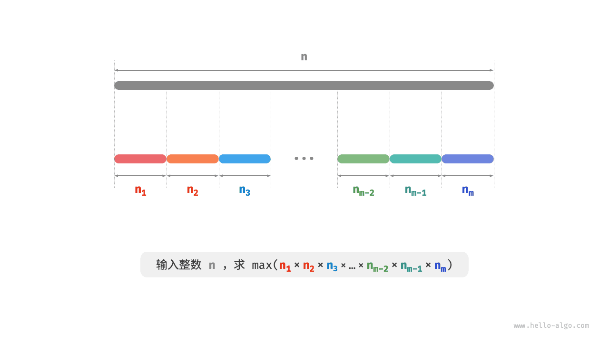
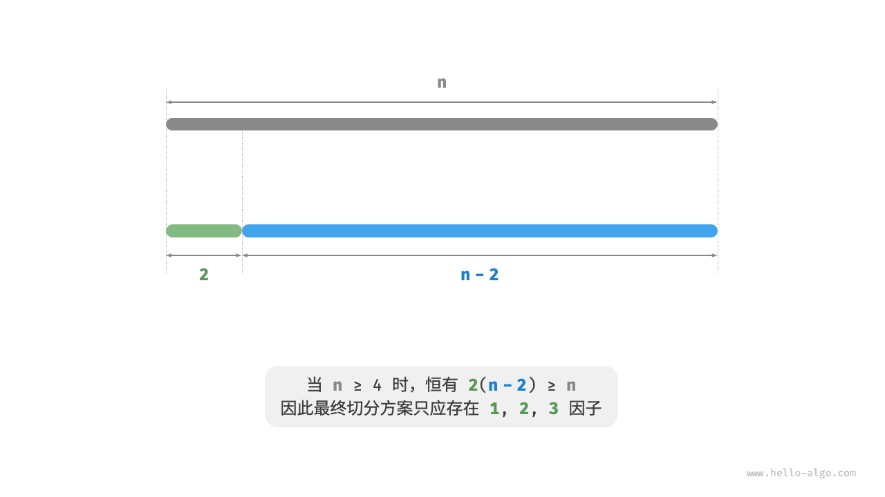
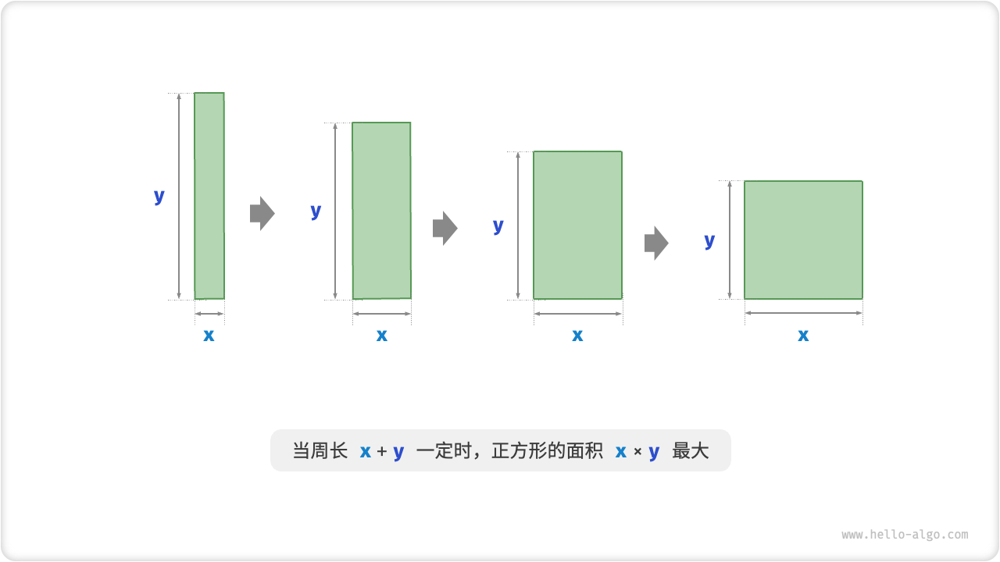
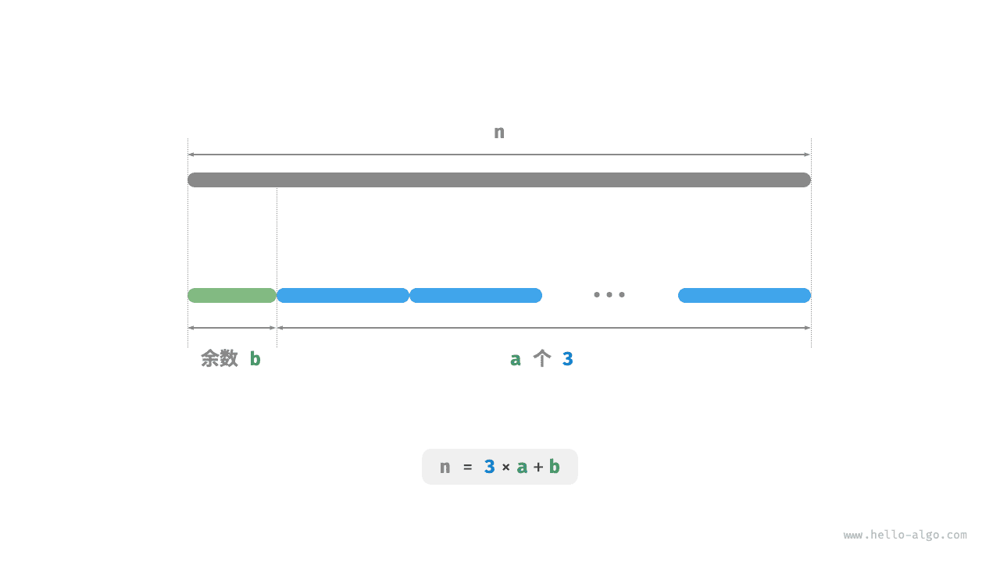

# 最大切分乘积问题

!!! question

    给定一个正整数 $n$ ，将其切分为至少两个正整数的和，求切分后所有整数的乘积最大是多少，如下图所示。



假设我们将 $n$ 切分为 $m$ 个整数因子，其中第 $i$ 个因子记为 $n_i$ ，即

$$
n = \sum_{i=1}^{m}n_i
$$

本题的目标是求得所有整数因子的最大乘积，即

$$
\max(\prod_{i=1}^{m}n_i)
$$

我们需要思考的是：切分数量 $m$ 应该多大，每个 $n_i$ 应该是多少？

### 贪心策略确定

根据经验，两个整数的乘积往往比它们的加和更大。假设从 $n$ 中分出一个因子 $2$ ，则它们的乘积为 $2(n-2)$ 。我们将该乘积与 $n$ 作比较：

$$
\begin{aligned}
2(n-2) & \geq n \newline
2n - n - 4 & \geq 0 \newline
n & \geq 4
\end{aligned}
$$

如下图所示，当 $n \geq 4$ 时，切分出一个 $2$ 后乘积会变大，**这说明大于等于 $4$ 的整数都应该被切分**。

**贪心策略一**：如果切分方案中包含 $\geq 4$ 的因子，那么它就应该被继续切分。最终的切分方案只应出现 $1$、$2$、$3$ 这三种因子。



接下来思考哪个因子是最优的。在 $1$、$2$、$3$ 这三个因子中，显然 $1$ 是最差的，因为 $1 \times (n-1) < n$ 恒成立，即切分出 $1$ 反而会导致乘积减小。

如下图所示，当 $n = 6$ 时，有 $3 \times 3 > 2 \times 2 \times 2$ 。**这意味着切分出 $3$ 比切分出 $2$ 更优**。

**贪心策略二**：在切分方案中，最多只应存在两个 $2$ 。因为三个 $2$ 总是可以替换为两个 $3$ ，从而获得更大的乘积。



综上所述，可推理出以下贪心策略。

1. 输入整数 $n$ ，从其不断地切分出因子 $3$ ，直至余数为 $0$、$1$、$2$ 。
2. 当余数为 $0$ 时，代表 $n$ 是 $3$ 的倍数，因此不做任何处理。
3. 当余数为 $2$ 时，不继续划分，保留。
4. 当余数为 $1$ 时，由于 $2 \times 2 > 1 \times 3$ ，因此应将最后一个 $3$ 替换为 $2$ 。

### 代码实现

如下图所示，我们无须通过循环来切分整数，而可以利用向下整除运算得到 $3$ 的个数 $a$ ，用取模运算得到余数 $b$ ，此时有：

$$
n = 3 a + b
$$

请注意，对于 $n \leq 3$ 的边界情况，必须拆分出一个 $1$ ，乘积为 $1 \times (n - 1)$ 。

```src
[file]{max_product_cutting}-[class]{}-[func]{max_product_cutting}
```



**时间复杂度取决于编程语言的幂运算的实现方法**。以 Python 为例，常用的幂计算函数有三种。

- 运算符 `**` 和函数 `pow()` 的时间复杂度均为 $O(\log⁡ a)$ 。
- 函数 `math.pow()` 内部调用 C 语言库的 `pow()` 函数，其执行浮点取幂，时间复杂度为 $O(1)$ 。

变量 $a$ 和 $b$ 使用常数大小的额外空间，**因此空间复杂度为 $O(1)$** 。

### 正确性证明

使用反证法，只分析 $n \geq 3$ 的情况。

1. **所有因子 $\leq 3$** ：假设最优切分方案中存在 $\geq 4$ 的因子 $x$ ，那么一定可以将其继续划分为 $2(x-2)$ ，从而获得更大的乘积。这与假设矛盾。
2. **切分方案不包含 $1$** ：假设最优切分方案中存在一个因子 $1$ ，那么它一定可以合并入另外一个因子中，以获得更大的乘积。这与假设矛盾。
3. **切分方案最多包含两个 $2$** ：假设最优切分方案中包含三个 $2$ ，那么一定可以替换为两个 $3$ ，乘积更大。这与假设矛盾。
