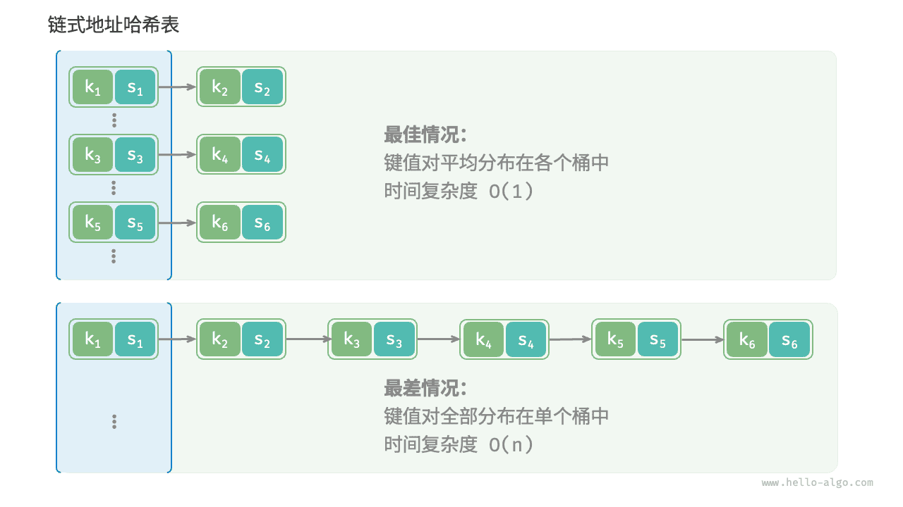

# 哈希算法

前两节介绍了哈希表的工作原理和哈希冲突的处理方法。然而无论是开放寻址还是链式地址，**它们只能保证哈希表可以在发生冲突时正常工作，而无法减少哈希冲突的发生**。

如果哈希冲突过于频繁，哈希表的性能则会急剧劣化。如下图所示，对于链式地址哈希表，理想情况下键值对均匀分布在各个桶中，达到最佳查询效率；最差情况下所有键值对都存储到同一个桶中，时间复杂度退化至 $O(n)$ 。



**键值对的分布情况由哈希函数决定**。回忆哈希函数的计算步骤，先计算哈希值，再对数组长度取模：

```shell
index = hash(key) % capacity
```

观察以上公式，当哈希表容量 `capacity` 固定时，**哈希算法 `hash()` 决定了输出值**，进而决定了键值对在哈希表中的分布情况。

这意味着，为了降低哈希冲突的发生概率，我们应当将注意力集中在哈希算法 `hash()` 的设计上。

## 哈希算法的目标

为了实现“既快又稳”的哈希表数据结构，哈希算法应具备以下特点。

- **确定性**：对于相同的输入，哈希算法应始终产生相同的输出。这样才能确保哈希表是可靠的。
- **效率高**：计算哈希值的过程应该足够快。计算开销越小，哈希表的实用性越高。
- **均匀分布**：哈希算法应使得键值对均匀分布在哈希表中。分布越均匀，哈希冲突的概率就越低。

实际上，哈希算法除了可以用于实现哈希表，还广泛应用于其他领域中。

- **密码存储**：为了保护用户密码的安全，系统通常不会直接存储用户的明文密码，而是存储密码的哈希值。当用户输入密码时，系统会对输入的密码计算哈希值，然后与存储的哈希值进行比较。如果两者匹配，那么密码就被视为正确。
- **数据完整性检查**：数据发送方可以计算数据的哈希值并将其一同发送；接收方可以重新计算接收到的数据的哈希值，并与接收到的哈希值进行比较。如果两者匹配，那么数据就被视为完整。

对于密码学的相关应用，为了防止从哈希值推导出原始密码等逆向工程，哈希算法需要具备更高等级的安全特性。

- **单向性**：无法通过哈希值反推出关于输入数据的任何信息。
- **抗碰撞性**：应当极难找到两个不同的输入，使得它们的哈希值相同。
- **雪崩效应**：输入的微小变化应当导致输出的显著且不可预测的变化。

请注意，**“均匀分布”与“抗碰撞性”是两个独立的概念**，满足均匀分布不一定满足抗碰撞性。例如，在随机输入 `key` 下，哈希函数 `key % 100` 可以产生均匀分布的输出。然而该哈希算法过于简单，所有后两位相等的 `key` 的输出都相同，因此我们可以很容易地从哈希值反推出可用的 `key` ，从而破解密码。

## 哈希算法的设计

哈希算法的设计是一个需要考虑许多因素的复杂问题。然而对于某些要求不高的场景，我们也能设计一些简单的哈希算法。

- **加法哈希**：对输入的每个字符的 ASCII 码进行相加，将得到的总和作为哈希值。
- **乘法哈希**：利用乘法的不相关性，每轮乘以一个常数，将各个字符的 ASCII 码累积到哈希值中。
- **异或哈希**：将输入数据的每个元素通过异或操作累积到一个哈希值中。
- **旋转哈希**：将每个字符的 ASCII 码累积到一个哈希值中，每次累积之前都会对哈希值进行旋转操作。

```src
[file]{simple_hash}-[class]{}-[func]{rot_hash}
```

观察发现，每种哈希算法的最后一步都是对大质数 $1000000007$ 取模，以确保哈希值在合适的范围内。值得思考的是，为什么要强调对质数取模，或者说对合数取模的弊端是什么？这是一个有趣的问题。

先抛出结论：**使用大质数作为模数，可以最大化地保证哈希值的均匀分布**。因为质数不与其他数字存在公约数，可以减少因取模操作而产生的周期性模式，从而避免哈希冲突。

举个例子，假设我们选择合数 $9$ 作为模数，它可以被 $3$ 整除，那么所有可以被 $3$ 整除的 `key` 都会被映射到 $0$、$3$、$6$ 这三个哈希值。

$$
\begin{aligned}
\text{modulus} & = 9 \newline
\text{key} & = \{ 0, 3, 6, 9, 12, 15, 18, 21, 24, 27, 30, 33, \dots \} \newline
\text{hash} & = \{ 0, 3, 6, 0, 3, 6, 0, 3, 6, 0, 3, 6,\dots \}
\end{aligned}
$$

如果输入 `key` 恰好满足这种等差数列的数据分布，那么哈希值就会出现聚堆，从而加重哈希冲突。现在，假设将 `modulus` 替换为质数 $13$ ，由于 `key` 和 `modulus` 之间不存在公约数，因此输出的哈希值的均匀性会明显提升。

$$
\begin{aligned}
\text{modulus} & = 13 \newline
\text{key} & = \{ 0, 3, 6, 9, 12, 15, 18, 21, 24, 27, 30, 33, \dots \} \newline
\text{hash} & = \{ 0, 3, 6, 9, 12, 2, 5, 8, 11, 1, 4, 7, \dots \}
\end{aligned}
$$

值得说明的是，如果能够保证 `key` 是随机均匀分布的，那么选择质数或者合数作为模数都可以，它们都能输出均匀分布的哈希值。而当 `key` 的分布存在某种周期性时，对合数取模更容易出现聚集现象。

总而言之，我们通常选取质数作为模数，并且这个质数最好足够大，以尽可能消除周期性模式，提升哈希算法的稳健性。

## 常见哈希算法

不难发现，以上介绍的简单哈希算法都比较“脆弱”，远远没有达到哈希算法的设计目标。例如，由于加法和异或满足交换律，因此加法哈希和异或哈希无法区分内容相同但顺序不同的字符串，这可能会加剧哈希冲突，并引起一些安全问题。

在实际中，我们通常会用一些标准哈希算法，例如 MD5、SHA-1、SHA-2 和 SHA-3 等。它们可以将任意长度的输入数据映射到恒定长度的哈希值。

近一个世纪以来，哈希算法处在不断升级与优化的过程中。一部分研究人员努力提升哈希算法的性能，另一部分研究人员和黑客则致力于寻找哈希算法的安全性问题。下表展示了在实际应用中常见的哈希算法。

- MD5 和 SHA-1 已多次被成功攻击，因此它们被各类安全应用弃用。
- SHA-2 系列中的 SHA-256 是最安全的哈希算法之一，仍未出现成功的攻击案例，因此常用在各类安全应用与协议中。
- SHA-3 相较 SHA-2 的实现开销更低、计算效率更高，但目前使用覆盖度不如 SHA-2 系列。

<p align="center"> 表 <id> &nbsp; 常见的哈希算法 </p>

|          | MD5                            | SHA-1            | SHA-2                        | SHA-3               |
| -------- | ------------------------------ | ---------------- | ---------------------------- | ------------------- |
| 推出时间 | 1992                           | 1995             | 2002                         | 2008                |
| 输出长度 | 128 bit                        | 160 bit          | 256/512 bit                  | 224/256/384/512 bit |
| 哈希冲突 | 较多                           | 较多             | 很少                         | 很少                |
| 安全等级 | 低，已被成功攻击               | 低，已被成功攻击 | 高                           | 高                  |
| 应用     | 已被弃用，仍用于数据完整性检查 | 已被弃用         | 加密货币交易验证、数字签名等 | 可用于替代 SHA-2    |

## 数据结构的哈希值

我们知道，哈希表的 `key` 可以是整数、小数或字符串等数据类型。编程语言通常会为这些数据类型提供内置的哈希算法，用于计算哈希表中的桶索引。以 Python 为例，我们可以调用 `hash()` 函数来计算各种数据类型的哈希值。

- 整数和布尔量的哈希值就是其本身。
- 浮点数和字符串的哈希值计算较为复杂，有兴趣的读者请自行学习。
- 元组的哈希值是对其中每一个元素进行哈希，然后将这些哈希值组合起来，得到单一的哈希值。
- 对象的哈希值基于其内存地址生成。通过重写对象的哈希方法，可实现基于内容生成哈希值。

!!! tip

    请注意，不同编程语言的内置哈希值计算函数的定义和方法不同。

=== "Python"

    ```python title="built_in_hash.py"
    num = 3
    hash_num = hash(num)
    # 整数 3 的哈希值为 3

    bol = True
    hash_bol = hash(bol)
    # 布尔量 True 的哈希值为 1

    dec = 3.14159
    hash_dec = hash(dec)
    # 小数 3.14159 的哈希值为 326484311674566659

    str = "Hello 算法"
    hash_str = hash(str)
    # 字符串“Hello 算法”的哈希值为 4617003410720528961

    tup = (12836, "小哈")
    hash_tup = hash(tup)
    # 元组 (12836, '小哈') 的哈希值为 1029005403108185979

    obj = ListNode(0)
    hash_obj = hash(obj)
    # 节点对象 <ListNode object at 0x1058fd810> 的哈希值为 274267521
    ```

=== "C++"

    ```cpp title="built_in_hash.cpp"
    int num = 3;
    size_t hashNum = hash<int>()(num);
    // 整数 3 的哈希值为 3

    bool bol = true;
    size_t hashBol = hash<bool>()(bol);
    // 布尔量 1 的哈希值为 1

    double dec = 3.14159;
    size_t hashDec = hash<double>()(dec);
    // 小数 3.14159 的哈希值为 4614256650576692846

    string str = "Hello 算法";
    size_t hashStr = hash<string>()(str);
    // 字符串“Hello 算法”的哈希值为 15466937326284535026

    // 在 C++ 中，内置 std:hash() 仅提供基本数据类型的哈希值计算
    // 数组、对象的哈希值计算需要自行实现
    ```

=== "Java"

    ```java title="built_in_hash.java"
    int num = 3;
    int hashNum = Integer.hashCode(num);
    // 整数 3 的哈希值为 3

    boolean bol = true;
    int hashBol = Boolean.hashCode(bol);
    // 布尔量 true 的哈希值为 1231

    double dec = 3.14159;
    int hashDec = Double.hashCode(dec);
    // 小数 3.14159 的哈希值为 -1340954729

    String str = "Hello 算法";
    int hashStr = str.hashCode();
    // 字符串“Hello 算法”的哈希值为 -727081396

    Object[] arr = { 12836, "小哈" };
    int hashTup = Arrays.hashCode(arr);
    // 数组 [12836, 小哈] 的哈希值为 1151158

    ListNode obj = new ListNode(0);
    int hashObj = obj.hashCode();
    // 节点对象 utils.ListNode@7dc5e7b4 的哈希值为 2110121908
    ```

=== "C#"

    ```csharp title="built_in_hash.cs"
    int num = 3;
    int hashNum = num.GetHashCode();
    // 整数 3 的哈希值为 3;

    bool bol = true;
    int hashBol = bol.GetHashCode();
    // 布尔量 true 的哈希值为 1;

    double dec = 3.14159;
    int hashDec = dec.GetHashCode();
    // 小数 3.14159 的哈希值为 -1340954729;

    string str = "Hello 算法";
    int hashStr = str.GetHashCode();
    // 字符串“Hello 算法”的哈希值为 -586107568;

    object[] arr = [12836, "小哈"];
    int hashTup = arr.GetHashCode();
    // 数组 [12836, 小哈] 的哈希值为 42931033;

    ListNode obj = new(0);
    int hashObj = obj.GetHashCode();
    // 节点对象 0 的哈希值为 39053774;
    ```

=== "Go"

    ```go title="built_in_hash.go"
    // Go 未提供内置 hash code 函数
    ```

=== "Swift"

    ```swift title="built_in_hash.swift"
    let num = 3
    let hashNum = num.hashValue
    // 整数 3 的哈希值为 9047044699613009734

    let bol = true
    let hashBol = bol.hashValue
    // 布尔量 true 的哈希值为 -4431640247352757451

    let dec = 3.14159
    let hashDec = dec.hashValue
    // 小数 3.14159 的哈希值为 -2465384235396674631

    let str = "Hello 算法"
    let hashStr = str.hashValue
    // 字符串“Hello 算法”的哈希值为 -7850626797806988787

    let arr = [AnyHashable(12836), AnyHashable("小哈")]
    let hashTup = arr.hashValue
    // 数组 [AnyHashable(12836), AnyHashable("小哈")] 的哈希值为 -2308633508154532996

    let obj = ListNode(x: 0)
    let hashObj = obj.hashValue
    // 节点对象 utils.ListNode 的哈希值为 -2434780518035996159
    ```

=== "JS"

    ```javascript title="built_in_hash.js"
    // JavaScript 未提供内置 hash code 函数
    ```

=== "TS"

    ```typescript title="built_in_hash.ts"
    // TypeScript 未提供内置 hash code 函数
    ```

=== "Dart"

    ```dart title="built_in_hash.dart"
    int num = 3;
    int hashNum = num.hashCode;
    // 整数 3 的哈希值为 34803

    bool bol = true;
    int hashBol = bol.hashCode;
    // 布尔值 true 的哈希值为 1231

    double dec = 3.14159;
    int hashDec = dec.hashCode;
    // 小数 3.14159 的哈希值为 2570631074981783

    String str = "Hello 算法";
    int hashStr = str.hashCode;
    // 字符串“Hello 算法”的哈希值为 468167534

    List arr = [12836, "小哈"];
    int hashArr = arr.hashCode;
    // 数组 [12836, 小哈] 的哈希值为 976512528

    ListNode obj = new ListNode(0);
    int hashObj = obj.hashCode;
    // 节点对象 Instance of 'ListNode' 的哈希值为 1033450432
    ```

=== "Rust"

    ```rust title="built_in_hash.rs"
    use std::collections::hash_map::DefaultHasher;
    use std::hash::{Hash, Hasher};

    let num = 3;
    let mut num_hasher = DefaultHasher::new();
    num.hash(&mut num_hasher);
    let hash_num = num_hasher.finish();
    // 整数 3 的哈希值为 568126464209439262

    let bol = true;
    let mut bol_hasher = DefaultHasher::new();
    bol.hash(&mut bol_hasher);
    let hash_bol = bol_hasher.finish();
    // 布尔量 true 的哈希值为 4952851536318644461

    let dec: f32 = 3.14159;
    let mut dec_hasher = DefaultHasher::new();
    dec.to_bits().hash(&mut dec_hasher);
    let hash_dec = dec_hasher.finish();
    // 小数 3.14159 的哈希值为 2566941990314602357

    let str = "Hello 算法";
    let mut str_hasher = DefaultHasher::new();
    str.hash(&mut str_hasher);
    let hash_str = str_hasher.finish();
    // 字符串“Hello 算法”的哈希值为 16092673739211250988

    let arr = (&12836, &"小哈");
    let mut tup_hasher = DefaultHasher::new();
    arr.hash(&mut tup_hasher);
    let hash_tup = tup_hasher.finish();
    // 元组 (12836, "小哈") 的哈希值为 1885128010422702749

    let node = ListNode::new(42);
    let mut hasher = DefaultHasher::new();
    node.borrow().val.hash(&mut hasher);
    let hash = hasher.finish();
    // 节点对象 RefCell { value: ListNode { val: 42, next: None } } 的哈希值为15387811073369036852
    ```

=== "C"

    ```c title="built_in_hash.c"
    // C 未提供内置 hash code 函数
    ```

=== "Kotlin"

    ```kotlin title="built_in_hash.kt"
    val num = 3
    val hashNum = num.hashCode()
    // 整数 3 的哈希值为 3

    val bol = true
    val hashBol = bol.hashCode()
    // 布尔量 true 的哈希值为 1231

    val dec = 3.14159
    val hashDec = dec.hashCode()
    // 小数 3.14159 的哈希值为 -1340954729

    val str = "Hello 算法"
    val hashStr = str.hashCode()
    // 字符串“Hello 算法”的哈希值为 -727081396

    val arr = arrayOf<Any>(12836, "小哈")
    val hashTup = arr.hashCode()
    // 数组 [12836, 小哈] 的哈希值为 189568618

    val obj = ListNode(0)
    val hashObj = obj.hashCode()
    // 节点对象 utils.ListNode@1d81eb93 的哈希值为 495053715
    ```

=== "Ruby"

    ```ruby title="built_in_hash.rb"
    num = 3
    hash_num = num.hash
    # 整数 3 的哈希值为 -4385856518450339636

    bol = true
    hash_bol = bol.hash
    # 布尔量 true 的哈希值为 -1617938112149317027

    dec = 3.14159
    hash_dec = dec.hash
    # 小数 3.14159 的哈希值为 -1479186995943067893

    str = "Hello 算法"
    hash_str = str.hash
    # 字符串“Hello 算法”的哈希值为 -4075943250025831763

    tup = [12836, '小哈']
    hash_tup = tup.hash
    # 元组 (12836, '小哈') 的哈希值为 1999544809202288822

    obj = ListNode.new(0)
    hash_obj = obj.hash
    # 节点对象 #<ListNode:0x000078133140ab70> 的哈希值为 4302940560806366381
    ```

=== "Zig"

    ```zig title="built_in_hash.zig"

    ```

??? pythontutor "可视化运行"

    https://pythontutor.com/render.html#code=class%20ListNode%3A%0A%20%20%20%20%22%22%22%E9%93%BE%E8%A1%A8%E8%8A%82%E7%82%B9%E7%B1%BB%22%22%22%0A%20%20%20%20def%20__init__%28self,%20val%3A%20int%29%3A%0A%20%20%20%20%20%20%20%20self.val%3A%20int%20%3D%20val%20%20%23%20%E8%8A%82%E7%82%B9%E5%80%BC%0A%20%20%20%20%20%20%20%20self.next%3A%20ListNode%20%7C%20None%20%3D%20None%20%20%23%20%E5%90%8E%E7%BB%A7%E8%8A%82%E7%82%B9%E5%BC%95%E7%94%A8%0A%0A%22%22%22Driver%20Code%22%22%22%0Aif%20__name__%20%3D%3D%20%22__main__%22%3A%0A%20%20%20%20num%20%3D%203%0A%20%20%20%20hash_num%20%3D%20hash%28num%29%0A%20%20%20%20%23%20%E6%95%B4%E6%95%B0%203%20%E7%9A%84%E5%93%88%E5%B8%8C%E5%80%BC%E4%B8%BA%203%0A%0A%20%20%20%20bol%20%3D%20True%0A%20%20%20%20hash_bol%20%3D%20hash%28bol%29%0A%20%20%20%20%23%20%E5%B8%83%E5%B0%94%E9%87%8F%20True%20%E7%9A%84%E5%93%88%E5%B8%8C%E5%80%BC%E4%B8%BA%201%0A%0A%20%20%20%20dec%20%3D%203.14159%0A%20%20%20%20hash_dec%20%3D%20hash%28dec%29%0A%20%20%20%20%23%20%E5%B0%8F%E6%95%B0%203.14159%20%E7%9A%84%E5%93%88%E5%B8%8C%E5%80%BC%E4%B8%BA%20326484311674566659%0A%0A%20%20%20%20str%20%3D%20%22Hello%20%E7%AE%97%E6%B3%95%22%0A%20%20%20%20hash_str%20%3D%20hash%28str%29%0A%20%20%20%20%23%20%E5%AD%97%E7%AC%A6%E4%B8%B2%E2%80%9CHello%20%E7%AE%97%E6%B3%95%E2%80%9D%E7%9A%84%E5%93%88%E5%B8%8C%E5%80%BC%E4%B8%BA%204617003410720528961%0A%0A%20%20%20%20tup%20%3D%20%2812836,%20%22%E5%B0%8F%E5%93%88%22%29%0A%20%20%20%20hash_tup%20%3D%20hash%28tup%29%0A%20%20%20%20%23%20%E5%85%83%E7%BB%84%20%2812836,%20'%E5%B0%8F%E5%93%88'%29%20%E7%9A%84%E5%93%88%E5%B8%8C%E5%80%BC%E4%B8%BA%201029005403108185979%0A%0A%20%20%20%20obj%20%3D%20ListNode%280%29%0A%20%20%20%20hash_obj%20%3D%20hash%28obj%29%0A%20%20%20%20%23%20%E8%8A%82%E7%82%B9%E5%AF%B9%E8%B1%A1%20%3CListNode%20object%20at%200x1058fd810%3E%20%E7%9A%84%E5%93%88%E5%B8%8C%E5%80%BC%E4%B8%BA%20274267521&cumulative=false&curInstr=19&heapPrimitives=nevernest&mode=display&origin=opt-frontend.js&py=311&rawInputLstJSON=%5B%5D&textReferences=false

在许多编程语言中，**只有不可变对象才可作为哈希表的 `key`** 。假如我们将列表（动态数组）作为 `key` ，当列表的内容发生变化时，它的哈希值也随之改变，我们就无法在哈希表中查询到原先的 `value` 了。

虽然自定义对象（比如链表节点）的成员变量是可变的，但它是可哈希的。**这是因为对象的哈希值通常是基于内存地址生成的**，即使对象的内容发生了变化，但它的内存地址不变，哈希值仍然是不变的。

细心的你可能发现在不同控制台中运行程序时，输出的哈希值是不同的。**这是因为 Python 解释器在每次启动时，都会为字符串哈希函数加入一个随机的盐（salt）值**。这种做法可以有效防止 HashDoS 攻击，提升哈希算法的安全性。
