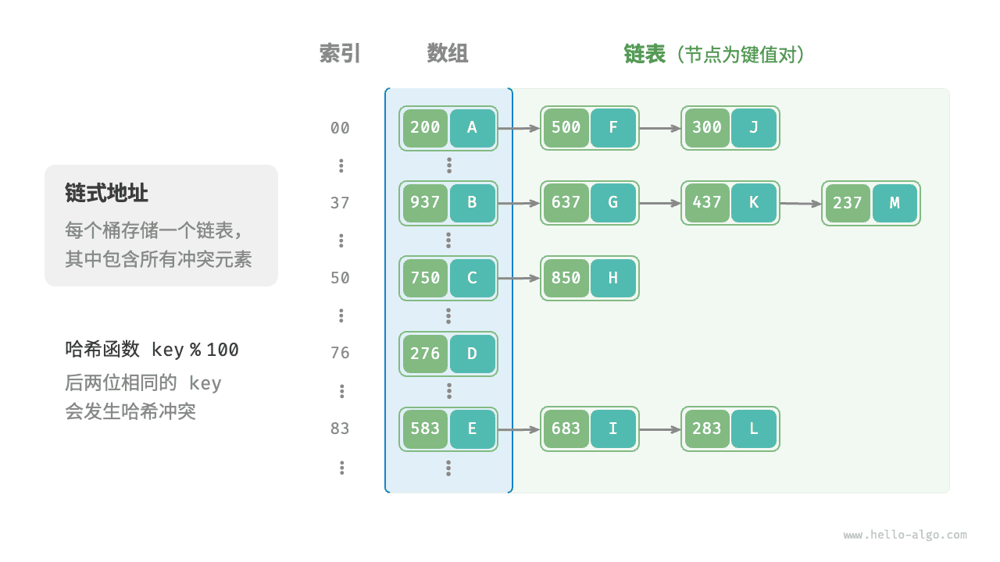
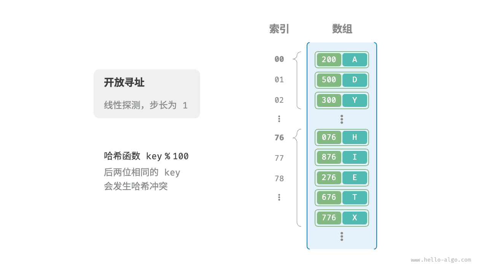
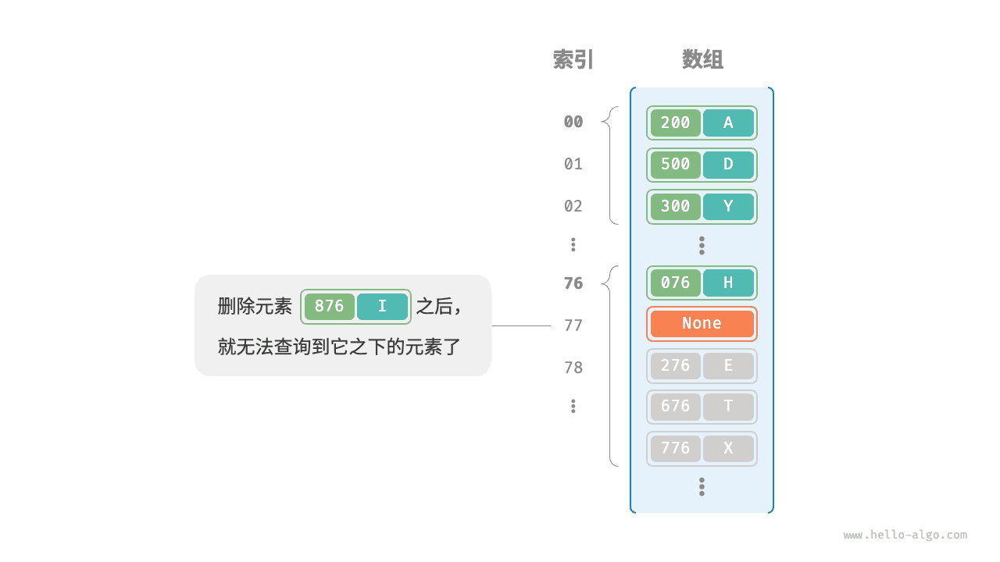

# 哈希冲突

上一节提到，**通常情况下哈希函数的输入空间远大于输出空间**，因此理论上哈希冲突是不可避免的。比如，输入空间为全体整数，输出空间为数组容量大小，则必然有多个整数映射至同一桶索引。

哈希冲突会导致查询结果错误，严重影响哈希表的可用性。为了解决该问题，每当遇到哈希冲突时，我们就进行哈希表扩容，直至冲突消失为止。此方法简单粗暴且有效，但效率太低，因为哈希表扩容需要进行大量的数据搬运与哈希值计算。为了提升效率，我们可以采用以下策略。

1. 改良哈希表数据结构，**使得哈希表可以在出现哈希冲突时正常工作**。
2. 仅在必要时，即当哈希冲突比较严重时，才执行扩容操作。

哈希表的结构改良方法主要包括“链式地址”和“开放寻址”。

## 链式地址

在原始哈希表中，每个桶仅能存储一个键值对。<u>链式地址（separate chaining）</u>将单个元素转换为链表，将键值对作为链表节点，将所有发生冲突的键值对都存储在同一链表中。下图展示了一个链式地址哈希表的例子。



基于链式地址实现的哈希表的操作方法发生了以下变化。

- **查询元素**：输入 `key` ，经过哈希函数得到桶索引，即可访问链表头节点，然后遍历链表并对比 `key` 以查找目标键值对。
- **添加元素**：首先通过哈希函数访问链表头节点，然后将节点（键值对）添加到链表中。
- **删除元素**：根据哈希函数的结果访问链表头部，接着遍历链表以查找目标节点并将其删除。

链式地址存在以下局限性。

- **占用空间增大**：链表包含节点指针，它相比数组更加耗费内存空间。
- **查询效率降低**：因为需要线性遍历链表来查找对应元素。

以下代码给出了链式地址哈希表的简单实现，需要注意两点。

- 使用列表（动态数组）代替链表，从而简化代码。在这种设定下，哈希表（数组）包含多个桶，每个桶都是一个列表。
- 以下实现包含哈希表扩容方法。当负载因子超过 $\frac{2}{3}$ 时，我们将哈希表扩容至原先的 $2$ 倍。

```src
[file]{hash_map_chaining}-[class]{hash_map_chaining}-[func]{}
```

值得注意的是，当链表很长时，查询效率 $O(n)$ 很差。**此时可以将链表转换为“AVL 树”或“红黑树”**，从而将查询操作的时间复杂度优化至 $O(\log n)$ 。

## 开放寻址

<u>开放寻址（open addressing）</u>不引入额外的数据结构，而是通过“多次探测”来处理哈希冲突，探测方式主要包括线性探测、平方探测和多次哈希等。

下面以线性探测为例，介绍开放寻址哈希表的工作机制。

### 线性探测

线性探测采用固定步长的线性搜索来进行探测，其操作方法与普通哈希表有所不同。

- **插入元素**：通过哈希函数计算桶索引，若发现桶内已有元素，则从冲突位置向后线性遍历（步长通常为 $1$ ），直至找到空桶，将元素插入其中。
- **查找元素**：若发现哈希冲突，则使用相同步长向后进行线性遍历，直到找到对应元素，返回 `value` 即可；如果遇到空桶，说明目标元素不在哈希表中，返回 `None` 。

下图展示了开放寻址（线性探测）哈希表的键值对分布。根据此哈希函数，最后两位相同的 `key` 都会被映射到相同的桶。而通过线性探测，它们被依次存储在该桶以及之下的桶中。



然而，**线性探测容易产生“聚集现象”**。具体来说，数组中连续被占用的位置越长，这些连续位置发生哈希冲突的可能性越大，从而进一步促使该位置的聚堆生长，形成恶性循环，最终导致增删查改操作效率劣化。

值得注意的是，**我们不能在开放寻址哈希表中直接删除元素**。这是因为删除元素会在数组内产生一个空桶 `None` ，而当查询元素时，线性探测到该空桶就会返回，因此在该空桶之下的元素都无法再被访问到，程序可能误判这些元素不存在，如下图所示。



为了解决该问题，我们可以采用<u>懒删除（lazy deletion）</u>机制：它不直接从哈希表中移除元素，**而是利用一个常量 `TOMBSTONE` 来标记这个桶**。在该机制下，`None` 和 `TOMBSTONE` 都代表空桶，都可以放置键值对。但不同的是，线性探测到 `TOMBSTONE` 时应该继续遍历，因为其之下可能还存在键值对。

然而，**懒删除可能会加速哈希表的性能退化**。这是因为每次删除操作都会产生一个删除标记，随着 `TOMBSTONE` 的增加，搜索时间也会增加，因为线性探测可能需要跳过多个 `TOMBSTONE` 才能找到目标元素。

为此，考虑在线性探测中记录遇到的首个 `TOMBSTONE` 的索引，并将搜索到的目标元素与该 `TOMBSTONE` 交换位置。这样做的好处是当每次查询或添加元素时，元素会被移动至距离理想位置（探测起始点）更近的桶，从而优化查询效率。

以下代码实现了一个包含懒删除的开放寻址（线性探测）哈希表。为了更加充分地使用哈希表的空间，我们将哈希表看作一个“环形数组”，当越过数组尾部时，回到头部继续遍历。

```src
[file]{hash_map_open_addressing}-[class]{hash_map_open_addressing}-[func]{}
```

### 平方探测

平方探测与线性探测类似，都是开放寻址的常见策略之一。当发生冲突时，平方探测不是简单地跳过一个固定的步数，而是跳过“探测次数的平方”的步数，即 $1, 4, 9, \dots$ 步。

平方探测主要具有以下优势。

- 平方探测通过跳过探测次数平方的距离，试图缓解线性探测的聚集效应。
- 平方探测会跳过更大的距离来寻找空位置，有助于数据分布得更加均匀。

然而，平方探测并不是完美的。

- 仍然存在聚集现象，即某些位置比其他位置更容易被占用。
- 由于平方的增长，平方探测可能不会探测整个哈希表，这意味着即使哈希表中有空桶，平方探测也可能无法访问到它。

### 多次哈希

顾名思义，多次哈希方法使用多个哈希函数 $f_1(x)$、$f_2(x)$、$f_3(x)$、$\dots$ 进行探测。

- **插入元素**：若哈希函数 $f_1(x)$ 出现冲突，则尝试 $f_2(x)$ ，以此类推，直到找到空位后插入元素。
- **查找元素**：在相同的哈希函数顺序下进行查找，直到找到目标元素时返回；若遇到空位或已尝试所有哈希函数，说明哈希表中不存在该元素，则返回 `None` 。

与线性探测相比，多次哈希方法不易产生聚集，但多个哈希函数会带来额外的计算量。

!!! tip

    请注意，开放寻址（线性探测、平方探测和多次哈希）哈希表都存在“不能直接删除元素”的问题。

## 编程语言的选择

各种编程语言采取了不同的哈希表实现策略，下面举几个例子。

- Python 采用开放寻址。字典 `dict` 使用伪随机数进行探测。
- Java 采用链式地址。自 JDK 1.8 以来，当 `HashMap` 内数组长度达到 64 且链表长度达到 8 时，链表会转换为红黑树以提升查找性能。
- Go 采用链式地址。Go 规定每个桶最多存储 8 个键值对，超出容量则连接一个溢出桶；当溢出桶过多时，会执行一次特殊的等量扩容操作，以确保性能。
