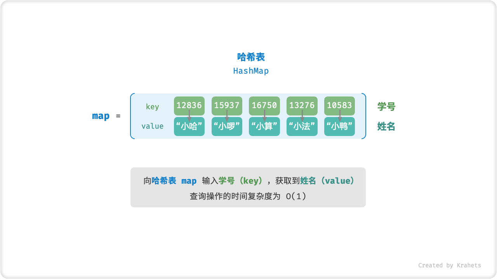

# 哈希表

哈希表通过建立「键 key」和「值 value」之间的映射，实现高效的元素查找。具体地，输入一个 key ，在哈希表中查询并获取 value ，时间复杂度为 $O(1)$ 。

例如，给定一个包含 $n$ 个学生的数据库，每个学生有“姓名 `name` ”和“学号 `id` ”两项数据，希望实现一个查询功能：**输入一个学号，返回对应的姓名**，则可以使用哈希表实现。



<p align="center"> Fig. 哈希表抽象表示 </p>

## 哈希表效率

除了哈希表之外，还可以使用以下数据结构来实现上述查询功能：

1. **无序数组**：每个元素为  `[学号, 姓名]` ；
2. **有序数组**：将 `1.` 中的数组按照学号从小到大排序；
3. **链表**：每个结点的值为 `[学号, 姓名]` ；
4. **二叉搜索树**：每个结点的值为 `[学号, 姓名]` ，根据学号大小来构建树；

使用上述方法，各项操作的时间复杂度如下表所示（在此不做赘述，详解可见 [二叉搜索树章节](https://www.hello-algo.com/chapter_tree/binary_search_tree/#_6)）。无论是查找元素、还是增删元素，哈希表的时间复杂度都是 $O(1)$ ，全面胜出！

<div class="center-table" markdown>

|          | 无序数组 | 有序数组    | 链表   | 二叉搜索树  | 哈希表 |
| -------- | -------- | ----------- | ------ | ----------- | ------ |
| 查找元素 | $O(n)$   | $O(\log n)$ | $O(n)$ | $O(\log n)$ | $O(1)$ |
| 插入元素 | $O(1)$   | $O(n)$      | $O(1)$ | $O(\log n)$ | $O(1)$ |
| 删除元素 | $O(n)$   | $O(n)$      | $O(n)$ | $O(\log n)$ | $O(1)$ |

</div>

## 哈希表常用操作

哈希表的基本操作包括 **初始化、查询操作、添加与删除键值对**。

=== "Java"

    ```java title="hash_map.java"
    /* 初始化哈希表 */
    Map<Integer, String> map = new HashMap<>();
    
    /* 添加操作 */
    // 在哈希表中添加键值对 (key, value)
    map.put(12836, "小哈");   
    map.put(15937, "小啰");   
    map.put(16750, "小算");   
    map.put(13276, "小法");
    map.put(10583, "小鸭");
    
    /* 查询操作 */
    // 向哈希表输入键 key ，得到值 value
    String name = map.get(15937);
    
    /* 删除操作 */
    // 在哈希表中删除键值对 (key, value)
    map.remove(10583);
    ```

=== "C++"

    ```cpp title="hash_map.cpp"
    /* 初始化哈希表 */
    unordered_map<int, string> map;
    
    /* 添加操作 */
    // 在哈希表中添加键值对 (key, value)
    map[12836] = "小哈";
    map[15937] = "小啰";
    map[16750] = "小算";
    map[13276] = "小法";
    map[10583] = "小鸭";
    
    /* 查询操作 */
    // 向哈希表输入键 key ，得到值 value
    string name = map[15937];
    
    /* 删除操作 */
    // 在哈希表中删除键值对 (key, value)
    map.erase(10583);
    ```

=== "Python"

    ```python title="hash_map.py"
    """ 初始化哈希表 """
    mapp = {}
    
    """ 添加操作 """
    # 在哈希表中添加键值对 (key, value)
    mapp[12836] = "小哈"
    mapp[15937] = "小啰"
    mapp[16750] = "小算"
    mapp[13276] = "小法"
    mapp[10583] = "小鸭"
    
    """ 查询操作 """
    # 向哈希表输入键 key ，得到值 value
    name = mapp[15937]
    
    """ 删除操作 """
    # 在哈希表中删除键值对 (key, value)
    mapp.pop(10583)
    ```

=== "Go"

    ```go title="hash_map.go"
    /* 初始化哈希表 */
    mapp := make(map[int]string)
    
    /* 添加操作 */
    // 在哈希表中添加键值对 (key, value)
    mapp[12836] = "小哈"
    mapp[15937] = "小啰"
    mapp[16750] = "小算"
    mapp[13276] = "小法"
    mapp[10583] = "小鸭"
    
    /* 查询操作 */
    // 向哈希表输入键 key ，得到值 value
    name := mapp[15937]
    
    /* 删除操作 */
    // 在哈希表中删除键值对 (key, value)
    delete(mapp, 10583)
    ```

=== "JavaScript"

    ```javascript title="hash_map.js"
    /* 初始化哈希表 */
    const map = new ArrayHashMap();
    /* 添加操作 */
    // 在哈希表中添加键值对 (key, value)
    map.set(12836, '小哈');
    map.set(15937, '小啰');
    map.set(16750, '小算');
    map.set(13276, '小法');
    map.set(10583, '小鸭');
    
    /* 查询操作 */
    // 向哈希表输入键 key ，得到值 value
    let name = map.get(15937);
    
    /* 删除操作 */
    // 在哈希表中删除键值对 (key, value)
    map.delete(10583);
    ```

=== "TypeScript"

    ```typescript title="hash_map.ts"
    /* 初始化哈希表 */
    const map = new Map<number, string>();
    /* 添加操作 */
    // 在哈希表中添加键值对 (key, value)
    map.set(12836, '小哈');
    map.set(15937, '小啰');
    map.set(16750, '小算');
    map.set(13276, '小法');
    map.set(10583, '小鸭');
    console.info('\n添加完成后，哈希表为\nKey -> Value');
    console.info(map);
    
    /* 查询操作 */
    // 向哈希表输入键 key ，得到值 value
    let name = map.get(15937);
    console.info('\n输入学号 15937 ，查询到姓名 ' + name);
    
    /* 删除操作 */
    // 在哈希表中删除键值对 (key, value)
    map.delete(10583);
    console.info('\n删除 10583 后，哈希表为\nKey -> Value');
    console.info(map);
    ```

=== "C"

    ```c title="hash_map.c"
    
    ```

=== "C#"

    ```csharp title="hash_map.cs"
    /* 初始化哈希表 */
    Dictionary<int, String> map = new ();
    
    /* 添加操作 */
    // 在哈希表中添加键值对 (key, value)
    map.Add(12836, "小哈");
    map.Add(15937, "小啰");
    map.Add(16750, "小算");
    map.Add(13276, "小法");
    map.Add(10583, "小鸭");
    
    /* 查询操作 */
    // 向哈希表输入键 key ，得到值 value
    String name = map[15937];
    
    /* 删除操作 */
    // 在哈希表中删除键值对 (key, value)
    map.Remove(10583);
    ```

=== "Swift"

    ```swift title="hash_map.swift"
    /* 初始化哈希表 */
    var map: [Int: String] = [:]
    
    /* 添加操作 */
    // 在哈希表中添加键值对 (key, value)
    map[12836] = "小哈"
    map[15937] = "小啰"
    map[16750] = "小算"
    map[13276] = "小法"
    map[10583] = "小鸭"
    
    /* 查询操作 */
    // 向哈希表输入键 key ，得到值 value
    let name = map[15937]!
    
    /* 删除操作 */
    // 在哈希表中删除键值对 (key, value)
    map.removeValue(forKey: 10583)
    ```

=== "Zig"

    ```zig title="hash_map.zig"

    ```

遍历哈希表有三种方式，即 **遍历键值对、遍历键、遍历值**。

=== "Java"

    ```java title="hash_map.java"
    /* 遍历哈希表 */
    // 遍历键值对 key->value
    for (Map.Entry <Integer, String> kv: map.entrySet()) {
        System.out.println(kv.getKey() + " -> " + kv.getValue());
    }
    // 单独遍历键 key
    for (int key: map.keySet()) {
        System.out.println(key);
    }
    // 单独遍历值 value
    for (String val: map.values()) {
        System.out.println(val);
    }
    ```

=== "C++"

    ```cpp title="hash_map.cpp"
    /* 遍历哈希表 */
    // 遍历键值对 key->value
    for (auto kv: map) {
        cout << kv.first << " -> " << kv.second << endl;
    }
    // 单独遍历键 key
    for (auto key: map) {
        cout << key.first << endl;
    }
    // 单独遍历值 value
    for (auto val: map) {
        cout << val.second << endl;
    }
    ```

=== "Python"

    ```python title="hash_map.py"
    """ 遍历哈希表 """
    # 遍历键值对 key->value
    for key, value in mapp.items():
        print(key, "->", value)
    # 单独遍历键 key
    for key in mapp.keys():
        print(key)
    # 单独遍历值 value
    for value in mapp.values():
        print(value)
    ```

=== "Go"

    ```go title="hash_map_test.go"
    /* 遍历哈希表 */
    // 遍历键值对 key->value
    for key, value := range mapp {
        fmt.Println(key, "->", value)
    }
    // 单独遍历键 key
    for key := range mapp {
        fmt.Println(key)
    }
    // 单独遍历值 value
    for _, value := range mapp {
        fmt.Println(value)
    }
    ```

=== "JavaScript"

    ```javascript title="hash_map.js"
    /* 遍历哈希表 */
    console.info('\n遍历键值对 Key->Value');
    for (const [k, v] of map.entries()) {
        console.info(k + ' -> ' + v);
    }
    console.info('\n单独遍历键 Key');
    for (const k of map.keys()) {
        console.info(k);
    }
    console.info('\n单独遍历值 Value');
    for (const v of map.values()) {
        console.info(v);
    }
    ```

=== "TypeScript"

    ```typescript title="hash_map.ts"
    /* 遍历哈希表 */
    console.info('\n遍历键值对 Key->Value');
    for (const [k, v] of map.entries()) {
        console.info(k + ' -> ' + v);
    }
    console.info('\n单独遍历键 Key');
    for (const k of map.keys()) {
        console.info(k);
    }
    console.info('\n单独遍历值 Value');
    for (const v of map.values()) {
        console.info(v);
    }
    ```

=== "C"

    ```c title="hash_map.c"
    
    ```

=== "C#"

    ```csharp title="hash_map.cs"
    /* 遍历哈希表 */
    // 遍历键值对 Key->Value
    foreach (var kv in map) {
        Console.WriteLine(kv.Key + " -> " + kv.Value);
    }
    // 单独遍历键 key
    foreach (int key in map.Keys) {
        Console.WriteLine(key);
    }
    // 单独遍历值 value
    foreach (String val in map.Values) {
        Console.WriteLine(val);
    }
    ```

=== "Swift"

    ```swift title="hash_map.swift"
    /* 遍历哈希表 */
    // 遍历键值对 Key->Value
    for (key, value) in map {
        print("\(key) -> \(value)")
    }
    // 单独遍历键 Key
    for key in map.keys {
        print(key)
    }
    // 单独遍历值 Value
    for value in map.values {
        print(value)
    }
    ```

=== "Zig"

    ```zig title="hash_map.zig"

    ```

## 哈希函数

哈希表中存储元素的数据结构被称为「桶 Bucket」，底层实现可能是数组、链表、二叉树（红黑树），或是它们的组合。

最简单地，**我们可以仅用一个「数组」来实现哈希表**。首先，将所有 value 放入数组中，那么每个 value 在数组中都有唯一的「索引」。显然，访问 value 需要给定索引，而为了 **建立 key 和索引之间的映射关系**，我们需要使用「哈希函数 Hash Function」。

设数组为 `bucket` ，哈希函数为 `f(x)` ，输入键为 `key` 。那么获取 value 的步骤为：

1. 通过哈希函数计算出索引，即 `index = f(key)` ；
2. 通过索引在数组中获取值，即 `value = bucket[index]` ；

以上述学生数据 `key 学号 -> value 姓名` 为例，我们可以将「哈希函数」设计为

$$
f(x) = x \% 100
$$


<p align="center"> Fig. 哈希函数 </p>

=== "Java"

    ```java title="array_hash_map.java"
    [class]{Entry}-[func]{}

    [class]{ArrayHashMap}-[func]{}
    ```

=== "C++"

    ```cpp title="array_hash_map.cpp"
    [class]{Entry}-[func]{}

    [class]{ArrayHashMap}-[func]{}
    ```

=== "Python"

    ```python title="array_hash_map.py"
    [class]{Entry}-[func]{}

    [class]{ArrayHashMap}-[func]{}
    ```

=== "Go"

    ```go title="array_hash_map.go"
    [class]{entry}-[func]{}

    [class]{arrayHashMap}-[func]{}
    ```

=== "JavaScript"

    ```javascript title="array_hash_map.js"
    [class]{Entry}-[func]{}

    [class]{ArrayHashMap}-[func]{}
    ```

=== "TypeScript"

    ```typescript title="array_hash_map.ts"
    [class]{Entry}-[func]{}

    [class]{ArrayHashMap}-[func]{}
    ```

=== "C"

    ```c title="array_hash_map.c"
    [class]{entry}-[func]{}

    [class]{arrayHashMap}-[func]{}
    ```

=== "C#"

    ```csharp title="array_hash_map.cs"
    [class]{Entry}-[func]{}

    [class]{ArrayHashMap}-[func]{}
    ```

=== "Swift"

    ```swift title="array_hash_map.swift"
    [class]{Entry}-[func]{}

    [class]{ArrayHashMap}-[func]{}
    ```

=== "Zig"

    ```zig title="array_hash_map.zig"
    [class]{Entry}-[func]{}

    [class]{ArrayHashMap}-[func]{}
    ```

## 哈希冲突

细心的同学可能会发现，**哈希函数 $f(x) = x \% 100$ 会在某些情况下失效**。具体地，当输入的 key 后两位相同时，哈希函数的计算结果也相同，指向同一个 value 。例如，分别查询两个学号 $12836$ 和 $20336$ ，则有

$$
f(12836) = f(20336) = 36
$$

两个学号指向了同一个姓名，这明显是不对的，我们将这种现象称为「哈希冲突 Hash Collision」。如何避免哈希冲突的问题将被留在下章讨论。


<p align="center"> Fig. 哈希冲突 </p>

综上所述，一个优秀的「哈希函数」应该具备以下特性：

- 尽量少地发生哈希冲突；
- 时间复杂度 $O(1)$ ，计算尽可能高效；
- 空间使用率高，即“键值对占用空间 / 哈希表总占用空间”尽可能大；
