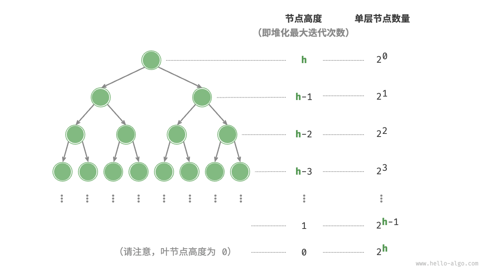

# 建堆操作

如果我们想要根据输入列表生成一个堆，这个过程被称为「建堆」。

## 借助入堆方法实现

最直接的方法是借助“元素入堆操作”实现，首先创建一个空堆，然后将列表元素依次添加到堆中。

设元素数量为 $n$ ，则最后一个元素入堆的时间复杂度为 $O(\log n)$ 。在依次添加元素时，堆的平均长度为 $\frac{n}{2}$ ，因此该方法的总体时间复杂度为 $O(n \log n)$ 。

## 基于堆化操作实现

有趣的是，存在一种更高效的建堆方法，其时间复杂度仅为 $O(n)$ 。我们先将列表所有元素原封不动添加到堆中，**然后迭代地对各个节点执行“从顶至底堆化”**。当然，**我们不需要对叶节点执行堆化操作**，因为它们没有子节点。

=== "Java"

    ```java title="my_heap.java"
    [class]{MaxHeap}-[func]{MaxHeap}
    ```

=== "C++"

    ```cpp title="my_heap.cpp"
    [class]{MaxHeap}-[func]{MaxHeap}
    ```

=== "Python"

    ```python title="my_heap.py"
    [class]{MaxHeap}-[func]{__init__}
    ```

=== "Go"

    ```go title="my_heap.go"
    [class]{maxHeap}-[func]{newMaxHeap}
    ```

=== "JS"

    ```javascript title="my_heap.js"
    [class]{MaxHeap}-[func]{constructor}
    ```

=== "TS"

    ```typescript title="my_heap.ts"
    [class]{MaxHeap}-[func]{constructor}
    ```

=== "C"

    ```c title="my_heap.c"
    [class]{maxHeap}-[func]{newMaxHeap}
    ```

=== "C#"

    ```csharp title="my_heap.cs"
    [class]{MaxHeap}-[func]{MaxHeap}
    ```

=== "Swift"

    ```swift title="my_heap.swift"
    [class]{MaxHeap}-[func]{init}
    ```

=== "Zig"

    ```zig title="my_heap.zig"
    [class]{MaxHeap}-[func]{init}
    ```

=== "Dart"

    ```dart title="my_heap.dart"
    [class]{MaxHeap}-[func]{MaxHeap}
    ```

=== "Rust"

    ```rust title="my_heap.rs"
    [class]{MaxHeap}-[func]{new}
    ```

## 复杂度分析

为什么第二种建堆方法的时间复杂度是 $O(n)$ ？我们来展开推算一下。

- 完全二叉树中，设节点总数为 $n$ ，则叶节点数量为 $(n + 1) / 2$ ，其中 $/$ 为向下整除。因此，在排除叶节点后，需要堆化的节点数量为 $(n - 1)/2$ ，复杂度为 $O(n)$ 。
- 在从顶至底堆化的过程中，每个节点最多堆化到叶节点，因此最大迭代次数为二叉树高度 $O(\log n)$ 。

将上述两者相乘，可得到建堆过程的时间复杂度为 $O(n \log n)$ 。**然而，这个估算结果并不准确，因为我们没有考虑到二叉树底层节点数量远多于顶层节点的特性**。

接下来我们来进行更为详细的计算。为了减小计算难度，我们假设树是一个“完美二叉树”，该假设不会影响计算结果的正确性。设二叉树（即堆）节点数量为 $n$ ，树高度为 $h$ 。上文提到，**节点堆化最大迭代次数等于该节点到叶节点的距离，而该距离正是“节点高度”**。



因此，我们可以将各层的“节点数量 $\times$ 节点高度”求和，**从而得到所有节点的堆化迭代次数的总和**。

$$
T(h) = 2^0h + 2^1(h-1) + 2^2(h-2) + \cdots + 2^{(h-1)}\times1
$$

化简上式需要借助中学的数列知识，先对 $T(h)$ 乘以 $2$ ，得到

$$
\begin{aligned}
T(h) & = 2^0h + 2^1(h-1) + 2^2(h-2) + \cdots + 2^{h-1}\times1 \newline
2 T(h) & = 2^1h + 2^2(h-1) + 2^3(h-2) + \cdots + 2^{h}\times1 \newline
\end{aligned}
$$

**使用错位相减法**，令下式 $2 T(h)$ 减去上式 $T(h)$ ，可得

$$
2T(h) - T(h) = T(h) = -2^0h + 2^1 + 2^2 + \cdots + 2^{h-1} + 2^h
$$

观察上式，发现 $T(h)$ 是一个等比数列，可直接使用求和公式，得到时间复杂度为

$$
\begin{aligned}
T(h) & = 2 \frac{1 - 2^h}{1 - 2} - h \newline
& = 2^{h+1} - h - 2 \newline
& = O(2^h)
\end{aligned}
$$

进一步地，高度为 $h$ 的完美二叉树的节点数量为 $n = 2^{h+1} - 1$ ，易得复杂度为 $O(2^h) = O(n)$ 。以上推算表明，**输入列表并建堆的时间复杂度为 $O(n)$ ，非常高效**。
