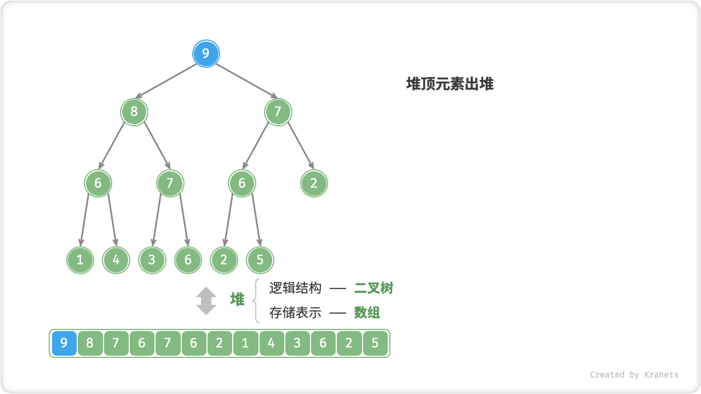
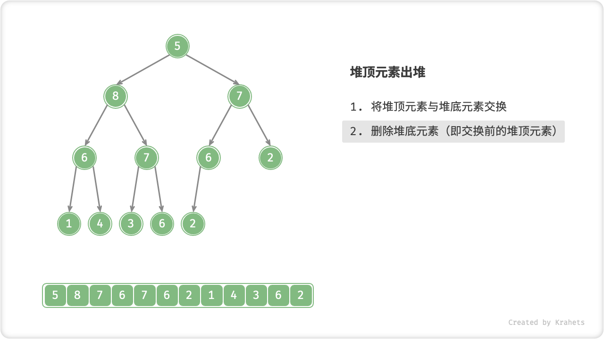
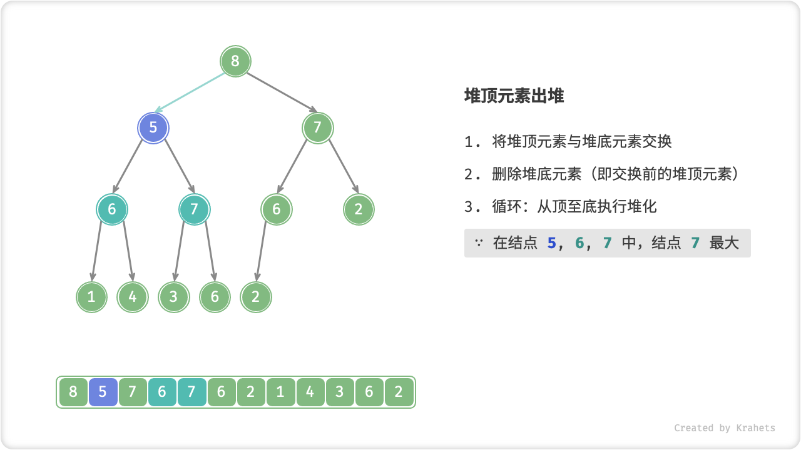
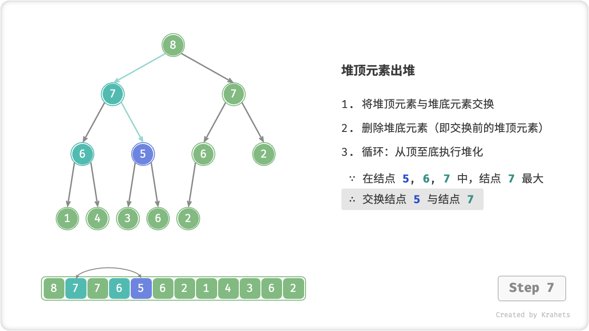
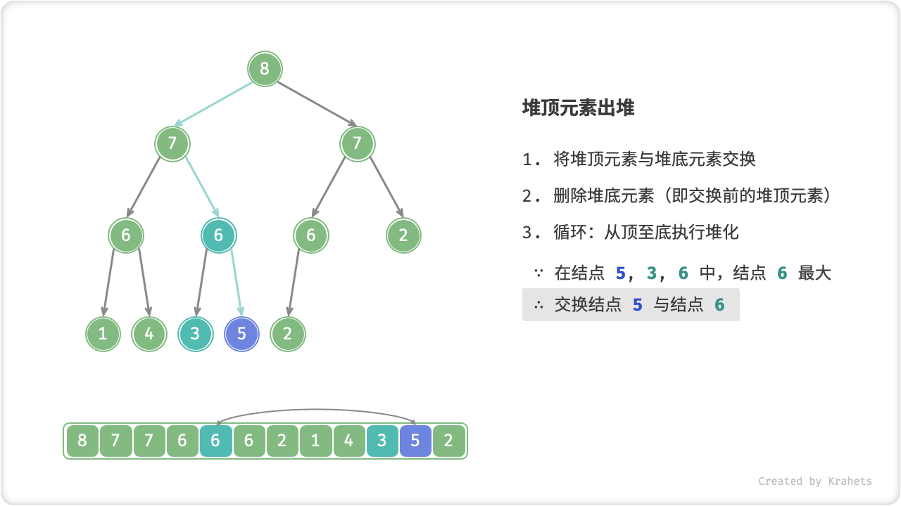
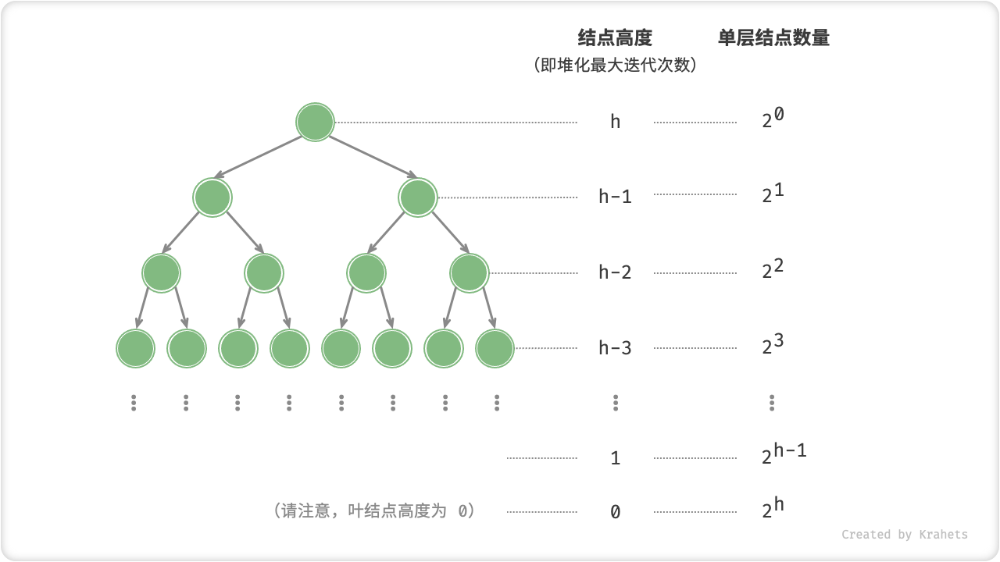

# 堆

「堆 Heap」是一棵限定条件下的「完全二叉树」。根据成立条件，堆主要分为两种类型：

- 「大顶堆 Max Heap」，任意结点的值 $\geq$ 其子结点的值；
- 「小顶堆 Min Heap」，任意结点的值 $\leq$ 其子结点的值；


## 堆术语与性质

- 由于堆是完全二叉树，因此最底层结点靠左填充，其它层结点皆被填满。
- 二叉树中的根结点对应「堆顶」，底层最靠右结点对应「堆底」。
- 对于大顶堆 / 小顶堆，其堆顶元素（即根结点）的值最大 / 最小。

## 堆常用操作

值得说明的是，多数编程语言提供的是「优先队列 Priority Queue」，其是一种抽象数据结构，**定义为具有出队优先级的队列**。

而恰好，**堆的定义与优先队列的操作逻辑完全吻合**，大顶堆就是一个元素从大到小出队的优先队列。从使用角度看，我们可以将「优先队列」和「堆」理解为等价的数据结构。因此，本文与代码对两者不做特别区分，统一使用「堆」来命名。

堆的常用操作见下表（方法命名以 Java 为例）。

<p align="center"> Table. 堆的常用操作 </p>

<div class="center-table" markdown>

| 方法      | 描述                                         | 时间复杂度  |
| --------- | -------------------------------------------- | ----------- |
| add()     | 元素入堆                                     | $O(\log n)$ |
| poll()    | 堆顶元素出堆                                 | $O(\log n)$ |
| peek()    | 访问堆顶元素（大 / 小顶堆分别为最大 / 小值） | $O(1)$      |
| size()    | 获取堆的元素数量                             | $O(1)$      |
| isEmpty() | 判断堆是否为空                               | $O(1)$      |

</div>

我们可以直接使用编程语言提供的堆类（或优先队列类）。

!!! tip

    类似于排序中“从小到大排列”和“从大到小排列”，“大顶堆”和“小顶堆”可仅通过修改 Comparator 来互相转换。

=== "Java"

    ```java title="heap.java"
    /* 初始化堆 */
    // 初始化小顶堆
    Queue<Integer> minHeap = new PriorityQueue<>();
    // 初始化大顶堆（使用 lambda 表达式修改 Comparator 即可）
    Queue<Integer> maxHeap = new PriorityQueue<>((a, b) -> b - a);
    
    /* 元素入堆 */
    maxHeap.add(1);
    maxHeap.add(3);
    maxHeap.add(2);
    maxHeap.add(5);
    maxHeap.add(4);
    
    /* 获取堆顶元素 */
    int peek = maxHeap.peek(); // 5
    
    /* 堆顶元素出堆 */
    // 出堆元素会形成一个从大到小的序列
    peek = heap.poll();  // 5
    peek = heap.poll();  // 4
    peek = heap.poll();  // 3
    peek = heap.poll();  // 2
    peek = heap.poll();  // 1
    
    /* 获取堆大小 */
    int size = maxHeap.size();
    
    /* 判断堆是否为空 */
    boolean isEmpty = maxHeap.isEmpty();
    
    /* 输入列表并建堆 */
    minHeap = new PriorityQueue<>(Arrays.asList(1, 3, 2, 5, 4));
    ```

=== "C++"

    ```cpp title="heap.cpp"
    /* 初始化堆 */
    // 初始化小顶堆
    priority_queue<int, vector<int>, greater<int>> minHeap;
    // 初始化大顶堆
    priority_queue<int, vector<int>, less<int>> maxHeap;

    /* 元素入堆 */
    maxHeap.push(1);
    maxHeap.push(3);
    maxHeap.push(2);
    maxHeap.push(5);
    maxHeap.push(4);

    /* 获取堆顶元素 */
    int peek = maxHeap.top(); // 5

    /* 堆顶元素出堆 */
    // 出堆元素会形成一个从大到小的序列
    maxHeap.pop(); // 5
    maxHeap.pop(); // 4
    maxHeap.pop(); // 3
    maxHeap.pop(); // 2
    maxHeap.pop(); // 1

    /* 获取堆大小 */
    int size = maxHeap.size();

    /* 判断堆是否为空 */
    bool isEmpty = maxHeap.empty();

    /* 输入列表并建堆 */
    vector<int> input{1, 3, 2, 5, 4};
    priority_queue<int, vector<int>, greater<int>> minHeap(input.begin(), input.end());
    ```

=== "Python"

    ```python title="heap.py"
    # 初始化小顶堆
    min_heap, flag = [], 1
    # 初始化大顶堆
    max_heap, flag = [], -1

    # Python 的 heapq 模块默认实现小顶堆
    # 考虑将“元素取负”后再入堆，这样就可以将大小关系颠倒，从而实现大顶堆
    # 在本示例中，flag = 1 时对应小顶堆，flag = -1 时对应大顶堆
    """ 元素入堆 """
    heapq.heappush(max_heap, flag * 1)
    heapq.heappush(max_heap, flag * 3)
    heapq.heappush(max_heap, flag * 2)
    heapq.heappush(max_heap, flag * 5)
    heapq.heappush(max_heap, flag * 4)

    """ 获取堆顶元素 """
    peek = flag * max_heap[0] # 5

    """ 堆顶元素出堆 """
    # 出堆元素会形成一个从大到小的序列
    val = flag * heapq.heappop(max_heap) # 5
    val = flag * heapq.heappop(max_heap) # 4
    val = flag * heapq.heappop(max_heap) # 3
    val = flag * heapq.heappop(max_heap) # 2
    val = flag * heapq.heappop(max_heap) # 1

    """ 获取堆大小 """
    size = len(max_heap)

    """ 判断堆是否为空 """
    is_empty = not max_heap

    """ 输入列表并建堆 """
    min_heap = [1, 3, 2, 5, 4]
    heapq.heapify(min_heap)
    ```

=== "Go"

    ```go title="heap.go"
    // Go 语言中可以通过实现 heap.Interface 来构建整数大顶堆
    // 实现 heap.Interface 需要同时实现 sort.Interface
    type intHeap []any

    // Push heap.Interface 的方法，实现推入元素到堆
    func (h *intHeap) Push(x any) {
        // Push 和 Pop 使用 pointer receiver 作为参数
        // 因为它们不仅会对切片的内容进行调整，还会修改切片的长度。
        *h = append(*h, x.(int))
    }

    // Pop heap.Interface 的方法，实现弹出堆顶元素
    func (h *intHeap) Pop() any {
        // 待出堆元素存放在最后
        last := (*h)[len(*h)-1]
        *h = (*h)[:len(*h)-1]
        return last
    }

    // Len sort.Interface 的方法
    func (h *intHeap) Len() int {
        return len(*h)
    }

    // Less sort.Interface 的方法
    func (h *intHeap) Less(i, j int) bool {
        // 如果实现小顶堆，则需要调整为小于号
        return (*h)[i].(int) > (*h)[j].(int)
    }

    // Swap sort.Interface 的方法
    func (h *intHeap) Swap(i, j int) {
        (*h)[i], (*h)[j] = (*h)[j], (*h)[i]
    }

    // Top 获取堆顶元素
    func (h *intHeap) Top() any {
        return (*h)[0]
    }

    /* Driver Code */
    func TestHeap(t *testing.T) {
        /* 初始化堆 */
        // 初始化大顶堆
        maxHeap := &intHeap{}
        heap.Init(maxHeap)
        /* 元素入堆 */
        // 调用 heap.Interface 的方法，来添加元素
        heap.Push(maxHeap, 1)
        heap.Push(maxHeap, 3)
        heap.Push(maxHeap, 2)
        heap.Push(maxHeap, 4)
        heap.Push(maxHeap, 5)

        /* 获取堆顶元素 */
        top := maxHeap.Top()
        fmt.Printf("堆顶元素为 %d\n", top)

        /* 堆顶元素出堆 */
        // 调用 heap.Interface 的方法，来移除元素
        heap.Pop(maxHeap)
        heap.Pop(maxHeap)
        heap.Pop(maxHeap)
        heap.Pop(maxHeap)
        heap.Pop(maxHeap)

        /* 获取堆大小 */
        size := len(*maxHeap)
        fmt.Printf("堆元素数量为 %d\n", size)

        /* 判断堆是否为空 */
        isEmpty := len(*maxHeap) == 0
        fmt.Printf("堆是否为空 %t\n", isEmpty)
    }
    ```

=== "JavaScript"

    ```javascript title="heap.js"
    // JavaScript 未提供内置 heap 类
    ```

=== "TypeScript"

    ```typescript title="heap.ts"
    // TypeScript 未提供内置堆 Heap 类
    ```

=== "C"

    ```c title="heap.c"

    ```

=== "C#"

    ```csharp title="heap.cs"
    /* 初始化堆 */
    // 初始化小顶堆
    PriorityQueue<int, int> minHeap = new PriorityQueue<int, int>();
    // 初始化大顶堆（使用 lambda 表达式修改 Comparator 即可）
    PriorityQueue<int, int> maxHeap = new PriorityQueue<int, int>(Comparer<int>.Create((x, y) => y - x));

    /* 元素入堆 */
    maxHeap.Enqueue(1, 1);
    maxHeap.Enqueue(3, 3);
    maxHeap.Enqueue(2, 2);
    maxHeap.Enqueue(5, 5);
    maxHeap.Enqueue(4, 4);

    /* 获取堆顶元素 */
    int peek = maxHeap.Peek();//5

    /* 堆顶元素出堆 */
    // 出堆元素会形成一个从大到小的序列
    peek = maxHeap.Dequeue();  // 5
    peek = maxHeap.Dequeue();  // 4
    peek = maxHeap.Dequeue();  // 3
    peek = maxHeap.Dequeue();  // 2
    peek = maxHeap.Dequeue();  // 1

    /* 获取堆大小 */
    int size = maxHeap.Count;

    /* 判断堆是否为空 */
    bool isEmpty = maxHeap.Count == 0;

    /* 输入列表并建堆 */
    minHeap = new PriorityQueue<int, int>(new List<(int, int)> { (1, 1), (3, 3), (2, 2), (5, 5), (4, 4), });
    ```

=== "Swift"

    ```swift title="heap.swift"
    // Swift 未提供内置 heap 类
    ```

=== "Zig"

    ```zig title="heap.zig"

    ```

## 堆的实现

下文实现的是「大顶堆」，若想转换为「小顶堆」，将所有大小逻辑判断取逆（例如将 $\geq$ 替换为 $\leq$ ）即可，有兴趣的同学可自行实现。

### 堆的存储与表示

在二叉树章节我们学过，「完全二叉树」非常适合使用「数组」来表示，而堆恰好是一棵完全二叉树，**因而我们采用「数组」来存储「堆」**。

**二叉树指针**。使用数组表示二叉树时，元素代表结点值，索引代表结点在二叉树中的位置，**而结点指针通过索引映射公式来实现**。

具体地，给定索引 $i$ ，那么其左子结点索引为 $2i + 1$ 、右子结点索引为 $2i + 2$ 、父结点索引为 $(i - 1) / 2$ （向下整除）。当索引越界时，代表空结点或结点不存在。


我们将索引映射公式封装成函数，以便后续使用。

=== "Java"

    ```java title="my_heap.java"
    [class]{MaxHeap}-[func]{left}

    [class]{MaxHeap}-[func]{right}

    [class]{MaxHeap}-[func]{parent}
    ```

=== "C++"

    ```cpp title="my_heap.cpp"
    [class]{MaxHeap}-[func]{left}

    [class]{MaxHeap}-[func]{right}

    [class]{MaxHeap}-[func]{parent}
    ```

=== "Python"

    ```python title="my_heap.py"
    [class]{MaxHeap}-[func]{left}

    [class]{MaxHeap}-[func]{right}

    [class]{MaxHeap}-[func]{parent}
    ```

=== "Go"

    ```go title="my_heap.go"
    [class]{maxHeap}-[func]{left}

    [class]{maxHeap}-[func]{right}

    [class]{maxHeap}-[func]{parent}
    ```

=== "JavaScript"

    ```javascript title="my_heap.js"
    [class]{MaxHeap}-[func]{#left}

    [class]{MaxHeap}-[func]{#right}

    [class]{MaxHeap}-[func]{#parent}
    ```

=== "TypeScript"

    ```typescript title="my_heap.ts"
    [class]{MaxHeap}-[func]{left}

    [class]{MaxHeap}-[func]{right}

    [class]{MaxHeap}-[func]{parent}
    ```

=== "C"

    ```c title="my_heap.c"
    [class]{maxHeap}-[func]{left}

    [class]{maxHeap}-[func]{right}

    [class]{maxHeap}-[func]{parent}
    ```

=== "C#"

    ```csharp title="my_heap.cs"
    [class]{MaxHeap}-[func]{left}

    [class]{MaxHeap}-[func]{right}

    [class]{MaxHeap}-[func]{parent}
    ```

=== "Swift"

    ```swift title="my_heap.swift"
    [class]{MaxHeap}-[func]{left}

    [class]{MaxHeap}-[func]{right}

    [class]{MaxHeap}-[func]{parent}
    ```

=== "Zig"

    ```zig title="my_heap.zig"
    [class]{MaxHeap}-[func]{left}

    [class]{MaxHeap}-[func]{right}

    [class]{MaxHeap}-[func]{parent}
    ```

### 访问堆顶元素

堆顶元素是二叉树的根结点，即列表首元素。

=== "Java"

    ```java title="my_heap.java"
    [class]{MaxHeap}-[func]{peek}
    ```

=== "C++"

    ```cpp title="my_heap.cpp"
    [class]{MaxHeap}-[func]{peek}
    ```

=== "Python"

    ```python title="my_heap.py"
    [class]{MaxHeap}-[func]{peek}
    ```

=== "Go"

    ```go title="my_heap.go"
    [class]{maxHeap}-[func]{peek}
    ```

=== "JavaScript"

    ```javascript title="my_heap.js"
    [class]{MaxHeap}-[func]{peek}
    ```

=== "TypeScript"

    ```typescript title="my_heap.ts"
    [class]{MaxHeap}-[func]{peek}
    ```

=== "C"

    ```c title="my_heap.c"
    [class]{maxHeap}-[func]{peek}
    ```

=== "C#"

    ```csharp title="my_heap.cs"
    [class]{MaxHeap}-[func]{peek}
    ```

=== "Swift"

    ```swift title="my_heap.swift"
    [class]{MaxHeap}-[func]{peek}
    ```

=== "Zig"

    ```zig title="my_heap.zig"
    [class]{MaxHeap}-[func]{peek}
    ```

### 元素入堆

给定元素 `val` ，我们先将其添加到堆底。添加后，由于 `val` 可能大于堆中其它元素，此时堆的成立条件可能已经被破坏，**因此需要修复从插入结点到根结点这条路径上的各个结点**，该操作被称为「堆化 Heapify」。

考虑从入堆结点开始，**从底至顶执行堆化**。具体地，比较插入结点与其父结点的值，若插入结点更大则将它们交换；并循环以上操作，从底至顶地修复堆中的各个结点；直至越过根结点时结束，或当遇到无需交换的结点时提前结束。

=== "<1>"
    

=== "<2>"
    

=== "<3>"
    

=== "<4>"
    

=== "<5>"
    

=== "<6>"
    

设结点总数为 $n$ ，则树的高度为 $O(\log n)$ ，易得堆化操作的循环轮数最多为 $O(\log n)$ ，**因而元素入堆操作的时间复杂度为 $O(\log n)$** 。

=== "Java"

    ```java title="my_heap.java"
    [class]{MaxHeap}-[func]{push}

    [class]{MaxHeap}-[func]{siftUp}
    ```

=== "C++"

    ```cpp title="my_heap.cpp"
    [class]{MaxHeap}-[func]{push}

    [class]{MaxHeap}-[func]{siftUp}
    ```

=== "Python"

    ```python title="my_heap.py"
    [class]{MaxHeap}-[func]{push}

    [class]{MaxHeap}-[func]{sift_up}
    ```

=== "Go"

    ```go title="my_heap.go"
    [class]{maxHeap}-[func]{push}

    [class]{maxHeap}-[func]{siftUp}
    ```

=== "JavaScript"

    ```javascript title="my_heap.js"
    [class]{MaxHeap}-[func]{push}

    [class]{MaxHeap}-[func]{#siftUp}
    ```

=== "TypeScript"

    ```typescript title="my_heap.ts"
    [class]{MaxHeap}-[func]{push}

    [class]{MaxHeap}-[func]{siftUp}
    ```

=== "C"

    ```c title="my_heap.c"
    [class]{maxHeap}-[func]{push}

    [class]{maxHeap}-[func]{siftUp}
    ```

=== "C#"

    ```csharp title="my_heap.cs"
    [class]{MaxHeap}-[func]{push}

    [class]{MaxHeap}-[func]{siftUp}
    ```

=== "Swift"

    ```swift title="my_heap.swift"
    [class]{MaxHeap}-[func]{push}

    [class]{MaxHeap}-[func]{siftUp}
    ```

=== "Zig"

    ```zig title="my_heap.zig"
    [class]{MaxHeap}-[func]{push}

    [class]{MaxHeap}-[func]{siftUp}
    ```

### 堆顶元素出堆

堆顶元素是二叉树根结点，即列表首元素，如果我们直接将首元素从列表中删除，则二叉树中所有结点都会随之发生移位（索引发生变化），这样后续使用堆化修复就很麻烦了。为了尽量减少元素索引变动，采取以下操作步骤：

1. 交换堆顶元素与堆底元素（即交换根结点与最右叶结点）；
2. 交换完成后，将堆底从列表中删除（注意，因为已经交换，实际上删除的是原来的堆顶元素）；
3. 从根结点开始，**从顶至底执行堆化**；

顾名思义，**从顶至底堆化的操作方向与从底至顶堆化相反**，我们比较根结点的值与其两个子结点的值，将最大的子结点与根结点执行交换，并循环以上操作，直到越过叶结点时结束，或当遇到无需交换的结点时提前结束。

=== "<1>"
    

=== "<2>"
    

=== "<3>"
    

=== "<4>"
    

=== "<5>"
    

=== "<6>"
    

=== "<7>"
    

=== "<8>"
    

=== "<9>"
    

=== "<10>"
    

与元素入堆操作类似，**堆顶元素出堆操作的时间复杂度为 $O(\log n)$** 。

=== "Java"

    ```java title="my_heap.java"
    [class]{MaxHeap}-[func]{poll}

    [class]{MaxHeap}-[func]{siftDown}
    ```

=== "C++"

    ```cpp title="my_heap.cpp"
    [class]{MaxHeap}-[func]{poll}

    [class]{MaxHeap}-[func]{siftDown}
    ```

=== "Python"

    ```python title="my_heap.py"
    [class]{MaxHeap}-[func]{poll}

    [class]{MaxHeap}-[func]{sift_down}
    ```

=== "Go"

    ```go title="my_heap.go"
    [class]{maxHeap}-[func]{poll}

    [class]{maxHeap}-[func]{siftDown}
    ```

=== "JavaScript"

    ```javascript title="my_heap.js"
    [class]{MaxHeap}-[func]{poll}

    [class]{MaxHeap}-[func]{#siftDown}
    ```

=== "TypeScript"

    ```typescript title="my_heap.ts"
    [class]{MaxHeap}-[func]{poll}

    [class]{MaxHeap}-[func]{siftDown}
    ```

=== "C"

    ```c title="my_heap.c"
    [class]{maxHeap}-[func]{poll}

    [class]{maxHeap}-[func]{siftDown}
    ```

=== "C#"

    ```csharp title="my_heap.cs"
    [class]{MaxHeap}-[func]{poll}

    [class]{MaxHeap}-[func]{siftDown}
    ```

=== "Swift"

    ```swift title="my_heap.swift"
    [class]{MaxHeap}-[func]{poll}

    [class]{MaxHeap}-[func]{siftDown}
    ```

=== "Zig"

    ```zig title="my_heap.zig"
    [class]{MaxHeap}-[func]{poll}

    [class]{MaxHeap}-[func]{siftDown}
    ```

### 输入数据并建堆 *

如果我们想要直接输入一个列表并将其建堆，那么该怎么做呢？最直接地，考虑使用「元素入堆」方法，将列表元素依次入堆。元素入堆的时间复杂度为 $O(\log n)$ ，而平均长度为 $\frac{n}{2}$ ，因此该方法的总体时间复杂度为 $O(n \log n)$ 。

然而，存在一种更加优雅的建堆方法。设结点数量为 $n$ ，我们先将列表所有元素原封不动添加进堆，**然后迭代地对各个结点执行「从顶至底堆化」**。当然，**无需对叶结点执行堆化**，因为其没有子结点。

=== "Java"

    ```java title="my_heap.java"
    [class]{MaxHeap}-[func]{MaxHeap}
    ```

=== "C++"

    ```cpp title="my_heap.cpp"
    [class]{MaxHeap}-[func]{MaxHeap}
    ```

=== "Python"

    ```python title="my_heap.py"
    [class]{MaxHeap}-[func]{__init__}
    ```

=== "Go"

    ```go title="my_heap.go"
    [class]{maxHeap}-[func]{newMaxHeap}
    ```

=== "JavaScript"

    ```javascript title="my_heap.js"
    [class]{MaxHeap}-[func]{constructor}
    ```

=== "TypeScript"

    ```typescript title="my_heap.ts"
    [class]{MaxHeap}-[func]{constructor}
    ```

=== "C"

    ```c title="my_heap.c"
    [class]{maxHeap}-[func]{newMaxHeap}
    ```

=== "C#"

    ```csharp title="my_heap.cs"
    [class]{MaxHeap}-[func]{MaxHeap}
    ```

=== "Swift"

    ```swift title="my_heap.swift"
    [class]{MaxHeap}-[func]{init}
    ```

=== "Zig"

    ```zig title="my_heap.zig"
    [class]{MaxHeap}-[func]{init}
    ```

那么，第二种建堆方法的时间复杂度时多少呢？我们来做一下简单推算。

- 完全二叉树中，设结点总数为 $n$ ，则叶结点数量为 $(n + 1) / 2$ ，其中 $/$ 为向下整除。因此在排除叶结点后，需要堆化结点数量为 $(n - 1)/2$ ，即为 $O(n)$ ；
- 从顶至底堆化中，每个结点最多堆化至叶结点，因此最大迭代次数为二叉树高度 $O(\log n)$ ；

将上述两者相乘，可得时间复杂度为 $O(n \log n)$ 。然而，该估算结果仍不够准确，因为我们没有考虑到 **二叉树底层结点远多于顶层结点** 的性质。

下面我们来尝试展开计算。为了减小计算难度，我们假设树是一个「完美二叉树」，该假设不会影响计算结果的正确性。设二叉树（即堆）结点数量为 $n$ ，树高度为 $h$ 。上文提到，**结点堆化最大迭代次数等于该结点到叶结点的距离，而这正是“结点高度”**。因此，我们将各层的“结点数量 $\times$ 结点高度”求和，即可得到所有结点的堆化的迭代次数总和。

$$
T(h) = 2^0h + 2^1(h-1) + 2^2(h-2) + \cdots + 2^{(h-1)}\times1
$$



化简上式需要借助中学的数列知识，先对 $T(h)$ 乘以 $2$ ，易得

$$
\begin{aligned}
T(h) & = 2^0h + 2^1(h-1) + 2^2(h-2) + \cdots + 2^{h-1}\times1 \newline
2 T(h) & = 2^1h + 2^2(h-1) + 2^3(h-2) + \cdots + 2^{h}\times1 \newline
\end{aligned}
$$

**使用错位相减法**，令下式 $2 T(h)$ 减去上式 $T(h)$ ，可得

$$
2T(h) - T(h) = T(h) = -2^0h + 2^1 + 2^2 + \cdots + 2^{h-1} + 2^h
$$

观察上式，$T(h)$ 是一个等比数列，可直接使用求和公式，得到时间复杂度为

$$
\begin{aligned}
T(h) & = 2 \frac{1 - 2^h}{1 - 2} - h \newline
& = 2^{h+1} - h \newline
& = O(2^h)
\end{aligned}
$$

进一步地，高度为 $h$ 的完美二叉树的结点数量为 $n = 2^{h+1} - 1$ ，易得复杂度为 $O(2^h) = O(n)$。以上推算表明，**输入列表并建堆的时间复杂度为 $O(n)$ ，非常高效**。

## 堆常见应用

- **优先队列**。堆常作为实现优先队列的首选数据结构，入队和出队操作时间复杂度为 $O(\log n)$ ，建队操作为 $O(n)$ ，皆非常高效。
- **堆排序**。给定一组数据，我们使用其建堆，并依次全部弹出，则可以得到有序的序列。当然，堆排序一般无需弹出元素，仅需每轮将堆顶元素交换至数组尾部并减小堆的长度即可。
- **获取最大的 $k$ 个元素**。这既是一道经典算法题目，也是一种常见应用，例如选取热度前 10 的新闻作为微博热搜，选取前 10 销量的商品等。
