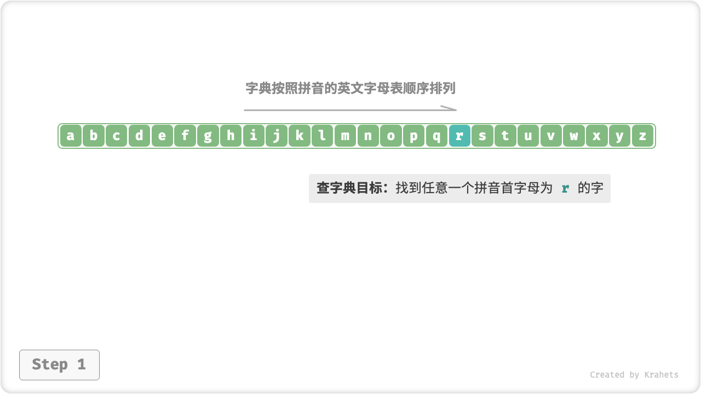
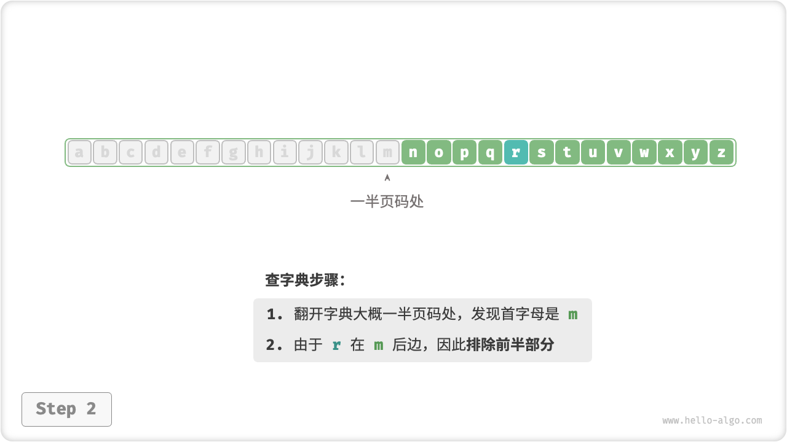
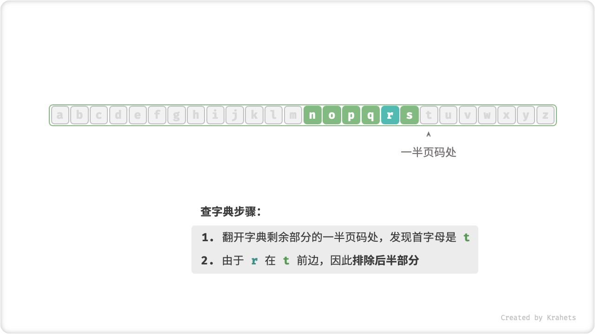
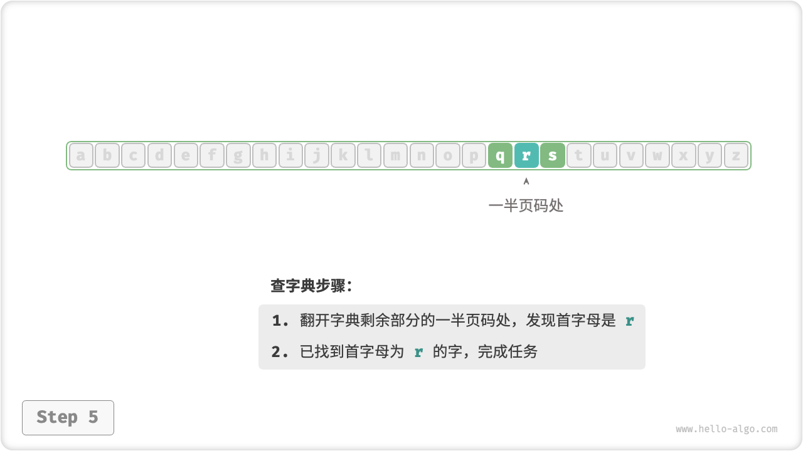

# 算法无处不在

听到“算法”这个词，我们一般会联想到数学。但实际上，大多数算法并不包含复杂的数学，而更像是在考察基本逻辑，而这些逻辑在我们日常生活中处处可见。

在正式介绍算法之前，我想告诉你一件有趣的事：**其实，你在过去已经学会了很多算法，并且已经习惯将它们应用到日常生活中**。接下来，我将介绍两个具体例子来佐证。

**例一：拼积木**。一套积木，除了有许多部件之外，还会附送详细的拼装说明书。我们按照说明书上一步步操作，即可拼出复杂的积木模型。

如果从数据结构与算法的角度看，大大小小的「积木」就是数据结构，而「拼装说明书」上的一系列步骤就是算法。

**例二：查字典**。在字典中，每个汉字都有一个对应的拼音，而字典是按照拼音的英文字母表顺序排列的。假设需要在字典中查询任意一个拼音首字母为 $r$ 的字，一般我们会这样做：

1. 打开字典大致一半页数的位置，查看此页的首字母是什么（假设为 $m$ ）；
2. 由于在英文字母表中 $r$ 在 $m$ 的后面，因此应排除字典前半部分，查找范围仅剩后半部分；
3. 循环执行步骤 1-2 ，直到找到拼音首字母为 $r$ 的页码时终止。

=== "Step 1"
    
=== "Step 2"
    
=== "Step 3"
    
=== "Step 4"
    
=== "Step 5"
    

查字典这个小学生的标配技能，实际上就是大名鼎鼎的「二分查找」。从数据结构角度，我们可以将字典看作是一个已排序的「数组」；而从算法角度，我们可将上述查字典的一系列指令看作是「二分查找」算法。

小到烹饪一道菜、大到星际航行，几乎所有问题的解决都离不开算法。计算机的出现，使我们可以通过编程将数据结构存储在内存中，也可以编写代码来调用 CPU, GPU 执行算法，从而将生活中的问题搬运到计算机中，更加高效地解决各式各样的复杂问题。

!!! tip

    读到这里，如果你感到对数据结构、算法、数组、二分查找等此类概念一知半解，那么就太好了！因为这正是本书存在的价值，接下来，本书将会一步步地引导你进入数据结构与算法的知识殿堂。
