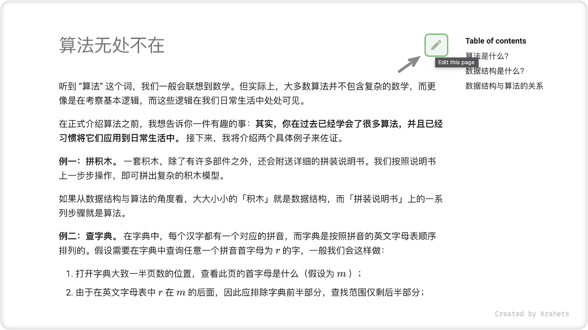

# 一起参与创作

由于作者水平有限，书中内容难免疏漏谬误，请您谅解。此外，希望您可以一同参与到本书的内容创作中来。如果你发现笔误、无效链接、内容缺失、文字歧义、解释不清晰、行文结构不合理等问题，烦请您帮忙修正内容，以帮助其他读者获取更优质的学习内容。

!!! quote ""

    纸质书籍的两次印刷的间隔时间往往需要数年，内容更新非常不方便。 但在本开源 HTML 书中，内容更迭的时间被缩短至数日甚至几个小时。

## 修改文字

每个页面的右上角都有一个「编辑」按钮，你可以按照以下步骤修改文章：

1. 点击编辑按钮，如果遇到提示 “需要 Fork 此仓库” ，请通过；
2. 修改 Markdown 源文件内容；
3. 在页面底部填写更改说明，然后单击 “Propose file change” 按钮；
4. 页面跳转后，点击 “Create pull request” 按钮发起拉取请求即可，我会第一时间查看处理并及时更新内容。

## 修改图片

书中的配图无法直接修改，需要通过以下途径提出修改意见：

1. 新建一个 Issue ，将需要修改的图片复制或截图，粘贴在面板中；
2. 描述图片问题，应如何修改；
3. 提交 Issue 即可，我会第一时间重新画图并替换图片。

## 修改代码

若发现代码源文件有错误，可以本地修改并提交 Pull Request ：

1. 登录 GitHub ，并 Fork [<u>本仓库</u>](https://github.com/krahets/hello-algo) 至个人账号；
2. 使用 Git 克隆 Fork 的仓库至本地（Git 安装教程见上节 “编程环境安装” ）；
3. 在本地修改 `.java` , `.cpp` , `.py` 文件中的代码，并运行测试；测试完毕后，请同步修改 Markdown 文件中的对应代码；
5. 将本地更新 Commit ，并 Push 至远程仓库；
6. 刷新仓库网页，点击 “Create pull request” 按钮发起拉取请求即可；

（TODO：教学视频）

## 创作新内容

「修改代码」中介绍的是完整的 Pull Request 流程，还可以用来 **重写某章节、新增章节、翻译代码至其他编程语言** 等。非常欢迎您和我一同来创作本书！
