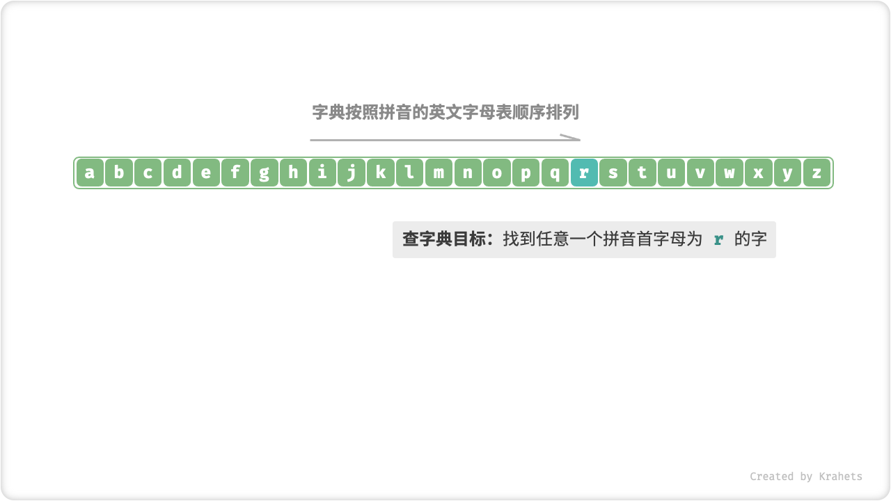

# 算法是什么

听到 “算法” 这个词，我们一般会联想到数学。但实际上，大多数算法并不包含复杂的数学，而更像是在考察基本逻辑，而这些逻辑在我们日常生活中处处可见。

在正式介绍算法之前，我想告诉你一件有趣的事：**其实，你在过去已经学会了很多算法，并且已经习惯将它们应用到日常生活中。** 接下来，我将介绍两个具体例子来佐证。

**例一：拼积木。** 一套积木，除了有许多部件之外，还会附送详细的拼装说明书。我们按照说明书上一步步操作，即可拼出复杂的积木模型。

如果从数据结构与算法的角度看，大大小小的「积木」就是数据结构，而「拼装说明书」上的一系列步骤就是算法。

**例二：查字典。** 在字典中，每个汉字都有一个对应的拼音，而字典是按照拼音的英文字母表顺序排列的。假设需要在字典中查询任意一个拼音首字母为 $r$ 的字，一般我们会这样做：

1. 打开字典大致一半页数的位置，查看此页的首字母是什么（假设为 $m$ ）；
2. 由于在英文字母表中 $r$ 在 $m$ 的后面，因此应排除字典前半部分，查找范围仅剩后半部分；
3. 循环执行步骤 1-2 ，直到找到拼音首字母为 $r$ 的页码时终止。

=== "Step 1"

    

=== "Step 2"

    

=== "Step 3"

    

=== "Step 4"

    

=== "Step 5"

    

查字典这个小学生的标配技能，实际上就是大名鼎鼎的「二分查找」。从数据结构角度，我们可以将字典看作是一个已排序的「数组」；而从算法角度，我们可将上述查字典的一系列指令看作是「二分查找」算法。

小到烹饪一道菜、大到星际航行，几乎所有问题的解决都离不开算法。计算机的出现，使我们可以通过编程将数据结构存储在内存中，也可以编写代码来调用 CPU, GPU 执行算法，从而将生活中的问题搬运到计算机中，更加高效地解决各式各样的复杂问题。

!!! tip

    读到这里，如果你感到对数据结构、算法、数组、二分查找等此类概念一知半解，那么就太好了！因为这正是本书存在的价值，接下来，本书将会一步步地引导你进入数据结构与算法的知识殿堂。

## 算法是什么？

「算法 Algorithm」是在有限时间内解决问题的一组指令或操作步骤。算法具有以下特性：

- 问题是明确的，需要拥有明确的输入和输出定义。
- 解具有确定性，即给定相同输入时，输出一定相同。
- 具有可行性，可在有限步骤、有限时间、有限内存空间下完成。
- 独立于编程语言，即可用多种语言实现。

## 数据结构是什么？

「数据结构 Data Structure」是在计算机中组织与存储数据的方式。为了提高数据存储和操作性能，数据结构的设计原则有：

- 空间占用尽可能小，节省计算机内存。
- 数据操作尽量快，包括数据访问、添加、删除、更新等。
- 提供简洁的数据表示和逻辑信息，以便算法高效运行。

数据结构的设计是一个充满权衡的过程，这意味着如果获得某方面的优势，则往往需要在另一方面做出妥协。例如，链表相对于数组，数据添加删除操作更加方便，但牺牲了数据的访问速度；图相对于链表，提供了更多的逻辑信息，但需要占用更多的内存空间。

## 数据结构与算法的关系

「数据结构」与「算法」是高度相关、紧密嵌合的，体现在：

- 数据结构是算法的底座。数据结构为算法提供结构化存储的数据，以及操作数据的对应方法。
- 算法是发挥数据结构优势的舞台。数据结构仅存储数据信息，结合算法才可解决特定问题。
- 算法有对应最优的数据结构。给定算法，一般可基于不同的数据结构实现，而最终执行效率往往相差很大。

如果将数据结构与算法比作「LEGO 乐高」，数据结构就是乐高「积木」，而算法就是把积木拼成目标形态的一系列「操作步骤」。

 Fig. 数据结构与算法的关系 

!!! tip "约定俗成的习惯"

    在实际讨论中，我们通常会将「数据结构与算法」简称为「算法」。例如，我们熟称的 LeetCode 算法题目，实际上同时考察了数据结构和算法两部分知识。
