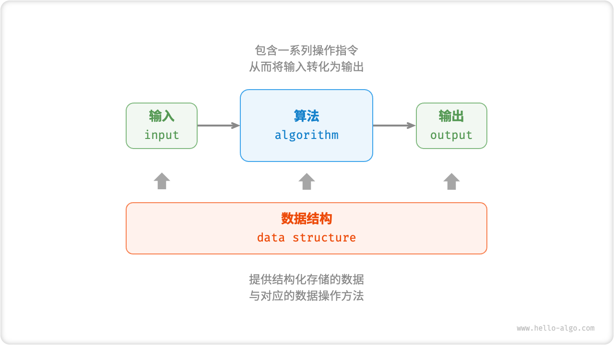

# 算法是什么

## 算法定义

<u>算法（algorithm）</u>是在有限时间内解决特定问题的一组指令或操作步骤，它具有以下特性。

- 问题是明确的，包含清晰的输入和输出定义。
- 具有可行性，能够在有限步骤、时间和内存空间下完成。
- 各步骤都有确定的含义，在相同的输入和运行条件下，输出始终相同。

## 数据结构定义

<u>数据结构（data structure）</u>是计算机中组织和存储数据的方式，具有以下设计目标。

- 空间占用尽量少，以节省计算机内存。
- 数据操作尽可能快速，涵盖数据访问、添加、删除、更新等。
- 提供简洁的数据表示和逻辑信息，以便算法高效运行。

**数据结构设计是一个充满权衡的过程**。如果想在某方面取得提升，往往需要在另一方面作出妥协。下面举两个例子。

- 链表相较于数组，在数据添加和删除操作上更加便捷，但牺牲了数据访问速度。
- 图相较于链表，提供了更丰富的逻辑信息，但需要占用更大的内存空间。

## 数据结构与算法的关系

如下图所示，数据结构与算法高度相关、紧密结合，具体表现在以下三个方面。

- 数据结构是算法的基石。数据结构为算法提供了结构化存储的数据，以及操作数据的方法。
- 算法是数据结构发挥作用的舞台。数据结构本身仅存储数据信息，结合算法才能解决特定问题。
- 算法通常可以基于不同的数据结构实现，但执行效率可能相差很大，选择合适的数据结构是关键。

数据结构与算法犹如下图所示的拼装积木。一套积木，除了包含许多零件之外，还附有详细的组装说明书。我们按照说明书一步步操作，就能组装出精美的积木模型。

两者的详细对应关系如下表所示。

 表 <id> &nbsp; 将数据结构与算法类比为拼装积木 

| 数据结构与算法 | 拼装积木                                 |
| -------------- | ---------------------------------------- |
| 输入数据       | 未拼装的积木                             |
| 数据结构       | 积木组织形式，包括形状、大小、连接方式等 |
| 算法           | 把积木拼成目标形态的一系列操作步骤       |
| 输出数据       | 积木模型                                 |

值得说明的是，数据结构与算法是独立于编程语言的。正因如此，本书得以提供基于多种编程语言的实现。

!!! tip "约定俗成的简称"

    在实际讨论时，我们通常会将“数据结构与算法”简称为“算法”。比如众所周知的 LeetCode 算法题目，实际上同时考查数据结构和算法两方面的知识。
