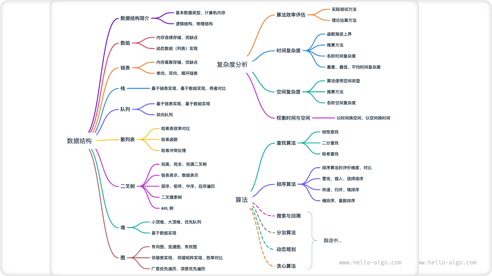

# 关于本书

本项目旨在创建一本开源免费、新手友好的数据结构与算法入门教程。

- 全书采用动画图解，结构化地讲解数据结构与算法知识，内容清晰易懂、学习曲线平滑。
- 算法源代码皆可一键运行，支持 Java、C++、Python、Go、JS、TS、C#、Swift、Rust、Dart、Zig 等语言。
- 鼓励读者在章节讨论区互帮互助、共同进步，提问与评论通常可在两日内得到回复。

## 读者对象

若您是算法初学者，从未接触过算法，或者已经有一些刷题经验，对数据结构与算法有模糊的认识，在会与不会之间反复横跳，那么这本书正是为您量身定制！

如果您已经积累一定刷题量，熟悉大部分题型，那么本书可助您回顾与梳理算法知识体系，仓库源代码可以被当作“刷题工具库”或“算法字典”来使用。

若您是算法大神，我们期待收到您的宝贵建议，或者[一起参与创作](https://www.hello-algo.com/chapter_appendix/contribution/)。

!!! success "前置条件"

    您需要至少具备任一语言的编程基础，能够阅读和编写简单代码。

## 内容结构

本书主要内容如下图所示。

- **复杂度分析**：数据结构和算法的评价维度与方法。时间复杂度、空间复杂度的推算方法、常见类型、示例等。
- **数据结构**：基本数据类型，数据结构的分类方法。数组、链表、栈、队列、哈希表、树、堆、图等数据结构的定义、优缺点、常用操作、常见类型、典型应用、实现方法等。
- **算法**：搜索、排序、分治、回溯、动态规划、贪心等算法的定义、优缺点、效率、应用场景、解题步骤、示例题目等。

## 致谢

在本书的创作过程中，我得到了许多人的帮助，包括但不限于：

- 感谢我在公司的导师李汐博士，在一次畅谈中您鼓励我“快行动起来”，坚定了我写这本书的决心。
- 感谢我的女朋友泡泡作为本书的首位读者，从算法小白的角度提出许多宝贵建议，使得本书更适合新手阅读。
- 感谢腾宝、琦宝、飞宝为本书起了一个富有创意的名字，唤起大家写下第一行代码 "Hello World!" 的美好回忆。
- 感谢苏潼为本书设计了精美的封面和 LOGO，并在我的强迫症下多次耐心修改。
- 感谢 @squidfunk 提供的写作排版建议，以及他开发的开源文档主题 [Material-for-MkDocs](https://github.com/squidfunk/mkdocs-material/tree/master) 。

在写作过程中，我阅读了许多关于数据结构与算法的教材和文章。这些作品为本书提供了优秀的范本，确保了本书内容的准确性与品质。在此感谢所有老师和前辈们的杰出贡献！

本书倡导手脑并用的学习方式，在这一点上深受[《动手学深度学习》](https://github.com/d2l-ai/d2l-zh)的启发。在此向各位读者强烈推荐这本优秀著作。

衷心感谢我的父母，正是你们一直以来的支持与鼓励，让我有机会做这件富有趣味的事。
