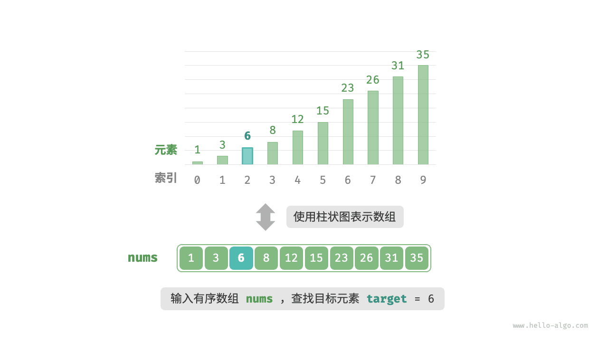
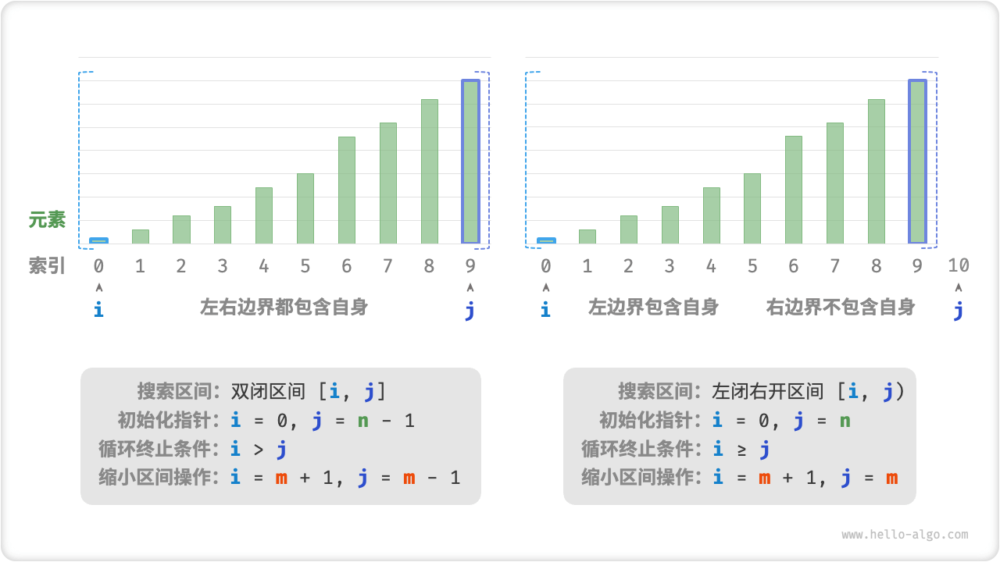

# 10.1 &nbsp; 二分查找

「二分查找 binary search」是一种基于分治策略的高效搜索算法。它利用数据的有序性，每轮缩小一半搜索范围，直至找到目标元素或搜索区间为空为止。

!!! question

    给定一个长度为 $n$ 的数组 `nums` ，元素按从小到大的顺序排列且不重复。请查找并返回元素 `target` 在该数组中的索引。若数组不包含该元素，则返回 $-1$ 。示例如图 10-1 所示。

{ class="animation-figure" }

<p align="center"> 图 10-1 &nbsp; 二分查找示例数据 </p>

如图 10-2 所示，我们先初始化指针 $i = 0$ 和 $j = n - 1$ ，分别指向数组首元素和尾元素，代表搜索区间 $[0, n - 1]$ 。请注意，中括号表示闭区间，其包含边界值本身。

接下来，循环执行以下两步。

1. 计算中点索引 $m = \lfloor {(i + j) / 2} \rfloor$ ，其中 $\lfloor \: \rfloor$ 表示向下取整操作。
2. 判断 `nums[m]` 和 `target` 的大小关系，分为以下三种情况。
    1. 当 `nums[m] < target` 时，说明 `target` 在区间 $[m + 1, j]$ 中，因此执行 $i = m + 1$ 。
    2. 当 `nums[m] > target` 时，说明 `target` 在区间 $[i, m - 1]$ 中，因此执行 $j = m - 1$ 。
    3. 当 `nums[m] = target` 时，说明找到 `target` ，因此返回索引 $m$ 。

若数组不包含目标元素，搜索区间最终会缩小为空。此时返回 $-1$ 。

=== "<1>"
    { class="animation-figure" }

=== "<2>"
    { class="animation-figure" }

=== "<3>"
    { class="animation-figure" }

=== "<4>"
    { class="animation-figure" }

=== "<5>"
    { class="animation-figure" }

=== "<6>"
    { class="animation-figure" }

=== "<7>"
    { class="animation-figure" }

<p align="center"> 图 10-2 &nbsp; 二分查找流程 </p>

值得注意的是，由于 $i$ 和 $j$ 都是 `int` 类型，**因此 $i + j$ 可能会超出 `int` 类型的取值范围**。为了避免大数越界，我们通常采用公式 $m = \lfloor {i + (j - i) / 2} \rfloor$ 来计算中点。

代码如下所示：

=== "Python"

    ```python title="binary_search.py"
    def binary_search(nums: list[int], target: int) -> int:
        """二分查找（双闭区间）"""
        # 初始化双闭区间 [0, n-1] ，即 i, j 分别指向数组首元素、尾元素
        i, j = 0, len(nums) - 1
        # 循环，当搜索区间为空时跳出（当 i > j 时为空）
        while i <= j:
            # 理论上 Python 的数字可以无限大（取决于内存大小），无须考虑大数越界问题
            m = (i + j) // 2  # 计算中点索引 m
            if nums[m] < target:
                i = m + 1  # 此情况说明 target 在区间 [m+1, j] 中
            elif nums[m] > target:
                j = m - 1  # 此情况说明 target 在区间 [i, m-1] 中
            else:
                return m  # 找到目标元素，返回其索引
        return -1  # 未找到目标元素，返回 -1
    ```

=== "C++"

    ```cpp title="binary_search.cpp"
    /* 二分查找（双闭区间） */
    int binarySearch(vector<int> &nums, int target) {
        // 初始化双闭区间 [0, n-1] ，即 i, j 分别指向数组首元素、尾元素
        int i = 0, j = nums.size() - 1;
        // 循环，当搜索区间为空时跳出（当 i > j 时为空）
        while (i <= j) {
            int m = i + (j - i) / 2; // 计算中点索引 m
            if (nums[m] < target)    // 此情况说明 target 在区间 [m+1, j] 中
                i = m + 1;
            else if (nums[m] > target) // 此情况说明 target 在区间 [i, m-1] 中
                j = m - 1;
            else // 找到目标元素，返回其索引
                return m;
        }
        // 未找到目标元素，返回 -1
        return -1;
    }
    ```

=== "Java"

    ```java title="binary_search.java"
    /* 二分查找（双闭区间） */
    int binarySearch(int[] nums, int target) {
        // 初始化双闭区间 [0, n-1] ，即 i, j 分别指向数组首元素、尾元素
        int i = 0, j = nums.length - 1;
        // 循环，当搜索区间为空时跳出（当 i > j 时为空）
        while (i <= j) {
            int m = i + (j - i) / 2; // 计算中点索引 m
            if (nums[m] < target) // 此情况说明 target 在区间 [m+1, j] 中
                i = m + 1;
            else if (nums[m] > target) // 此情况说明 target 在区间 [i, m-1] 中
                j = m - 1;
            else // 找到目标元素，返回其索引
                return m;
        }
        // 未找到目标元素，返回 -1
        return -1;
    }
    ```

=== "C#"

    ```csharp title="binary_search.cs"
    /* 二分查找（双闭区间） */
    int BinarySearch(int[] nums, int target) {
        // 初始化双闭区间 [0, n-1] ，即 i, j 分别指向数组首元素、尾元素
        int i = 0, j = nums.Length - 1;
        // 循环，当搜索区间为空时跳出（当 i > j 时为空）
        while (i <= j) {
            int m = i + (j - i) / 2;   // 计算中点索引 m
            if (nums[m] < target)      // 此情况说明 target 在区间 [m+1, j] 中
                i = m + 1;
            else if (nums[m] > target) // 此情况说明 target 在区间 [i, m-1] 中
                j = m - 1;
            else                       // 找到目标元素，返回其索引
                return m;
        }
        // 未找到目标元素，返回 -1
        return -1;
    }
    ```

=== "Go"

    ```go title="binary_search.go"
    /* 二分查找（双闭区间） */
    func binarySearch(nums []int, target int) int {
        // 初始化双闭区间 [0, n-1] ，即 i, j 分别指向数组首元素、尾元素
        i, j := 0, len(nums)-1
        // 循环，当搜索区间为空时跳出（当 i > j 时为空）
        for i <= j {
            m := i + (j-i)/2      // 计算中点索引 m
            if nums[m] < target { // 此情况说明 target 在区间 [m+1, j] 中
                i = m + 1
            } else if nums[m] > target { // 此情况说明 target 在区间 [i, m-1] 中
                j = m - 1
            } else { // 找到目标元素，返回其索引
                return m
            }
        }
        // 未找到目标元素，返回 -1
        return -1
    }
    ```

=== "Swift"

    ```swift title="binary_search.swift"
    /* 二分查找（双闭区间） */
    func binarySearch(nums: [Int], target: Int) -> Int {
        // 初始化双闭区间 [0, n-1] ，即 i, j 分别指向数组首元素、尾元素
        var i = 0
        var j = nums.count - 1
        // 循环，当搜索区间为空时跳出（当 i > j 时为空）
        while i <= j {
            let m = i + (j - i) / 2 // 计算中点索引 m
            if nums[m] < target { // 此情况说明 target 在区间 [m+1, j] 中
                i = m + 1
            } else if nums[m] > target { // 此情况说明 target 在区间 [i, m-1] 中
                j = m - 1
            } else { // 找到目标元素，返回其索引
                return m
            }
        }
        // 未找到目标元素，返回 -1
        return -1
    }
    ```

=== "JS"

    ```javascript title="binary_search.js"
    /* 二分查找（双闭区间） */
    function binarySearch(nums, target) {
        // 初始化双闭区间 [0, n-1] ，即 i, j 分别指向数组首元素、尾元素
        let i = 0,
            j = nums.length - 1;
        // 循环，当搜索区间为空时跳出（当 i > j 时为空）
        while (i <= j) {
            // 计算中点索引 m ，使用 parseInt() 向下取整
            const m = parseInt(i + (j - i) / 2);
            if (nums[m] < target)
                // 此情况说明 target 在区间 [m+1, j] 中
                i = m + 1;
            else if (nums[m] > target)
                // 此情况说明 target 在区间 [i, m-1] 中
                j = m - 1;
            else return m; // 找到目标元素，返回其索引
        }
        // 未找到目标元素，返回 -1
        return -1;
    }
    ```

=== "TS"

    ```typescript title="binary_search.ts"
    /* 二分查找（双闭区间） */
    function binarySearch(nums: number[], target: number): number {
        // 初始化双闭区间 [0, n-1] ，即 i, j 分别指向数组首元素、尾元素
        let i = 0,
            j = nums.length - 1;
        // 循环，当搜索区间为空时跳出（当 i > j 时为空）
        while (i <= j) {
            // 计算中点索引 m
            const m = Math.floor(i + (j - i) / 2);
            if (nums[m] < target) {
                // 此情况说明 target 在区间 [m+1, j] 中
                i = m + 1;
            } else if (nums[m] > target) {
                // 此情况说明 target 在区间 [i, m-1] 中
                j = m - 1;
            } else {
                // 找到目标元素，返回其索引
                return m;
            }
        }
        return -1; // 未找到目标元素，返回 -1
    }
    ```

=== "Dart"

    ```dart title="binary_search.dart"
    /* 二分查找（双闭区间） */
    int binarySearch(List<int> nums, int target) {
      // 初始化双闭区间 [0, n-1] ，即 i, j 分别指向数组首元素、尾元素
      int i = 0, j = nums.length - 1;
      // 循环，当搜索区间为空时跳出（当 i > j 时为空）
      while (i <= j) {
        int m = i + (j - i) ~/ 2; // 计算中点索引 m
        if (nums[m] < target) {
          // 此情况说明 target 在区间 [m+1, j] 中
          i = m + 1;
        } else if (nums[m] > target) {
          // 此情况说明 target 在区间 [i, m-1] 中
          j = m - 1;
        } else {
          // 找到目标元素，返回其索引
          return m;
        }
      }
      // 未找到目标元素，返回 -1
      return -1;
    }
    ```

=== "Rust"

    ```rust title="binary_search.rs"
    /* 二分查找（双闭区间） */
    fn binary_search(nums: &[i32], target: i32) -> i32 {
        // 初始化双闭区间 [0, n-1] ，即 i, j 分别指向数组首元素、尾元素
        let mut i = 0;
        let mut j = nums.len() as i32 - 1;
        // 循环，当搜索区间为空时跳出（当 i > j 时为空）
        while i <= j {
            let m = i + (j - i) / 2;      // 计算中点索引 m
            if nums[m as usize] < target {         // 此情况说明 target 在区间 [m+1, j] 中
                i = m + 1;
            } else if nums[m as usize] > target {  // 此情况说明 target 在区间 [i, m-1] 中
                j = m - 1;
            } else {                      // 找到目标元素，返回其索引
                return m;
            }                       
        }
        // 未找到目标元素，返回 -1
        return -1;
    }
    ```

=== "C"

    ```c title="binary_search.c"
    /* 二分查找（双闭区间） */
    int binarySearch(int *nums, int len, int target) {
        // 初始化双闭区间 [0, n-1] ，即 i, j 分别指向数组首元素、尾元素
        int i = 0, j = len - 1;
        // 循环，当搜索区间为空时跳出（当 i > j 时为空）
        while (i <= j) {
            int m = i + (j - i) / 2; // 计算中点索引 m
            if (nums[m] < target)    // 此情况说明 target 在区间 [m+1, j] 中
                i = m + 1;
            else if (nums[m] > target) // 此情况说明 target 在区间 [i, m-1] 中
                j = m - 1;
            else // 找到目标元素，返回其索引
                return m;
        }
        // 未找到目标元素，返回 -1
        return -1;
    }
    ```

=== "Zig"

    ```zig title="binary_search.zig"
    // 二分查找（双闭区间）
    fn binarySearch(comptime T: type, nums: std.ArrayList(T), target: T) T {
        // 初始化双闭区间 [0, n-1] ，即 i, j 分别指向数组首元素、尾元素
        var i: usize = 0;
        var j: usize = nums.items.len - 1;
        // 循环，当搜索区间为空时跳出（当 i > j 时为空）
        while (i <= j) {
            var m = i + (j - i) / 2;                // 计算中点索引 m
            if (nums.items[m] < target) {           // 此情况说明 target 在区间 [m+1, j] 中
                i = m + 1;
            } else if (nums.items[m] > target) {    // 此情况说明 target 在区间 [i, m-1] 中
                j = m - 1;
            } else {                                // 找到目标元素，返回其索引
                return @intCast(m);
            }
        }
        // 未找到目标元素，返回 -1
        return -1;
    }
    ```

??? pythontutor "可视化运行"

    <div style="height: 549px; width: 100%;"><iframe class="pythontutor-iframe" src="https://pythontutor.com/iframe-embed.html#code=def%20binary_search%28nums%3A%20list%5Bint%5D,%20target%3A%20int%29%20-%3E%20int%3A%0A%20%20%20%20%22%22%22%E4%BA%8C%E5%88%86%E6%9F%A5%E6%89%BE%EF%BC%88%E5%8F%8C%E9%97%AD%E5%8C%BA%E9%97%B4%EF%BC%89%22%22%22%0A%20%20%20%20%23%20%E5%88%9D%E5%A7%8B%E5%8C%96%E5%8F%8C%E9%97%AD%E5%8C%BA%E9%97%B4%20%5B0,%20n-1%5D%20%EF%BC%8C%E5%8D%B3%20i,%20j%20%E5%88%86%E5%88%AB%E6%8C%87%E5%90%91%E6%95%B0%E7%BB%84%E9%A6%96%E5%85%83%E7%B4%A0%E3%80%81%E5%B0%BE%E5%85%83%E7%B4%A0%0A%20%20%20%20i,%20j%20%3D%200,%20len%28nums%29%20-%201%0A%20%20%20%20%23%20%E5%BE%AA%E7%8E%AF%EF%BC%8C%E5%BD%93%E6%90%9C%E7%B4%A2%E5%8C%BA%E9%97%B4%E4%B8%BA%E7%A9%BA%E6%97%B6%E8%B7%B3%E5%87%BA%EF%BC%88%E5%BD%93%20i%20%3E%20j%20%E6%97%B6%E4%B8%BA%E7%A9%BA%EF%BC%89%0A%20%20%20%20while%20i%20%3C%3D%20j%3A%0A%20%20%20%20%20%20%20%20%23%20%E7%90%86%E8%AE%BA%E4%B8%8A%20Python%20%E7%9A%84%E6%95%B0%E5%AD%97%E5%8F%AF%E4%BB%A5%E6%97%A0%E9%99%90%E5%A4%A7%EF%BC%88%E5%8F%96%E5%86%B3%E4%BA%8E%E5%86%85%E5%AD%98%E5%A4%A7%E5%B0%8F%EF%BC%89%EF%BC%8C%E6%97%A0%E9%A1%BB%E8%80%83%E8%99%91%E5%A4%A7%E6%95%B0%E8%B6%8A%E7%95%8C%E9%97%AE%E9%A2%98%0A%20%20%20%20%20%20%20%20m%20%3D%20%28i%20%2B%20j%29%20//%202%20%20%23%20%E8%AE%A1%E7%AE%97%E4%B8%AD%E7%82%B9%E7%B4%A2%E5%BC%95%20m%0A%20%20%20%20%20%20%20%20if%20nums%5Bm%5D%20%3C%20target%3A%0A%20%20%20%20%20%20%20%20%20%20%20%20i%20%3D%20m%20%2B%201%20%20%23%20%E6%AD%A4%E6%83%85%E5%86%B5%E8%AF%B4%E6%98%8E%20target%20%E5%9C%A8%E5%8C%BA%E9%97%B4%20%5Bm%2B1,%20j%5D%20%E4%B8%AD%0A%20%20%20%20%20%20%20%20elif%20nums%5Bm%5D%20%3E%20target%3A%0A%20%20%20%20%20%20%20%20%20%20%20%20j%20%3D%20m%20-%201%20%20%23%20%E6%AD%A4%E6%83%85%E5%86%B5%E8%AF%B4%E6%98%8E%20target%20%E5%9C%A8%E5%8C%BA%E9%97%B4%20%5Bi,%20m-1%5D%20%E4%B8%AD%0A%20%20%20%20%20%20%20%20else%3A%0A%20%20%20%20%20%20%20%20%20%20%20%20return%20m%20%20%23%20%E6%89%BE%E5%88%B0%E7%9B%AE%E6%A0%87%E5%85%83%E7%B4%A0%EF%BC%8C%E8%BF%94%E5%9B%9E%E5%85%B6%E7%B4%A2%E5%BC%95%0A%20%20%20%20return%20-1%20%20%23%20%E6%9C%AA%E6%89%BE%E5%88%B0%E7%9B%AE%E6%A0%87%E5%85%83%E7%B4%A0%EF%BC%8C%E8%BF%94%E5%9B%9E%20-1%0A%0A%0A%22%22%22Driver%20Code%22%22%22%0Aif%20__name__%20%3D%3D%20%22__main__%22%3A%0A%20%20%20%20target%20%3D%206%0A%20%20%20%20nums%20%3D%20%5B1,%203,%206,%208,%2012,%2015,%2023,%2026,%2031,%2035%5D%0A%0A%20%20%20%20%23%20%E4%BA%8C%E5%88%86%E6%9F%A5%E6%89%BE%EF%BC%88%E5%8F%8C%E9%97%AD%E5%8C%BA%E9%97%B4%EF%BC%89%0A%20%20%20%20index%20%3D%20binary_search%28nums,%20target%29%0A%20%20%20%20print%28%22%E7%9B%AE%E6%A0%87%E5%85%83%E7%B4%A0%206%20%E7%9A%84%E7%B4%A2%E5%BC%95%20%3D%20%22,%20index%29&codeDivHeight=472&codeDivWidth=350&cumulative=false&curInstr=5&heapPrimitives=nevernest&origin=opt-frontend.js&py=311&rawInputLstJSON=%5B%5D&textReferences=false"> </iframe></div>
    <div style="margin-top: 5px;"><a href="https://pythontutor.com/iframe-embed.html#code=def%20binary_search%28nums%3A%20list%5Bint%5D,%20target%3A%20int%29%20-%3E%20int%3A%0A%20%20%20%20%22%22%22%E4%BA%8C%E5%88%86%E6%9F%A5%E6%89%BE%EF%BC%88%E5%8F%8C%E9%97%AD%E5%8C%BA%E9%97%B4%EF%BC%89%22%22%22%0A%20%20%20%20%23%20%E5%88%9D%E5%A7%8B%E5%8C%96%E5%8F%8C%E9%97%AD%E5%8C%BA%E9%97%B4%20%5B0,%20n-1%5D%20%EF%BC%8C%E5%8D%B3%20i,%20j%20%E5%88%86%E5%88%AB%E6%8C%87%E5%90%91%E6%95%B0%E7%BB%84%E9%A6%96%E5%85%83%E7%B4%A0%E3%80%81%E5%B0%BE%E5%85%83%E7%B4%A0%0A%20%20%20%20i,%20j%20%3D%200,%20len%28nums%29%20-%201%0A%20%20%20%20%23%20%E5%BE%AA%E7%8E%AF%EF%BC%8C%E5%BD%93%E6%90%9C%E7%B4%A2%E5%8C%BA%E9%97%B4%E4%B8%BA%E7%A9%BA%E6%97%B6%E8%B7%B3%E5%87%BA%EF%BC%88%E5%BD%93%20i%20%3E%20j%20%E6%97%B6%E4%B8%BA%E7%A9%BA%EF%BC%89%0A%20%20%20%20while%20i%20%3C%3D%20j%3A%0A%20%20%20%20%20%20%20%20%23%20%E7%90%86%E8%AE%BA%E4%B8%8A%20Python%20%E7%9A%84%E6%95%B0%E5%AD%97%E5%8F%AF%E4%BB%A5%E6%97%A0%E9%99%90%E5%A4%A7%EF%BC%88%E5%8F%96%E5%86%B3%E4%BA%8E%E5%86%85%E5%AD%98%E5%A4%A7%E5%B0%8F%EF%BC%89%EF%BC%8C%E6%97%A0%E9%A1%BB%E8%80%83%E8%99%91%E5%A4%A7%E6%95%B0%E8%B6%8A%E7%95%8C%E9%97%AE%E9%A2%98%0A%20%20%20%20%20%20%20%20m%20%3D%20%28i%20%2B%20j%29%20//%202%20%20%23%20%E8%AE%A1%E7%AE%97%E4%B8%AD%E7%82%B9%E7%B4%A2%E5%BC%95%20m%0A%20%20%20%20%20%20%20%20if%20nums%5Bm%5D%20%3C%20target%3A%0A%20%20%20%20%20%20%20%20%20%20%20%20i%20%3D%20m%20%2B%201%20%20%23%20%E6%AD%A4%E6%83%85%E5%86%B5%E8%AF%B4%E6%98%8E%20target%20%E5%9C%A8%E5%8C%BA%E9%97%B4%20%5Bm%2B1,%20j%5D%20%E4%B8%AD%0A%20%20%20%20%20%20%20%20elif%20nums%5Bm%5D%20%3E%20target%3A%0A%20%20%20%20%20%20%20%20%20%20%20%20j%20%3D%20m%20-%201%20%20%23%20%E6%AD%A4%E6%83%85%E5%86%B5%E8%AF%B4%E6%98%8E%20target%20%E5%9C%A8%E5%8C%BA%E9%97%B4%20%5Bi,%20m-1%5D%20%E4%B8%AD%0A%20%20%20%20%20%20%20%20else%3A%0A%20%20%20%20%20%20%20%20%20%20%20%20return%20m%20%20%23%20%E6%89%BE%E5%88%B0%E7%9B%AE%E6%A0%87%E5%85%83%E7%B4%A0%EF%BC%8C%E8%BF%94%E5%9B%9E%E5%85%B6%E7%B4%A2%E5%BC%95%0A%20%20%20%20return%20-1%20%20%23%20%E6%9C%AA%E6%89%BE%E5%88%B0%E7%9B%AE%E6%A0%87%E5%85%83%E7%B4%A0%EF%BC%8C%E8%BF%94%E5%9B%9E%20-1%0A%0A%0A%22%22%22Driver%20Code%22%22%22%0Aif%20__name__%20%3D%3D%20%22__main__%22%3A%0A%20%20%20%20target%20%3D%206%0A%20%20%20%20nums%20%3D%20%5B1,%203,%206,%208,%2012,%2015,%2023,%2026,%2031,%2035%5D%0A%0A%20%20%20%20%23%20%E4%BA%8C%E5%88%86%E6%9F%A5%E6%89%BE%EF%BC%88%E5%8F%8C%E9%97%AD%E5%8C%BA%E9%97%B4%EF%BC%89%0A%20%20%20%20index%20%3D%20binary_search%28nums,%20target%29%0A%20%20%20%20print%28%22%E7%9B%AE%E6%A0%87%E5%85%83%E7%B4%A0%206%20%E7%9A%84%E7%B4%A2%E5%BC%95%20%3D%20%22,%20index%29&codeDivHeight=800&codeDivWidth=600&cumulative=false&curInstr=5&heapPrimitives=nevernest&origin=opt-frontend.js&py=311&rawInputLstJSON=%5B%5D&textReferences=false" target="_blank" rel="noopener noreferrer">全屏观看 ></a></div>

**时间复杂度为 $O(\log n)$** ：在二分循环中，区间每轮缩小一半，循环次数为 $\log_2 n$ 。

**空间复杂度为 $O(1)$** ：指针 $i$ 和 $j$ 使用常数大小空间。

## 10.1.1 &nbsp; 区间表示方法

除了上述双闭区间外，常见的区间表示还有“左闭右开”区间，定义为 $[0, n)$ ，即左边界包含自身，右边界不包含自身。在该表示下，区间 $[i, j)$ 在 $i = j$ 时为空。

我们可以基于该表示实现具有相同功能的二分查找算法：

=== "Python"

    ```python title="binary_search.py"
    def binary_search_lcro(nums: list[int], target: int) -> int:
        """二分查找（左闭右开区间）"""
        # 初始化左闭右开区间 [0, n) ，即 i, j 分别指向数组首元素、尾元素+1
        i, j = 0, len(nums)
        # 循环，当搜索区间为空时跳出（当 i = j 时为空）
        while i < j:
            m = (i + j) // 2  # 计算中点索引 m
            if nums[m] < target:
                i = m + 1  # 此情况说明 target 在区间 [m+1, j) 中
            elif nums[m] > target:
                j = m  # 此情况说明 target 在区间 [i, m) 中
            else:
                return m  # 找到目标元素，返回其索引
        return -1  # 未找到目标元素，返回 -1
    ```

=== "C++"

    ```cpp title="binary_search.cpp"
    /* 二分查找（左闭右开区间） */
    int binarySearchLCRO(vector<int> &nums, int target) {
        // 初始化左闭右开区间 [0, n) ，即 i, j 分别指向数组首元素、尾元素+1
        int i = 0, j = nums.size();
        // 循环，当搜索区间为空时跳出（当 i = j 时为空）
        while (i < j) {
            int m = i + (j - i) / 2; // 计算中点索引 m
            if (nums[m] < target)    // 此情况说明 target 在区间 [m+1, j) 中
                i = m + 1;
            else if (nums[m] > target) // 此情况说明 target 在区间 [i, m) 中
                j = m;
            else // 找到目标元素，返回其索引
                return m;
        }
        // 未找到目标元素，返回 -1
        return -1;
    }
    ```

=== "Java"

    ```java title="binary_search.java"
    /* 二分查找（左闭右开区间） */
    int binarySearchLCRO(int[] nums, int target) {
        // 初始化左闭右开区间 [0, n) ，即 i, j 分别指向数组首元素、尾元素+1
        int i = 0, j = nums.length;
        // 循环，当搜索区间为空时跳出（当 i = j 时为空）
        while (i < j) {
            int m = i + (j - i) / 2; // 计算中点索引 m
            if (nums[m] < target) // 此情况说明 target 在区间 [m+1, j) 中
                i = m + 1;
            else if (nums[m] > target) // 此情况说明 target 在区间 [i, m) 中
                j = m;
            else // 找到目标元素，返回其索引
                return m;
        }
        // 未找到目标元素，返回 -1
        return -1;
    }
    ```

=== "C#"

    ```csharp title="binary_search.cs"
    /* 二分查找（左闭右开区间） */
    int BinarySearchLCRO(int[] nums, int target) {
        // 初始化左闭右开区间 [0, n) ，即 i, j 分别指向数组首元素、尾元素+1
        int i = 0, j = nums.Length;
        // 循环，当搜索区间为空时跳出（当 i = j 时为空）
        while (i < j) {
            int m = i + (j - i) / 2;   // 计算中点索引 m
            if (nums[m] < target)      // 此情况说明 target 在区间 [m+1, j) 中
                i = m + 1;
            else if (nums[m] > target) // 此情况说明 target 在区间 [i, m) 中
                j = m;
            else                       // 找到目标元素，返回其索引
                return m;
        }
        // 未找到目标元素，返回 -1
        return -1;
    }
    ```

=== "Go"

    ```go title="binary_search.go"
    /* 二分查找（左闭右开区间） */
    func binarySearchLCRO(nums []int, target int) int {
        // 初始化左闭右开区间 [0, n) ，即 i, j 分别指向数组首元素、尾元素+1
        i, j := 0, len(nums)
        // 循环，当搜索区间为空时跳出（当 i = j 时为空）
        for i < j {
            m := i + (j-i)/2      // 计算中点索引 m
            if nums[m] < target { // 此情况说明 target 在区间 [m+1, j) 中
                i = m + 1
            } else if nums[m] > target { // 此情况说明 target 在区间 [i, m) 中
                j = m
            } else { // 找到目标元素，返回其索引
                return m
            }
        }
        // 未找到目标元素，返回 -1
        return -1
    }
    ```

=== "Swift"

    ```swift title="binary_search.swift"
    /* 二分查找（左闭右开区间） */
    func binarySearchLCRO(nums: [Int], target: Int) -> Int {
        // 初始化左闭右开区间 [0, n) ，即 i, j 分别指向数组首元素、尾元素+1
        var i = 0
        var j = nums.count
        // 循环，当搜索区间为空时跳出（当 i = j 时为空）
        while i < j {
            let m = i + (j - i) / 2 // 计算中点索引 m
            if nums[m] < target { // 此情况说明 target 在区间 [m+1, j) 中
                i = m + 1
            } else if nums[m] > target { // 此情况说明 target 在区间 [i, m) 中
                j = m
            } else { // 找到目标元素，返回其索引
                return m
            }
        }
        // 未找到目标元素，返回 -1
        return -1
    }
    ```

=== "JS"

    ```javascript title="binary_search.js"
    /* 二分查找（左闭右开区间） */
    function binarySearchLCRO(nums, target) {
        // 初始化左闭右开区间 [0, n) ，即 i, j 分别指向数组首元素、尾元素+1
        let i = 0,
            j = nums.length;
        // 循环，当搜索区间为空时跳出（当 i = j 时为空）
        while (i < j) {
            // 计算中点索引 m ，使用 parseInt() 向下取整
            const m = parseInt(i + (j - i) / 2);
            if (nums[m] < target)
                // 此情况说明 target 在区间 [m+1, j) 中
                i = m + 1;
            else if (nums[m] > target)
                // 此情况说明 target 在区间 [i, m) 中
                j = m;
            // 找到目标元素，返回其索引
            else return m;
        }
        // 未找到目标元素，返回 -1
        return -1;
    }
    ```

=== "TS"

    ```typescript title="binary_search.ts"
    /* 二分查找（左闭右开区间） */
    function binarySearchLCRO(nums: number[], target: number): number {
        // 初始化左闭右开区间 [0, n) ，即 i, j 分别指向数组首元素、尾元素+1
        let i = 0,
            j = nums.length;
        // 循环，当搜索区间为空时跳出（当 i = j 时为空）
        while (i < j) {
            // 计算中点索引 m
            const m = Math.floor(i + (j - i) / 2);
            if (nums[m] < target) {
                // 此情况说明 target 在区间 [m+1, j) 中
                i = m + 1;
            } else if (nums[m] > target) {
                // 此情况说明 target 在区间 [i, m) 中
                j = m;
            } else {
                // 找到目标元素，返回其索引
                return m;
            }
        }
        return -1; // 未找到目标元素，返回 -1
    }
    ```

=== "Dart"

    ```dart title="binary_search.dart"
    /* 二分查找（左闭右开区间） */
    int binarySearchLCRO(List<int> nums, int target) {
      // 初始化左闭右开区间 [0, n) ，即 i, j 分别指向数组首元素、尾元素+1
      int i = 0, j = nums.length;
      // 循环，当搜索区间为空时跳出（当 i = j 时为空）
      while (i < j) {
        int m = i + (j - i) ~/ 2; // 计算中点索引 m
        if (nums[m] < target) {
          // 此情况说明 target 在区间 [m+1, j) 中
          i = m + 1;
        } else if (nums[m] > target) {
          // 此情况说明 target 在区间 [i, m) 中
          j = m;
        } else {
          // 找到目标元素，返回其索引
          return m;
        }
      }
      // 未找到目标元素，返回 -1
      return -1;
    }
    ```

=== "Rust"

    ```rust title="binary_search.rs"
    /* 二分查找（左闭右开区间） */
    fn binary_search_lcro(nums: &[i32], target: i32) -> i32 {
        // 初始化左闭右开区间 [0, n) ，即 i, j 分别指向数组首元素、尾元素+1
        let mut i = 0;
        let mut j = nums.len() as i32;
        // 循环，当搜索区间为空时跳出（当 i = j 时为空）
        while i < j {
            let m = i + (j - i) / 2;      // 计算中点索引 m
            if nums[m as usize] < target {         // 此情况说明 target 在区间 [m+1, j) 中
                i = m + 1;
            } else if nums[m as usize] > target {  // 此情况说明 target 在区间 [i, m) 中
                j = m;
            } else {                      // 找到目标元素，返回其索引
                return m;
            }                       
        }
        // 未找到目标元素，返回 -1
        return -1;
    }
    ```

=== "C"

    ```c title="binary_search.c"
    /* 二分查找（左闭右开区间） */
    int binarySearchLCRO(int *nums, int len, int target) {
        // 初始化左闭右开区间 [0, n) ，即 i, j 分别指向数组首元素、尾元素+1
        int i = 0, j = len;
        // 循环，当搜索区间为空时跳出（当 i = j 时为空）
        while (i < j) {
            int m = i + (j - i) / 2; // 计算中点索引 m
            if (nums[m] < target)    // 此情况说明 target 在区间 [m+1, j) 中
                i = m + 1;
            else if (nums[m] > target) // 此情况说明 target 在区间 [i, m) 中
                j = m;
            else // 找到目标元素，返回其索引
                return m;
        }
        // 未找到目标元素，返回 -1
        return -1;
    }
    ```

=== "Zig"

    ```zig title="binary_search.zig"
    // 二分查找（左闭右开区间）
    fn binarySearchLCRO(comptime T: type, nums: std.ArrayList(T), target: T) T {
        // 初始化左闭右开区间 [0, n) ，即 i, j 分别指向数组首元素、尾元素+1
        var i: usize = 0;
        var j: usize = nums.items.len;
        // 循环，当搜索区间为空时跳出（当 i = j 时为空）
        while (i <= j) {
            var m = i + (j - i) / 2;                // 计算中点索引 m
            if (nums.items[m] < target) {           // 此情况说明 target 在区间 [m+1, j) 中
                i = m + 1;
            } else if (nums.items[m] > target) {    // 此情况说明 target 在区间 [i, m) 中
                j = m;
            } else {                                // 找到目标元素，返回其索引
                return @intCast(m);
            }
        }
        // 未找到目标元素，返回 -1
        return -1;
    }
    ```

??? pythontutor "可视化运行"

    <div style="height: 549px; width: 100%;"><iframe class="pythontutor-iframe" src="https://pythontutor.com/iframe-embed.html#code=def%20binary_search_lcro%28nums%3A%20list%5Bint%5D,%20target%3A%20int%29%20-%3E%20int%3A%0A%20%20%20%20%22%22%22%E4%BA%8C%E5%88%86%E6%9F%A5%E6%89%BE%EF%BC%88%E5%B7%A6%E9%97%AD%E5%8F%B3%E5%BC%80%E5%8C%BA%E9%97%B4%EF%BC%89%22%22%22%0A%20%20%20%20%23%20%E5%88%9D%E5%A7%8B%E5%8C%96%E5%B7%A6%E9%97%AD%E5%8F%B3%E5%BC%80%E5%8C%BA%E9%97%B4%20%5B0,%20n%29%20%EF%BC%8C%E5%8D%B3%20i,%20j%20%E5%88%86%E5%88%AB%E6%8C%87%E5%90%91%E6%95%B0%E7%BB%84%E9%A6%96%E5%85%83%E7%B4%A0%E3%80%81%E5%B0%BE%E5%85%83%E7%B4%A0%2B1%0A%20%20%20%20i,%20j%20%3D%200,%20len%28nums%29%0A%20%20%20%20%23%20%E5%BE%AA%E7%8E%AF%EF%BC%8C%E5%BD%93%E6%90%9C%E7%B4%A2%E5%8C%BA%E9%97%B4%E4%B8%BA%E7%A9%BA%E6%97%B6%E8%B7%B3%E5%87%BA%EF%BC%88%E5%BD%93%20i%20%3D%20j%20%E6%97%B6%E4%B8%BA%E7%A9%BA%EF%BC%89%0A%20%20%20%20while%20i%20%3C%20j%3A%0A%20%20%20%20%20%20%20%20m%20%3D%20%28i%20%2B%20j%29%20//%202%20%20%23%20%E8%AE%A1%E7%AE%97%E4%B8%AD%E7%82%B9%E7%B4%A2%E5%BC%95%20m%0A%20%20%20%20%20%20%20%20if%20nums%5Bm%5D%20%3C%20target%3A%0A%20%20%20%20%20%20%20%20%20%20%20%20i%20%3D%20m%20%2B%201%20%20%23%20%E6%AD%A4%E6%83%85%E5%86%B5%E8%AF%B4%E6%98%8E%20target%20%E5%9C%A8%E5%8C%BA%E9%97%B4%20%5Bm%2B1,%20j%29%20%E4%B8%AD%0A%20%20%20%20%20%20%20%20elif%20nums%5Bm%5D%20%3E%20target%3A%0A%20%20%20%20%20%20%20%20%20%20%20%20j%20%3D%20m%20%20%23%20%E6%AD%A4%E6%83%85%E5%86%B5%E8%AF%B4%E6%98%8E%20target%20%E5%9C%A8%E5%8C%BA%E9%97%B4%20%5Bi,%20m%29%20%E4%B8%AD%0A%20%20%20%20%20%20%20%20else%3A%0A%20%20%20%20%20%20%20%20%20%20%20%20return%20m%20%20%23%20%E6%89%BE%E5%88%B0%E7%9B%AE%E6%A0%87%E5%85%83%E7%B4%A0%EF%BC%8C%E8%BF%94%E5%9B%9E%E5%85%B6%E7%B4%A2%E5%BC%95%0A%20%20%20%20return%20-1%20%20%23%20%E6%9C%AA%E6%89%BE%E5%88%B0%E7%9B%AE%E6%A0%87%E5%85%83%E7%B4%A0%EF%BC%8C%E8%BF%94%E5%9B%9E%20-1%0A%0A%0A%22%22%22Driver%20Code%22%22%22%0Aif%20__name__%20%3D%3D%20%22__main__%22%3A%0A%20%20%20%20target%20%3D%206%0A%20%20%20%20nums%20%3D%20%5B1,%203,%206,%208,%2012,%2015,%2023,%2026,%2031,%2035%5D%0A%0A%20%20%20%20%23%20%E4%BA%8C%E5%88%86%E6%9F%A5%E6%89%BE%EF%BC%88%E5%B7%A6%E9%97%AD%E5%8F%B3%E5%BC%80%E5%8C%BA%E9%97%B4%EF%BC%89%0A%20%20%20%20index%20%3D%20binary_search_lcro%28nums,%20target%29%0A%20%20%20%20print%28%22%E7%9B%AE%E6%A0%87%E5%85%83%E7%B4%A0%206%20%E7%9A%84%E7%B4%A2%E5%BC%95%20%3D%20%22,%20index%29&codeDivHeight=472&codeDivWidth=350&cumulative=false&curInstr=5&heapPrimitives=nevernest&origin=opt-frontend.js&py=311&rawInputLstJSON=%5B%5D&textReferences=false"> </iframe></div>
    <div style="margin-top: 5px;"><a href="https://pythontutor.com/iframe-embed.html#code=def%20binary_search_lcro%28nums%3A%20list%5Bint%5D,%20target%3A%20int%29%20-%3E%20int%3A%0A%20%20%20%20%22%22%22%E4%BA%8C%E5%88%86%E6%9F%A5%E6%89%BE%EF%BC%88%E5%B7%A6%E9%97%AD%E5%8F%B3%E5%BC%80%E5%8C%BA%E9%97%B4%EF%BC%89%22%22%22%0A%20%20%20%20%23%20%E5%88%9D%E5%A7%8B%E5%8C%96%E5%B7%A6%E9%97%AD%E5%8F%B3%E5%BC%80%E5%8C%BA%E9%97%B4%20%5B0,%20n%29%20%EF%BC%8C%E5%8D%B3%20i,%20j%20%E5%88%86%E5%88%AB%E6%8C%87%E5%90%91%E6%95%B0%E7%BB%84%E9%A6%96%E5%85%83%E7%B4%A0%E3%80%81%E5%B0%BE%E5%85%83%E7%B4%A0%2B1%0A%20%20%20%20i,%20j%20%3D%200,%20len%28nums%29%0A%20%20%20%20%23%20%E5%BE%AA%E7%8E%AF%EF%BC%8C%E5%BD%93%E6%90%9C%E7%B4%A2%E5%8C%BA%E9%97%B4%E4%B8%BA%E7%A9%BA%E6%97%B6%E8%B7%B3%E5%87%BA%EF%BC%88%E5%BD%93%20i%20%3D%20j%20%E6%97%B6%E4%B8%BA%E7%A9%BA%EF%BC%89%0A%20%20%20%20while%20i%20%3C%20j%3A%0A%20%20%20%20%20%20%20%20m%20%3D%20%28i%20%2B%20j%29%20//%202%20%20%23%20%E8%AE%A1%E7%AE%97%E4%B8%AD%E7%82%B9%E7%B4%A2%E5%BC%95%20m%0A%20%20%20%20%20%20%20%20if%20nums%5Bm%5D%20%3C%20target%3A%0A%20%20%20%20%20%20%20%20%20%20%20%20i%20%3D%20m%20%2B%201%20%20%23%20%E6%AD%A4%E6%83%85%E5%86%B5%E8%AF%B4%E6%98%8E%20target%20%E5%9C%A8%E5%8C%BA%E9%97%B4%20%5Bm%2B1,%20j%29%20%E4%B8%AD%0A%20%20%20%20%20%20%20%20elif%20nums%5Bm%5D%20%3E%20target%3A%0A%20%20%20%20%20%20%20%20%20%20%20%20j%20%3D%20m%20%20%23%20%E6%AD%A4%E6%83%85%E5%86%B5%E8%AF%B4%E6%98%8E%20target%20%E5%9C%A8%E5%8C%BA%E9%97%B4%20%5Bi,%20m%29%20%E4%B8%AD%0A%20%20%20%20%20%20%20%20else%3A%0A%20%20%20%20%20%20%20%20%20%20%20%20return%20m%20%20%23%20%E6%89%BE%E5%88%B0%E7%9B%AE%E6%A0%87%E5%85%83%E7%B4%A0%EF%BC%8C%E8%BF%94%E5%9B%9E%E5%85%B6%E7%B4%A2%E5%BC%95%0A%20%20%20%20return%20-1%20%20%23%20%E6%9C%AA%E6%89%BE%E5%88%B0%E7%9B%AE%E6%A0%87%E5%85%83%E7%B4%A0%EF%BC%8C%E8%BF%94%E5%9B%9E%20-1%0A%0A%0A%22%22%22Driver%20Code%22%22%22%0Aif%20__name__%20%3D%3D%20%22__main__%22%3A%0A%20%20%20%20target%20%3D%206%0A%20%20%20%20nums%20%3D%20%5B1,%203,%206,%208,%2012,%2015,%2023,%2026,%2031,%2035%5D%0A%0A%20%20%20%20%23%20%E4%BA%8C%E5%88%86%E6%9F%A5%E6%89%BE%EF%BC%88%E5%B7%A6%E9%97%AD%E5%8F%B3%E5%BC%80%E5%8C%BA%E9%97%B4%EF%BC%89%0A%20%20%20%20index%20%3D%20binary_search_lcro%28nums,%20target%29%0A%20%20%20%20print%28%22%E7%9B%AE%E6%A0%87%E5%85%83%E7%B4%A0%206%20%E7%9A%84%E7%B4%A2%E5%BC%95%20%3D%20%22,%20index%29&codeDivHeight=800&codeDivWidth=600&cumulative=false&curInstr=5&heapPrimitives=nevernest&origin=opt-frontend.js&py=311&rawInputLstJSON=%5B%5D&textReferences=false" target="_blank" rel="noopener noreferrer">全屏观看 ></a></div>

如图 10-3 所示，在两种区间表示下，二分查找算法的初始化、循环条件和缩小区间操作皆有所不同。

由于“双闭区间”表示中的左右边界都被定义为闭区间，因此通过指针 $i$ 和指针 $j$ 缩小区间的操作也是对称的。这样更不容易出错，**因此一般建议采用“双闭区间”的写法**。

{ class="animation-figure" }

<p align="center"> 图 10-3 &nbsp; 两种区间定义 </p>

## 10.1.2 &nbsp; 优点与局限性

二分查找在时间和空间方面都有较好的性能。

- 二分查找的时间效率高。在大数据量下，对数阶的时间复杂度具有显著优势。例如，当数据大小 $n = 2^{20}$ 时，线性查找需要 $2^{20} = 1048576$ 轮循环，而二分查找仅需 $\log_2 2^{20} = 20$ 轮循环。
- 二分查找无须额外空间。相较于需要借助额外空间的搜索算法（例如哈希查找），二分查找更加节省空间。

然而，二分查找并非适用于所有情况，主要有以下原因。

- 二分查找仅适用于有序数据。若输入数据无序，为了使用二分查找而专门进行排序，得不偿失。因为排序算法的时间复杂度通常为 $O(n \log n)$ ，比线性查找和二分查找都更高。对于频繁插入元素的场景，为保持数组有序性，需要将元素插入到特定位置，时间复杂度为 $O(n)$ ，也是非常昂贵的。
- 二分查找仅适用于数组。二分查找需要跳跃式（非连续地）访问元素，而在链表中执行跳跃式访问的效率较低，因此不适合应用在链表或基于链表实现的数据结构。
- 小数据量下，线性查找性能更佳。在线性查找中，每轮只需 1 次判断操作；而在二分查找中，需要 1 次加法、1 次除法、1 ~ 3 次判断操作、1 次加法（减法），共 4 ~ 6 个单元操作；因此，当数据量 $n$ 较小时，线性查找反而比二分查找更快。
