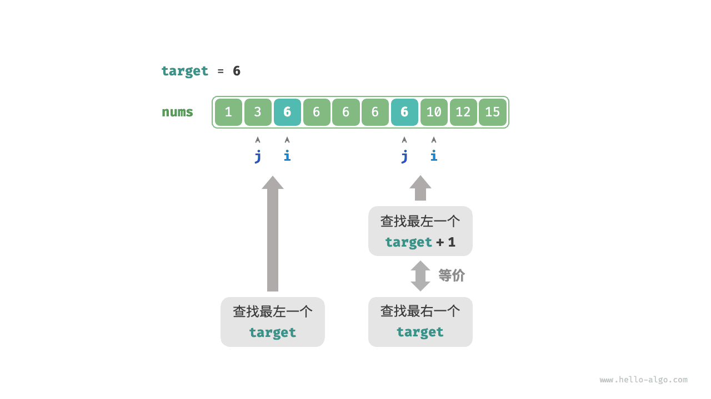
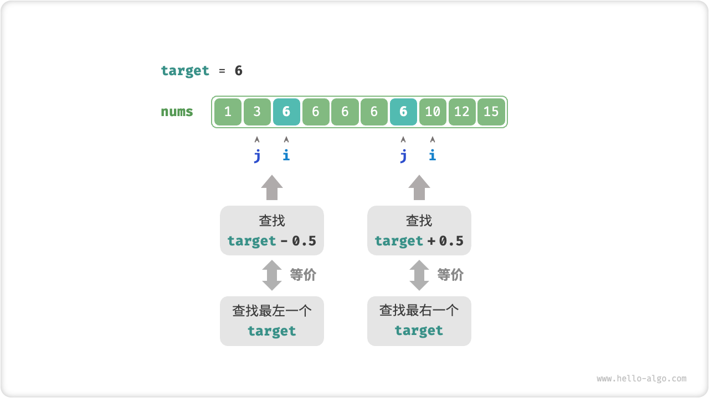

# 二分查找边界

## 查找左边界

!!! question

    给定一个长度为 $n$ 的有序数组 `nums` ，其中可能包含重复元素。请返回数组中最左一个元素 `target` 的索引。若数组中不包含该元素，则返回 $-1$ 。

回忆二分查找插入点的方法，搜索完成后 $i$ 指向最左一个 `target` ，**因此查找插入点本质上是在查找最左一个 `target` 的索引**。

考虑通过查找插入点的函数实现查找左边界。请注意，数组中可能不包含 `target` ，这种情况可能导致以下两种结果。

- 插入点的索引 $i$ 越界。
- 元素 `nums[i]` 与 `target` 不相等。

当遇到以上两种情况时，直接返回 $-1$ 即可。代码如下所示：

```src
[file]{binary_search_edge}-[class]{}-[func]{binary_search_left_edge}
```

## 查找右边界

那么如何查找最右一个 `target` 呢？最直接的方式是修改代码，替换在 `nums[m] == target` 情况下的指针收缩操作。代码在此省略，有兴趣的读者可以自行实现。

下面我们介绍两种更加取巧的方法。

### 复用查找左边界

实际上，我们可以利用查找最左元素的函数来查找最右元素，具体方法为：**将查找最右一个 `target` 转化为查找最左一个 `target + 1`**。

如下图所示，查找完成后，指针 $i$ 指向最左一个 `target + 1`（如果存在），而 $j$ 指向最右一个 `target` ，**因此返回 $j$ 即可**。



请注意，返回的插入点是 $i$ ，因此需要将其减 $1$ ，从而获得 $j$ ：

```src
[file]{binary_search_edge}-[class]{}-[func]{binary_search_right_edge}
```

### 转化为查找元素

我们知道，当数组不包含 `target` 时，最终 $i$ 和 $j$ 会分别指向首个大于、小于 `target` 的元素。

因此，如下图所示，我们可以构造一个数组中不存在的元素，用于查找左右边界。

- 查找最左一个 `target` ：可以转化为查找 `target - 0.5` ，并返回指针 $i$ 。
- 查找最右一个 `target` ：可以转化为查找 `target + 0.5` ，并返回指针 $j$ 。



代码在此省略，以下两点值得注意。

- 给定数组不包含小数，这意味着我们无须关心如何处理相等的情况。
- 因为该方法引入了小数，所以需要将函数中的变量 `target` 改为浮点数类型（Python 无须改动）。
