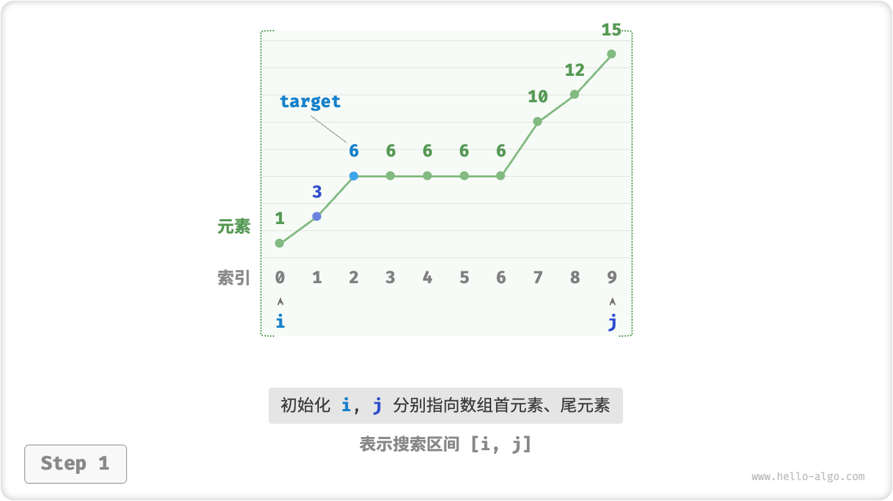
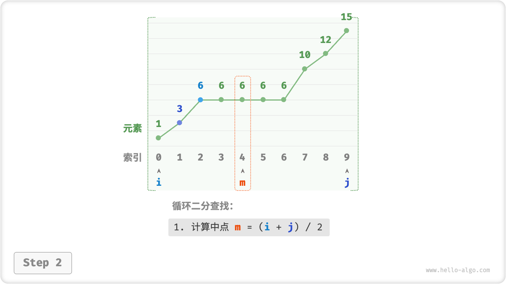
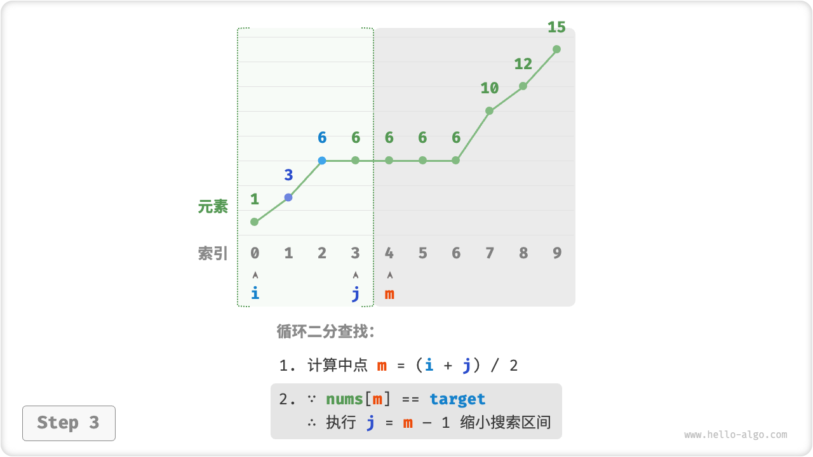
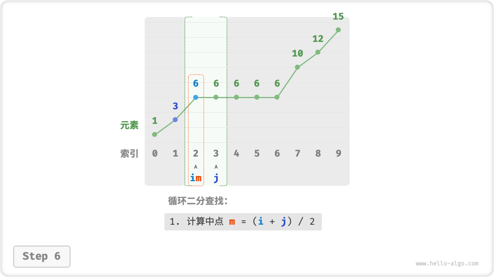
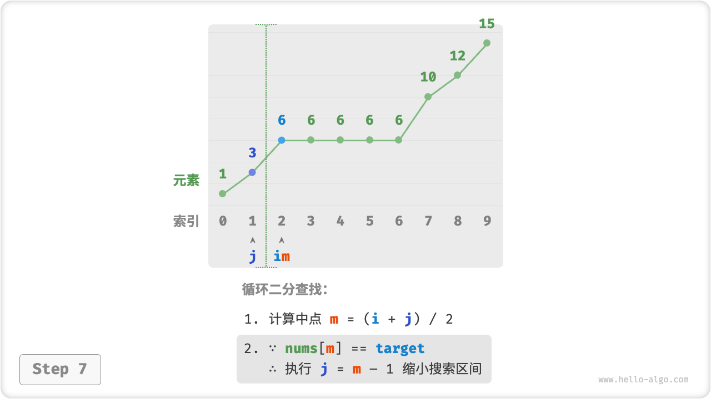
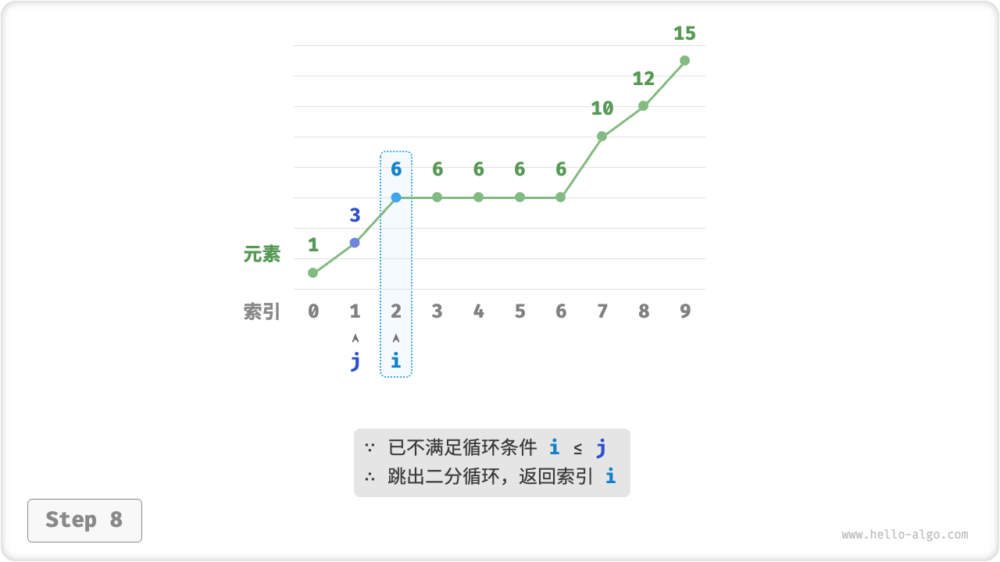
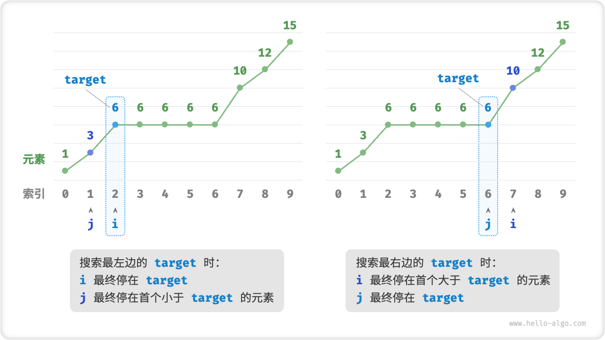

# 二分查找边界

在上一节中，题目规定数组中所有元素都是唯一的。如果目标元素在数组中多次出现，上节介绍的方法只能保证返回其中一个目标元素的索引，**而无法确定该索引的左边和右边还有多少目标元素**。

!!! question

    给定一个长度为 $n$ 的有序数组 `nums` ，数组可能包含重复元素。请查找并返回元素 `target` 在数组中首次出现的索引。若数组中不包含该元素，则返回 $-1$ 。

## 线性方法

为了查找数组中最左边的 `target` ，我们可以分为两步：

1. 进行二分查找，定位到任意一个 `target` 的索引，记为 $k$ ；
2. 以索引 $k$ 为起始点，向左进行线性遍历，找到最左边的 `target` 返回即可。


这个方法虽然有效，但由于包含线性查找，时间复杂度为 $O(n)$ ，当存在很多重复的 `target` 时效率较低。

## 二分方法

考虑仅使用二分查找解决该问题。整体算法流程不变，先计算中点索引 $m$ ，再判断 `target` 和 `nums[m]` 大小关系：

- 当 `nums[m] < target` 或 `nums[m] > target` 时，说明还没有找到 `target` ，因此采取与上节代码相同的缩小区间操作，**从而使指针 $i$ 和 $j$ 向 `target` 靠近**。
- 当 `nums[m] == target` 时，说明“小于 `target` 的元素”在区间 $[i, m - 1]$ 中，因此采用 $j = m - 1$ 来缩小区间，**从而使指针 $j$ 向小于 `target` 的元素靠近**。

二分查找完成后，**$i$ 指向最左边的 `target` ，$j$ 指向首个小于 `target` 的元素**，因此返回索引 $i$ 即可。

=== "<1>"
    

=== "<2>"
    

=== "<3>"
    

=== "<4>"
    

=== "<5>"
    

=== "<6>"
    

=== "<7>"
    

=== "<8>"
    

注意，数组可能不包含目标元素 `target` 。因此在函数返回前，我们需要先判断 `nums[i]` 与 `target` 是否相等，以及索引 $i$ 是否越界。

=== "Java"

    ```java title="binary_search_edge.java"
    [class]{binary_search_edge}-[func]{binarySearchLeftEdge}
    ```

=== "C++"

    ```cpp title="binary_search_edge.cpp"
    [class]{}-[func]{binarySearchLeftEdge}
    ```

=== "Python"

    ```python title="binary_search_edge.py"
    [class]{}-[func]{binary_search_left_edge}
    ```

=== "Go"

    ```go title="binary_search_edge.go"
    [class]{}-[func]{binarySearchLeftEdge}
    ```

=== "JavaScript"

    ```javascript title="binary_search_edge.js"
    [class]{}-[func]{binarySearchLeftEdge}
    ```

=== "TypeScript"

    ```typescript title="binary_search_edge.ts"
    [class]{}-[func]{binarySearchLeftEdge}
    ```

=== "C"

    ```c title="binary_search_edge.c"
    [class]{}-[func]{binarySearchLeftEdge}
    ```

=== "C#"

    ```csharp title="binary_search_edge.cs"
    [class]{binary_search_edge}-[func]{binarySearchLeftEdge}
    ```

=== "Swift"

    ```swift title="binary_search_edge.swift"
    [class]{}-[func]{binarySearchLeftEdge}
    ```

=== "Zig"

    ```zig title="binary_search_edge.zig"
    [class]{}-[func]{binarySearchLeftEdge}
    ```

=== "Dart"

    ```dart title="binary_search_edge.dart"
    [class]{}-[func]{binarySearchLeftEdge}
    ```

## 查找右边界

类似地，我们也可以二分查找最右边的 `target` 。当 `nums[m] == target` 时，说明大于 `target` 的元素在区间 $[m + 1, j]$ 中，因此执行 `i = m + 1` ，**使得指针 $i$ 向大于 `target` 的元素靠近**。

完成二分后，**$i$ 指向首个大于 `target` 的元素，$j$ 指向最右边的 `target`** ，因此返回索引 $j$ 即可。

=== "Java"

    ```java title="binary_search_edge.java"
    [class]{binary_search_edge}-[func]{binarySearchRightEdge}
    ```

=== "C++"

    ```cpp title="binary_search_edge.cpp"
    [class]{}-[func]{binarySearchRightEdge}
    ```

=== "Python"

    ```python title="binary_search_edge.py"
    [class]{}-[func]{binary_search_right_edge}
    ```

=== "Go"

    ```go title="binary_search_edge.go"
    [class]{}-[func]{binarySearchRightEdge}
    ```

=== "JavaScript"

    ```javascript title="binary_search_edge.js"
    [class]{}-[func]{binarySearchRightEdge}
    ```

=== "TypeScript"

    ```typescript title="binary_search_edge.ts"
    [class]{}-[func]{binarySearchRightEdge}
    ```

=== "C"

    ```c title="binary_search_edge.c"
    [class]{}-[func]{binarySearchRightEdge}
    ```

=== "C#"

    ```csharp title="binary_search_edge.cs"
    [class]{binary_search_edge}-[func]{binarySearchRightEdge}
    ```

=== "Swift"

    ```swift title="binary_search_edge.swift"
    [class]{}-[func]{binarySearchRightEdge}
    ```

=== "Zig"

    ```zig title="binary_search_edge.zig"
    [class]{}-[func]{binarySearchRightEdge}
    ```

=== "Dart"

    ```dart title="binary_search_edge.dart"
    [class]{}-[func]{binarySearchRightEdge}
    ```

观察下图，搜索最右边元素时指针 $j$ 的作用与搜索最左边元素时指针 $i$ 的作用一致，反之亦然。也就是说，**搜索最左边元素和最右边元素的实现是镜像对称的**。



!!! tip

    以上代码采取的都是“双闭区间”写法。有兴趣的读者可以自行实现“左闭右开”写法。
