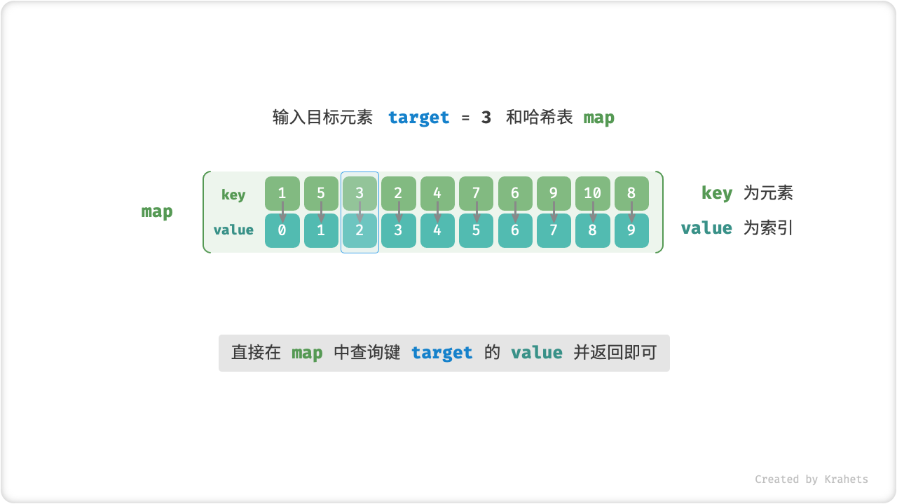
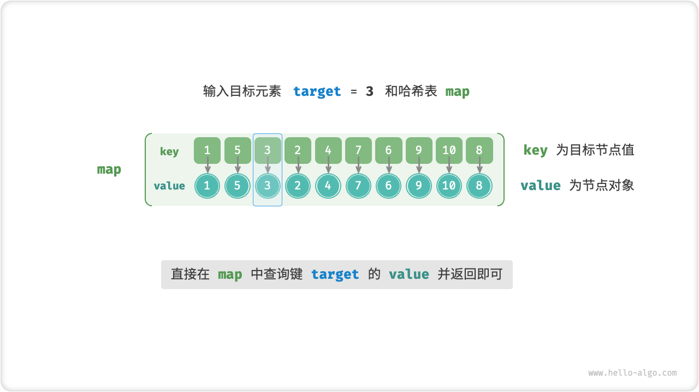

# 哈希查找

!!! question

    在数据量很大时，「线性查找」太慢；而「二分查找」要求数据必须是有序的，并且只能在数组中应用。那么是否有方法可以同时避免上述缺点呢？答案是肯定的，此方法被称为「哈希查找」。

「哈希查找 Hash Searching」借助一个哈希表来存储需要的「键值对 Key Value Pair」，我们可以在 $O(1)$ 时间下实现 “键 $\rightarrow$ 值” 映射查找，体现着 “以空间换时间” 的算法思想。

## 算法实现

如果我们想要给定数组中的一个目标元素 `target` ，获取该元素的索引，那么可以借助一个哈希表实现查找。



=== "Java"

    ```java title="hashing_search.java"
    /* 哈希查找（数组） */
    int hashingSearch(Map<Integer, Integer> map, int target) {
        // 哈希表的 key: 目标元素，value: 索引
        // 若哈希表中无此 key ，返回 -1
        return map.getOrDefault(target, -1);
    }
    ```

=== "C++"

    ```cpp title="hashing_search.cpp"
    /* 哈希查找（数组） */
    int hashingSearch(unordered_map<int, int> map, int target) {
        // 哈希表的 key: 目标元素，value: 索引
        // 若哈希表中无此 key ，返回 -1
        if (map.find(target) == map.end())
            return -1;
        return map[target];
    }
    ```

再比如，如果我们想要给定一个目标结点值 `target` ，获取对应的链表结点对象，那么也可以使用哈希查找实现。



=== "Java"

    ```java title="hashing_search.java"
    /* 哈希查找（链表） */
    ListNode hashingSearch1(Map<Integer, ListNode> map, int target) {
        // 哈希表的 key: 目标结点值，value: 结点对象
        // 若哈希表中无此 key ，返回 null
        return map.getOrDefault(target, null);
    }
    ```

=== "C++"

    ```cpp title="hashing_search.cpp"
    /* 哈希查找（链表） */
    ListNode* hashingSearch1(unordered_map<int, ListNode*> map, int target) {
        // 哈希表的 key: 目标结点值，value: 结点对象
        // 若哈希表中无此 key ，返回 nullptr
        if (map.find(target) == map.end())
            return nullptr;
        return map[target];
    }
    ```

## 复杂度分析

**时间复杂度：** $O(1)$ ，哈希表的查找操作使用 $O(1)$ 时间。

**空间复杂度：** $O(n)$ ，其中 $n$ 为数组或链表长度。

## 优缺点

在哈希表中，**查找、插入、删除操作的平均时间复杂度都为 $O(1)$** ，这意味着无论是高频增删还是高频查找场景，哈希查找的性能表现都非常好。当然，一切的前提是保证哈希表未退化。

即使如此，哈希查找仍存在一些问题，在实际应用中，需要根据情况灵活选择方法。

- 辅助哈希表 **需要使用 $O(n)$ 的额外空间**，意味着需要预留更多的计算机内存；
- 建立和维护哈希表需要时间，因此哈希查找 **不适合高频增删、低频查找的使用场景**；
- 当哈希冲突严重时，哈希表会退化为链表，**时间复杂度劣化至 $O(n)$** ；
- **当数据量很小时，线性查找比哈希查找更快**。这是因为计算哈希映射函数可能比遍历一个小型数组更慢；
