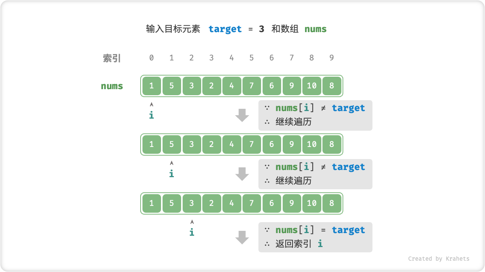

# 线性查找

「线性查找 Linear Search」是一种最基础的查找方法，其从数据结构的一端开始，依次访问每个元素，直到另一端后停止。

## 算法实现

线性查找实质上就是遍历数据结构 + 判断条件。比如，我们想要在数组 `nums` 中查找目标元素 `target` 的对应索引，那么可以在数组中进行线性查找。



=== "Java"

    ```java title="linear_search.java"
    /* 线性查找（数组） */
    int linearSearch(int[] nums, int target) {
        // 遍历数组
        for (int i = 0; i < nums.length; i++) {
            // 找到目标元素，返回其索引
            if (nums[i] == target)
                return i;
        }
        // 未找到目标元素，返回 -1
        return -1;
    }
    ```

=== "C++"

    ```cpp title="linear_search.cpp"
    /* 线性查找（数组） */
    int linearSearch(vector<int>& nums, int target) {
        // 遍历数组
        for (int i = 0; i < nums.size(); i++) {
            // 找到目标元素，返回其索引
            if (nums[i] == target)
                return i;
        }
        // 未找到目标元素，返回 -1
        return -1;
    }
    ```

再比如，我们想要在给定一个目标结点值 `target` ，返回此结点对象，也可以在链表中进行线性查找。

=== "Java"

    ```java title="linear_search.java"
    /* 线性查找（链表） */
    ListNode linearSearch(ListNode head, int target) {
        // 遍历链表
        while (head != null) {
            // 找到目标结点，返回之
            if (head.val == target)
                return head;
            head = head.next;
        }
        // 未找到目标结点，返回 null
        return null;
    }
    ```

=== "C++"

    ```cpp title="linear_search.cpp"
    /* 线性查找（链表） */
    ListNode* linearSearch(ListNode* head, int target) {
        // 遍历链表
        while (head != nullptr) {
            // 找到目标结点，返回之
            if (head->val == target)
                return head;
            head = head->next;
        }
        // 未找到目标结点，返回 nullptr
        return nullptr;
    }
    ```

## 复杂度分析

**时间复杂度 $O(n)$ ：** 其中 $n$ 为数组或链表长度。

**空间复杂度 $O(1)$ ：** 无需使用额外空间。

## 优缺点

**线性查找的通用性极佳。** 由于线性查找是依次访问元素的，即没有跳跃访问元素，因此数组或链表皆适用。

**线性查找的时间复杂度太高。** 在数据量 $n$ 很大时，查找效率很低。
