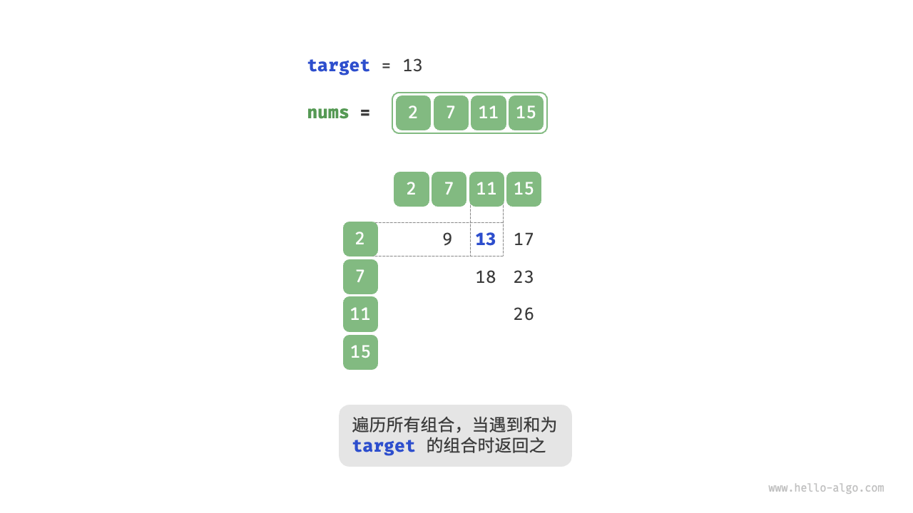
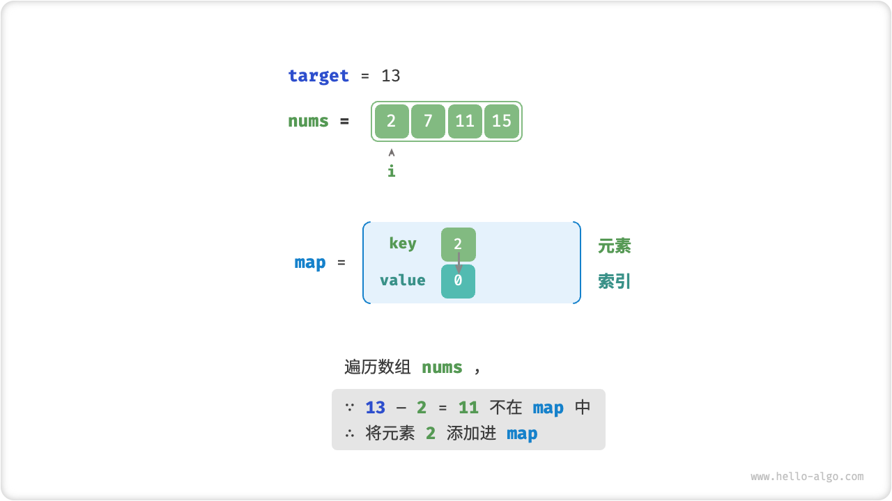
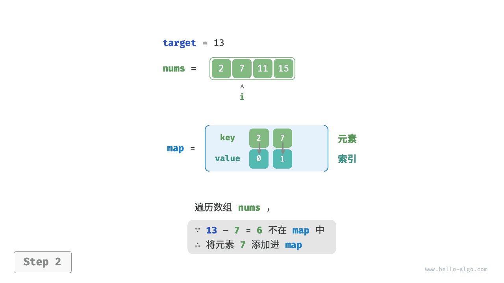
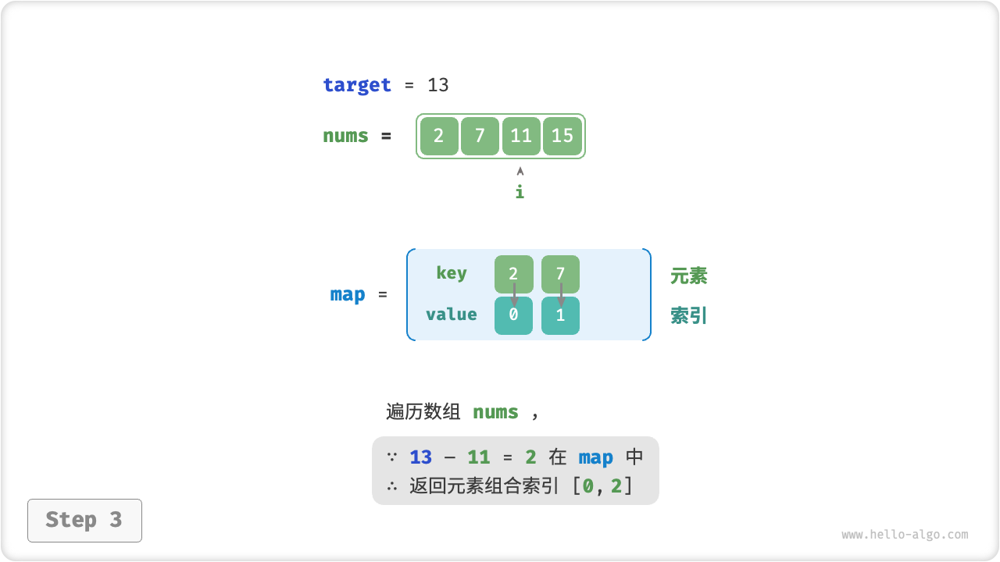

# 10.4 &nbsp; 哈希优化策略

在算法题中，**我们常通过将线性查找替换为哈希查找来降低算法的时间复杂度**。我们借助一个算法题来加深理解。

!!! question

    给定一个整数数组 `nums` 和一个目标元素 `target` ，请在数组中搜索“和”为 `target` 的两个元素，并返回它们的数组索引。返回任意一个解即可。

## 10.4.1 &nbsp; 线性查找：以时间换空间

考虑直接遍历所有可能的组合。如图 10-9 所示，我们开启一个两层循环，在每轮中判断两个整数的和是否为 `target` ，若是，则返回它们的索引。

{ class="animation-figure" }

<p align="center"> 图 10-9 &nbsp; 线性查找求解两数之和 </p>

代码如下所示：

=== "Python"

    ```python title="two_sum.py"
    def two_sum_brute_force(nums: list[int], target: int) -> list[int]:
        """方法一：暴力枚举"""
        # 两层循环，时间复杂度为 O(n^2)
        for i in range(len(nums) - 1):
            for j in range(i + 1, len(nums)):
                if nums[i] + nums[j] == target:
                    return [i, j]
        return []
    ```

=== "C++"

    ```cpp title="two_sum.cpp"
    /* 方法一：暴力枚举 */
    vector<int> twoSumBruteForce(vector<int> &nums, int target) {
        int size = nums.size();
        // 两层循环，时间复杂度为 O(n^2)
        for (int i = 0; i < size - 1; i++) {
            for (int j = i + 1; j < size; j++) {
                if (nums[i] + nums[j] == target)
                    return {i, j};
            }
        }
        return {};
    }
    ```

=== "Java"

    ```java title="two_sum.java"
    /* 方法一：暴力枚举 */
    int[] twoSumBruteForce(int[] nums, int target) {
        int size = nums.length;
        // 两层循环，时间复杂度为 O(n^2)
        for (int i = 0; i < size - 1; i++) {
            for (int j = i + 1; j < size; j++) {
                if (nums[i] + nums[j] == target)
                    return new int[] { i, j };
            }
        }
        return new int[0];
    }
    ```

=== "C#"

    ```csharp title="two_sum.cs"
    /* 方法一：暴力枚举 */
    int[] TwoSumBruteForce(int[] nums, int target) {
        int size = nums.Length;
        // 两层循环，时间复杂度为 O(n^2)
        for (int i = 0; i < size - 1; i++) {
            for (int j = i + 1; j < size; j++) {
                if (nums[i] + nums[j] == target)
                    return [i, j];
            }
        }
        return [];
    }
    ```

=== "Go"

    ```go title="two_sum.go"
    /* 方法一：暴力枚举 */
    func twoSumBruteForce(nums []int, target int) []int {
        size := len(nums)
        // 两层循环，时间复杂度为 O(n^2)
        for i := 0; i < size-1; i++ {
            for j := i + 1; i < size; j++ {
                if nums[i]+nums[j] == target {
                    return []int{i, j}
                }
            }
        }
        return nil
    }
    ```

=== "Swift"

    ```swift title="two_sum.swift"
    /* 方法一：暴力枚举 */
    func twoSumBruteForce(nums: [Int], target: Int) -> [Int] {
        // 两层循环，时间复杂度为 O(n^2)
        for i in nums.indices.dropLast() {
            for j in nums.indices.dropFirst(i + 1) {
                if nums[i] + nums[j] == target {
                    return [i, j]
                }
            }
        }
        return [0]
    }
    ```

=== "JS"

    ```javascript title="two_sum.js"
    /* 方法一：暴力枚举 */
    function twoSumBruteForce(nums, target) {
        const n = nums.length;
        // 两层循环，时间复杂度为 O(n^2)
        for (let i = 0; i < n; i++) {
            for (let j = i + 1; j < n; j++) {
                if (nums[i] + nums[j] === target) {
                    return [i, j];
                }
            }
        }
        return [];
    }
    ```

=== "TS"

    ```typescript title="two_sum.ts"
    /* 方法一：暴力枚举 */
    function twoSumBruteForce(nums: number[], target: number): number[] {
        const n = nums.length;
        // 两层循环，时间复杂度为 O(n^2)
        for (let i = 0; i < n; i++) {
            for (let j = i + 1; j < n; j++) {
                if (nums[i] + nums[j] === target) {
                    return [i, j];
                }
            }
        }
        return [];
    }
    ```

=== "Dart"

    ```dart title="two_sum.dart"
    /* 方法一： 暴力枚举 */
    List<int> twoSumBruteForce(List<int> nums, int target) {
      int size = nums.length;
      // 两层循环，时间复杂度为 O(n^2)
      for (var i = 0; i < size - 1; i++) {
        for (var j = i + 1; j < size; j++) {
          if (nums[i] + nums[j] == target) return [i, j];
        }
      }
      return [0];
    }
    ```

=== "Rust"

    ```rust title="two_sum.rs"
    /* 方法一：暴力枚举 */
    pub fn two_sum_brute_force(nums: &Vec<i32>, target: i32) -> Option<Vec<i32>> {
        let size = nums.len();
        // 两层循环，时间复杂度为 O(n^2)
        for i in 0..size - 1 {
            for j in i + 1..size {
                if nums[i] + nums[j] == target {
                    return Some(vec![i as i32, j as i32]);
                }
            }
        }
        None
    }
    ```

=== "C"

    ```c title="two_sum.c"
    /* 方法一：暴力枚举 */
    int *twoSumBruteForce(int *nums, int numsSize, int target, int *returnSize) {
        for (int i = 0; i < numsSize; ++i) {
            for (int j = i + 1; j < numsSize; ++j) {
                if (nums[i] + nums[j] == target) {
                    int *res = malloc(sizeof(int) * 2);
                    res[0] = i, res[1] = j;
                    *returnSize = 2;
                    return res;
                }
            }
        }
        *returnSize = 0;
        return NULL;
    }
    ```

=== "Zig"

    ```zig title="two_sum.zig"
    // 方法一：暴力枚举
    fn twoSumBruteForce(nums: []i32, target: i32) ?[2]i32 {
        var size: usize = nums.len;
        var i: usize = 0;
        // 两层循环，时间复杂度为 O(n^2)
        while (i < size - 1) : (i += 1) {
            var j = i + 1;
            while (j < size) : (j += 1) {
                if (nums[i] + nums[j] == target) {
                    return [_]i32{@intCast(i), @intCast(j)};
                }
            }
        }
        return null;
    }
    ```

??? pythontutor "可视化运行"

    <div style="height: 560px; width: 100%;"><iframe class="pythontutor-iframe" src="https://pythontutor.com/iframe-embed.html#code=def%20two_sum_brute_force%28nums%3A%20list%5Bint%5D,%20target%3A%20int%29%20-%3E%20list%5Bint%5D%3A%0A%20%20%20%20%22%22%22%E6%96%B9%E6%B3%95%E4%B8%80%EF%BC%9A%E6%9A%B4%E5%8A%9B%E6%9E%9A%E4%B8%BE%22%22%22%0A%20%20%20%20%23%20%E4%B8%A4%E5%B1%82%E5%BE%AA%E7%8E%AF%EF%BC%8C%E6%97%B6%E9%97%B4%E5%A4%8D%E6%9D%82%E5%BA%A6%E4%B8%BA%20O%28n%5E2%29%0A%20%20%20%20for%20i%20in%20range%28len%28nums%29%20-%201%29%3A%0A%20%20%20%20%20%20%20%20for%20j%20in%20range%28i%20%2B%201,%20len%28nums%29%29%3A%0A%20%20%20%20%20%20%20%20%20%20%20%20if%20nums%5Bi%5D%20%2B%20nums%5Bj%5D%20%3D%3D%20target%3A%0A%20%20%20%20%20%20%20%20%20%20%20%20%20%20%20%20return%20%5Bi,%20j%5D%0A%20%20%20%20return%20%5B%5D%0A%0A%22%22%22Driver%20Code%22%22%22%0Aif%20__name__%20%3D%3D%20%22__main__%22%3A%0A%20%20%20%20nums%20%3D%20%5B2,%207,%2011,%2015%5D%0A%20%20%20%20target%20%3D%2013%0A%20%20%20%20res%20%3D%20two_sum_brute_force%28nums,%20target%29&codeDivHeight=470&codeDivWidth=350&cumulative=false&curInstr=5&heapPrimitives=nevernest&origin=opt-frontend.js&py=311&rawInputLstJSON=%5B%5D&textReferences=false"> </iframe></div>
    <a href="https://pythontutor.com/iframe-embed.html#code=def%20two_sum_brute_force%28nums%3A%20list%5Bint%5D,%20target%3A%20int%29%20-%3E%20list%5Bint%5D%3A%0A%20%20%20%20%22%22%22%E6%96%B9%E6%B3%95%E4%B8%80%EF%BC%9A%E6%9A%B4%E5%8A%9B%E6%9E%9A%E4%B8%BE%22%22%22%0A%20%20%20%20%23%20%E4%B8%A4%E5%B1%82%E5%BE%AA%E7%8E%AF%EF%BC%8C%E6%97%B6%E9%97%B4%E5%A4%8D%E6%9D%82%E5%BA%A6%E4%B8%BA%20O%28n%5E2%29%0A%20%20%20%20for%20i%20in%20range%28len%28nums%29%20-%201%29%3A%0A%20%20%20%20%20%20%20%20for%20j%20in%20range%28i%20%2B%201,%20len%28nums%29%29%3A%0A%20%20%20%20%20%20%20%20%20%20%20%20if%20nums%5Bi%5D%20%2B%20nums%5Bj%5D%20%3D%3D%20target%3A%0A%20%20%20%20%20%20%20%20%20%20%20%20%20%20%20%20return%20%5Bi,%20j%5D%0A%20%20%20%20return%20%5B%5D%0A%0A%22%22%22Driver%20Code%22%22%22%0Aif%20__name__%20%3D%3D%20%22__main__%22%3A%0A%20%20%20%20nums%20%3D%20%5B2,%207,%2011,%2015%5D%0A%20%20%20%20target%20%3D%2013%0A%20%20%20%20res%20%3D%20two_sum_brute_force%28nums,%20target%29&codeDivHeight=470&codeDivWidth=350&cumulative=false&curInstr=5&heapPrimitives=nevernest&origin=opt-frontend.js&py=311&rawInputLstJSON=%5B%5D&textReferences=false" target="_blank" rel="noopener noreferrer">全屏观看 ></a>

此方法的时间复杂度为 $O(n^2)$ ，空间复杂度为 $O(1)$ ，在大数据量下非常耗时。

## 10.4.2 &nbsp; 哈希查找：以空间换时间

考虑借助一个哈希表，键值对分别为数组元素和元素索引。循环遍历数组，每轮执行图 10-10 所示的步骤。

1. 判断数字 `target - nums[i]` 是否在哈希表中，若是，则直接返回这两个元素的索引。
2. 将键值对 `nums[i]` 和索引 `i` 添加进哈希表。

=== "<1>"
    { class="animation-figure" }

=== "<2>"
    { class="animation-figure" }

=== "<3>"
    { class="animation-figure" }

<p align="center"> 图 10-10 &nbsp; 辅助哈希表求解两数之和 </p>

实现代码如下所示，仅需单层循环即可：

=== "Python"

    ```python title="two_sum.py"
    def two_sum_hash_table(nums: list[int], target: int) -> list[int]:
        """方法二：辅助哈希表"""
        # 辅助哈希表，空间复杂度为 O(n)
        dic = {}
        # 单层循环，时间复杂度为 O(n)
        for i in range(len(nums)):
            if target - nums[i] in dic:
                return [dic[target - nums[i]], i]
            dic[nums[i]] = i
        return []
    ```

=== "C++"

    ```cpp title="two_sum.cpp"
    /* 方法二：辅助哈希表 */
    vector<int> twoSumHashTable(vector<int> &nums, int target) {
        int size = nums.size();
        // 辅助哈希表，空间复杂度为 O(n)
        unordered_map<int, int> dic;
        // 单层循环，时间复杂度为 O(n)
        for (int i = 0; i < size; i++) {
            if (dic.find(target - nums[i]) != dic.end()) {
                return {dic[target - nums[i]], i};
            }
            dic.emplace(nums[i], i);
        }
        return {};
    }
    ```

=== "Java"

    ```java title="two_sum.java"
    /* 方法二：辅助哈希表 */
    int[] twoSumHashTable(int[] nums, int target) {
        int size = nums.length;
        // 辅助哈希表，空间复杂度为 O(n)
        Map<Integer, Integer> dic = new HashMap<>();
        // 单层循环，时间复杂度为 O(n)
        for (int i = 0; i < size; i++) {
            if (dic.containsKey(target - nums[i])) {
                return new int[] { dic.get(target - nums[i]), i };
            }
            dic.put(nums[i], i);
        }
        return new int[0];
    }
    ```

=== "C#"

    ```csharp title="two_sum.cs"
    /* 方法二：辅助哈希表 */
    int[] TwoSumHashTable(int[] nums, int target) {
        int size = nums.Length;
        // 辅助哈希表，空间复杂度为 O(n)
        Dictionary<int, int> dic = [];
        // 单层循环，时间复杂度为 O(n)
        for (int i = 0; i < size; i++) {
            if (dic.ContainsKey(target - nums[i])) {
                return [dic[target - nums[i]], i];
            }
            dic.Add(nums[i], i);
        }
        return [];
    }
    ```

=== "Go"

    ```go title="two_sum.go"
    /* 方法二：辅助哈希表 */
    func twoSumHashTable(nums []int, target int) []int {
        // 辅助哈希表，空间复杂度为 O(n)
        hashTable := map[int]int{}
        // 单层循环，时间复杂度为 O(n)
        for idx, val := range nums {
            if preIdx, ok := hashTable[target-val]; ok {
                return []int{preIdx, idx}
            }
            hashTable[val] = idx
        }
        return nil
    }
    ```

=== "Swift"

    ```swift title="two_sum.swift"
    /* 方法二：辅助哈希表 */
    func twoSumHashTable(nums: [Int], target: Int) -> [Int] {
        // 辅助哈希表，空间复杂度为 O(n)
        var dic: [Int: Int] = [:]
        // 单层循环，时间复杂度为 O(n)
        for i in nums.indices {
            if let j = dic[target - nums[i]] {
                return [j, i]
            }
            dic[nums[i]] = i
        }
        return [0]
    }
    ```

=== "JS"

    ```javascript title="two_sum.js"
    /* 方法二：辅助哈希表 */
    function twoSumHashTable(nums, target) {
        // 辅助哈希表，空间复杂度为 O(n)
        let m = {};
        // 单层循环，时间复杂度为 O(n)
        for (let i = 0; i < nums.length; i++) {
            if (m[target - nums[i]] !== undefined) {
                return [m[target - nums[i]], i];
            } else {
                m[nums[i]] = i;
            }
        }
        return [];
    }
    ```

=== "TS"

    ```typescript title="two_sum.ts"
    /* 方法二：辅助哈希表 */
    function twoSumHashTable(nums: number[], target: number): number[] {
        // 辅助哈希表，空间复杂度为 O(n)
        let m: Map<number, number> = new Map();
        // 单层循环，时间复杂度为 O(n)
        for (let i = 0; i < nums.length; i++) {
            let index = m.get(target - nums[i]);
            if (index !== undefined) {
                return [index, i];
            } else {
                m.set(nums[i], i);
            }
        }
        return [];
    }
    ```

=== "Dart"

    ```dart title="two_sum.dart"
    /* 方法二： 辅助哈希表 */
    List<int> twoSumHashTable(List<int> nums, int target) {
      int size = nums.length;
      // 辅助哈希表，空间复杂度为 O(n)
      Map<int, int> dic = HashMap();
      // 单层循环，时间复杂度为 O(n)
      for (var i = 0; i < size; i++) {
        if (dic.containsKey(target - nums[i])) {
          return [dic[target - nums[i]]!, i];
        }
        dic.putIfAbsent(nums[i], () => i);
      }
      return [0];
    }
    ```

=== "Rust"

    ```rust title="two_sum.rs"
    /* 方法二：辅助哈希表 */
    pub fn two_sum_hash_table(nums: &Vec<i32>, target: i32) -> Option<Vec<i32>> {
        // 辅助哈希表，空间复杂度为 O(n)
        let mut dic = HashMap::new();
        // 单层循环，时间复杂度为 O(n)
        for (i, num) in nums.iter().enumerate() {
            match dic.get(&(target - num)) {
                Some(v) => return Some(vec![*v as i32, i as i32]),
                None => dic.insert(num, i as i32)
            };
        }
        None
    }
    ```

=== "C"

    ```c title="two_sum.c"
    /* 哈希表 */
    typedef struct {
        int key;
        int val;
        UT_hash_handle hh; // 基于 uthash.h 实现
    } HashTable;

    /* 哈希表查询 */
    HashTable *find(HashTable *h, int key) {
        HashTable *tmp;
        HASH_FIND_INT(h, &key, tmp);
        return tmp;
    }

    /* 哈希表元素插入 */
    void insert(HashTable *h, int key, int val) {
        HashTable *t = find(h, key);
        if (t == NULL) {
            HashTable *tmp = malloc(sizeof(HashTable));
            tmp->key = key, tmp->val = val;
            HASH_ADD_INT(h, key, tmp);
        } else {
            t->val = val;
        }
    }

    /* 方法二：辅助哈希表 */
    int *twoSumHashTable(int *nums, int numsSize, int target, int *returnSize) {
        HashTable *hashtable = NULL;
        for (int i = 0; i < numsSize; i++) {
            HashTable *t = find(hashtable, target - nums[i]);
            if (t != NULL) {
                int *res = malloc(sizeof(int) * 2);
                res[0] = t->val, res[1] = i;
                *returnSize = 2;
                return res;
            }
            insert(hashtable, nums[i], i);
        }
        *returnSize = 0;
        return NULL;
    }
    ```

=== "Zig"

    ```zig title="two_sum.zig"
    // 方法二：辅助哈希表
    fn twoSumHashTable(nums: []i32, target: i32) !?[2]i32 {
        var size: usize = nums.len;
        // 辅助哈希表，空间复杂度为 O(n)
        var dic = std.AutoHashMap(i32, i32).init(std.heap.page_allocator);
        defer dic.deinit();
        var i: usize = 0;
        // 单层循环，时间复杂度为 O(n)
        while (i < size) : (i += 1) {
            if (dic.contains(target - nums[i])) {
                return [_]i32{dic.get(target - nums[i]).?, @intCast(i)};
            }
            try dic.put(nums[i], @intCast(i));
        }
        return null;
    }
    ```

??? pythontutor "可视化运行"

    <div style="height: 560px; width: 100%;"><iframe class="pythontutor-iframe" src="https://pythontutor.com/iframe-embed.html#code=def%20two_sum_hash_table%28nums%3A%20list%5Bint%5D,%20target%3A%20int%29%20-%3E%20list%5Bint%5D%3A%0A%20%20%20%20%22%22%22%E6%96%B9%E6%B3%95%E4%BA%8C%EF%BC%9A%E8%BE%85%E5%8A%A9%E5%93%88%E5%B8%8C%E8%A1%A8%22%22%22%0A%20%20%20%20%23%20%E8%BE%85%E5%8A%A9%E5%93%88%E5%B8%8C%E8%A1%A8%EF%BC%8C%E7%A9%BA%E9%97%B4%E5%A4%8D%E6%9D%82%E5%BA%A6%E4%B8%BA%20O%28n%29%0A%20%20%20%20dic%20%3D%20%7B%7D%0A%20%20%20%20%23%20%E5%8D%95%E5%B1%82%E5%BE%AA%E7%8E%AF%EF%BC%8C%E6%97%B6%E9%97%B4%E5%A4%8D%E6%9D%82%E5%BA%A6%E4%B8%BA%20O%28n%29%0A%20%20%20%20for%20i%20in%20range%28len%28nums%29%29%3A%0A%20%20%20%20%20%20%20%20if%20target%20-%20nums%5Bi%5D%20in%20dic%3A%0A%20%20%20%20%20%20%20%20%20%20%20%20return%20%5Bdic%5Btarget%20-%20nums%5Bi%5D%5D,%20i%5D%0A%20%20%20%20%20%20%20%20dic%5Bnums%5Bi%5D%5D%20%3D%20i%0A%20%20%20%20return%20%5B%5D%0A%0A%22%22%22Driver%20Code%22%22%22%0Aif%20__name__%20%3D%3D%20%22__main__%22%3A%0A%20%20%20%20nums%20%3D%20%5B2,%207,%2011,%2015%5D%0A%20%20%20%20target%20%3D%2013%0A%20%20%20%20res%20%3D%20two_sum_hash_table%28nums,%20target%29&codeDivHeight=470&codeDivWidth=350&cumulative=false&curInstr=5&heapPrimitives=nevernest&origin=opt-frontend.js&py=311&rawInputLstJSON=%5B%5D&textReferences=false"> </iframe></div>
    <a href="https://pythontutor.com/iframe-embed.html#code=def%20two_sum_hash_table%28nums%3A%20list%5Bint%5D,%20target%3A%20int%29%20-%3E%20list%5Bint%5D%3A%0A%20%20%20%20%22%22%22%E6%96%B9%E6%B3%95%E4%BA%8C%EF%BC%9A%E8%BE%85%E5%8A%A9%E5%93%88%E5%B8%8C%E8%A1%A8%22%22%22%0A%20%20%20%20%23%20%E8%BE%85%E5%8A%A9%E5%93%88%E5%B8%8C%E8%A1%A8%EF%BC%8C%E7%A9%BA%E9%97%B4%E5%A4%8D%E6%9D%82%E5%BA%A6%E4%B8%BA%20O%28n%29%0A%20%20%20%20dic%20%3D%20%7B%7D%0A%20%20%20%20%23%20%E5%8D%95%E5%B1%82%E5%BE%AA%E7%8E%AF%EF%BC%8C%E6%97%B6%E9%97%B4%E5%A4%8D%E6%9D%82%E5%BA%A6%E4%B8%BA%20O%28n%29%0A%20%20%20%20for%20i%20in%20range%28len%28nums%29%29%3A%0A%20%20%20%20%20%20%20%20if%20target%20-%20nums%5Bi%5D%20in%20dic%3A%0A%20%20%20%20%20%20%20%20%20%20%20%20return%20%5Bdic%5Btarget%20-%20nums%5Bi%5D%5D,%20i%5D%0A%20%20%20%20%20%20%20%20dic%5Bnums%5Bi%5D%5D%20%3D%20i%0A%20%20%20%20return%20%5B%5D%0A%0A%22%22%22Driver%20Code%22%22%22%0Aif%20__name__%20%3D%3D%20%22__main__%22%3A%0A%20%20%20%20nums%20%3D%20%5B2,%207,%2011,%2015%5D%0A%20%20%20%20target%20%3D%2013%0A%20%20%20%20res%20%3D%20two_sum_hash_table%28nums,%20target%29&codeDivHeight=470&codeDivWidth=350&cumulative=false&curInstr=5&heapPrimitives=nevernest&origin=opt-frontend.js&py=311&rawInputLstJSON=%5B%5D&textReferences=false" target="_blank" rel="noopener noreferrer">全屏观看 ></a>

此方法通过哈希查找将时间复杂度从 $O(n^2)$ 降至 $O(n)$ ，大幅提升运行效率。

由于需要维护一个额外的哈希表，因此空间复杂度为 $O(n)$ 。**尽管如此，该方法的整体时空效率更为均衡，因此它是本题的最优解法**。
