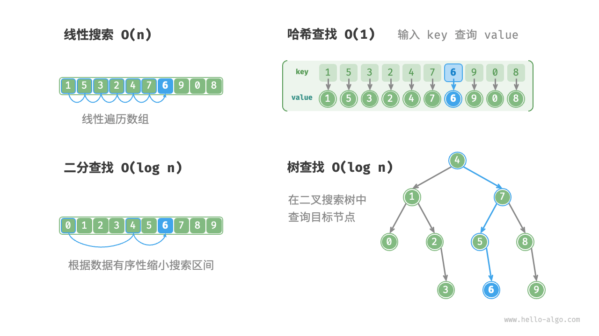

# 重识搜索算法

<u>搜索算法（searching algorithm）</u>用于在数据结构（例如数组、链表、树或图）中搜索一个或一组满足特定条件的元素。

搜索算法可根据实现思路分为以下两类。

- **通过遍历数据结构来定位目标元素**，例如数组、链表、树和图的遍历等。
- **利用数据组织结构或数据包含的先验信息，实现高效元素查找**，例如二分查找、哈希查找和二叉搜索树查找等。

不难发现，这些知识点都已在前面的章节中介绍过，因此搜索算法对于我们来说并不陌生。在本节中，我们将从更加系统的视角切入，重新审视搜索算法。

## 暴力搜索

暴力搜索通过遍历数据结构的每个元素来定位目标元素。

- “线性搜索”适用于数组和链表等线性数据结构。它从数据结构的一端开始，逐个访问元素，直到找到目标元素或到达另一端仍没有找到目标元素为止。
- “广度优先搜索”和“深度优先搜索”是图和树的两种遍历策略。广度优先搜索从初始节点开始逐层搜索，由近及远地访问各个节点。深度优先搜索从初始节点开始，沿着一条路径走到头，再回溯并尝试其他路径，直到遍历完整个数据结构。

暴力搜索的优点是简单且通用性好，**无须对数据做预处理和借助额外的数据结构**。

然而，**此类算法的时间复杂度为 $O(n)$** ，其中 $n$ 为元素数量，因此在数据量较大的情况下性能较差。

## 自适应搜索

自适应搜索利用数据的特有属性（例如有序性）来优化搜索过程，从而更高效地定位目标元素。

- “二分查找”利用数据的有序性实现高效查找，仅适用于数组。
- “哈希查找”利用哈希表将搜索数据和目标数据建立为键值对映射，从而实现查询操作。
- “树查找”在特定的树结构（例如二叉搜索树）中，基于比较节点值来快速排除节点，从而定位目标元素。

此类算法的优点是效率高，**时间复杂度可达到 $O(\log n)$ 甚至 $O(1)$** 。

然而，**使用这些算法往往需要对数据进行预处理**。例如，二分查找需要预先对数组进行排序，哈希查找和树查找都需要借助额外的数据结构，维护这些数据结构也需要额外的时间和空间开销。

!!! tip

    自适应搜索算法常被称为查找算法，**主要用于在特定数据结构中快速检索目标元素**。

## 搜索方法选取

给定大小为 $n$ 的一组数据，我们可以使用线性搜索、二分查找、树查找、哈希查找等多种方法从中搜索目标元素。各个方法的工作原理如下图所示。

上述几种方法的操作效率与特性如下表所示。

 表 <id> &nbsp; 查找算法效率对比 

|              | 线性搜索 | 二分查找           | 树查找             | 哈希查找        |
| ------------ | -------- | ------------------ | ------------------ | --------------- |
| 查找元素     | $O(n)$   | $O(\log n)$        | $O(\log n)$        | $O(1)$          |
| 插入元素     | $O(1)$   | $O(n)$             | $O(\log n)$        | $O(1)$          |
| 删除元素     | $O(n)$   | $O(n)$             | $O(\log n)$        | $O(1)$          |
| 额外空间     | $O(1)$   | $O(1)$             | $O(n)$             | $O(n)$          |
| 数据预处理   | /        | 排序 $O(n \log n)$ | 建树 $O(n \log n)$ | 建哈希表 $O(n)$ |
| 数据是否有序 | 无序     | 有序               | 有序               | 无序            |

搜索算法的选择还取决于数据体量、搜索性能要求、数据查询与更新频率等。

**线性搜索**

- 通用性较好，无须任何数据预处理操作。假如我们仅需查询一次数据，那么其他三种方法的数据预处理的时间比线性搜索的时间还要更长。
- 适用于体量较小的数据，此情况下时间复杂度对效率影响较小。
- 适用于数据更新频率较高的场景，因为该方法不需要对数据进行任何额外维护。

**二分查找**

- 适用于大数据量的情况，效率表现稳定，最差时间复杂度为 $O(\log n)$ 。
- 数据量不能过大，因为存储数组需要连续的内存空间。
- 不适用于高频增删数据的场景，因为维护有序数组的开销较大。

**哈希查找**

- 适合对查询性能要求很高的场景，平均时间复杂度为 $O(1)$ 。
- 不适合需要有序数据或范围查找的场景，因为哈希表无法维护数据的有序性。
- 对哈希函数和哈希冲突处理策略的依赖性较高，具有较大的性能劣化风险。
- 不适合数据量过大的情况，因为哈希表需要额外空间来最大程度地减少冲突，从而提供良好的查询性能。

**树查找**

- 适用于海量数据，因为树节点在内存中是分散存储的。
- 适合需要维护有序数据或范围查找的场景。
- 在持续增删节点的过程中，二叉搜索树可能产生倾斜，时间复杂度劣化至 $O(n)$ 。
- 若使用 AVL 树或红黑树，则各项操作可在 $O(\log n)$ 效率下稳定运行，但维护树平衡的操作会增加额外的开销。
