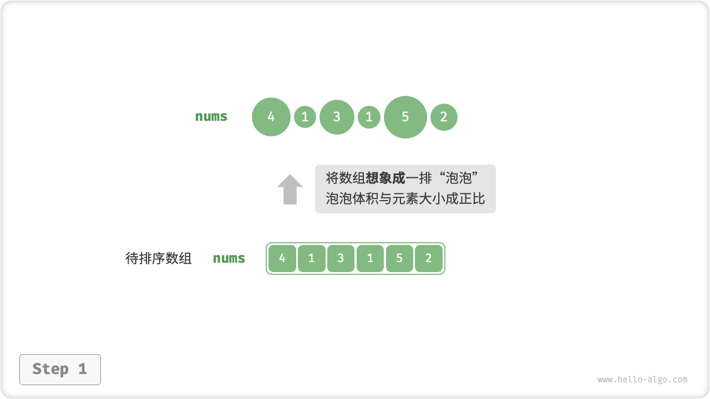
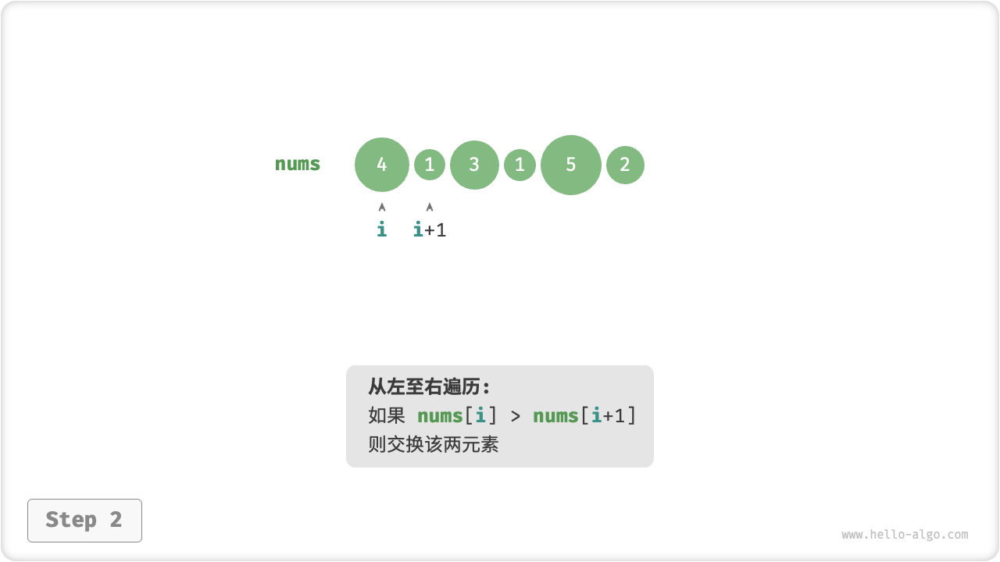
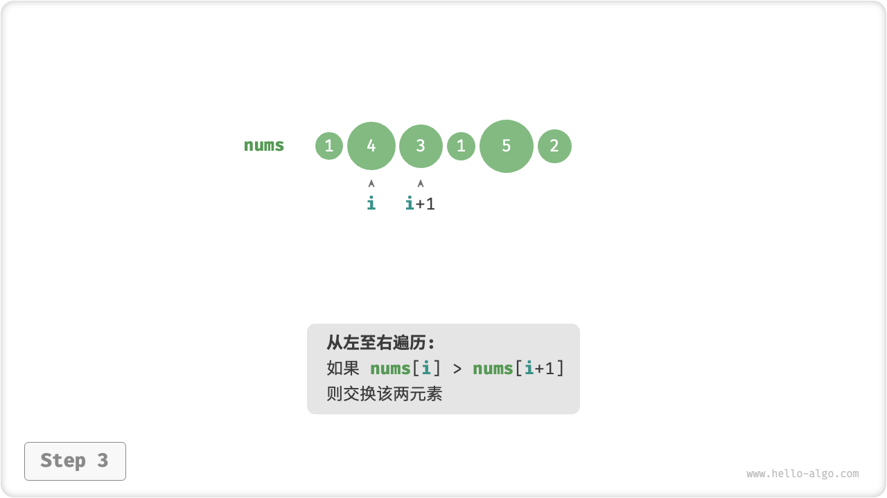
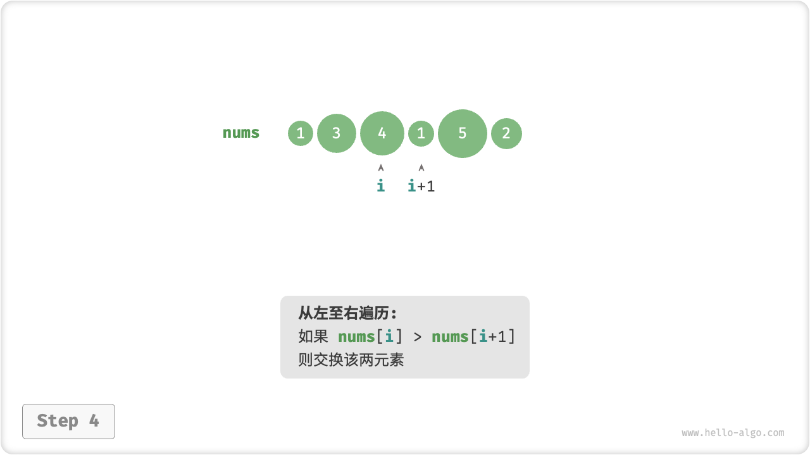
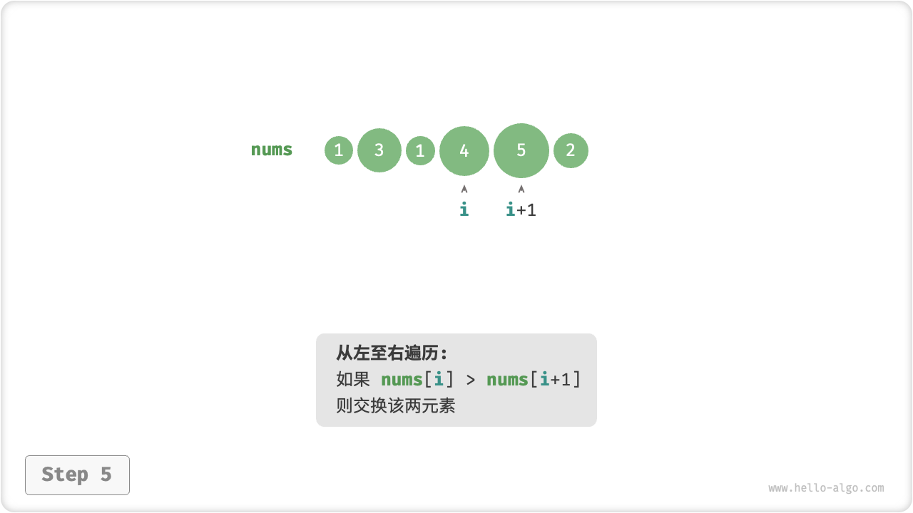
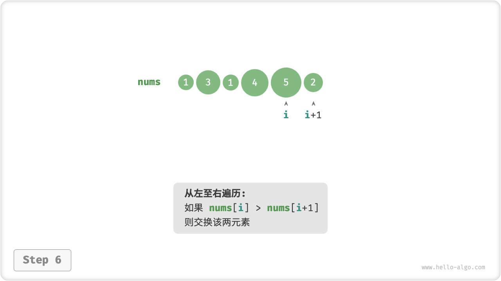
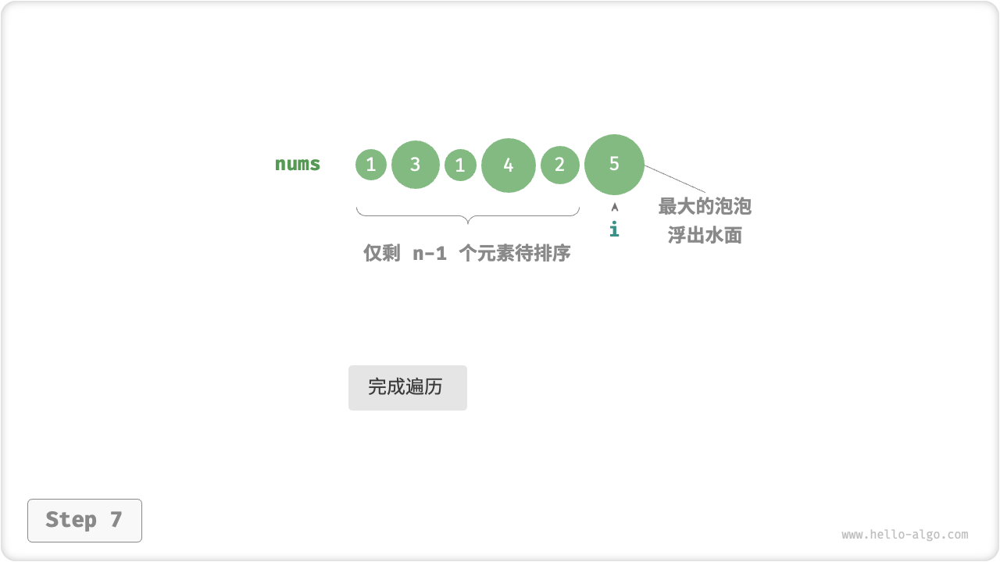
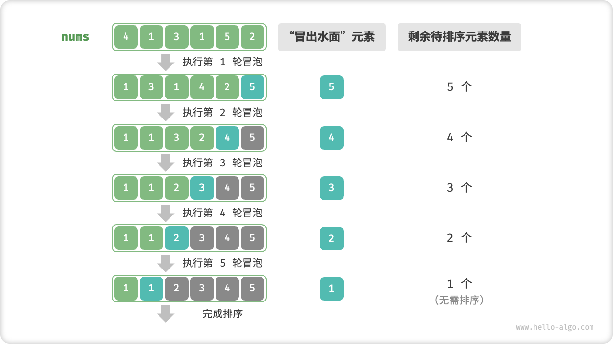

# 冒泡排序

<u>冒泡排序（bubble sort）</u>通过连续地比较与交换相邻元素实现排序。这个过程就像气泡从底部升到顶部一样，因此得名冒泡排序。

如下图所示，冒泡过程可以利用元素交换操作来模拟：从数组最左端开始向右遍历，依次比较相邻元素大小，如果“左元素 > 右元素”就交换二者。遍历完成后，最大的元素会被移动到数组的最右端。

=== "<1>"
    

=== "<2>"
    

=== "<3>"
    

=== "<4>"
    

=== "<5>"
    

=== "<6>"
    

=== "<7>"
    

## 算法流程

设数组的长度为 $n$ ，冒泡排序的步骤如下图所示。

1. 首先，对 $n$ 个元素执行“冒泡”，**将数组的最大元素交换至正确位置**。
2. 接下来，对剩余 $n - 1$ 个元素执行“冒泡”，**将第二大元素交换至正确位置**。
3. 以此类推，经过 $n - 1$ 轮“冒泡”后，**前 $n - 1$ 大的元素都被交换至正确位置**。
4. 仅剩的一个元素必定是最小元素，无须排序，因此数组排序完成。



示例代码如下：

```src
[file]{bubble_sort}-[class]{}-[func]{bubble_sort}
```

## 效率优化

我们发现，如果某轮“冒泡”中没有执行任何交换操作，说明数组已经完成排序，可直接返回结果。因此，可以增加一个标志位 `flag` 来监测这种情况，一旦出现就立即返回。

经过优化，冒泡排序的最差时间复杂度和平均时间复杂度仍为 $O(n^2)$ ；但当输入数组完全有序时，可达到最佳时间复杂度 $O(n)$ 。

```src
[file]{bubble_sort}-[class]{}-[func]{bubble_sort_with_flag}
```

## 算法特性

- **时间复杂度为 $O(n^2)$、自适应排序**：各轮“冒泡”遍历的数组长度依次为 $n - 1$、$n - 2$、$\dots$、$2$、$1$ ，总和为 $(n - 1) n / 2$ 。在引入 `flag` 优化后，最佳时间复杂度可达到 $O(n)$ 。
- **空间复杂度为 $O(1)$、原地排序**：指针 $i$ 和 $j$ 使用常数大小的额外空间。
- **稳定排序**：由于在“冒泡”中遇到相等元素不交换。
