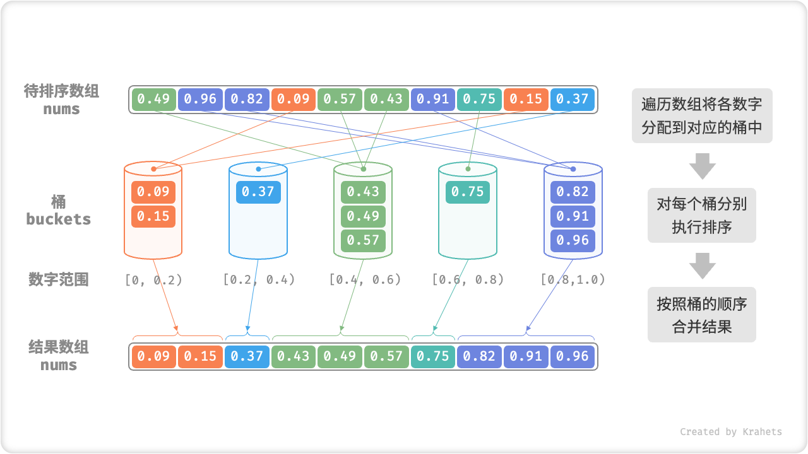
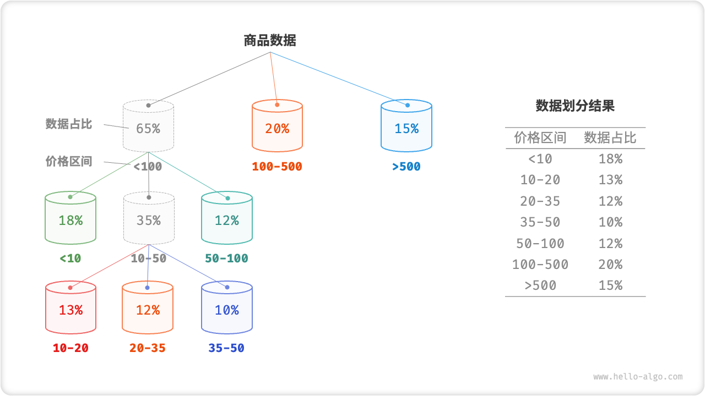
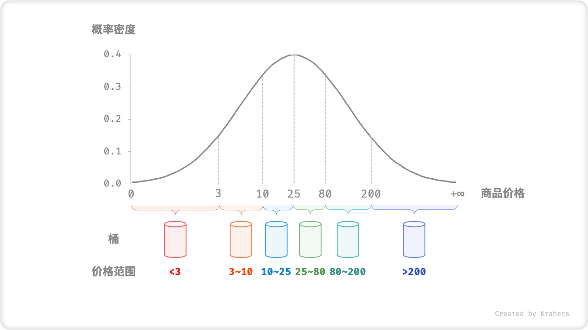

# 桶排序

前述几种排序算法都属于“基于比较的排序算法”，它们通过比较元素间的大小来实现排序。此类排序算法的时间复杂度无法超越 $O(n \log n)$ 。接下来，我们将探讨几种“非比较排序算法”，它们的时间复杂度可以达到线性阶。

<u>桶排序（bucket sort）</u>是分治策略的一个典型应用。它通过设置一些具有大小顺序的桶，每个桶对应一个数据范围，将数据平均分配到各个桶中；然后，在每个桶内部分别执行排序；最终按照桶的顺序将所有数据合并。

## 算法流程

考虑一个长度为 $n$ 的数组，其元素是范围 $[0, 1)$ 内的浮点数。桶排序的流程如下图所示。

1. 初始化 $k$ 个桶，将 $n$ 个元素分配到 $k$ 个桶中。
2. 对每个桶分别执行排序（这里采用编程语言的内置排序函数）。
3. 按照桶从小到大的顺序合并结果。



代码如下所示：

```src
[file]{bucket_sort}-[class]{}-[func]{bucket_sort}
```

## 算法特性

桶排序适用于处理体量很大的数据。例如，输入数据包含 100 万个元素，由于空间限制，系统内存无法一次性加载所有数据。此时，可以将数据分成 1000 个桶，然后分别对每个桶进行排序，最后将结果合并。

- **时间复杂度为 $O(n + k)$** ：假设元素在各个桶内平均分布，那么每个桶内的元素数量为 $\frac{n}{k}$ 。假设排序单个桶使用 $O(\frac{n}{k} \log\frac{n}{k})$ 时间，则排序所有桶使用 $O(n \log\frac{n}{k})$ 时间。**当桶数量 $k$ 比较大时，时间复杂度则趋向于 $O(n)$** 。合并结果时需要遍历所有桶和元素，花费 $O(n + k)$ 时间。
- **自适应排序**：在最差情况下，所有数据被分配到一个桶中，且排序该桶使用 $O(n^2)$ 时间。
- **空间复杂度为 $O(n + k)$、非原地排序**：需要借助 $k$ 个桶和总共 $n$ 个元素的额外空间。
- 桶排序是否稳定取决于排序桶内元素的算法是否稳定。

## 如何实现平均分配

桶排序的时间复杂度理论上可以达到 $O(n)$ ，**关键在于将元素均匀分配到各个桶中**，因为实际数据往往不是均匀分布的。例如，我们想要将淘宝上的所有商品按价格范围平均分配到 10 个桶中，但商品价格分布不均，低于 100 元的非常多，高于 1000 元的非常少。若将价格区间平均划分为 10 个，各个桶中的商品数量差距会非常大。

为实现平均分配，我们可以先设定一条大致的分界线，将数据粗略地分到 3 个桶中。**分配完毕后，再将商品较多的桶继续划分为 3 个桶，直至所有桶中的元素数量大致相等**。

如下图所示，这种方法本质上是创建一棵递归树，目标是让叶节点的值尽可能平均。当然，不一定要每轮将数据划分为 3 个桶，具体划分方式可根据数据特点灵活选择。



如果我们提前知道商品价格的概率分布，**则可以根据数据概率分布设置每个桶的价格分界线**。值得注意的是，数据分布并不一定需要特意统计，也可以根据数据特点采用某种概率模型进行近似。

如下图所示，我们假设商品价格服从正态分布，这样就可以合理地设定价格区间，从而将商品平均分配到各个桶中。


