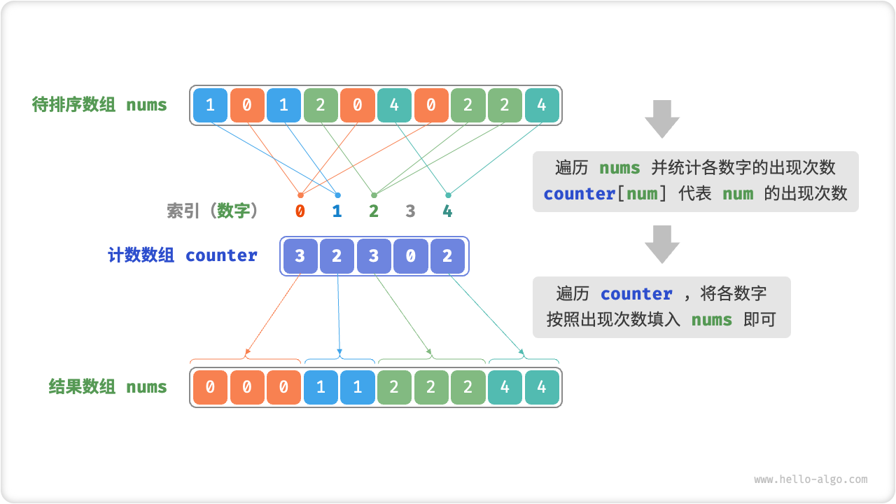
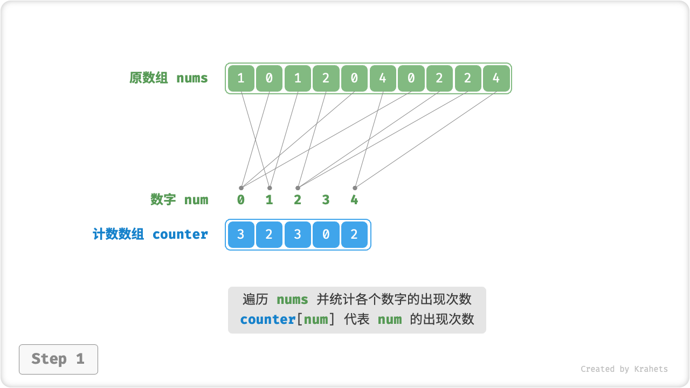
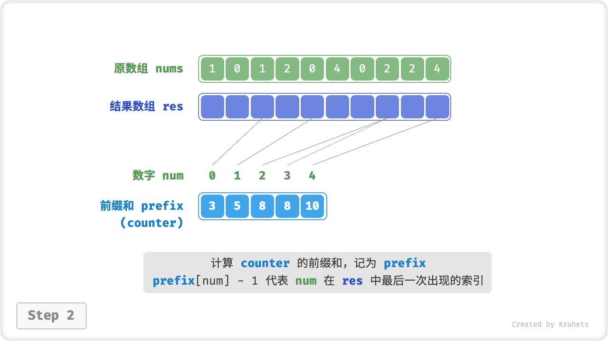
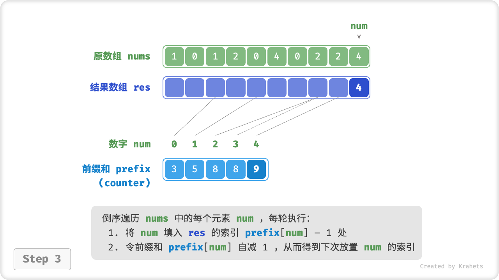
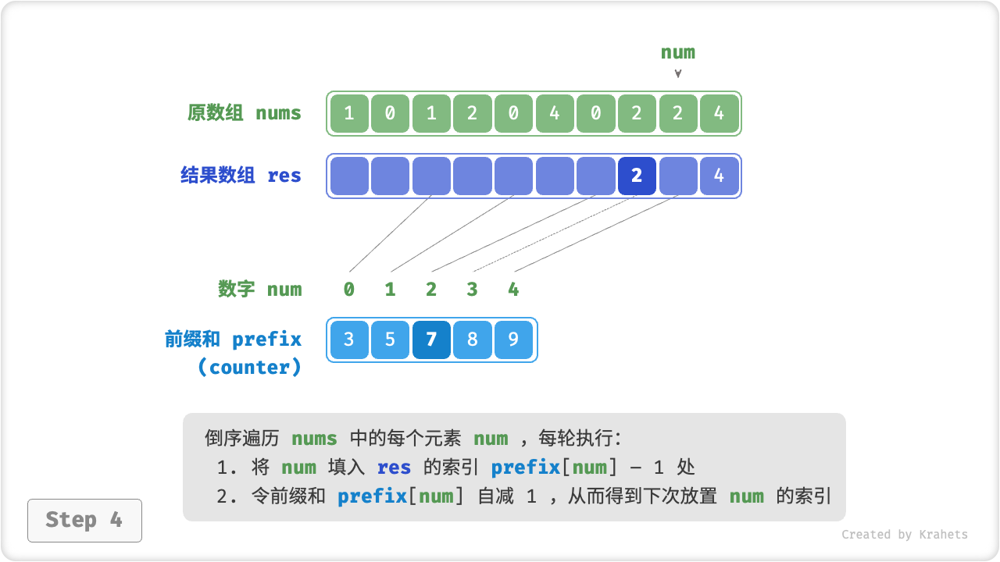
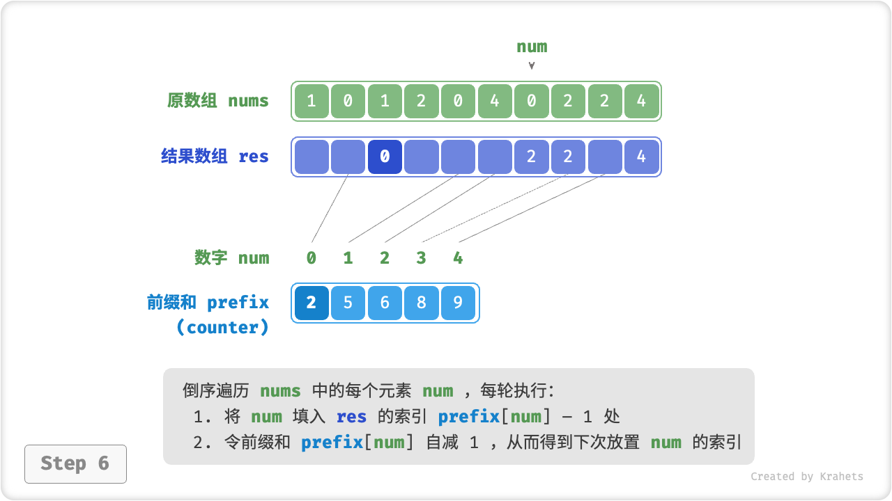
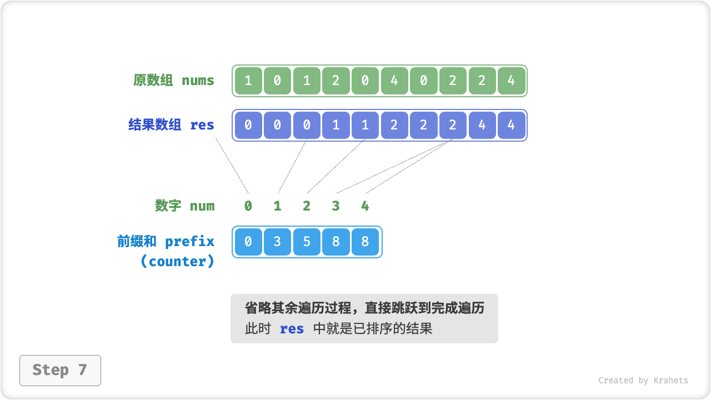
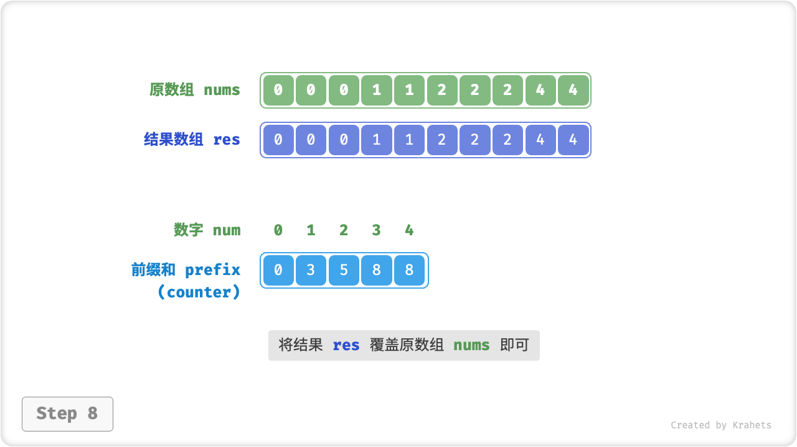

# 计数排序

前面介绍的几种排序算法都属于 **基于比较的排序算法**，即通过比较元素之间的大小来实现排序，此类排序算法的时间复杂度无法超越 $O(n \log n)$ 。接下来，我们将学习一种 **非比较排序算法** ，名为「计数排序 Counting Sort」，其时间复杂度可以达到 $O(n)$ 。

## 简单实现

先看一个简单例子。给定一个长度为 $n$ 的数组 `nums` ，元素皆为 **非负整数**。计数排序的整体流程为：

1. 遍历记录数组中的最大数字，记为 $m$ ，并建立一个长度为 $m + 1$ 的辅助数组 `counter` ；
2. **借助 `counter` 统计 `nums` 中各数字的出现次数**，其中 `counter[num]` 对应数字 `num` 的出现次数。统计方法很简单，只需遍历 `nums` （设当前数字为 `num`），每轮将 `counter[num]` 自增 $1$ 即可。
3. **由于 `counter` 的各个索引是天然有序的，因此相当于所有数字已经被排序好了**。接下来，我们遍历 `counter` ，根据各数字的出现次数，将各数字按从小到大的顺序填入 `nums` 即可。

观察发现，计数排序名副其实，是通过“统计元素数量”来实现排序的。



=== "Java"

    ```java title="counting_sort.java"
    [class]{counting_sort}-[func]{countingSortNaive}
    ```

=== "C++"

    ```cpp title="counting_sort.cpp"
    [class]{}-[func]{countingSortNaive}
    ```

=== "Python"

    ```python title="counting_sort.py"
    [class]{}-[func]{counting_sort_naive}
    ```

=== "Go"

    ```go title="counting_sort.go"
    [class]{}-[func]{countingSortNaive}
    ```

=== "JavaScript"

    ```javascript title="counting_sort.js"
    [class]{}-[func]{countingSortNaive}
    ```

=== "TypeScript"

    ```typescript title="counting_sort.ts"
    [class]{}-[func]{countingSortNaive}
    ```

=== "C"

    ```c title="counting_sort.c"
    [class]{}-[func]{countingSortNaive}
    ```

=== "C#"

    ```csharp title="counting_sort.cs"
    [class]{counting_sort}-[func]{countingSortNaive}
    ```

=== "Swift"

    ```swift title="counting_sort.swift"
    [class]{}-[func]{countingSortNaive}
    ```

=== "Zig"

    ```zig title="counting_sort.zig"
    [class]{}-[func]{countingSortNaive}
    ```

## 完整实现

细心的同学可能发现，**如果输入数据是对象，上述步骤 `3.` 就失效了**。例如输入数据是商品对象，我们想要按照商品价格（类的成员变量）对商品进行排序，而上述算法只能给出价格的排序结果。

那么如何才能得到原数据的排序结果呢？我们首先计算 `counter` 的「前缀和」，顾名思义，索引 `i` 处的前缀和 `prefix[i]` 等于数组前 `i` 个元素之和，即

$$
\text{prefix}[i] = \sum_{j=0}^i \text{counter[j]}
$$

**前缀和具有明确意义，`prefix[num] - 1` 代表元素 `num` 在结果数组 `res` 中最后一次出现的索引**。这个信息很关键，因为其给出了各个元素应该出现在结果数组的哪个位置。接下来，我们倒序遍历原数组 `nums` 的每个元素 `num` ，在每轮迭代中执行：

1. 将 `num` 填入数组 `res` 的索引 `prefix[num] - 1` 处；
2. 令前缀和 `prefix[num]` 自减 $1$ ，从而得到下次放置 `num` 的索引；

完成遍历后，数组 `res` 中就是排序好的结果，最后使用 `res` 覆盖原数组 `nums` 即可；

=== "<1>"
    

=== "<2>"
    

=== "<3>"
    

=== "<4>"
    

=== "<5>"
    

=== "<6>"
    

=== "<7>"
    

=== "<8>"
    

计数排序的实现代码如下所示。

=== "Java"

    ```java title="counting_sort.java"
    [class]{counting_sort}-[func]{countingSort}
    ```

=== "C++"

    ```cpp title="counting_sort.cpp"
    [class]{}-[func]{countingSort}
    ```

=== "Python"

    ```python title="counting_sort.py"
    [class]{}-[func]{counting_sort}
    ```

=== "Go"

    ```go title="counting_sort.go"
    [class]{}-[func]{countingSort}
    ```

=== "JavaScript"

    ```javascript title="counting_sort.js"
    [class]{}-[func]{countingSort}
    ```

=== "TypeScript"

    ```typescript title="counting_sort.ts"
    [class]{}-[func]{countingSort}
    ```

=== "C"

    ```c title="counting_sort.c"
    [class]{}-[func]{countingSort}
    ```

=== "C#"

    ```csharp title="counting_sort.cs"
    [class]{counting_sort}-[func]{countingSort}
    ```

=== "Swift"

    ```swift title="counting_sort.swift"
    [class]{}-[func]{countingSort}
    ```

=== "Zig"

    ```zig title="counting_sort.zig"
    [class]{}-[func]{countingSort}
    ```

## 算法特性

**时间复杂度 $O(n + m)$** ：涉及遍历 `nums` 和遍历 `counter` ，都使用线性时间。一般情况下 $n \gg m$ ，此时使用线性 $O(n)$ 时间。

**空间复杂度 $O(n + m)$** ：借助了长度分别为 $n$ , $m$ 的数组 `res` 和 `counter` ，是“非原地排序”；

**稳定排序**：由于向 `res` 中填充元素的顺序是“从右向左”的，因此倒序遍历 `nums` 可以避免改变相等元素之间的相对位置，从而实现“稳定排序”；其实正序遍历 `nums` 也可以得到正确的排序结果，但结果“非稳定”。

## 局限性

看到这里，你也许会觉得计数排序太妙了，咔咔一通操作，时间复杂度就下来了。然而，使用技术排序的前置条件比较苛刻。

**计数排序只适用于非负整数**。若想要用在其他类型数据上，则要求该数据必须可以被转化为非负整数，并且不能改变各个元素之间的相对大小关系。例如，对于包含负数的整数数组，可以先给所有数字加上一个常数，将全部数字转化为正数，排序完成后再转换回去即可。

**计数排序只适用于数据范围不大的情况**。比如，上述示例中 $m$ 不能太大，否则占用空间太多；而当 $n \ll m$ 时，计数排序使用 $O(m)$ 时间，有可能比 $O(n \log n)$ 的排序算法还要慢。
