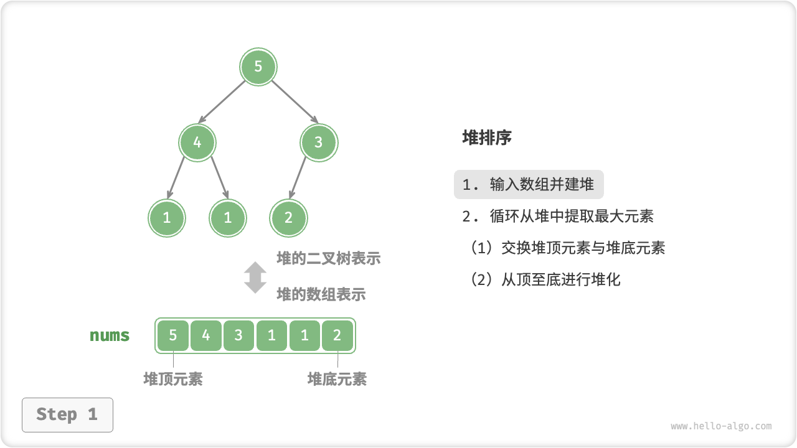
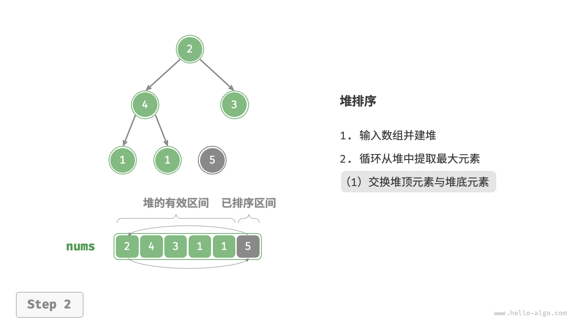
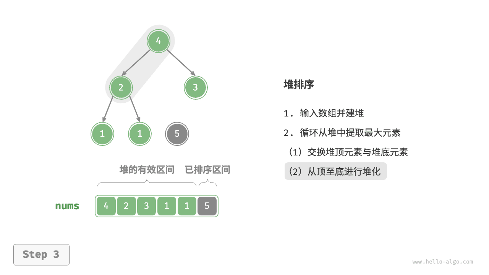
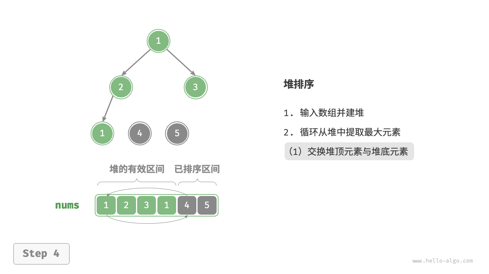
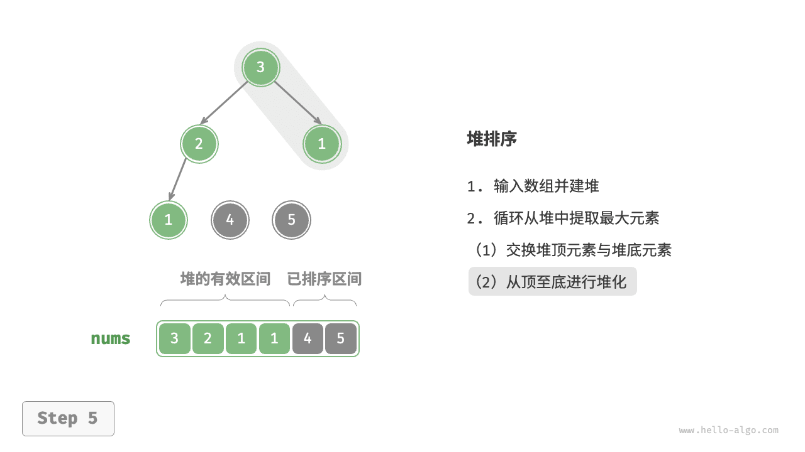
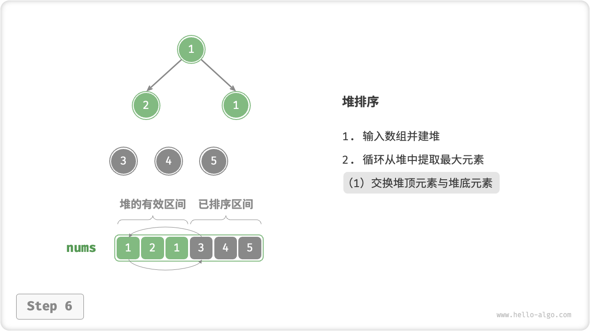
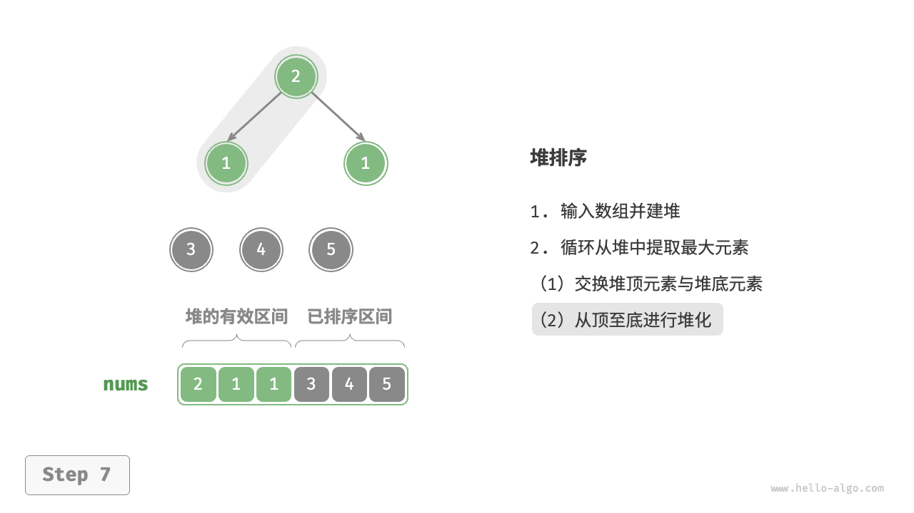
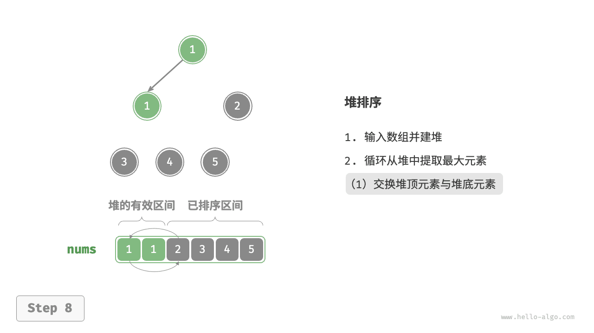
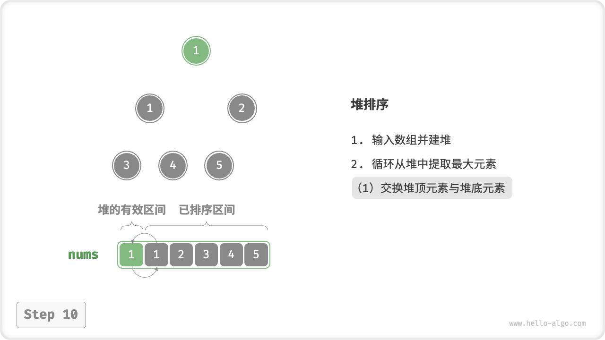
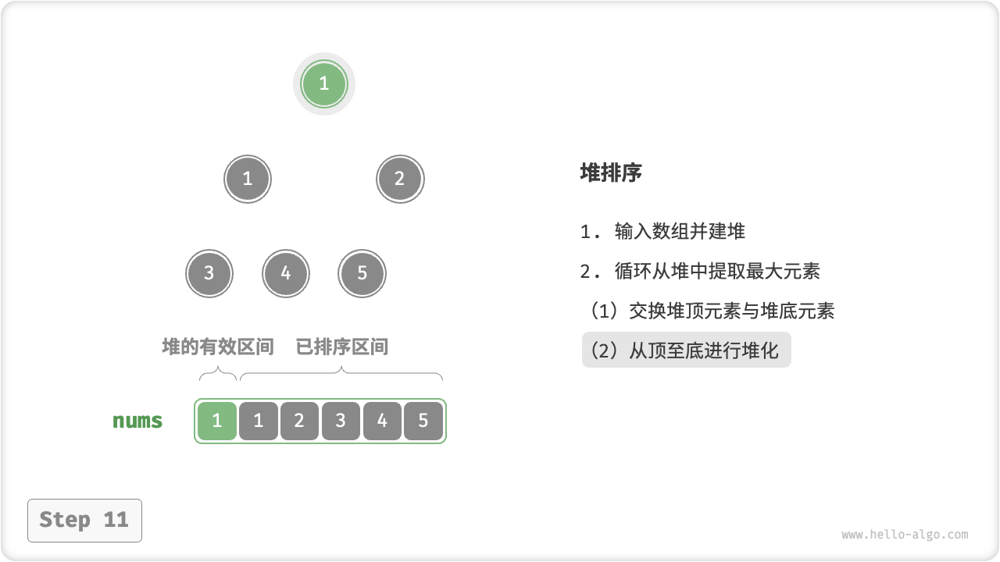

# 11.7 &nbsp; 堆排序

!!! tip

    阅读本节前，请确保已学完“堆“章节。

「堆排序 heap sort」是一种基于堆数据结构实现的高效排序算法。我们可以利用已经学过的“建堆操作”和“元素出堆操作”实现堆排序。

1. 输入数组并建立小顶堆，此时最小元素位于堆顶。
2. 不断执行出堆操作，依次记录出堆元素，即可得到从小到大排序的序列。

以上方法虽然可行，但需要借助一个额外数组来保存弹出的元素，比较浪费空间。在实际中，我们通常使用一种更加优雅的实现方式。

## 11.7.1 &nbsp; 算法流程

设数组的长度为 $n$ ，堆排序的流程如图 11-12 所示。

1. 输入数组并建立大顶堆。完成后，最大元素位于堆顶。
2. 将堆顶元素（第一个元素）与堆底元素（最后一个元素）交换。完成交换后，堆的长度减 $1$ ，已排序元素数量加 $1$ 。
3. 从堆顶元素开始，从顶到底执行堆化操作（sift down）。完成堆化后，堆的性质得到修复。
4. 循环执行第 `2.` 步和第 `3.` 步。循环 $n - 1$ 轮后，即可完成数组排序。

!!! tip

    实际上，元素出堆操作中也包含第 `2.` 步和第 `3.` 步，只是多了一个弹出元素的步骤。

=== "<1>"
    { class="animation-figure" }

=== "<2>"
    { class="animation-figure" }

=== "<3>"
    { class="animation-figure" }

=== "<4>"
    { class="animation-figure" }

=== "<5>"
    { class="animation-figure" }

=== "<6>"
    { class="animation-figure" }

=== "<7>"
    { class="animation-figure" }

=== "<8>"
    { class="animation-figure" }

=== "<9>"
    { class="animation-figure" }

=== "<10>"
    { class="animation-figure" }

=== "<11>"
    { class="animation-figure" }

=== "<12>"
    { class="animation-figure" }

<p align="center"> 图 11-12 &nbsp; 堆排序步骤 </p>

在代码实现中，我们使用了与“堆”章节相同的从顶至底堆化 `sift_down()` 函数。值得注意的是，由于堆的长度会随着提取最大元素而减小，因此我们需要给 `sift_down()` 函数添加一个长度参数 $n$ ，用于指定堆的当前有效长度。代码如下所示：

=== "Python"

    ```python title="heap_sort.py"
    def sift_down(nums: list[int], n: int, i: int):
        """堆的长度为 n ，从节点 i 开始，从顶至底堆化"""
        while True:
            # 判断节点 i, l, r 中值最大的节点，记为 ma
            l = 2 * i + 1
            r = 2 * i + 2
            ma = i
            if l < n and nums[l] > nums[ma]:
                ma = l
            if r < n and nums[r] > nums[ma]:
                ma = r
            # 若节点 i 最大或索引 l, r 越界，则无须继续堆化，跳出
            if ma == i:
                break
            # 交换两节点
            nums[i], nums[ma] = nums[ma], nums[i]
            # 循环向下堆化
            i = ma

    def heap_sort(nums: list[int]):
        """堆排序"""
        # 建堆操作：堆化除叶节点以外的其他所有节点
        for i in range(len(nums) // 2 - 1, -1, -1):
            sift_down(nums, len(nums), i)
        # 从堆中提取最大元素，循环 n-1 轮
        for i in range(len(nums) - 1, 0, -1):
            # 交换根节点与最右叶节点（交换首元素与尾元素）
            nums[0], nums[i] = nums[i], nums[0]
            # 以根节点为起点，从顶至底进行堆化
            sift_down(nums, i, 0)
    ```

=== "C++"

    ```cpp title="heap_sort.cpp"
    /* 堆的长度为 n ，从节点 i 开始，从顶至底堆化 */
    void siftDown(vector<int> &nums, int n, int i) {
        while (true) {
            // 判断节点 i, l, r 中值最大的节点，记为 ma
            int l = 2 * i + 1;
            int r = 2 * i + 2;
            int ma = i;
            if (l < n && nums[l] > nums[ma])
                ma = l;
            if (r < n && nums[r] > nums[ma])
                ma = r;
            // 若节点 i 最大或索引 l, r 越界，则无须继续堆化，跳出
            if (ma == i) {
                break;
            }
            // 交换两节点
            swap(nums[i], nums[ma]);
            // 循环向下堆化
            i = ma;
        }
    }

    /* 堆排序 */
    void heapSort(vector<int> &nums) {
        // 建堆操作：堆化除叶节点以外的其他所有节点
        for (int i = nums.size() / 2 - 1; i >= 0; --i) {
            siftDown(nums, nums.size(), i);
        }
        // 从堆中提取最大元素，循环 n-1 轮
        for (int i = nums.size() - 1; i > 0; --i) {
            // 交换根节点与最右叶节点（交换首元素与尾元素）
            swap(nums[0], nums[i]);
            // 以根节点为起点，从顶至底进行堆化
            siftDown(nums, i, 0);
        }
    }
    ```

=== "Java"

    ```java title="heap_sort.java"
    /* 堆的长度为 n ，从节点 i 开始，从顶至底堆化 */
    void siftDown(int[] nums, int n, int i) {
        while (true) {
            // 判断节点 i, l, r 中值最大的节点，记为 ma
            int l = 2 * i + 1;
            int r = 2 * i + 2;
            int ma = i;
            if (l < n && nums[l] > nums[ma])
                ma = l;
            if (r < n && nums[r] > nums[ma])
                ma = r;
            // 若节点 i 最大或索引 l, r 越界，则无须继续堆化，跳出
            if (ma == i)
                break;
            // 交换两节点
            int temp = nums[i];
            nums[i] = nums[ma];
            nums[ma] = temp;
            // 循环向下堆化
            i = ma;
        }
    }

    /* 堆排序 */
    void heapSort(int[] nums) {
        // 建堆操作：堆化除叶节点以外的其他所有节点
        for (int i = nums.length / 2 - 1; i >= 0; i--) {
            siftDown(nums, nums.length, i);
        }
        // 从堆中提取最大元素，循环 n-1 轮
        for (int i = nums.length - 1; i > 0; i--) {
            // 交换根节点与最右叶节点（交换首元素与尾元素）
            int tmp = nums[0];
            nums[0] = nums[i];
            nums[i] = tmp;
            // 以根节点为起点，从顶至底进行堆化
            siftDown(nums, i, 0);
        }
    }
    ```

=== "C#"

    ```csharp title="heap_sort.cs"
    /* 堆的长度为 n ，从节点 i 开始，从顶至底堆化 */
    void SiftDown(int[] nums, int n, int i) {
        while (true) {
            // 判断节点 i, l, r 中值最大的节点，记为 ma
            int l = 2 * i + 1;
            int r = 2 * i + 2;
            int ma = i;
            if (l < n && nums[l] > nums[ma])
                ma = l;
            if (r < n && nums[r] > nums[ma])
                ma = r;
            // 若节点 i 最大或索引 l, r 越界，则无须继续堆化，跳出
            if (ma == i)
                break;
            // 交换两节点
            (nums[ma], nums[i]) = (nums[i], nums[ma]);
            // 循环向下堆化
            i = ma;
        }
    }

    /* 堆排序 */
    void HeapSort(int[] nums) {
        // 建堆操作：堆化除叶节点以外的其他所有节点
        for (int i = nums.Length / 2 - 1; i >= 0; i--) {
            SiftDown(nums, nums.Length, i);
        }
        // 从堆中提取最大元素，循环 n-1 轮
        for (int i = nums.Length - 1; i > 0; i--) {
            // 交换根节点与最右叶节点（交换首元素与尾元素）
            (nums[i], nums[0]) = (nums[0], nums[i]);
            // 以根节点为起点，从顶至底进行堆化
            SiftDown(nums, i, 0);
        }
    }
    ```

=== "Go"

    ```go title="heap_sort.go"
    /* 堆的长度为 n ，从节点 i 开始，从顶至底堆化 */
    func siftDown(nums *[]int, n, i int) {
        for true {
            // 判断节点 i, l, r 中值最大的节点，记为 ma
            l := 2*i + 1
            r := 2*i + 2
            ma := i
            if l < n && (*nums)[l] > (*nums)[ma] {
                ma = l
            }
            if r < n && (*nums)[r] > (*nums)[ma] {
                ma = r
            }
            // 若节点 i 最大或索引 l, r 越界，则无须继续堆化，跳出
            if ma == i {
                break
            }
            // 交换两节点
            (*nums)[i], (*nums)[ma] = (*nums)[ma], (*nums)[i]
            // 循环向下堆化
            i = ma
        }
    }

    /* 堆排序 */
    func heapSort(nums *[]int) {
        // 建堆操作：堆化除叶节点以外的其他所有节点
        for i := len(*nums)/2 - 1; i >= 0; i-- {
            siftDown(nums, len(*nums), i)
        }
        // 从堆中提取最大元素，循环 n-1 轮
        for i := len(*nums) - 1; i > 0; i-- {
            // 交换根节点与最右叶节点（交换首元素与尾元素）
            (*nums)[0], (*nums)[i] = (*nums)[i], (*nums)[0]
            // 以根节点为起点，从顶至底进行堆化
            siftDown(nums, i, 0)
        }
    }
    ```

=== "Swift"

    ```swift title="heap_sort.swift"
    /* 堆的长度为 n ，从节点 i 开始，从顶至底堆化 */
    func siftDown(nums: inout [Int], n: Int, i: Int) {
        var i = i
        while true {
            // 判断节点 i, l, r 中值最大的节点，记为 ma
            let l = 2 * i + 1
            let r = 2 * i + 2
            var ma = i
            if l < n, nums[l] > nums[ma] {
                ma = l
            }
            if r < n, nums[r] > nums[ma] {
                ma = r
            }
            // 若节点 i 最大或索引 l, r 越界，则无须继续堆化，跳出
            if ma == i {
                break
            }
            // 交换两节点
            nums.swapAt(i, ma)
            // 循环向下堆化
            i = ma
        }
    }

    /* 堆排序 */
    func heapSort(nums: inout [Int]) {
        // 建堆操作：堆化除叶节点以外的其他所有节点
        for i in stride(from: nums.count / 2 - 1, through: 0, by: -1) {
            siftDown(nums: &nums, n: nums.count, i: i)
        }
        // 从堆中提取最大元素，循环 n-1 轮
        for i in nums.indices.dropFirst().reversed() {
            // 交换根节点与最右叶节点（交换首元素与尾元素）
            nums.swapAt(0, i)
            // 以根节点为起点，从顶至底进行堆化
            siftDown(nums: &nums, n: i, i: 0)
        }
    }
    ```

=== "JS"

    ```javascript title="heap_sort.js"
    /* 堆的长度为 n ，从节点 i 开始，从顶至底堆化 */
    function siftDown(nums, n, i) {
        while (true) {
            // 判断节点 i, l, r 中值最大的节点，记为 ma
            let l = 2 * i + 1;
            let r = 2 * i + 2;
            let ma = i;
            if (l < n && nums[l] > nums[ma]) {
                ma = l;
            }
            if (r < n && nums[r] > nums[ma]) {
                ma = r;
            }
            // 若节点 i 最大或索引 l, r 越界，则无须继续堆化，跳出
            if (ma === i) {
                break;
            }
            // 交换两节点
            [nums[i], nums[ma]] = [nums[ma], nums[i]];
            // 循环向下堆化
            i = ma;
        }
    }

    /* 堆排序 */
    function heapSort(nums) {
        // 建堆操作：堆化除叶节点以外的其他所有节点
        for (let i = Math.floor(nums.length / 2) - 1; i >= 0; i--) {
            siftDown(nums, nums.length, i);
        }
        // 从堆中提取最大元素，循环 n-1 轮
        for (let i = nums.length - 1; i > 0; i--) {
            // 交换根节点与最右叶节点（交换首元素与尾元素）
            [nums[0], nums[i]] = [nums[i], nums[0]];
            // 以根节点为起点，从顶至底进行堆化
            siftDown(nums, i, 0);
        }
    }
    ```

=== "TS"

    ```typescript title="heap_sort.ts"
    /* 堆的长度为 n ，从节点 i 开始，从顶至底堆化 */
    function siftDown(nums: number[], n: number, i: number): void {
        while (true) {
            // 判断节点 i, l, r 中值最大的节点，记为 ma
            let l = 2 * i + 1;
            let r = 2 * i + 2;
            let ma = i;
            if (l < n && nums[l] > nums[ma]) {
                ma = l;
            }
            if (r < n && nums[r] > nums[ma]) {
                ma = r;
            }
            // 若节点 i 最大或索引 l, r 越界，则无须继续堆化，跳出
            if (ma === i) {
                break;
            }
            // 交换两节点
            [nums[i], nums[ma]] = [nums[ma], nums[i]];
            // 循环向下堆化
            i = ma;
        }
    }

    /* 堆排序 */
    function heapSort(nums: number[]): void {
        // 建堆操作：堆化除叶节点以外的其他所有节点
        for (let i = Math.floor(nums.length / 2) - 1; i >= 0; i--) {
            siftDown(nums, nums.length, i);
        }
        // 从堆中提取最大元素，循环 n-1 轮
        for (let i = nums.length - 1; i > 0; i--) {
            // 交换根节点与最右叶节点（交换首元素与尾元素）
            [nums[0], nums[i]] = [nums[i], nums[0]];
            // 以根节点为起点，从顶至底进行堆化
            siftDown(nums, i, 0);
        }
    }
    ```

=== "Dart"

    ```dart title="heap_sort.dart"
    /* 堆的长度为 n ，从节点 i 开始，从顶至底堆化 */
    void siftDown(List<int> nums, int n, int i) {
      while (true) {
        // 判断节点 i, l, r 中值最大的节点，记为 ma
        int l = 2 * i + 1;
        int r = 2 * i + 2;
        int ma = i;
        if (l < n && nums[l] > nums[ma]) ma = l;
        if (r < n && nums[r] > nums[ma]) ma = r;
        // 若节点 i 最大或索引 l, r 越界，则无须继续堆化，跳出
        if (ma == i) break;
        // 交换两节点
        int temp = nums[i];
        nums[i] = nums[ma];
        nums[ma] = temp;
        // 循环向下堆化
        i = ma;
      }
    }

    /* 堆排序 */
    void heapSort(List<int> nums) {
      // 建堆操作：堆化除叶节点以外的其他所有节点
      for (int i = nums.length ~/ 2 - 1; i >= 0; i--) {
        siftDown(nums, nums.length, i);
      }
      // 从堆中提取最大元素，循环 n-1 轮
      for (int i = nums.length - 1; i > 0; i--) {
        // 交换根节点与最右叶节点（交换首元素与尾元素）
        int tmp = nums[0];
        nums[0] = nums[i];
        nums[i] = tmp;
        // 以根节点为起点，从顶至底进行堆化
        siftDown(nums, i, 0);
      }
    }
    ```

=== "Rust"

    ```rust title="heap_sort.rs"
    /* 堆的长度为 n ，从节点 i 开始，从顶至底堆化 */
    fn sift_down(nums: &mut [i32], n: usize, mut i: usize) {
        loop {
            // 判断节点 i, l, r 中值最大的节点，记为 ma
            let l = 2 * i + 1;
            let r = 2 * i + 2;
            let mut ma = i;
            if l < n && nums[l] > nums[ma] {
                ma = l;
            }
            if r < n && nums[r] > nums[ma] {
                ma = r;
            }
            // 若节点 i 最大或索引 l, r 越界，则无须继续堆化，跳出
            if ma == i {
                break;
            }
            // 交换两节点
            let temp = nums[i];
            nums[i] = nums[ma];
            nums[ma] = temp;
            // 循环向下堆化
            i = ma;
        }
    }

    /* 堆排序 */
    fn heap_sort(nums: &mut [i32]) {
        // 建堆操作：堆化除叶节点以外的其他所有节点
        for i in (0..=nums.len() / 2 - 1).rev() {
            sift_down(nums, nums.len(), i);
        }
        // 从堆中提取最大元素，循环 n-1 轮
        for i in (1..=nums.len() - 1).rev() {
            // 交换根节点与最右叶节点（交换首元素与尾元素）
            let tmp = nums[0];
            nums[0] = nums[i];
            nums[i] = tmp;
            // 以根节点为起点，从顶至底进行堆化
            sift_down(nums, i, 0);
        }
    }
    ```

=== "C"

    ```c title="heap_sort.c"
    /* 堆的长度为 n ，从节点 i 开始，从顶至底堆化 */
    void siftDown(int nums[], int n, int i) {
        while (1) {
            // 判断节点 i, l, r 中值最大的节点，记为 ma
            int l = 2 * i + 1;
            int r = 2 * i + 2;
            int ma = i;
            if (l < n && nums[l] > nums[ma])
                ma = l;
            if (r < n && nums[r] > nums[ma])
                ma = r;
            // 若节点 i 最大或索引 l, r 越界，则无须继续堆化，跳出
            if (ma == i) {
                break;
            }
            // 交换两节点
            int temp = nums[i];
            nums[i] = nums[ma];
            nums[ma] = temp;
            // 循环向下堆化
            i = ma;
        }
    }

    /* 堆排序 */
    void heapSort(int nums[], int n) {
        // 建堆操作：堆化除叶节点以外的其他所有节点
        for (int i = n / 2 - 1; i >= 0; --i) {
            siftDown(nums, n, i);
        }
        // 从堆中提取最大元素，循环 n-1 轮
        for (int i = n - 1; i > 0; --i) {
            // 交换根节点与最右叶节点（交换首元素与尾元素）
            int tmp = nums[0];
            nums[0] = nums[i];
            nums[i] = tmp;
            // 以根节点为起点，从顶至底进行堆化
            siftDown(nums, i, 0);
        }
    }
    ```

=== "Zig"

    ```zig title="heap_sort.zig"
    [class]{}-[func]{siftDown}

    [class]{}-[func]{heapSort}
    ```

??? pythontutor "可视化运行"

    <div style="height: 549px; width: 100%;"><iframe class="pythontutor-iframe" src="https://pythontutor.com/iframe-embed.html#code=def%20sift_down%28nums%3A%20list%5Bint%5D,%20n%3A%20int,%20i%3A%20int%29%3A%0A%20%20%20%20%22%22%22%E5%A0%86%E7%9A%84%E9%95%BF%E5%BA%A6%E4%B8%BA%20n%20%EF%BC%8C%E4%BB%8E%E8%8A%82%E7%82%B9%20i%20%E5%BC%80%E5%A7%8B%EF%BC%8C%E4%BB%8E%E9%A1%B6%E8%87%B3%E5%BA%95%E5%A0%86%E5%8C%96%22%22%22%0A%20%20%20%20while%20True%3A%0A%20%20%20%20%20%20%20%20%23%20%E5%88%A4%E6%96%AD%E8%8A%82%E7%82%B9%20i,%20l,%20r%20%E4%B8%AD%E5%80%BC%E6%9C%80%E5%A4%A7%E7%9A%84%E8%8A%82%E7%82%B9%EF%BC%8C%E8%AE%B0%E4%B8%BA%20ma%0A%20%20%20%20%20%20%20%20l%20%3D%202%20*%20i%20%2B%201%0A%20%20%20%20%20%20%20%20r%20%3D%202%20*%20i%20%2B%202%0A%20%20%20%20%20%20%20%20ma%20%3D%20i%0A%20%20%20%20%20%20%20%20if%20l%20%3C%20n%20and%20nums%5Bl%5D%20%3E%20nums%5Bma%5D%3A%0A%20%20%20%20%20%20%20%20%20%20%20%20ma%20%3D%20l%0A%20%20%20%20%20%20%20%20if%20r%20%3C%20n%20and%20nums%5Br%5D%20%3E%20nums%5Bma%5D%3A%0A%20%20%20%20%20%20%20%20%20%20%20%20ma%20%3D%20r%0A%20%20%20%20%20%20%20%20%23%20%E8%8B%A5%E8%8A%82%E7%82%B9%20i%20%E6%9C%80%E5%A4%A7%E6%88%96%E7%B4%A2%E5%BC%95%20l,%20r%20%E8%B6%8A%E7%95%8C%EF%BC%8C%E5%88%99%E6%97%A0%E9%A1%BB%E7%BB%A7%E7%BB%AD%E5%A0%86%E5%8C%96%EF%BC%8C%E8%B7%B3%E5%87%BA%0A%20%20%20%20%20%20%20%20if%20ma%20%3D%3D%20i%3A%0A%20%20%20%20%20%20%20%20%20%20%20%20break%0A%20%20%20%20%20%20%20%20%23%20%E4%BA%A4%E6%8D%A2%E4%B8%A4%E8%8A%82%E7%82%B9%0A%20%20%20%20%20%20%20%20nums%5Bi%5D,%20nums%5Bma%5D%20%3D%20nums%5Bma%5D,%20nums%5Bi%5D%0A%20%20%20%20%20%20%20%20%23%20%E5%BE%AA%E7%8E%AF%E5%90%91%E4%B8%8B%E5%A0%86%E5%8C%96%0A%20%20%20%20%20%20%20%20i%20%3D%20ma%0A%0Adef%20heap_sort%28nums%3A%20list%5Bint%5D%29%3A%0A%20%20%20%20%22%22%22%E5%A0%86%E6%8E%92%E5%BA%8F%22%22%22%0A%20%20%20%20%23%20%E5%BB%BA%E5%A0%86%E6%93%8D%E4%BD%9C%EF%BC%9A%E5%A0%86%E5%8C%96%E9%99%A4%E5%8F%B6%E8%8A%82%E7%82%B9%E4%BB%A5%E5%A4%96%E7%9A%84%E5%85%B6%E4%BB%96%E6%89%80%E6%9C%89%E8%8A%82%E7%82%B9%0A%20%20%20%20for%20i%20in%20range%28len%28nums%29%20//%202%20-%201,%20-1,%20-1%29%3A%0A%20%20%20%20%20%20%20%20sift_down%28nums,%20len%28nums%29,%20i%29%0A%20%20%20%20%23%20%E4%BB%8E%E5%A0%86%E4%B8%AD%E6%8F%90%E5%8F%96%E6%9C%80%E5%A4%A7%E5%85%83%E7%B4%A0%EF%BC%8C%E5%BE%AA%E7%8E%AF%20n-1%20%E8%BD%AE%0A%20%20%20%20for%20i%20in%20range%28len%28nums%29%20-%201,%200,%20-1%29%3A%0A%20%20%20%20%20%20%20%20%23%20%E4%BA%A4%E6%8D%A2%E6%A0%B9%E8%8A%82%E7%82%B9%E4%B8%8E%E6%9C%80%E5%8F%B3%E5%8F%B6%E8%8A%82%E7%82%B9%EF%BC%88%E4%BA%A4%E6%8D%A2%E9%A6%96%E5%85%83%E7%B4%A0%E4%B8%8E%E5%B0%BE%E5%85%83%E7%B4%A0%EF%BC%89%0A%20%20%20%20%20%20%20%20nums%5B0%5D,%20nums%5Bi%5D%20%3D%20nums%5Bi%5D,%20nums%5B0%5D%0A%20%20%20%20%20%20%20%20%23%20%E4%BB%A5%E6%A0%B9%E8%8A%82%E7%82%B9%E4%B8%BA%E8%B5%B7%E7%82%B9%EF%BC%8C%E4%BB%8E%E9%A1%B6%E8%87%B3%E5%BA%95%E8%BF%9B%E8%A1%8C%E5%A0%86%E5%8C%96%0A%20%20%20%20%20%20%20%20sift_down%28nums,%20i,%200%29%0A%0A%22%22%22Driver%20Code%22%22%22%0Aif%20__name__%20%3D%3D%20%22__main__%22%3A%0A%20%20%20%20nums%20%3D%20%5B4,%201,%203,%201,%205,%202%5D%0A%20%20%20%20heap_sort%28nums%29%0A%20%20%20%20print%28%22%E5%A0%86%E6%8E%92%E5%BA%8F%E5%AE%8C%E6%88%90%E5%90%8E%20nums%20%3D%22,%20nums%29&codeDivHeight=472&codeDivWidth=350&cumulative=false&curInstr=5&heapPrimitives=nevernest&origin=opt-frontend.js&py=311&rawInputLstJSON=%5B%5D&textReferences=false"> </iframe></div>
    <div style="margin-top: 5px;"><a href="https://pythontutor.com/iframe-embed.html#code=def%20sift_down%28nums%3A%20list%5Bint%5D,%20n%3A%20int,%20i%3A%20int%29%3A%0A%20%20%20%20%22%22%22%E5%A0%86%E7%9A%84%E9%95%BF%E5%BA%A6%E4%B8%BA%20n%20%EF%BC%8C%E4%BB%8E%E8%8A%82%E7%82%B9%20i%20%E5%BC%80%E5%A7%8B%EF%BC%8C%E4%BB%8E%E9%A1%B6%E8%87%B3%E5%BA%95%E5%A0%86%E5%8C%96%22%22%22%0A%20%20%20%20while%20True%3A%0A%20%20%20%20%20%20%20%20%23%20%E5%88%A4%E6%96%AD%E8%8A%82%E7%82%B9%20i,%20l,%20r%20%E4%B8%AD%E5%80%BC%E6%9C%80%E5%A4%A7%E7%9A%84%E8%8A%82%E7%82%B9%EF%BC%8C%E8%AE%B0%E4%B8%BA%20ma%0A%20%20%20%20%20%20%20%20l%20%3D%202%20*%20i%20%2B%201%0A%20%20%20%20%20%20%20%20r%20%3D%202%20*%20i%20%2B%202%0A%20%20%20%20%20%20%20%20ma%20%3D%20i%0A%20%20%20%20%20%20%20%20if%20l%20%3C%20n%20and%20nums%5Bl%5D%20%3E%20nums%5Bma%5D%3A%0A%20%20%20%20%20%20%20%20%20%20%20%20ma%20%3D%20l%0A%20%20%20%20%20%20%20%20if%20r%20%3C%20n%20and%20nums%5Br%5D%20%3E%20nums%5Bma%5D%3A%0A%20%20%20%20%20%20%20%20%20%20%20%20ma%20%3D%20r%0A%20%20%20%20%20%20%20%20%23%20%E8%8B%A5%E8%8A%82%E7%82%B9%20i%20%E6%9C%80%E5%A4%A7%E6%88%96%E7%B4%A2%E5%BC%95%20l,%20r%20%E8%B6%8A%E7%95%8C%EF%BC%8C%E5%88%99%E6%97%A0%E9%A1%BB%E7%BB%A7%E7%BB%AD%E5%A0%86%E5%8C%96%EF%BC%8C%E8%B7%B3%E5%87%BA%0A%20%20%20%20%20%20%20%20if%20ma%20%3D%3D%20i%3A%0A%20%20%20%20%20%20%20%20%20%20%20%20break%0A%20%20%20%20%20%20%20%20%23%20%E4%BA%A4%E6%8D%A2%E4%B8%A4%E8%8A%82%E7%82%B9%0A%20%20%20%20%20%20%20%20nums%5Bi%5D,%20nums%5Bma%5D%20%3D%20nums%5Bma%5D,%20nums%5Bi%5D%0A%20%20%20%20%20%20%20%20%23%20%E5%BE%AA%E7%8E%AF%E5%90%91%E4%B8%8B%E5%A0%86%E5%8C%96%0A%20%20%20%20%20%20%20%20i%20%3D%20ma%0A%0Adef%20heap_sort%28nums%3A%20list%5Bint%5D%29%3A%0A%20%20%20%20%22%22%22%E5%A0%86%E6%8E%92%E5%BA%8F%22%22%22%0A%20%20%20%20%23%20%E5%BB%BA%E5%A0%86%E6%93%8D%E4%BD%9C%EF%BC%9A%E5%A0%86%E5%8C%96%E9%99%A4%E5%8F%B6%E8%8A%82%E7%82%B9%E4%BB%A5%E5%A4%96%E7%9A%84%E5%85%B6%E4%BB%96%E6%89%80%E6%9C%89%E8%8A%82%E7%82%B9%0A%20%20%20%20for%20i%20in%20range%28len%28nums%29%20//%202%20-%201,%20-1,%20-1%29%3A%0A%20%20%20%20%20%20%20%20sift_down%28nums,%20len%28nums%29,%20i%29%0A%20%20%20%20%23%20%E4%BB%8E%E5%A0%86%E4%B8%AD%E6%8F%90%E5%8F%96%E6%9C%80%E5%A4%A7%E5%85%83%E7%B4%A0%EF%BC%8C%E5%BE%AA%E7%8E%AF%20n-1%20%E8%BD%AE%0A%20%20%20%20for%20i%20in%20range%28len%28nums%29%20-%201,%200,%20-1%29%3A%0A%20%20%20%20%20%20%20%20%23%20%E4%BA%A4%E6%8D%A2%E6%A0%B9%E8%8A%82%E7%82%B9%E4%B8%8E%E6%9C%80%E5%8F%B3%E5%8F%B6%E8%8A%82%E7%82%B9%EF%BC%88%E4%BA%A4%E6%8D%A2%E9%A6%96%E5%85%83%E7%B4%A0%E4%B8%8E%E5%B0%BE%E5%85%83%E7%B4%A0%EF%BC%89%0A%20%20%20%20%20%20%20%20nums%5B0%5D,%20nums%5Bi%5D%20%3D%20nums%5Bi%5D,%20nums%5B0%5D%0A%20%20%20%20%20%20%20%20%23%20%E4%BB%A5%E6%A0%B9%E8%8A%82%E7%82%B9%E4%B8%BA%E8%B5%B7%E7%82%B9%EF%BC%8C%E4%BB%8E%E9%A1%B6%E8%87%B3%E5%BA%95%E8%BF%9B%E8%A1%8C%E5%A0%86%E5%8C%96%0A%20%20%20%20%20%20%20%20sift_down%28nums,%20i,%200%29%0A%0A%22%22%22Driver%20Code%22%22%22%0Aif%20__name__%20%3D%3D%20%22__main__%22%3A%0A%20%20%20%20nums%20%3D%20%5B4,%201,%203,%201,%205,%202%5D%0A%20%20%20%20heap_sort%28nums%29%0A%20%20%20%20print%28%22%E5%A0%86%E6%8E%92%E5%BA%8F%E5%AE%8C%E6%88%90%E5%90%8E%20nums%20%3D%22,%20nums%29&codeDivHeight=800&codeDivWidth=600&cumulative=false&curInstr=5&heapPrimitives=nevernest&origin=opt-frontend.js&py=311&rawInputLstJSON=%5B%5D&textReferences=false" target="_blank" rel="noopener noreferrer">全屏观看 ></a></div>

## 11.7.2 &nbsp; 算法特性

- **时间复杂度为 $O(n \log n)$、非自适应排序**：建堆操作使用 $O(n)$ 时间。从堆中提取最大元素的时间复杂度为 $O(\log n)$ ，共循环 $n - 1$ 轮。
- **空间复杂度为 $O(1)$、原地排序**：几个指针变量使用 $O(1)$ 空间。元素交换和堆化操作都是在原数组上进行的。
- **非稳定排序**：在交换堆顶元素和堆底元素时，相等元素的相对位置可能发生变化。
