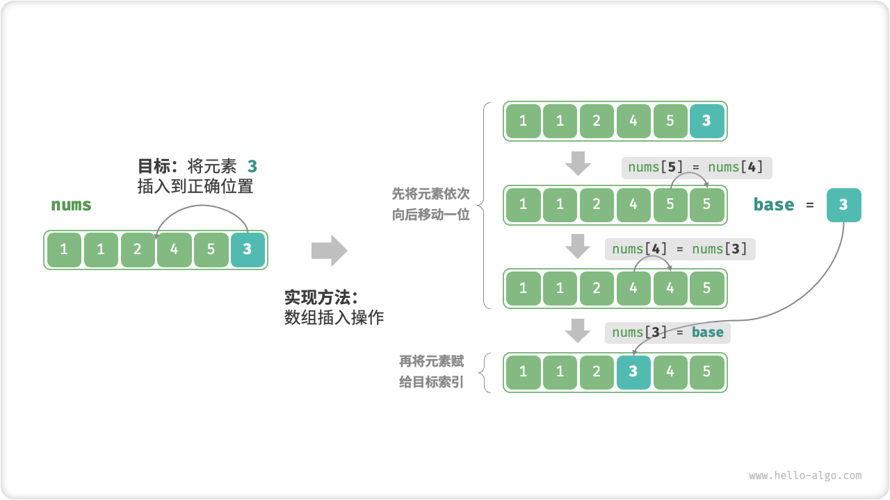
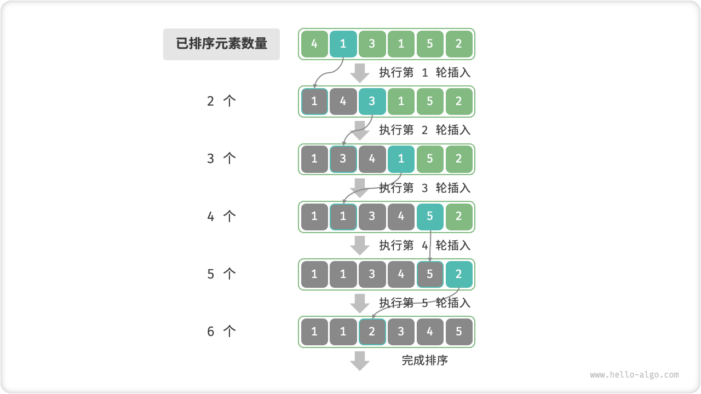

# 插入排序

<u>插入排序（insertion sort）</u>是一种简单的排序算法，它的工作原理与手动整理一副牌的过程非常相似。

具体来说，我们在未排序区间选择一个基准元素，将该元素与其左侧已排序区间的元素逐一比较大小，并将该元素插入到正确的位置。

下图展示了数组插入元素的操作流程。设基准元素为 `base` ，我们需要将从目标索引到 `base` 之间的所有元素向右移动一位，然后将 `base` 赋值给目标索引。



## 算法流程

插入排序的整体流程如下图所示。

1. 初始状态下，数组的第 1 个元素已完成排序。
2. 选取数组的第 2 个元素作为 `base` ，将其插入到正确位置后，**数组的前 2 个元素已排序**。
3. 选取第 3 个元素作为 `base` ，将其插入到正确位置后，**数组的前 3 个元素已排序**。
4. 以此类推，在最后一轮中，选取最后一个元素作为 `base` ，将其插入到正确位置后，**所有元素均已排序**。



示例代码如下：

```src
[file]{insertion_sort}-[class]{}-[func]{insertion_sort}
```

## 算法特性

- **时间复杂度为 $O(n^2)$、自适应排序**：在最差情况下，每次插入操作分别需要循环 $n - 1$、$n-2$、$\dots$、$2$、$1$ 次，求和得到 $(n - 1) n / 2$ ，因此时间复杂度为 $O(n^2)$ 。在遇到有序数据时，插入操作会提前终止。当输入数组完全有序时，插入排序达到最佳时间复杂度 $O(n)$ 。
- **空间复杂度为 $O(1)$、原地排序**：指针 $i$ 和 $j$ 使用常数大小的额外空间。
- **稳定排序**：在插入操作过程中，我们会将元素插入到相等元素的右侧，不会改变它们的顺序。

## 插入排序的优势

插入排序的时间复杂度为 $O(n^2)$ ，而我们即将学习的快速排序的时间复杂度为 $O(n \log n)$ 。尽管插入排序的时间复杂度更高，**但在数据量较小的情况下，插入排序通常更快**。

这个结论与线性查找和二分查找的适用情况的结论类似。快速排序这类 $O(n \log n)$ 的算法属于基于分治策略的排序算法，往往包含更多单元计算操作。而在数据量较小时，$n^2$ 和 $n \log n$ 的数值比较接近，复杂度不占主导地位，每轮中的单元操作数量起到决定性作用。

实际上，许多编程语言（例如 Java）的内置排序函数采用了插入排序，大致思路为：对于长数组，采用基于分治策略的排序算法，例如快速排序；对于短数组，直接使用插入排序。

虽然冒泡排序、选择排序和插入排序的时间复杂度都为 $O(n^2)$ ，但在实际情况中，**插入排序的使用频率显著高于冒泡排序和选择排序**，主要有以下原因。

- 冒泡排序基于元素交换实现，需要借助一个临时变量，共涉及 3 个单元操作；插入排序基于元素赋值实现，仅需 1 个单元操作。因此，**冒泡排序的计算开销通常比插入排序更高**。
- 选择排序在任何情况下的时间复杂度都为 $O(n^2)$ 。**如果给定一组部分有序的数据，插入排序通常比选择排序效率更高**。
- 选择排序不稳定，无法应用于多级排序。
