# 归并排序

「归并排序 Merge Sort」基于分治思想实现排序，包含“划分”和“合并”两个阶段：

1. **划分阶段**：通过递归不断地将数组从中点处分开，将长数组的排序问题转换为短数组的排序问题。
2. **合并阶段**：当子数组长度为 1 时终止划分，开始合并，持续地将左右两个较短的有序数组合并为一个较长的有序数组，直至结束。

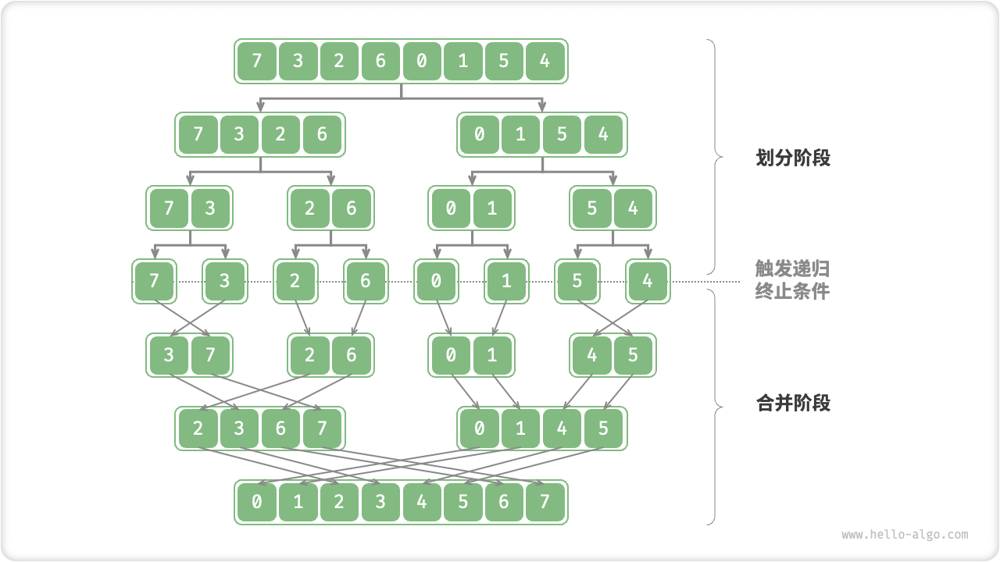

## 算法流程

“划分阶段”从顶至底递归地将数组从中点切为两个子数组：

1. 计算数组中点 `mid` ，递归划分左子数组（区间 `[left, mid]` ）和右子数组（区间 `[mid + 1, right]` ）。
2. 递归执行步骤 `1.` ，直至子数组区间长度为 1 时，终止递归划分。

“合并阶段”从底至顶地将左子数组和右子数组合并为一个有序数组。需要注意的是，从长度为 1 的子数组开始合并，合并阶段中的每个子数组都是有序的。

=== "<1>"
    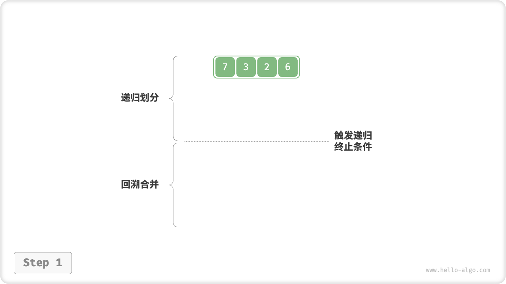

=== "<2>"
    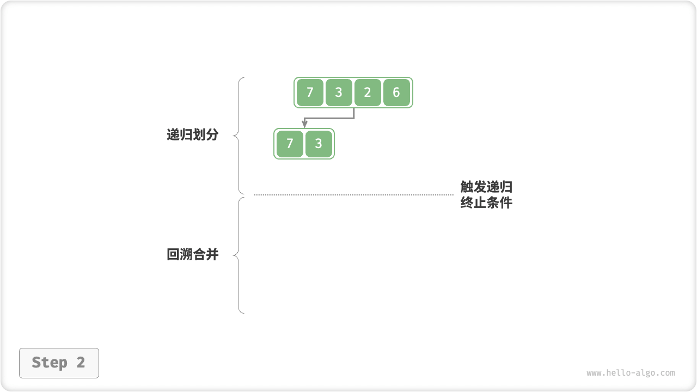

=== "<3>"
    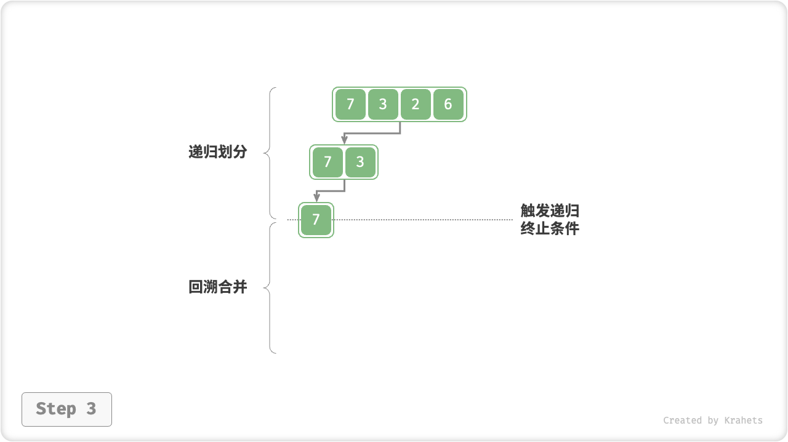

=== "<4>"
    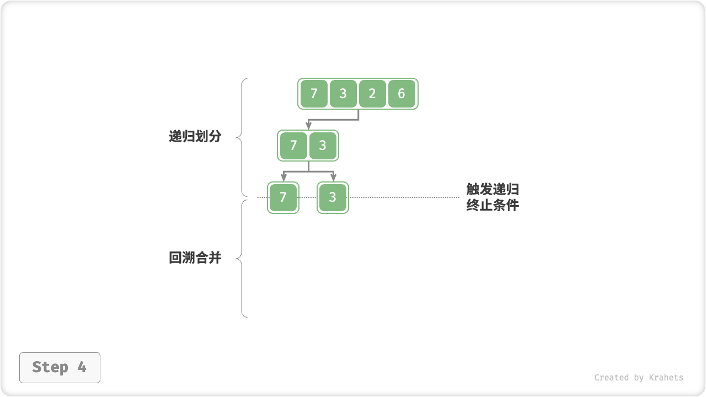

=== "<5>"
    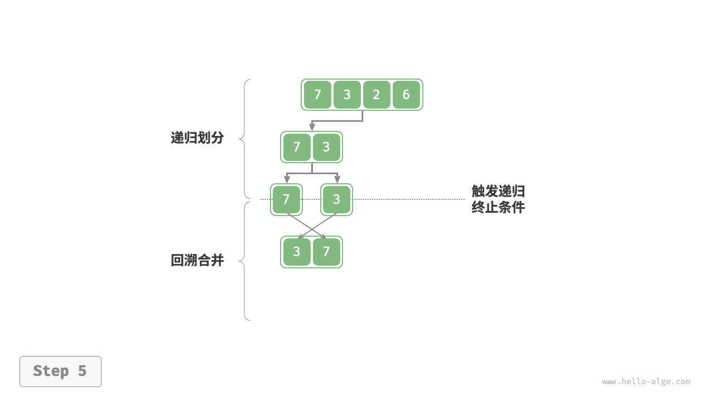

=== "<6>"
    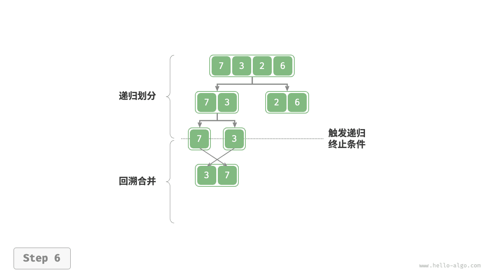

=== "<7>"
    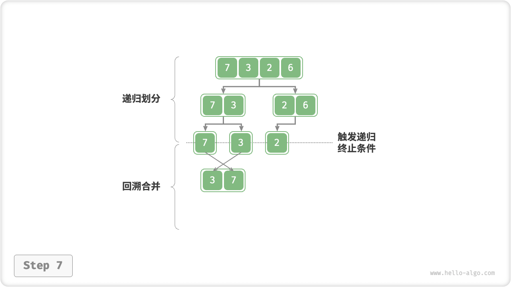

=== "<8>"
    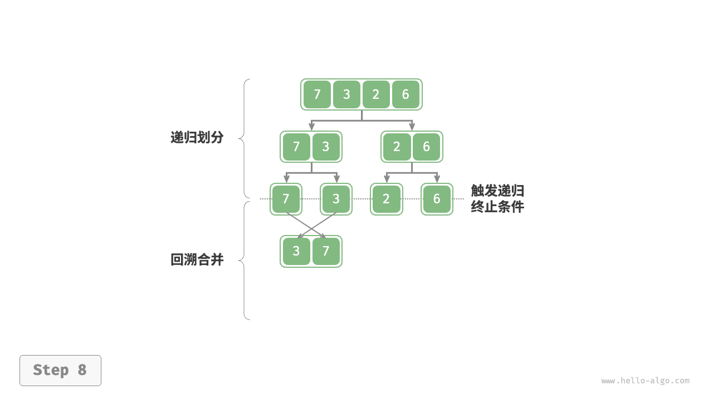

=== "<9>"
    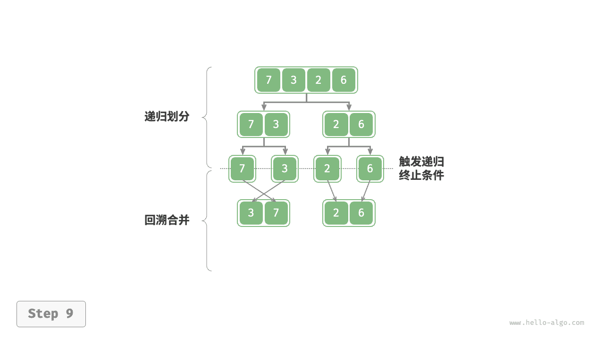

=== "<10>"
    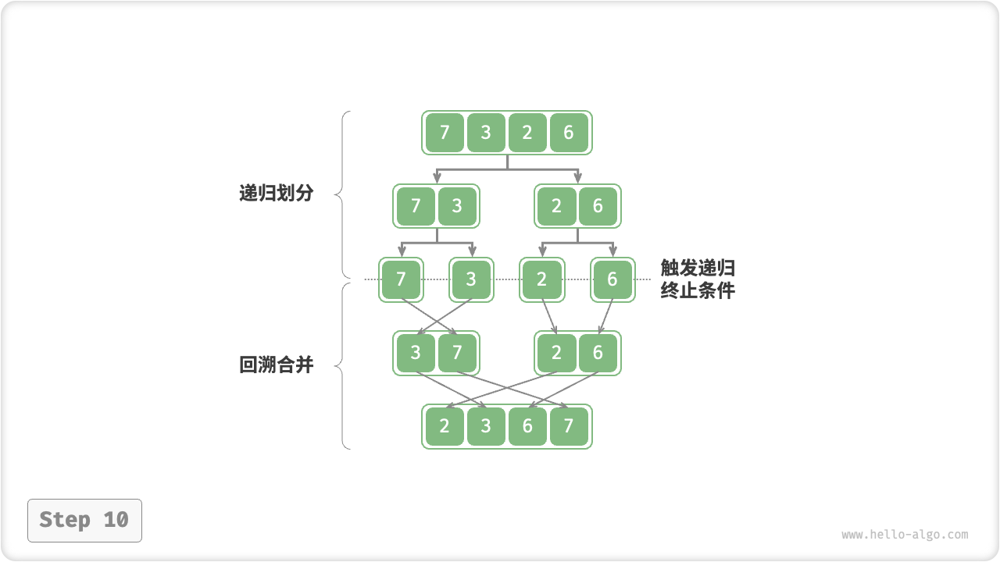

观察发现，归并排序的递归顺序与二叉树的后序遍历相同，具体来看：

- **后序遍历**：先递归左子树，再递归右子树，最后处理根节点。
- **归并排序**：先递归左子数组，再递归右子数组，最后处理合并。

=== "Java"

    ```java title="merge_sort.java"
    [class]{merge_sort}-[func]{merge}

    [class]{merge_sort}-[func]{mergeSort}
    ```

=== "C++"

    ```cpp title="merge_sort.cpp"
    [class]{}-[func]{merge}

    [class]{}-[func]{mergeSort}
    ```

=== "Python"

    ```python title="merge_sort.py"
    [class]{}-[func]{merge}

    [class]{}-[func]{merge_sort}
    ```

=== "Go"

    ```go title="merge_sort.go"
    [class]{}-[func]{merge}

    [class]{}-[func]{mergeSort}
    ```

=== "JS"

    ```javascript title="merge_sort.js"
    [class]{}-[func]{merge}

    [class]{}-[func]{mergeSort}
    ```

=== "TS"

    ```typescript title="merge_sort.ts"
    [class]{}-[func]{merge}

    [class]{}-[func]{mergeSort}
    ```

=== "C"

    ```c title="merge_sort.c"
    [class]{}-[func]{merge}

    [class]{}-[func]{mergeSort}
    ```

=== "C#"

    ```csharp title="merge_sort.cs"
    [class]{merge_sort}-[func]{merge}

    [class]{merge_sort}-[func]{mergeSort}
    ```

=== "Swift"

    ```swift title="merge_sort.swift"
    [class]{}-[func]{merge}

    [class]{}-[func]{mergeSort}
    ```

=== "Zig"

    ```zig title="merge_sort.zig"
    [class]{}-[func]{merge}

    [class]{}-[func]{mergeSort}
    ```

=== "Dart"

    ```dart title="merge_sort.dart"
    [class]{}-[func]{merge}

    [class]{}-[func]{mergeSort}
    ```

=== "Rust"

    ```rust title="merge_sort.rs"
    [class]{}-[func]{merge}

    [class]{}-[func]{merge_sort}
    ```

合并方法 `merge()` 代码中的难点包括：

- **在阅读代码时，需要特别注意各个变量的含义**。`nums` 的待合并区间为 `[left, right]` ，但由于 `tmp` 仅复制了 `nums` 该区间的元素，因此 `tmp` 对应区间为 `[0, right - left]` 。
- 在比较 `tmp[i]` 和 `tmp[j]` 的大小时，**还需考虑子数组遍历完成后的索引越界问题**，即 `i > leftEnd` 和 `j > rightEnd` 的情况。索引越界的优先级是最高的，如果左子数组已经被合并完了，那么不需要继续比较，直接合并右子数组元素即可。

## 算法特性

- **时间复杂度 $O(n \log n)$ 、非自适应排序** ：划分产生高度为 $\log n$ 的递归树，每层合并的总操作数量为 $n$ ，因此总体时间复杂度为 $O(n \log n)$ 。
- **空间复杂度 $O(n)$ 、非原地排序** ：递归深度为 $\log n$ ，使用 $O(\log n)$ 大小的栈帧空间。合并操作需要借助辅助数组实现，使用 $O(n)$ 大小的额外空间。
- **稳定排序**：在合并过程中，相等元素的次序保持不变。

## 链表排序 *

归并排序在排序链表时具有显著优势，空间复杂度可以优化至 $O(1)$ ，原因如下：

- 由于链表仅需改变指针就可实现节点的增删操作，因此合并阶段（将两个短有序链表合并为一个长有序链表）无需创建辅助链表。
- 通过使用“迭代划分”替代“递归划分”，可省去递归使用的栈帧空间。

具体实现细节比较复杂，有兴趣的同学可以查阅相关资料进行学习。
