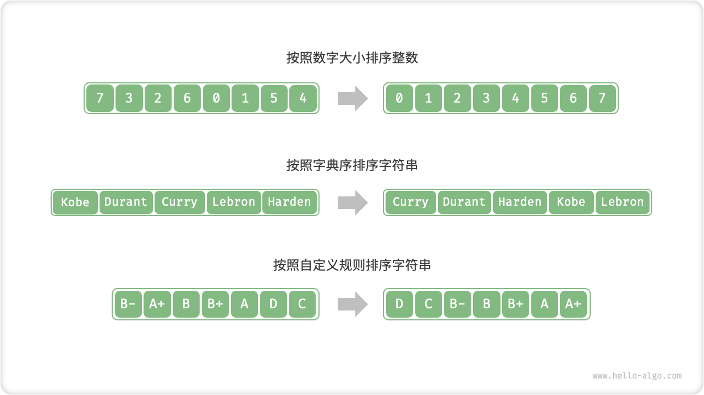

# 排序算法

<u>排序算法（sorting algorithm）</u>用于对一组数据按照特定顺序进行排列。排序算法有着广泛的应用，因为有序数据通常能够被更高效地查找、分析和处理。

如下图所示，排序算法中的数据类型可以是整数、浮点数、字符或字符串等。排序的判断规则可根据需求设定，如数字大小、字符 ASCII 码顺序或自定义规则。



## 评价维度

**运行效率**：我们期望排序算法的时间复杂度尽量低，且总体操作数量较少（时间复杂度中的常数项变小）。对于大数据量的情况，运行效率显得尤为重要。

**就地性**：顾名思义，<u>原地排序</u>通过在原数组上直接操作实现排序，无须借助额外的辅助数组，从而节省内存。通常情况下，原地排序的数据搬运操作较少，运行速度也更快。

**稳定性**：<u>稳定排序</u>在完成排序后，相等元素在数组中的相对顺序不发生改变。

稳定排序是多级排序场景的必要条件。假设我们有一个存储学生信息的表格，第 1 列和第 2 列分别是姓名和年龄。在这种情况下，<u>非稳定排序</u>可能导致输入数据的有序性丧失：

```shell
# 输入数据是按照姓名排序好的
# (name, age)
  ('A', 19)
  ('B', 18)
  ('C', 21)
  ('D', 19)
  ('E', 23)

# 假设使用非稳定排序算法按年龄排序列表，
# 结果中 ('D', 19) 和 ('A', 19) 的相对位置改变，
# 输入数据按姓名排序的性质丢失
  ('B', 18)
  ('D', 19)
  ('A', 19)
  ('C', 21)
  ('E', 23)
```

**自适应性**：<u>自适应排序</u>能够利用输入数据已有的顺序信息来减少计算量，达到更优的时间效率。自适应排序算法的最佳时间复杂度通常优于平均时间复杂度。

**是否基于比较**：<u>基于比较的排序</u>依赖比较运算符（$<$、$=$、$>$）来判断元素的相对顺序，从而排序整个数组，理论最优时间复杂度为 $O(n \log n)$ 。而<u>非比较排序</u>不使用比较运算符，时间复杂度可达 $O(n)$ ，但其通用性相对较差。

## 理想排序算法

**运行快、原地、稳定、自适应、通用性好**。显然，迄今为止尚未发现兼具以上所有特性的排序算法。因此，在选择排序算法时，需要根据具体的数据特点和问题需求来决定。

接下来，我们将共同学习各种排序算法，并基于上述评价维度对各个排序算法的优缺点进行分析。
