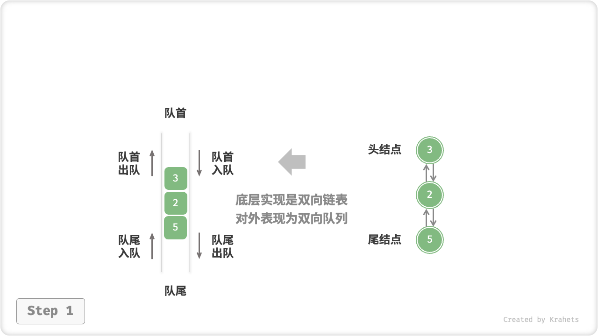
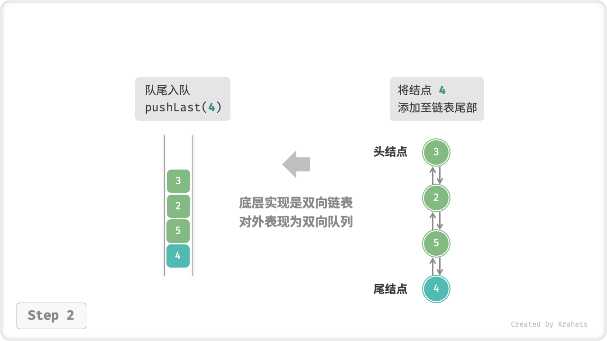
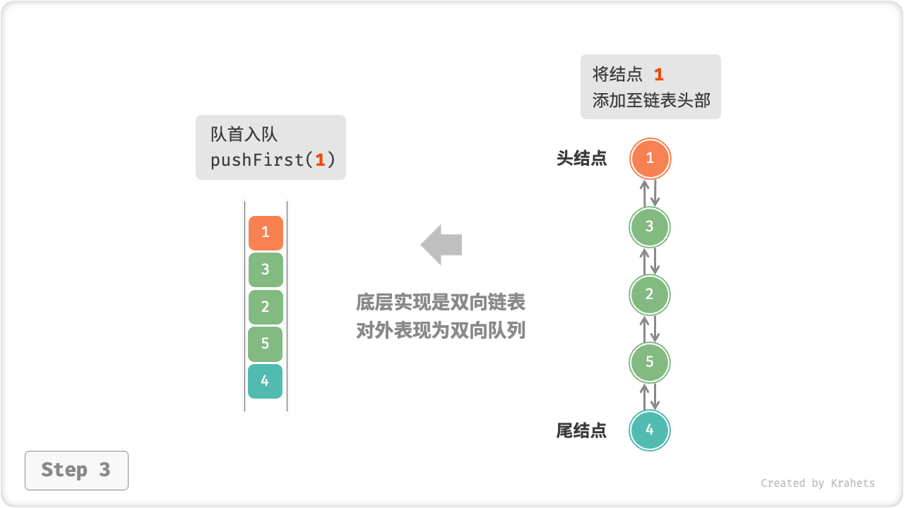
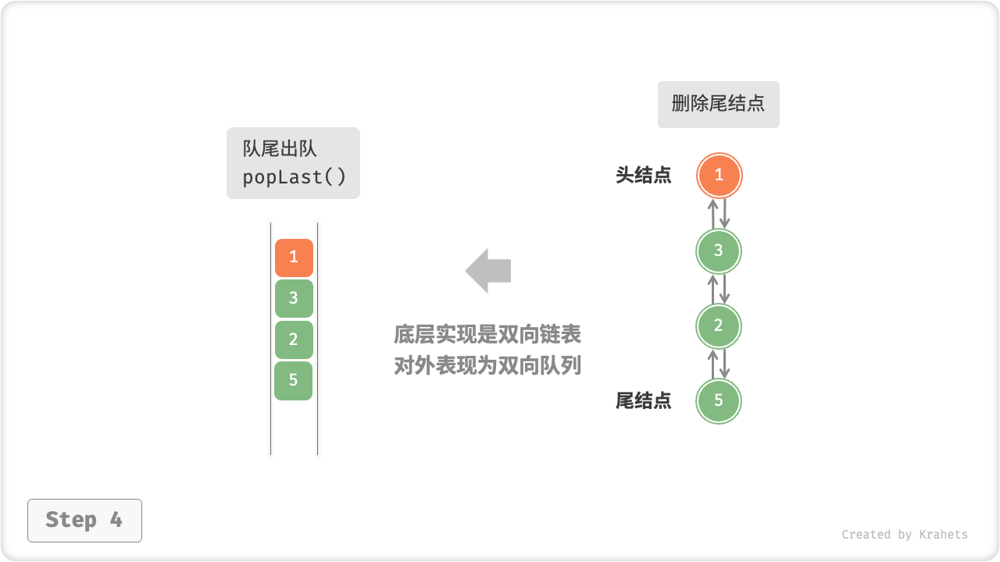
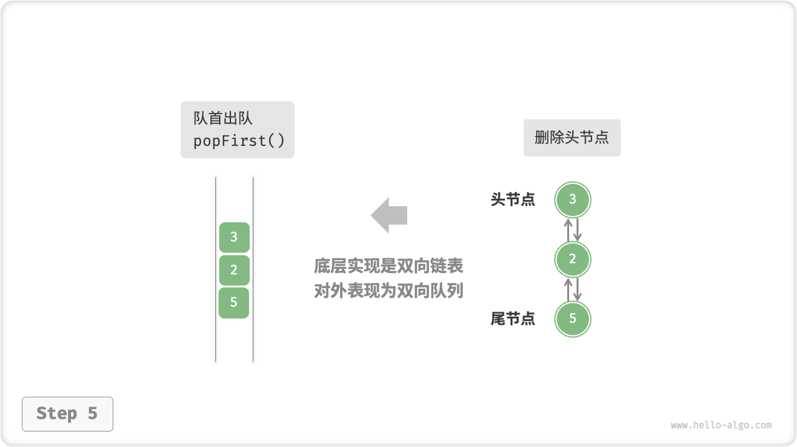
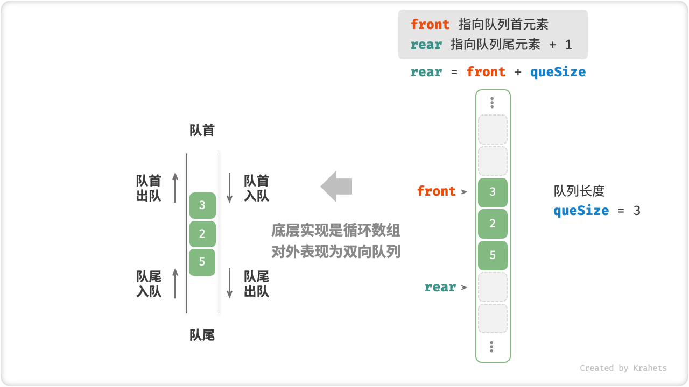
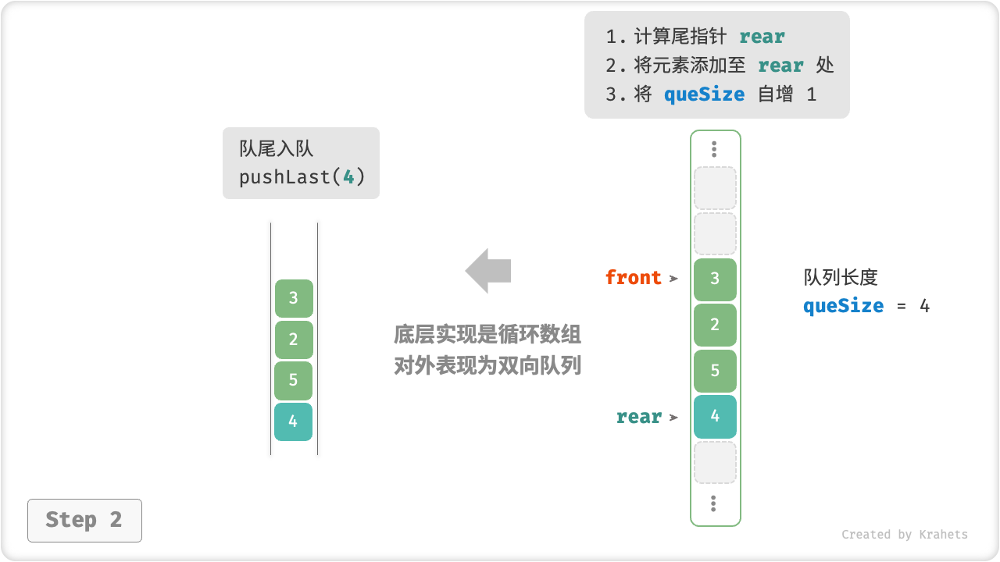
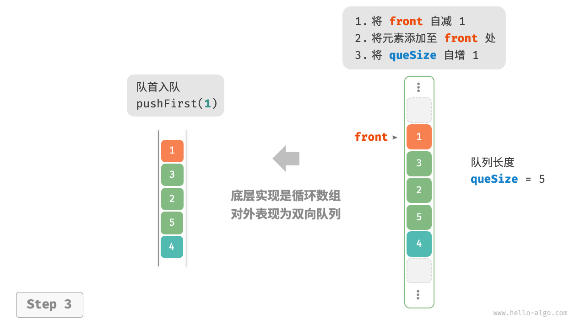
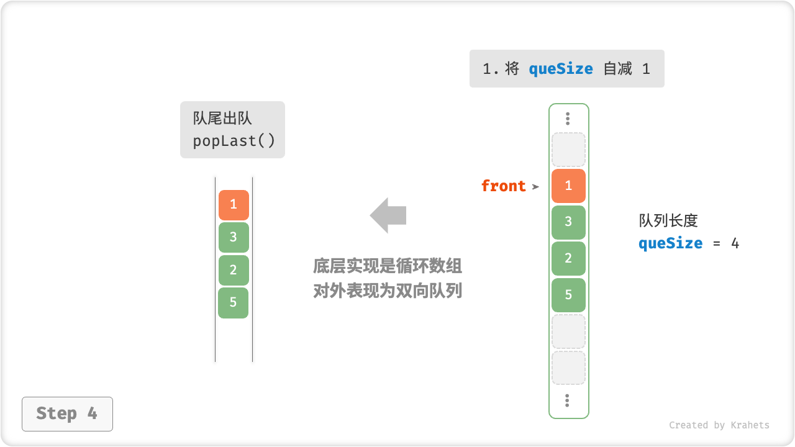

# 双向队列

在队列中，我们仅能在头部删除或在尾部添加元素。如下图所示，「双向队列 deque」提供了更高的灵活性，允许在头部和尾部执行元素的添加或删除操作。


## 双向队列常用操作

双向队列的常用操作如下表所示，具体的方法名称需要根据所使用的编程语言来确定。

<p align="center"> 表 <id> &nbsp; 双向队列操作效率 </p>

| 方法名       | 描述            | 时间复杂度 |
| ----------- | -------------- | ---------- |
| pushFirst() | 将元素添加至队首  | $O(1)$     |
| pushLast()  | 将元素添加至队尾  | $O(1)$     |
| popFirst()  | 删除队首元素     | $O(1)$     |
| popLast()   | 删除队尾元素     | $O(1)$     |
| peekFirst() | 访问队首元素     | $O(1)$     |
| peekLast()  | 访问队尾元素     | $O(1)$     |

同样地，我们可以直接使用编程语言中已实现的双向队列类。

=== "Python"

    ```python title="deque.py"
    # 初始化双向队列
    deque: deque[int] = collections.deque()
    
    # 元素入队
    deque.append(2)      # 添加至队尾
    deque.append(5)
    deque.append(4)
    deque.appendleft(3)  # 添加至队首
    deque.appendleft(1)
    
    # 访问元素
    front: int = deque[0]  # 队首元素
    rear: int = deque[-1]  # 队尾元素
    
    # 元素出队
    pop_front: int = deque.popleft()  # 队首元素出队
    pop_rear: int = deque.pop()       # 队尾元素出队
    
    # 获取双向队列的长度
    size: int = len(deque)
    
    # 判断双向队列是否为空
    is_empty: bool = len(deque) == 0
    ```

=== "C++"

    ```cpp title="deque.cpp"
    /* 初始化双向队列 */
    deque<int> deque;
    
    /* 元素入队 */
    deque.push_back(2);   // 添加至队尾
    deque.push_back(5);
    deque.push_back(4);
    deque.push_front(3);  // 添加至队首
    deque.push_front(1);
    
    /* 访问元素 */
    int front = deque.front(); // 队首元素
    int back = deque.back();   // 队尾元素
    
    /* 元素出队 */
    deque.pop_front();  // 队首元素出队
    deque.pop_back();   // 队尾元素出队
    
    /* 获取双向队列的长度 */
    int size = deque.size();
    
    /* 判断双向队列是否为空 */
    bool empty = deque.empty();
    ```

=== "Java"

    ```java title="deque.java"
    /* 初始化双向队列 */
    Deque<Integer> deque = new LinkedList<>();
    
    /* 元素入队 */
    deque.offerLast(2);   // 添加至队尾
    deque.offerLast(5);
    deque.offerLast(4);
    deque.offerFirst(3);  // 添加至队首
    deque.offerFirst(1);
    
    /* 访问元素 */
    int peekFirst = deque.peekFirst();  // 队首元素
    int peekLast = deque.peekLast();    // 队尾元素
    
    /* 元素出队 */
    int popFirst = deque.pollFirst();  // 队首元素出队
    int popLast = deque.pollLast();    // 队尾元素出队
    
    /* 获取双向队列的长度 */
    int size = deque.size();
    
    /* 判断双向队列是否为空 */
    boolean isEmpty = deque.isEmpty();
    ```

=== "C#"

    ```csharp title="deque.cs"
    /* 初始化双向队列 */
    // 在 C# 中，将链表 LinkedList 看作双向队列来使用
    LinkedList<int> deque = new LinkedList<int>();
    
    /* 元素入队 */
    deque.AddLast(2);   // 添加至队尾
    deque.AddLast(5);
    deque.AddLast(4);
    deque.AddFirst(3);  // 添加至队首
    deque.AddFirst(1);
    
    /* 访问元素 */
    int peekFirst = deque.First.Value;  // 队首元素
    int peekLast = deque.Last.Value;    // 队尾元素
    
    /* 元素出队 */
    deque.RemoveFirst();  // 队首元素出队
    deque.RemoveLast();   // 队尾元素出队
    
    /* 获取双向队列的长度 */
    int size = deque.Count;
    
    /* 判断双向队列是否为空 */
    bool isEmpty = deque.Count == 0;
    ```

=== "Go"

    ```go title="deque_test.go"
    /* 初始化双向队列 */
    // 在 Go 中，将 list 作为双向队列使用
    deque := list.New()
    
    /* 元素入队 */
    deque.PushBack(2)      // 添加至队尾
    deque.PushBack(5)
    deque.PushBack(4)
    deque.PushFront(3)     // 添加至队首
    deque.PushFront(1)
    
    /* 访问元素 */
    front := deque.Front() // 队首元素
    rear := deque.Back()   // 队尾元素
    
    /* 元素出队 */
    deque.Remove(front)    // 队首元素出队
    deque.Remove(rear)     // 队尾元素出队
    
    /* 获取双向队列的长度 */
    size := deque.Len()
    
    /* 判断双向队列是否为空 */
    isEmpty := deque.Len() == 0
    ```

=== "Swift"

    ```swift title="deque.swift"
    /* 初始化双向队列 */
    // Swift 没有内置的双向队列类，可以把 Array 当作双向队列来使用
    var deque: [Int] = []

    /* 元素入队 */
    deque.append(2) // 添加至队尾
    deque.append(5)
    deque.append(4)
    deque.insert(3, at: 0) // 添加至队首
    deque.insert(1, at: 0)

    /* 访问元素 */
    let peekFirst = deque.first! // 队首元素
    let peekLast = deque.last! // 队尾元素

    /* 元素出队 */
    // 使用 Array 模拟时 popFirst 的复杂度为 O(n)
    let popFirst = deque.removeFirst() // 队首元素出队
    let popLast = deque.removeLast() // 队尾元素出队

    /* 获取双向队列的长度 */
    let size = deque.count

    /* 判断双向队列是否为空 */
    let isEmpty = deque.isEmpty
    ```

=== "JS"

    ```javascript title="deque.js"
    /* 初始化双向队列 */
    // JavaScript 没有内置的双端队列，只能把 Array 当作双端队列来使用
    const deque = [];

    /* 元素入队 */
    deque.push(2);
    deque.push(5);
    deque.push(4);
    // 请注意，由于是数组，unshift() 方法的时间复杂度为 O(n)
    deque.unshift(3);
    deque.unshift(1);
    console.log("双向队列 deque = ", deque);

    /* 访问元素 */
    const peekFirst = deque[0];
    console.log("队首元素 peekFirst = " + peekFirst);
    const peekLast = deque[deque.length - 1];
    console.log("队尾元素 peekLast = " + peekLast);

    /* 元素出队 */
    // 请注意，由于是数组，shift() 方法的时间复杂度为 O(n)
    const popFront = deque.shift();
    console.log("队首出队元素 popFront = " + popFront + "，队首出队后 deque = " + deque);
    const popBack = deque.pop();
    console.log("队尾出队元素 popBack = " + popBack + "，队尾出队后 deque = " + deque);

    /* 获取双向队列的长度 */
    const size = deque.length;
    console.log("双向队列长度 size = " + size);

    /* 判断双向队列是否为空 */
    const isEmpty = size === 0;
    console.log("双向队列是否为空 = " + isEmpty);
    ```

=== "TS"

    ```typescript title="deque.ts"
    /* 初始化双向队列 */
    // TypeScript 没有内置的双端队列，只能把 Array 当作双端队列来使用
    const deque: number[] = [];

    /* 元素入队 */
    deque.push(2);
    deque.push(5);
    deque.push(4);
    // 请注意，由于是数组，unshift() 方法的时间复杂度为 O(n)
    deque.unshift(3);
    deque.unshift(1);
    console.log("双向队列 deque = ", deque);

    /* 访问元素 */
    const peekFirst: number = deque[0];
    console.log("队首元素 peekFirst = " + peekFirst);
    const peekLast: number = deque[deque.length - 1];
    console.log("队尾元素 peekLast = " + peekLast);

    /* 元素出队 */
    // 请注意，由于是数组，shift() 方法的时间复杂度为 O(n)
    const popFront: number = deque.shift() as number;
    console.log("队首出队元素 popFront = " + popFront + "，队首出队后 deque = " + deque);
    const popBack: number = deque.pop() as number;
    console.log("队尾出队元素 popBack = " + popBack + "，队尾出队后 deque = " + deque);

    /* 获取双向队列的长度 */
    const size: number = deque.length;
    console.log("双向队列长度 size = " + size);

    /* 判断双向队列是否为空 */
    const isEmpty: boolean = size === 0;
    console.log("双向队列是否为空 = " + isEmpty);
    ```

=== "Dart"

    ```dart title="deque.dart"
    /* 初始化双向队列 */
    // 在 Dart 中，Queue 被定义为双向队列
    Queue<int> deque = Queue<int>();

    /* 元素入队 */
    deque.addLast(2);  // 添加至队尾
    deque.addLast(5);
    deque.addLast(4);
    deque.addFirst(3); // 添加至队首
    deque.addFirst(1);

    /* 访问元素 */
    int peekFirst = deque.first; // 队首元素
    int peekLast = deque.last;   // 队尾元素

    /* 元素出队 */
    int popFirst = deque.removeFirst(); // 队首元素出队
    int popLast = deque.removeLast();   // 队尾元素出队

    /* 获取双向队列的长度 */
    int size = deque.length;

    /* 判断双向队列是否为空 */
    bool isEmpty = deque.isEmpty;W
    ```

=== "Rust"

    ```rust title="deque.rs"

    ```

=== "C"

    ```c title="deque.c"
    // C 未提供内置双向队列
    ```

=== "Zig"

    ```zig title="deque.zig"

    ```

## 双向队列实现 *

双向队列的实现与队列类似，可以选择链表或数组作为底层数据结构。

### 基于双向链表的实现

回顾上一节内容，我们使用普通单向链表来实现队列，因为它可以方便地删除头节点（对应出队操作）和在尾节点后添加新节点（对应入队操作）。

对于双向队列而言，头部和尾部都可以执行入队和出队操作。换句话说，双向队列需要实现另一个对称方向的操作。为此，我们采用“双向链表”作为双向队列的底层数据结构。

如下图所示，我们将双向链表的头节点和尾节点视为双向队列的队首和队尾，同时实现在两端添加和删除节点的功能。

=== "LinkedListDeque"
    

=== "pushLast()"
    

=== "pushFirst()"
    

=== "popLast()"
    

=== "popFirst()"
    

实现代码如下所示。

=== "Python"

    ```python title="linkedlist_deque.py"
    [class]{ListNode}-[func]{}

    [class]{LinkedListDeque}-[func]{}
    ```

=== "C++"

    ```cpp title="linkedlist_deque.cpp"
    [class]{DoublyListNode}-[func]{}

    [class]{LinkedListDeque}-[func]{}
    ```

=== "Java"

    ```java title="linkedlist_deque.java"
    [class]{ListNode}-[func]{}

    [class]{LinkedListDeque}-[func]{}
    ```

=== "C#"

    ```csharp title="linkedlist_deque.cs"
    [class]{ListNode}-[func]{}

    [class]{LinkedListDeque}-[func]{}
    ```

=== "Go"

    ```go title="linkedlist_deque.go"
    [class]{linkedListDeque}-[func]{}
    ```

=== "Swift"

    ```swift title="linkedlist_deque.swift"
    [class]{ListNode}-[func]{}

    [class]{LinkedListDeque}-[func]{}
    ```

=== "JS"

    ```javascript title="linkedlist_deque.js"
    [class]{ListNode}-[func]{}

    [class]{LinkedListDeque}-[func]{}
    ```

=== "TS"

    ```typescript title="linkedlist_deque.ts"
    [class]{ListNode}-[func]{}

    [class]{LinkedListDeque}-[func]{}
    ```

=== "Dart"

    ```dart title="linkedlist_deque.dart"
    [class]{ListNode}-[func]{}

    [class]{LinkedListDeque}-[func]{}
    ```

=== "Rust"

    ```rust title="linkedlist_deque.rs"
    [class]{ListNode}-[func]{}

    [class]{LinkedListDeque}-[func]{}
    ```

=== "C"

    ```c title="linkedlist_deque.c"
    [class]{doublyListNode}-[func]{}

    [class]{linkedListDeque}-[func]{}
    ```

=== "Zig"

    ```zig title="linkedlist_deque.zig"
    [class]{ListNode}-[func]{}

    [class]{LinkedListDeque}-[func]{}
    ```

### 基于数组的实现

如下图所示，与基于数组实现队列类似，我们也可以使用环形数组来实现双向队列。

=== "ArrayDeque"
    

=== "pushLast()"
    

=== "pushFirst()"
    

=== "popLast()"
    

=== "popFirst()"
    

在队列的实现基础上，仅需增加“队首入队”和“队尾出队”的方法。

=== "Python"

    ```python title="array_deque.py"
    [class]{ArrayDeque}-[func]{}
    ```

=== "C++"

    ```cpp title="array_deque.cpp"
    [class]{ArrayDeque}-[func]{}
    ```

=== "Java"

    ```java title="array_deque.java"
    [class]{ArrayDeque}-[func]{}
    ```

=== "C#"

    ```csharp title="array_deque.cs"
    [class]{ArrayDeque}-[func]{}
    ```

=== "Go"

    ```go title="array_deque.go"
    [class]{arrayDeque}-[func]{}
    ```

=== "Swift"

    ```swift title="array_deque.swift"
    [class]{ArrayDeque}-[func]{}
    ```

=== "JS"

    ```javascript title="array_deque.js"
    [class]{ArrayDeque}-[func]{}
    ```

=== "TS"

    ```typescript title="array_deque.ts"
    [class]{ArrayDeque}-[func]{}
    ```

=== "Dart"

    ```dart title="array_deque.dart"
    [class]{ArrayDeque}-[func]{}
    ```

=== "Rust"

    ```rust title="array_deque.rs"
    [class]{ArrayDeque}-[func]{}
    ```

=== "C"

    ```c title="array_deque.c"
    [class]{arrayDeque}-[func]{}
    ```

=== "Zig"

    ```zig title="array_deque.zig"
    [class]{ArrayDeque}-[func]{}
    ```

## 双向队列应用

双向队列兼具栈与队列的逻辑，**因此它可以实现这两者的所有应用场景，同时提供更高的自由度**。

我们知道，软件的“撤销”功能通常使用栈来实现：系统将每次更改操作 `push` 到栈中，然后通过 `pop` 实现撤销。然而，考虑到系统资源的限制，软件通常会限制撤销的步数（例如仅允许保存 $50$ 步）。当栈的长度超过 $50$ 时，软件需要在栈底（即队首）执行删除操作。**但栈无法实现该功能，此时就需要使用双向队列来替代栈**。请注意，“撤销”的核心逻辑仍然遵循栈的先入后出原则，只是双向队列能够更加灵活地实现一些额外逻辑。
