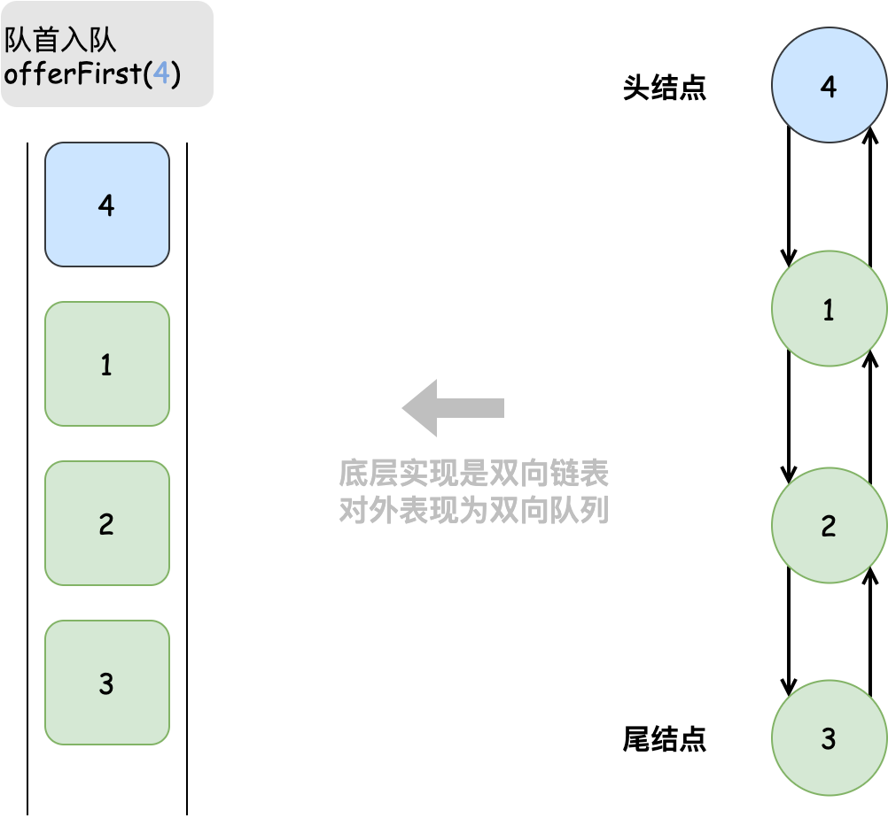
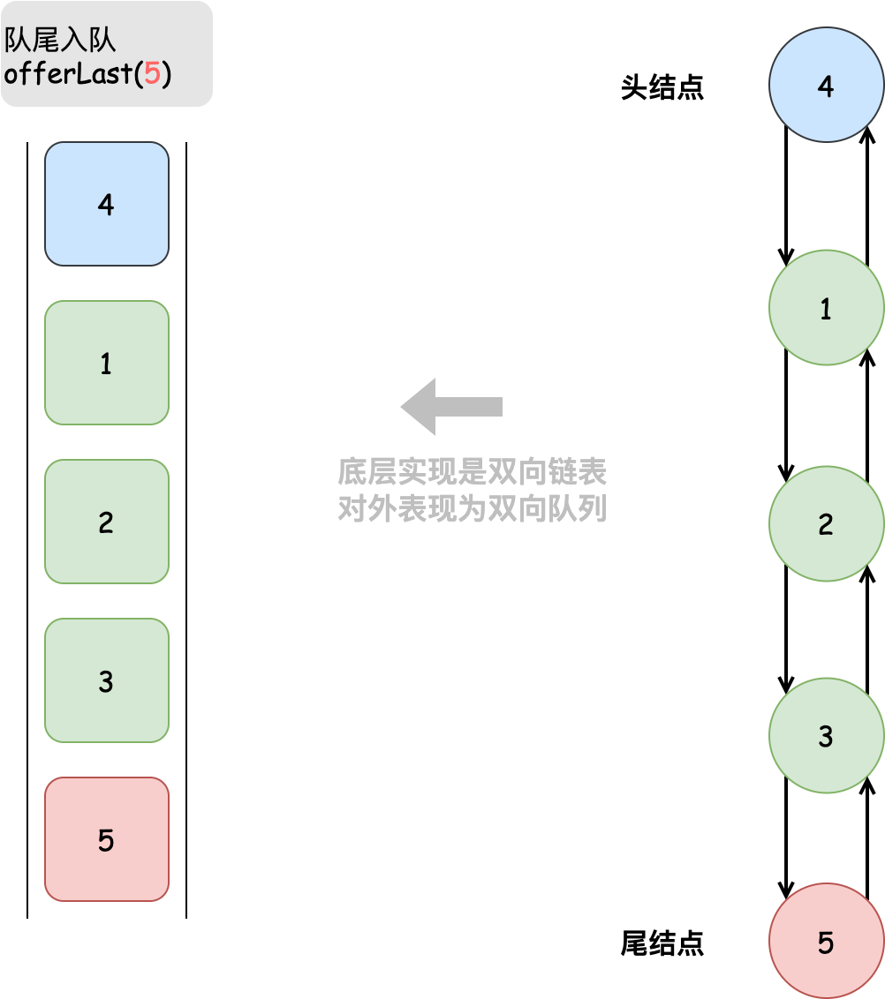

# 双向队列

对于队列，我们只能在头部删除或在尾部添加元素，而「双向队列 Deque」更加灵活，在其头部和尾部都能执行元素添加或删除操作。


<p align="center"> Fig. 双向队列的操作 </p>

## 双向队列常用操作

双向队列的常用操作见下表（方法命名以 Java 为例）。

<p align="center"> Table. 双向队列的常用操作 </p>

<div class="center-table" markdown>

| 方法         | 描述             | 时间复杂度 |
| ------------ | ---------------- | ---------- |
| offerFirst() | 将元素添加至队首 | $O(1)$     |
| offerLast()  | 将元素添加至队尾 | $O(1)$     |
| pollFirst()  | 删除队首元素     | $O(1)$     |
| pollLast()   | 删除队尾元素     | $O(1)$     |
| peekFirst()  | 访问队首元素     | $O(1)$     |
| peekLast()   | 访问队尾元素     | $O(1)$     |
| size()       | 获取队列的长度   | $O(1)$     |
| isEmpty()    | 判断队列是否为空 | $O(1)$     |

</div>

相同地，我们可以直接使用编程语言实现好的双向队列类。

=== "Java"

    ```java title="deque.java"
    /* 初始化双向队列 */
    Deque<Integer> deque = new LinkedList<>();
    
    /* 元素入队 */
    deque.offerLast(2);   // 添加至队尾
    deque.offerLast(5);
    deque.offerLast(4);
    deque.offerFirst(3);  // 添加至队首
    deque.offerFirst(1);
    
    /* 访问元素 */
    int peekFirst = deque.peekFirst();  // 队首元素
    int peekLast = deque.peekLast();    // 队尾元素
    
    /* 元素出队 */
    int pollFirst = deque.pollFirst();  // 队首元素出队
    int pollLast = deque.pollLast();    // 队尾元素出队
    
    /* 获取双向队列的长度 */
    int size = deque.size();
    
    /* 判断双向队列是否为空 */
    boolean isEmpty = deque.isEmpty();
    ```

=== "C++"

    ```cpp title="deque.cpp"
    /* 初始化双向队列 */
    deque<int> deque;
    
    /* 元素入队 */
    deque.push_back(2);   // 添加至队尾
    deque.push_back(5);
    deque.push_back(4);
    deque.push_front(3);  // 添加至队首
    deque.push_front(1);
    
    /* 访问元素 */
    int front = deque.front(); // 队首元素
    int back = deque.back();   // 队尾元素
    
    /* 元素出队 */
    deque.pop_front();  // 队首元素出队
    deque.pop_back();   // 队尾元素出队
    
    /* 获取双向队列的长度 */
    int size = deque.size();
    
    /* 判断双向队列是否为空 */
    bool empty = deque.empty();
    ```

=== "Python"

    ```python title="deque.py"
    """ 初始化双向队列 """
    duque = deque()
    
    """ 元素入队 """
    duque.append(2)      # 添加至队尾
    duque.append(5)
    duque.append(4)
    duque.appendleft(3)  # 添加至队首
    duque.appendleft(1)
    
    """ 访问元素 """
    front = duque[0]  # 队首元素
    rear = duque[-1]  # 队尾元素
    
    """ 元素出队 """
    pop_front = duque.popleft()  # 队首元素出队
    pop_rear = duque.pop()       # 队尾元素出队
    
    """ 获取双向队列的长度 """
    size = len(duque)
    
    """ 判断双向队列是否为空 """
    is_empty = len(duque) == 0
    ```

=== "Go"

    ```go title="deque_test.go"
    /* 初始化双向队列 */
    // 在 Go 中，将 list 作为双向队列使用
    deque := list.New()
    
    /* 元素入队 */
    deque.PushBack(2)      // 添加至队尾
    deque.PushBack(5)
    deque.PushBack(4)
    deque.PushFront(3)     // 添加至队首
    deque.PushFront(1)
    
    /* 访问元素 */
    front := deque.Front() // 队首元素
    rear := deque.Back()   // 队尾元素
    
    /* 元素出队 */
    deque.Remove(front)    // 队首元素出队
    deque.Remove(rear)     // 队尾元素出队
    
    /* 获取双向队列的长度 */
    size := deque.Len()
    
    /* 判断双向队列是否为空 */
    isEmpty := deque.Len() == 0
    ```

=== "JavaScript"

    ```js title="deque.js"
    
    ```

=== "TypeScript"

    ```typescript title="deque.ts"
    
    ```

=== "C"

    ```c title="deque.c"
    
    ```

=== "C#"

    ```csharp title="deque.cs"
    /* 初始化双向队列 */
    // 在 C# 中，将链表 LinkedList 看作双向队列来使用
    LinkedList<int> deque = new LinkedList<int>();
    
    /* 元素入队 */
    deque.AddLast(2);   // 添加至队尾
    deque.AddLast(5);
    deque.AddLast(4);
    deque.AddFirst(3);  // 添加至队首
    deque.AddFirst(1);
    
    /* 访问元素 */
    int peekFirst = deque.First.Value;  // 队首元素
    int peekLast = deque.Last.Value;    // 队尾元素
    
    /* 元素出队 */
    deque.RemoveFirst();  // 队首元素出队
    deque.RemoveLast();   // 队尾元素出队
    
    /* 获取双向队列的长度 */
    int size = deque.Count;
    
    /* 判断双向队列是否为空 */
    bool isEmpty = deque.Count == 0;
    ```

=== "Swift"

    ```swift title="deque.swift"
    /* 初始化双向队列 */
    // Swift 没有内置的双向队列类，可以把 Array 当作双向队列来使用
    var deque: [Int] = []

    /* 元素入队 */
    deque.append(2) // 添加至队尾
    deque.append(5)
    deque.append(4)
    deque.insert(3, at: 0) // 添加至队首
    deque.insert(1, at: 0)

    /* 访问元素 */
    let peekFirst = deque.first! // 队首元素
    let peekLast = deque.last! // 队尾元素

    /* 元素出队 */
    // 使用 Array 模拟时 pollFirst 的复杂度为 O(n)
    let pollFirst = deque.removeFirst() // 队首元素出队
    let pollLast = deque.removeLast() // 队尾元素出队

    /* 获取双向队列的长度 */
    let size = deque.count

    /* 判断双向队列是否为空 */
    let isEmpty = deque.isEmpty
    ```

## 双向队列实现

双向队列需要一种可以在两端添加、两端删除的数据结构，可以使用双向链表和数组来实现。

### 基于双向链表的实现
我们将双向链表的「头结点」和「尾结点」分别看作双向队列的队首和队尾，并且队首和队尾都能添加和删除结点。

=== "LinkedListDeque"
    

=== "offerFirst()"
    

=== "offerLast()"
    

=== "pollFirst()"
    

=== "pollLast()"
    

以下是使用双向链表实现双向队列的示例代码。

=== "Java"

    ```java title="linkedlist_deque_fy.java"
    /* 基于双向链表实现的双向队列 */
    class LinkedListDeque {
    
        /* 双向链表结点 */
        private static class ListNode {
            int val; // 结点值
            ListNode prev; // 前驱结点引用（指针）
            ListNode next; // 后继结点引用（指针）
    
            public ListNode(int val) {
                this.val = val;
                prev = next = null;
    
            }
        }
    
        private ListNode front, rear; // 头结点 front ，尾结点 rear
        private int size = 0; // 双向队列的长度
    
        public LinkedListDeque() {
            front = rear = null;
        }
    
        /* 获取双向队列的长度 */
        public int size() {
            return size;
        }
    
        /* 判断双向队列是否为空 */
        public boolean isEmpty() {
            return size() == 0;
        }
    
        /* 从队首入队 */
        public void offerFirst(int num) {
            // 创建结点作为新的头结点
            ListNode newFront = new ListNode(num);
    
            // 如果队列长度为0，需令头、尾结点都指向该结点
            if (size() == 0) {
                front = rear = newFront;
            } else {
                // 将新头结点添加至链表头部
                front.prev = newFront;
                newFront.next = front;
    
                // 头结点指针指向新头结点
                front = newFront;
            }
    
            // 更新队列长度
            size++;
        }
    
        /* 从队尾入队 */
        public void offerLast(int num) {
            // 创建结点作为新的尾结点
            ListNode newRear = new ListNode(num);
    
            // 如果队列长度为0，需令头、尾结点都指向该结点
            if (size() == 0) {
                front = rear = newRear;
            } else {
                // 将新尾结点添加至链表尾部
                rear.next = newRear;
                newRear.prev = rear;
    
                // 尾结点指针指向新尾结点
                rear = newRear;
            }
    
            // 更新队列长度
            size++;
        }
    
        /* 从队首出队 */
        public Integer pollFirst() {
            if (size() != 0) {
                // 暂存头结点值
                int num = peekFirst();
    
                // 记录头结点的后继结点，它将作为新头结点
                ListNode next = front.next;
                // 删除原头结点
                if (next != null) {
                    front.next = null;
                    next.prev = null;
                }
    
                // 头结点指针指向新的头结点
                front = next;
    
                // 更新队列长度
                size--;
    
                return num;
            }
    
            return null;
        }
    
        /* 从队尾出队 */
        public Integer pollLast() {
            if (size() != 0) {
                // 暂存尾结点值
                int num = peekLast();
    
                // 记录尾结点的前驱结点，它将作为新尾结点
                ListNode prev = rear.prev;
                // 删除原尾结点
                if (prev != null) {
                    rear.prev = null;
                    prev.next = null;
                }
    
                // 尾结点指针指向新的尾结点
                rear = prev;
    
                // 更新队列长度
                size--;
    
                return num;
            }
    
            return null;
        }
    
        /* 访问队首元素 */
        public Integer peekFirst() {
            return front != null ? front.val : null;
        }
    
        /* 访问队尾元素 */
        public Integer peekLast() {
            return rear != null ? rear.val : null;
        }
    
    }
    ```

=== "C++"


=== "Python"


=== "Go"


=== "JavaScript"


=== "TypeScript"


=== "C"


=== "C#"


=== "Swift"