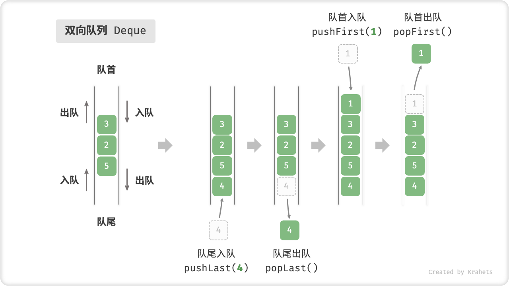
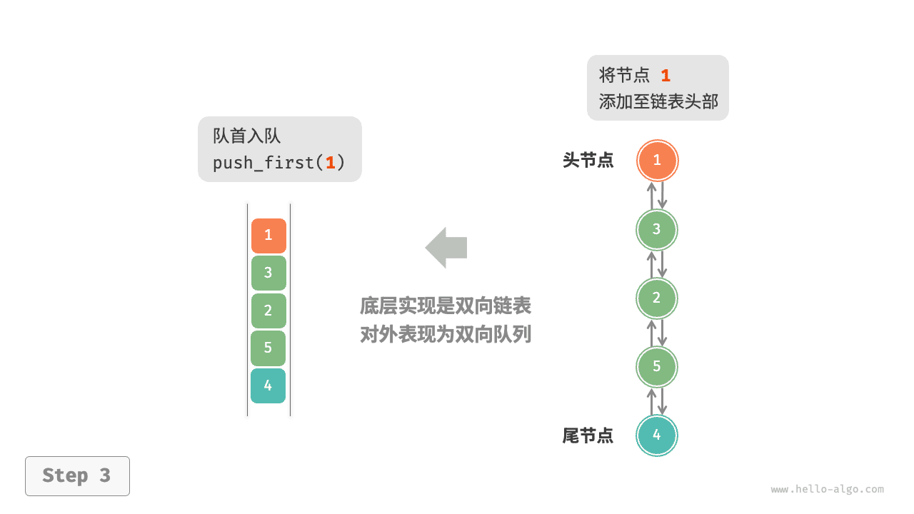
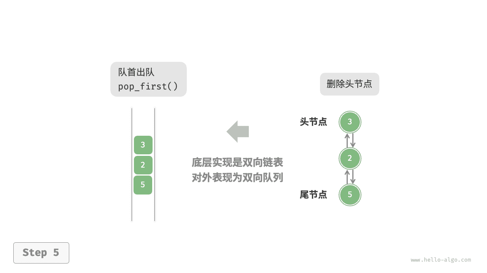
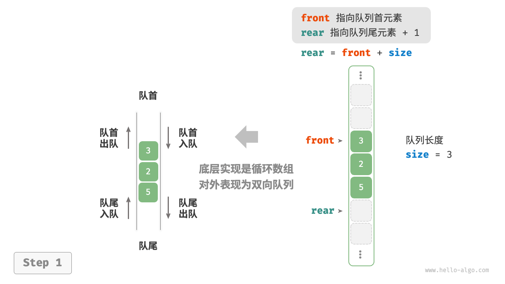
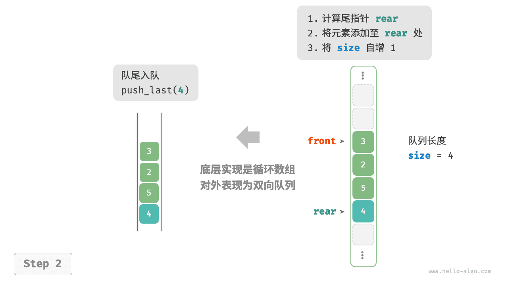
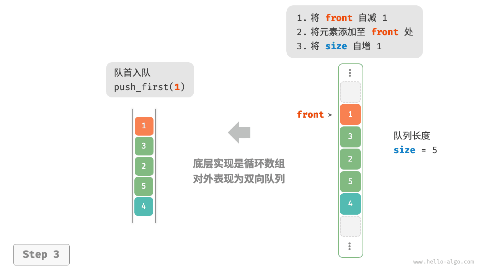
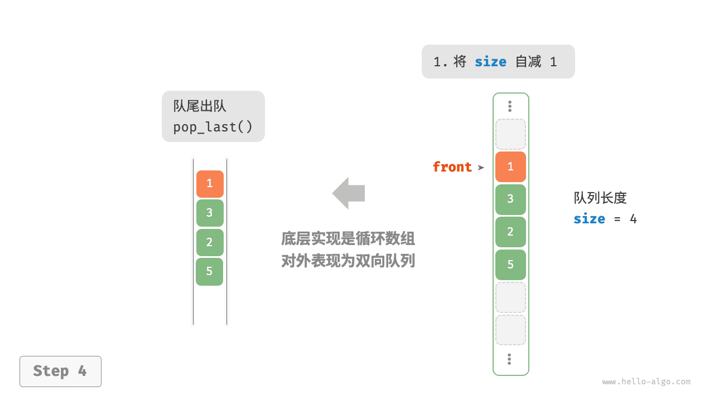

# 双向队列

在队列中，我们仅能删除头部元素或在尾部添加元素。如下图所示，<u>双向队列（double-ended queue）</u>提供了更高的灵活性，允许在头部和尾部执行元素的添加或删除操作。



## 双向队列常用操作

双向队列的常用操作如下表所示，具体的方法名称需要根据所使用的编程语言来确定。

<p align="center"> 表 <id> &nbsp; 双向队列操作效率 </p>

| 方法名         | 描述             | 时间复杂度 |
| -------------- | ---------------- | ---------- |
| `push_first()` | 将元素添加至队首 | $O(1)$     |
| `push_last()`  | 将元素添加至队尾 | $O(1)$     |
| `pop_first()`  | 删除队首元素     | $O(1)$     |
| `pop_last()`   | 删除队尾元素     | $O(1)$     |
| `peek_first()` | 访问队首元素     | $O(1)$     |
| `peek_last()`  | 访问队尾元素     | $O(1)$     |

同样地，我们可以直接使用编程语言中已实现的双向队列类：

=== "Python"

    ```python title="deque.py"
    from collections import deque

    # 初始化双向队列
    deque: deque[int] = deque()

    # 元素入队
    deque.append(2)      # 添加至队尾
    deque.append(5)
    deque.append(4)
    deque.appendleft(3)  # 添加至队首
    deque.appendleft(1)

    # 访问元素
    front: int = deque[0]  # 队首元素
    rear: int = deque[-1]  # 队尾元素

    # 元素出队
    pop_front: int = deque.popleft()  # 队首元素出队
    pop_rear: int = deque.pop()       # 队尾元素出队

    # 获取双向队列的长度
    size: int = len(deque)

    # 判断双向队列是否为空
    is_empty: bool = len(deque) == 0
    ```

=== "C++"

    ```cpp title="deque.cpp"
    /* 初始化双向队列 */
    deque<int> deque;

    /* 元素入队 */
    deque.push_back(2);   // 添加至队尾
    deque.push_back(5);
    deque.push_back(4);
    deque.push_front(3);  // 添加至队首
    deque.push_front(1);

    /* 访问元素 */
    int front = deque.front(); // 队首元素
    int back = deque.back();   // 队尾元素

    /* 元素出队 */
    deque.pop_front();  // 队首元素出队
    deque.pop_back();   // 队尾元素出队

    /* 获取双向队列的长度 */
    int size = deque.size();

    /* 判断双向队列是否为空 */
    bool empty = deque.empty();
    ```

=== "Java"

    ```java title="deque.java"
    /* 初始化双向队列 */
    Deque<Integer> deque = new LinkedList<>();

    /* 元素入队 */
    deque.offerLast(2);   // 添加至队尾
    deque.offerLast(5);
    deque.offerLast(4);
    deque.offerFirst(3);  // 添加至队首
    deque.offerFirst(1);

    /* 访问元素 */
    int peekFirst = deque.peekFirst();  // 队首元素
    int peekLast = deque.peekLast();    // 队尾元素

    /* 元素出队 */
    int popFirst = deque.pollFirst();  // 队首元素出队
    int popLast = deque.pollLast();    // 队尾元素出队

    /* 获取双向队列的长度 */
    int size = deque.size();

    /* 判断双向队列是否为空 */
    boolean isEmpty = deque.isEmpty();
    ```

=== "C#"

    ```csharp title="deque.cs"
    /* 初始化双向队列 */
    // 在 C# 中，将链表 LinkedList 看作双向队列来使用
    LinkedList<int> deque = new();

    /* 元素入队 */
    deque.AddLast(2);   // 添加至队尾
    deque.AddLast(5);
    deque.AddLast(4);
    deque.AddFirst(3);  // 添加至队首
    deque.AddFirst(1);

    /* 访问元素 */
    int peekFirst = deque.First.Value;  // 队首元素
    int peekLast = deque.Last.Value;    // 队尾元素

    /* 元素出队 */
    deque.RemoveFirst();  // 队首元素出队
    deque.RemoveLast();   // 队尾元素出队

    /* 获取双向队列的长度 */
    int size = deque.Count;

    /* 判断双向队列是否为空 */
    bool isEmpty = deque.Count == 0;
    ```

=== "Go"

    ```go title="deque_test.go"
    /* 初始化双向队列 */
    // 在 Go 中，将 list 作为双向队列使用
    deque := list.New()

    /* 元素入队 */
    deque.PushBack(2)      // 添加至队尾
    deque.PushBack(5)
    deque.PushBack(4)
    deque.PushFront(3)     // 添加至队首
    deque.PushFront(1)

    /* 访问元素 */
    front := deque.Front() // 队首元素
    rear := deque.Back()   // 队尾元素

    /* 元素出队 */
    deque.Remove(front)    // 队首元素出队
    deque.Remove(rear)     // 队尾元素出队

    /* 获取双向队列的长度 */
    size := deque.Len()

    /* 判断双向队列是否为空 */
    isEmpty := deque.Len() == 0
    ```

=== "Swift"

    ```swift title="deque.swift"
    /* 初始化双向队列 */
    // Swift 没有内置的双向队列类，可以把 Array 当作双向队列来使用
    var deque: [Int] = []

    /* 元素入队 */
    deque.append(2) // 添加至队尾
    deque.append(5)
    deque.append(4)
    deque.insert(3, at: 0) // 添加至队首
    deque.insert(1, at: 0)

    /* 访问元素 */
    let peekFirst = deque.first! // 队首元素
    let peekLast = deque.last! // 队尾元素

    /* 元素出队 */
    // 使用 Array 模拟时 popFirst 的复杂度为 O(n)
    let popFirst = deque.removeFirst() // 队首元素出队
    let popLast = deque.removeLast() // 队尾元素出队

    /* 获取双向队列的长度 */
    let size = deque.count

    /* 判断双向队列是否为空 */
    let isEmpty = deque.isEmpty
    ```

=== "JS"

    ```javascript title="deque.js"
    /* 初始化双向队列 */
    // JavaScript 没有内置的双端队列，只能把 Array 当作双端队列来使用
    const deque = [];

    /* 元素入队 */
    deque.push(2);
    deque.push(5);
    deque.push(4);
    // 请注意，由于是数组，unshift() 方法的时间复杂度为 O(n)
    deque.unshift(3);
    deque.unshift(1);

    /* 访问元素 */
    const peekFirst = deque[0];
    const peekLast = deque[deque.length - 1];

    /* 元素出队 */
    // 请注意，由于是数组，shift() 方法的时间复杂度为 O(n)
    const popFront = deque.shift();
    const popBack = deque.pop();

    /* 获取双向队列的长度 */
    const size = deque.length;

    /* 判断双向队列是否为空 */
    const isEmpty = size === 0;
    ```

=== "TS"

    ```typescript title="deque.ts"
    /* 初始化双向队列 */
    // TypeScript 没有内置的双端队列，只能把 Array 当作双端队列来使用
    const deque: number[] = [];

    /* 元素入队 */
    deque.push(2);
    deque.push(5);
    deque.push(4);
    // 请注意，由于是数组，unshift() 方法的时间复杂度为 O(n)
    deque.unshift(3);
    deque.unshift(1);

    /* 访问元素 */
    const peekFirst: number = deque[0];
    const peekLast: number = deque[deque.length - 1];

    /* 元素出队 */
    // 请注意，由于是数组，shift() 方法的时间复杂度为 O(n)
    const popFront: number = deque.shift() as number;
    const popBack: number = deque.pop() as number;

    /* 获取双向队列的长度 */
    const size: number = deque.length;

    /* 判断双向队列是否为空 */
    const isEmpty: boolean = size === 0;
    ```

=== "Dart"

    ```dart title="deque.dart"
    /* 初始化双向队列 */
    // 在 Dart 中，Queue 被定义为双向队列
    Queue<int> deque = Queue<int>();

    /* 元素入队 */
    deque.addLast(2);  // 添加至队尾
    deque.addLast(5);
    deque.addLast(4);
    deque.addFirst(3); // 添加至队首
    deque.addFirst(1);

    /* 访问元素 */
    int peekFirst = deque.first; // 队首元素
    int peekLast = deque.last;   // 队尾元素

    /* 元素出队 */
    int popFirst = deque.removeFirst(); // 队首元素出队
    int popLast = deque.removeLast();   // 队尾元素出队

    /* 获取双向队列的长度 */
    int size = deque.length;

    /* 判断双向队列是否为空 */
    bool isEmpty = deque.isEmpty;
    ```

=== "Rust"

    ```rust title="deque.rs"
    /* 初始化双向队列 */
    let mut deque: VecDeque<u32> = VecDeque::new();

    /* 元素入队 */
    deque.push_back(2);  // 添加至队尾
    deque.push_back(5);
    deque.push_back(4);
    deque.push_front(3); // 添加至队首
    deque.push_front(1);

    /* 访问元素 */
    if let Some(front) = deque.front() { // 队首元素
    }
    if let Some(rear) = deque.back() {   // 队尾元素
    }

    /* 元素出队 */
    if let Some(pop_front) = deque.pop_front() { // 队首元素出队
    }
    if let Some(pop_rear) = deque.pop_back() {   // 队尾元素出队
    }

    /* 获取双向队列的长度 */
    let size = deque.len();

    /* 判断双向队列是否为空 */
    let is_empty = deque.is_empty();
    ```

=== "C"

    ```c title="deque.c"
    // C 未提供内置双向队列
    ```

=== "Kotlin"

    ```kotlin title="deque.kt"
    /* 初始化双向队列 */
    val deque = LinkedList<Int>()

    /* 元素入队 */
    deque.offerLast(2)  // 添加至队尾
    deque.offerLast(5)
    deque.offerLast(4)
    deque.offerFirst(3) // 添加至队首
    deque.offerFirst(1)

    /* 访问元素 */
    val peekFirst = deque.peekFirst() // 队首元素
    val peekLast = deque.peekLast()   // 队尾元素

    /* 元素出队 */
    val popFirst = deque.pollFirst() // 队首元素出队
    val popLast = deque.pollLast()   // 队尾元素出队

    /* 获取双向队列的长度 */
    val size = deque.size

    /* 判断双向队列是否为空 */
    val isEmpty = deque.isEmpty()
    ```

=== "Ruby"

    ```ruby title="deque.rb"
    # 初始化双向队列
    # Ruby 没有内直的双端队列，只能把 Array 当作双端队列来使用
    deque = []

    # 元素如队
    deque << 2
    deque << 5
    deque << 4
    # 请注意，由于是数组，Array#unshift 方法的时间复杂度为 O(n)
    deque.unshift(3)
    deque.unshift(1)

    # 访问元素
    peek_first = deque.first
    peek_last = deque.last

    # 元素出队
    # 请注意，由于是数组， Array#shift 方法的时间复杂度为 O(n)
    pop_front = deque.shift
    pop_back = deque.pop

    # 获取双向队列的长度
    size = deque.length

    # 判断双向队列是否为空
    is_empty = size.zero?
    ```

=== "Zig"

    ```zig title="deque.zig"

    ```

??? pythontutor "可视化运行"

    https://pythontutor.com/render.html#code=from%20collections%20import%20deque%0A%0A%22%22%22Driver%20Code%22%22%22%0Aif%20__name__%20%3D%3D%20%22__main__%22%3A%0A%20%20%20%20%23%20%E5%88%9D%E5%A7%8B%E5%8C%96%E5%8F%8C%E5%90%91%E9%98%9F%E5%88%97%0A%20%20%20%20deq%20%3D%20deque%28%29%0A%0A%20%20%20%20%23%20%E5%85%83%E7%B4%A0%E5%85%A5%E9%98%9F%0A%20%20%20%20deq.append%282%29%20%20%23%20%E6%B7%BB%E5%8A%A0%E8%87%B3%E9%98%9F%E5%B0%BE%0A%20%20%20%20deq.append%285%29%0A%20%20%20%20deq.append%284%29%0A%20%20%20%20deq.appendleft%283%29%20%20%23%20%E6%B7%BB%E5%8A%A0%E8%87%B3%E9%98%9F%E9%A6%96%0A%20%20%20%20deq.appendleft%281%29%0A%20%20%20%20print%28%22%E5%8F%8C%E5%90%91%E9%98%9F%E5%88%97%20deque%20%3D%22,%20deq%29%0A%0A%20%20%20%20%23%20%E8%AE%BF%E9%97%AE%E5%85%83%E7%B4%A0%0A%20%20%20%20front%20%3D%20deq%5B0%5D%20%20%23%20%E9%98%9F%E9%A6%96%E5%85%83%E7%B4%A0%0A%20%20%20%20print%28%22%E9%98%9F%E9%A6%96%E5%85%83%E7%B4%A0%20front%20%3D%22,%20front%29%0A%20%20%20%20rear%20%3D%20deq%5B-1%5D%20%20%23%20%E9%98%9F%E5%B0%BE%E5%85%83%E7%B4%A0%0A%20%20%20%20print%28%22%E9%98%9F%E5%B0%BE%E5%85%83%E7%B4%A0%20rear%20%3D%22,%20rear%29%0A%0A%20%20%20%20%23%20%E5%85%83%E7%B4%A0%E5%87%BA%E9%98%9F%0A%20%20%20%20pop_front%20%3D%20deq.popleft%28%29%20%20%23%20%E9%98%9F%E9%A6%96%E5%85%83%E7%B4%A0%E5%87%BA%E9%98%9F%0A%20%20%20%20print%28%22%E9%98%9F%E9%A6%96%E5%87%BA%E9%98%9F%E5%85%83%E7%B4%A0%20%20pop_front%20%3D%22,%20pop_front%29%0A%20%20%20%20print%28%22%E9%98%9F%E9%A6%96%E5%87%BA%E9%98%9F%E5%90%8E%20deque%20%3D%22,%20deq%29%0A%20%20%20%20pop_rear%20%3D%20deq.pop%28%29%20%20%23%20%E9%98%9F%E5%B0%BE%E5%85%83%E7%B4%A0%E5%87%BA%E9%98%9F%0A%20%20%20%20print%28%22%E9%98%9F%E5%B0%BE%E5%87%BA%E9%98%9F%E5%85%83%E7%B4%A0%20%20pop_rear%20%3D%22,%20pop_rear%29%0A%20%20%20%20print%28%22%E9%98%9F%E5%B0%BE%E5%87%BA%E9%98%9F%E5%90%8E%20deque%20%3D%22,%20deq%29%0A%0A%20%20%20%20%23%20%E8%8E%B7%E5%8F%96%E5%8F%8C%E5%90%91%E9%98%9F%E5%88%97%E7%9A%84%E9%95%BF%E5%BA%A6%0A%20%20%20%20size%20%3D%20len%28deq%29%0A%20%20%20%20print%28%22%E5%8F%8C%E5%90%91%E9%98%9F%E5%88%97%E9%95%BF%E5%BA%A6%20size%20%3D%22,%20size%29%0A%0A%20%20%20%20%23%20%E5%88%A4%E6%96%AD%E5%8F%8C%E5%90%91%E9%98%9F%E5%88%97%E6%98%AF%E5%90%A6%E4%B8%BA%E7%A9%BA%0A%20%20%20%20is_empty%20%3D%20len%28deq%29%20%3D%3D%200%0A%20%20%20%20print%28%22%E5%8F%8C%E5%90%91%E9%98%9F%E5%88%97%E6%98%AF%E5%90%A6%E4%B8%BA%E7%A9%BA%20%3D%22,%20is_empty%29&cumulative=false&curInstr=3&heapPrimitives=nevernest&mode=display&origin=opt-frontend.js&py=311&rawInputLstJSON=%5B%5D&textReferences=false

## 双向队列实现 *

双向队列的实现与队列类似，可以选择链表或数组作为底层数据结构。

### 基于双向链表的实现

回顾上一节内容，我们使用普通单向链表来实现队列，因为它可以方便地删除头节点（对应出队操作）和在尾节点后添加新节点（对应入队操作）。

对于双向队列而言，头部和尾部都可以执行入队和出队操作。换句话说，双向队列需要实现另一个对称方向的操作。为此，我们采用“双向链表”作为双向队列的底层数据结构。

如下图所示，我们将双向链表的头节点和尾节点视为双向队列的队首和队尾，同时实现在两端添加和删除节点的功能。

=== "LinkedListDeque"
    

=== "push_last()"
    

=== "push_first()"
    

=== "pop_last()"
    

=== "pop_first()"
    

实现代码如下所示：

```src
[file]{linkedlist_deque}-[class]{linked_list_deque}-[func]{}
```

### 基于数组的实现

如下图所示，与基于数组实现队列类似，我们也可以使用环形数组来实现双向队列。

=== "ArrayDeque"
    

=== "push_last()"
    

=== "push_first()"
    

=== "pop_last()"
    

=== "pop_first()"
    

在队列的实现基础上，仅需增加“队首入队”和“队尾出队”的方法：

```src
[file]{array_deque}-[class]{array_deque}-[func]{}
```

## 双向队列应用

双向队列兼具栈与队列的逻辑，**因此它可以实现这两者的所有应用场景，同时提供更高的自由度**。

我们知道，软件的“撤销”功能通常使用栈来实现：系统将每次更改操作 `push` 到栈中，然后通过 `pop` 实现撤销。然而，考虑到系统资源的限制，软件通常会限制撤销的步数（例如仅允许保存 $50$ 步）。当栈的长度超过 $50$ 时，软件需要在栈底（队首）执行删除操作。**但栈无法实现该功能，此时就需要使用双向队列来替代栈**。请注意，“撤销”的核心逻辑仍然遵循栈的先入后出原则，只是双向队列能够更加灵活地实现一些额外逻辑。
