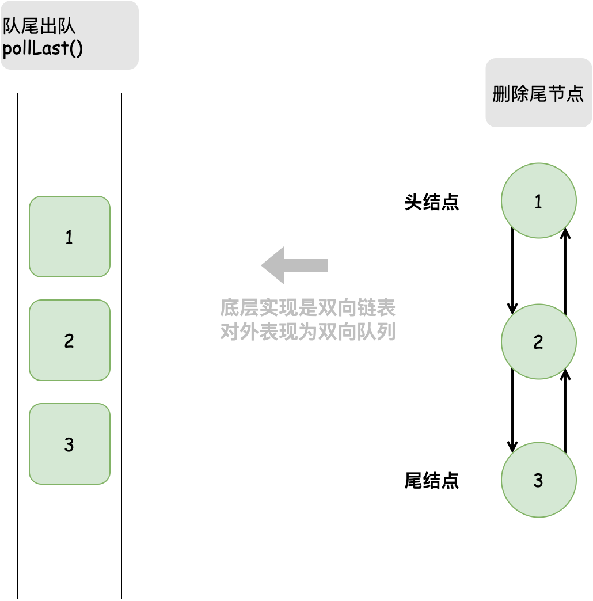
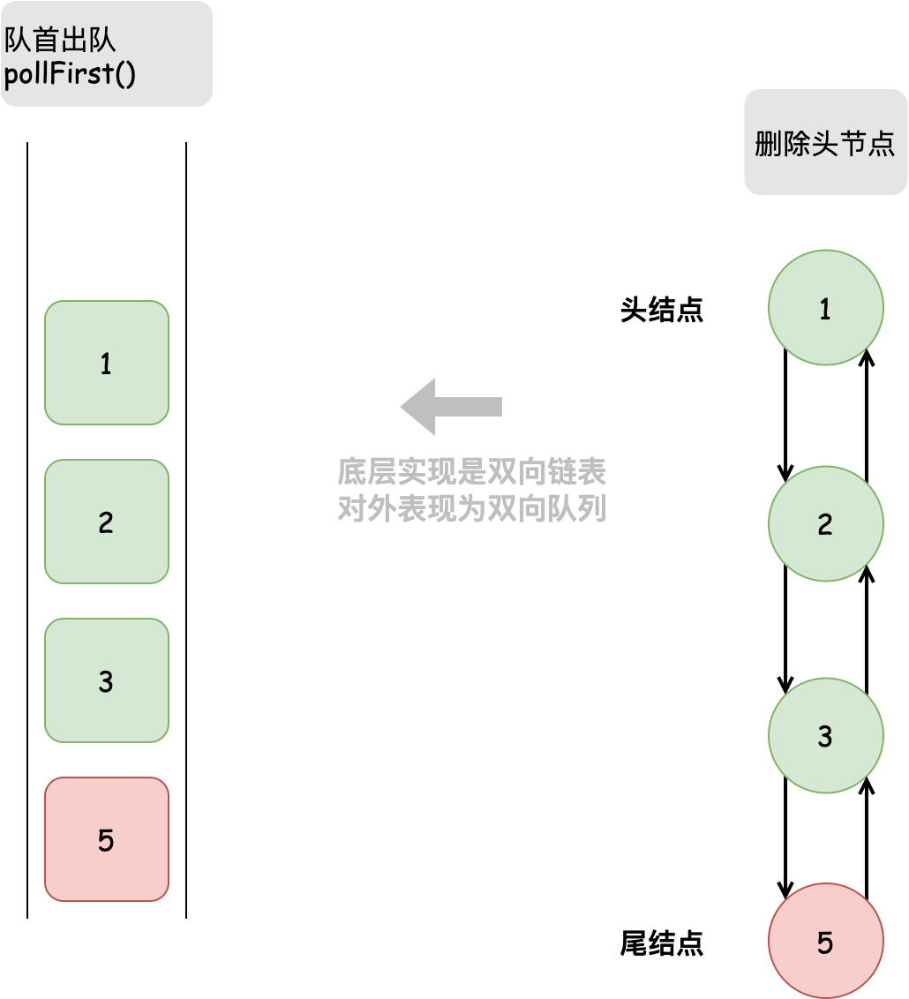
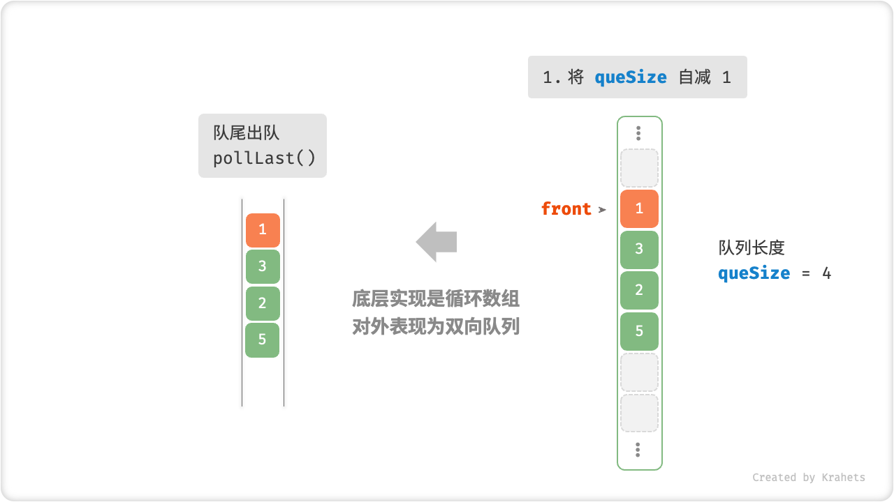
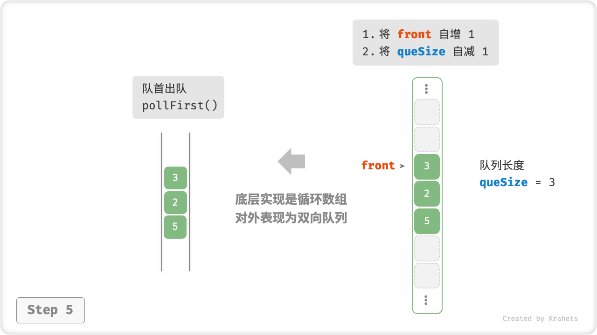

# 双向队列

对于队列，我们只能在头部删除或在尾部添加元素，而「双向队列 Deque」更加灵活，在其头部和尾部都能执行元素添加或删除操作。


<p align="center"> Fig. 双向队列的操作 </p>

## 双向队列常用操作

双向队列的常用操作见下表，方法名需根据特定语言来确定。

<p align="center"> Table. 双向队列的常用操作 </p>

<div class="center-table" markdown>

| 方法名        | 描述             | 时间复杂度 |
| ------------ | ---------------- | ---------- |
| pushFirst() | 将元素添加至队首 | $O(1)$     |
| pushLast()  | 将元素添加至队尾 | $O(1)$     |
| pollFirst()  | 删除队首元素     | $O(1)$     |
| pollLast()   | 删除队尾元素     | $O(1)$     |
| peekFirst()  | 访问队首元素     | $O(1)$     |
| peekLast()   | 访问队尾元素     | $O(1)$     |
| size()       | 获取队列的长度   | $O(1)$     |
| isEmpty()    | 判断队列是否为空 | $O(1)$     |

</div>

相同地，我们可以直接使用编程语言实现好的双向队列类。

=== "Java"

    ```java title="deque.java"
    /* 初始化双向队列 */
    Deque<Integer> deque = new LinkedList<>();
    
    /* 元素入队 */
    deque.offerLast(2);   // 添加至队尾
    deque.offerLast(5);
    deque.offerLast(4);
    deque.offerFirst(3);  // 添加至队首
    deque.offerFirst(1);
    
    /* 访问元素 */
    int peekFirst = deque.peekFirst();  // 队首元素
    int peekLast = deque.peekLast();    // 队尾元素
    
    /* 元素出队 */
    int pollFirst = deque.pollFirst();  // 队首元素出队
    int pollLast = deque.pollLast();    // 队尾元素出队
    
    /* 获取双向队列的长度 */
    int size = deque.size();
    
    /* 判断双向队列是否为空 */
    boolean isEmpty = deque.isEmpty();
    ```

=== "C++"

    ```cpp title="deque.cpp"
    /* 初始化双向队列 */
    deque<int> deque;
    
    /* 元素入队 */
    deque.push_back(2);   // 添加至队尾
    deque.push_back(5);
    deque.push_back(4);
    deque.push_front(3);  // 添加至队首
    deque.push_front(1);
    
    /* 访问元素 */
    int front = deque.front(); // 队首元素
    int back = deque.back();   // 队尾元素
    
    /* 元素出队 */
    deque.pop_front();  // 队首元素出队
    deque.pop_back();   // 队尾元素出队
    
    /* 获取双向队列的长度 */
    int size = deque.size();
    
    /* 判断双向队列是否为空 */
    bool empty = deque.empty();
    ```

=== "Python"

    ```python title="deque.py"
    """ 初始化双向队列 """
    duque = deque()
    
    """ 元素入队 """
    duque.append(2)      # 添加至队尾
    duque.append(5)
    duque.append(4)
    duque.appendleft(3)  # 添加至队首
    duque.appendleft(1)
    
    """ 访问元素 """
    front = duque[0]  # 队首元素
    rear = duque[-1]  # 队尾元素
    
    """ 元素出队 """
    pop_front = duque.popleft()  # 队首元素出队
    pop_rear = duque.pop()       # 队尾元素出队
    
    """ 获取双向队列的长度 """
    size = len(duque)
    
    """ 判断双向队列是否为空 """
    is_empty = len(duque) == 0
    ```

=== "Go"

    ```go title="deque_test.go"
    /* 初始化双向队列 */
    // 在 Go 中，将 list 作为双向队列使用
    deque := list.New()
    
    /* 元素入队 */
    deque.PushBack(2)      // 添加至队尾
    deque.PushBack(5)
    deque.PushBack(4)
    deque.PushFront(3)     // 添加至队首
    deque.PushFront(1)
    
    /* 访问元素 */
    front := deque.Front() // 队首元素
    rear := deque.Back()   // 队尾元素
    
    /* 元素出队 */
    deque.Remove(front)    // 队首元素出队
    deque.Remove(rear)     // 队尾元素出队
    
    /* 获取双向队列的长度 */
    size := deque.Len()
    
    /* 判断双向队列是否为空 */
    isEmpty := deque.Len() == 0
    ```

=== "JavaScript"

    ```javascript title="deque.js"
    /* 初始化双向队列 */
    // JavaScript 没有内置的双端队列，只能把 Array 当作双端队列来使用
    const deque = [];

    /* 元素入队 */
    deque.push(2);
    deque.push(5);
    deque.push(4);
    // 请注意，由于是数组，unshift() 方法的时间复杂度为 O(n)
    deque.unshift(3);
    deque.unshift(1);
    console.log("双向队列 deque = ", deque);

    /* 访问元素 */
    const peekFirst = deque[0];
    console.log("队首元素 peekFirst = " + peekFirst);
    const peekLast = deque[deque.length - 1];
    console.log("队尾元素 peekLast = " + peekLast);

    /* 元素出队 */
    // 请注意，由于是数组，shift() 方法的时间复杂度为 O(n)
    const popFront = deque.shift();
    console.log("队首出队元素 popFront = " + popFront + "，队首出队后 deque = " + deque);
    const popBack = deque.pop();
    console.log("队尾出队元素 popBack = " + popBack + "，队尾出队后 deque = " + deque);

    /* 获取双向队列的长度 */
    const size = deque.length;
    console.log("双向队列长度 size = " + size);

    /* 判断双向队列是否为空 */
    const isEmpty = size === 0;
    console.log("双向队列是否为空 = " + isEmpty);
    ```

=== "TypeScript"

    ```typescript title="deque.ts"
    /* 初始化双向队列 */
    // TypeScript 没有内置的双端队列，只能把 Array 当作双端队列来使用
    const deque: number[] = [];

    /* 元素入队 */
    deque.push(2);
    deque.push(5);
    deque.push(4);
    // 请注意，由于是数组，unshift() 方法的时间复杂度为 O(n)
    deque.unshift(3);
    deque.unshift(1);
    console.log("双向队列 deque = ", deque);

    /* 访问元素 */
    const peekFirst: number = deque[0];
    console.log("队首元素 peekFirst = " + peekFirst);
    const peekLast: number = deque[deque.length - 1];
    console.log("队尾元素 peekLast = " + peekLast);

    /* 元素出队 */
    // 请注意，由于是数组，shift() 方法的时间复杂度为 O(n)
    const popFront: number = deque.shift() as number;
    console.log("队首出队元素 popFront = " + popFront + "，队首出队后 deque = " + deque);
    const popBack: number = deque.pop() as number;
    console.log("队尾出队元素 popBack = " + popBack + "，队尾出队后 deque = " + deque);

    /* 获取双向队列的长度 */
    const size: number = deque.length;
    console.log("双向队列长度 size = " + size);

    /* 判断双向队列是否为空 */
    const isEmpty: boolean = size === 0;
    console.log("双向队列是否为空 = " + isEmpty);
    ```

=== "C"

    ```c title="deque.c"
    
    ```

=== "C#"

    ```csharp title="deque.cs"
    /* 初始化双向队列 */
    // 在 C# 中，将链表 LinkedList 看作双向队列来使用
    LinkedList<int> deque = new LinkedList<int>();
    
    /* 元素入队 */
    deque.AddLast(2);   // 添加至队尾
    deque.AddLast(5);
    deque.AddLast(4);
    deque.AddFirst(3);  // 添加至队首
    deque.AddFirst(1);
    
    /* 访问元素 */
    int peekFirst = deque.First.Value;  // 队首元素
    int peekLast = deque.Last.Value;    // 队尾元素
    
    /* 元素出队 */
    deque.RemoveFirst();  // 队首元素出队
    deque.RemoveLast();   // 队尾元素出队
    
    /* 获取双向队列的长度 */
    int size = deque.Count;
    
    /* 判断双向队列是否为空 */
    bool isEmpty = deque.Count == 0;
    ```

=== "Swift"

    ```swift title="deque.swift"
    /* 初始化双向队列 */
    // Swift 没有内置的双向队列类，可以把 Array 当作双向队列来使用
    var deque: [Int] = []

    /* 元素入队 */
    deque.append(2) // 添加至队尾
    deque.append(5)
    deque.append(4)
    deque.insert(3, at: 0) // 添加至队首
    deque.insert(1, at: 0)

    /* 访问元素 */
    let peekFirst = deque.first! // 队首元素
    let peekLast = deque.last! // 队尾元素

    /* 元素出队 */
    // 使用 Array 模拟时 pollFirst 的复杂度为 O(n)
    let pollFirst = deque.removeFirst() // 队首元素出队
    let pollLast = deque.removeLast() // 队尾元素出队

    /* 获取双向队列的长度 */
    let size = deque.count

    /* 判断双向队列是否为空 */
    let isEmpty = deque.isEmpty
    ```

=== "Zig"

    ```zig title="deque.zig"

    ```

## 双向队列实现 *

与队列类似，双向队列同样可以使用链表或数组来实现。

### 基于双向链表的实现

回忆上节内容，由于可以方便地删除链表头结点（对应出队操作），以及在链表尾结点后添加新结点（对应入队操作），因此我们使用普通单向链表来实现队列。

而双向队列的头部和尾部都可以执行入队与出队操作，换言之，双向队列的操作是“首尾对称”的，也需要实现另一个对称方向的操作。因此，双向队列需要使用「双向链表」来实现。

我们将双向链表的头结点和尾结点分别看作双向队列的队首和队尾，并且实现在两端都能添加与删除结点。

=== "LinkedListDeque"
    

=== "pushLast()"
    

=== "pushFirst()"
    

=== "pollLast()"
    

=== "pollFirst()"
    

以下是具体实现代码。

=== "Java"

    ```java title="linkedlist_deque.java"
    [class]{ListNode}-[func]{}

    [class]{LinkedListDeque}-[func]{}
    ```

=== "C++"

    ```cpp title="linkedlist_deque.cpp"

    ```

=== "Python"

    ```python title="linkedlist_deque.py"

    ```

=== "Go"

    ```go title="linkedlist_deque.go"

    ```

=== "JavaScript"

    ```javascript title="linkedlist_deque.js"
    [class]{ListNode}-[func]{}

    [class]{LinkedListDeque}-[func]{}
    ```

=== "TypeScript"

    ```typescript title="linkedlist_deque.ts"
    [class]{ListNode}-[func]{}

    [class]{LinkedListDeque}-[func]{}
    ```

=== "C"

    ```c title="linkedlist_deque.c"

    ```

=== "C#"

    ```csharp title="linkedlist_deque.cs"
    [class]{ListNode}-[func]{}

    [class]{LinkedListDeque}-[func]{}
    ```

=== "Swift"

    ```swift title="linkedlist_deque.swift"
    [class]{ListNode}-[func]{}

    [class]{LinkedListDeque}-[func]{}
    ```

=== "Zig"

    ```zig title="linkedlist_deque.zig"

    ```

### 基于数组的实现

与基于数组实现队列类似，我们也可以使用环形数组来实现双向队列。在实现队列的基础上，增加实现“队首入队”和“队尾出队”方法即可。

=== "ArrayDeque"
    

=== "pushLast()"
    

=== "pushFirst()"
    

=== "pollLast()"
    

=== "pollFirst()"
    

以下是具体实现代码。

=== "Java"

    ```java title="array_deque.java"
    [class]{ArrayDeque}-[func]{}
    ```

=== "C++"

    ```cpp title="array_deque.cpp"

    ```

=== "Python"

    ```python title="array_deque.py"

    ```

=== "Go"

    ```go title="array_deque.go"

    ```

=== "JavaScript"

    ```js title="array_deque.js"

    ```

=== "TypeScript"

    ```typescript title="array_deque.ts"

    ```

=== "C"

    ```c title="array_deque.c"

    ```

=== "C#"

    ```csharp title="array_deque.cs"

    ```

=== "Swift"

    ```swift title="array_deque.swift"
    [class]{ArrayDeque}-[func]{}
    ```

=== "Zig"

    ```zig title="array_deque.zig"

    ```
