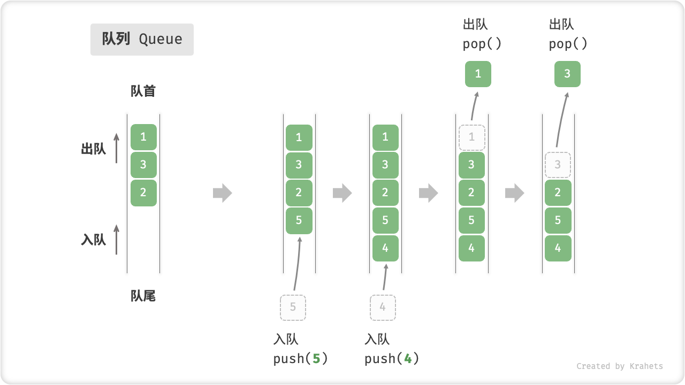
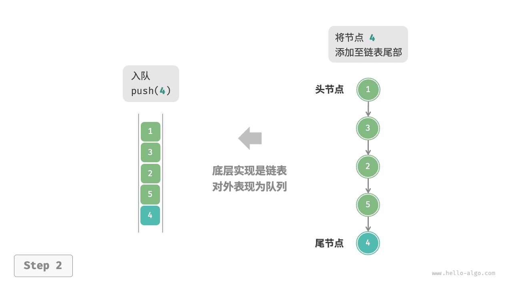
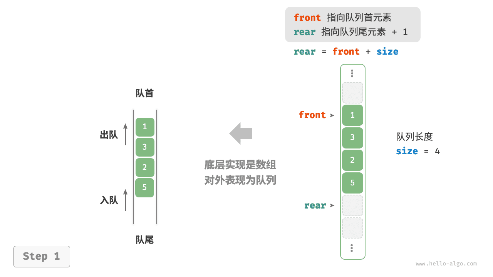
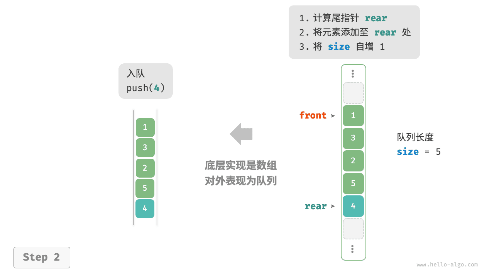
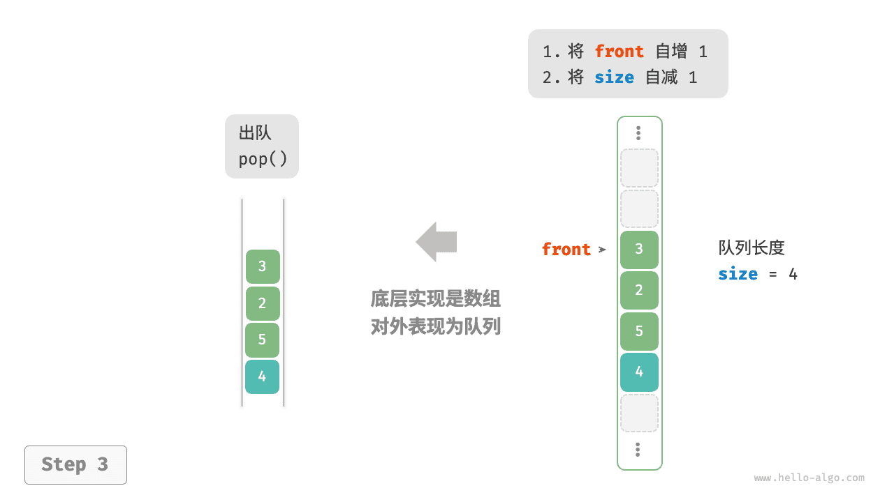

# 队列

<u>队列（queue）</u>是一种遵循先入先出规则的线性数据结构。顾名思义，队列模拟了排队现象，即新来的人不断加入队列尾部，而位于队列头部的人逐个离开。

如下图所示，我们将队列头部称为“队首”，尾部称为“队尾”，将把元素加入队尾的操作称为“入队”，删除队首元素的操作称为“出队”。



## 队列常用操作

队列的常见操作如下表所示。需要注意的是，不同编程语言的方法名称可能会有所不同。我们在此采用与栈相同的方法命名。

<p align="center"> 表 <id> &nbsp; 队列操作效率 </p>

| 方法名   | 描述                         | 时间复杂度 |
| -------- | ---------------------------- | ---------- |
| `push()` | 元素入队，即将元素添加至队尾 | $O(1)$     |
| `pop()`  | 队首元素出队                 | $O(1)$     |
| `peek()` | 访问队首元素                 | $O(1)$     |

我们可以直接使用编程语言中现成的队列类：

=== "Python"

    ```python title="queue.py"
    from collections import deque

    # 初始化队列
    # 在 Python 中，我们一般将双向队列类 deque 当作队列使用
    # 虽然 queue.Queue() 是纯正的队列类，但不太好用，因此不推荐
    que: deque[int] = deque()

    # 元素入队
    que.append(1)
    que.append(3)
    que.append(2)
    que.append(5)
    que.append(4)

    # 访问队首元素
    front: int = que[0]

    # 元素出队
    pop: int = que.popleft()

    # 获取队列的长度
    size: int = len(que)

    # 判断队列是否为空
    is_empty: bool = len(que) == 0
    ```

=== "C++"

    ```cpp title="queue.cpp"
    /* 初始化队列 */
    queue<int> queue;

    /* 元素入队 */
    queue.push(1);
    queue.push(3);
    queue.push(2);
    queue.push(5);
    queue.push(4);

    /* 访问队首元素 */
    int front = queue.front();

    /* 元素出队 */
    queue.pop();

    /* 获取队列的长度 */
    int size = queue.size();

    /* 判断队列是否为空 */
    bool empty = queue.empty();
    ```

=== "Java"

    ```java title="queue.java"
    /* 初始化队列 */
    Queue<Integer> queue = new LinkedList<>();

    /* 元素入队 */
    queue.offer(1);
    queue.offer(3);
    queue.offer(2);
    queue.offer(5);
    queue.offer(4);

    /* 访问队首元素 */
    int peek = queue.peek();

    /* 元素出队 */
    int pop = queue.poll();

    /* 获取队列的长度 */
    int size = queue.size();

    /* 判断队列是否为空 */
    boolean isEmpty = queue.isEmpty();
    ```

=== "C#"

    ```csharp title="queue.cs"
    /* 初始化队列 */
    Queue<int> queue = new();

    /* 元素入队 */
    queue.Enqueue(1);
    queue.Enqueue(3);
    queue.Enqueue(2);
    queue.Enqueue(5);
    queue.Enqueue(4);

    /* 访问队首元素 */
    int peek = queue.Peek();

    /* 元素出队 */
    int pop = queue.Dequeue();

    /* 获取队列的长度 */
    int size = queue.Count;

    /* 判断队列是否为空 */
    bool isEmpty = queue.Count == 0;
    ```

=== "Go"

    ```go title="queue_test.go"
    /* 初始化队列 */
    // 在 Go 中，将 list 作为队列来使用
    queue := list.New()

    /* 元素入队 */
    queue.PushBack(1)
    queue.PushBack(3)
    queue.PushBack(2)
    queue.PushBack(5)
    queue.PushBack(4)

    /* 访问队首元素 */
    peek := queue.Front()

    /* 元素出队 */
    pop := queue.Front()
    queue.Remove(pop)

    /* 获取队列的长度 */
    size := queue.Len()

    /* 判断队列是否为空 */
    isEmpty := queue.Len() == 0
    ```

=== "Swift"

    ```swift title="queue.swift"
    /* 初始化队列 */
    // Swift 没有内置的队列类，可以把 Array 当作队列来使用
    var queue: [Int] = []

    /* 元素入队 */
    queue.append(1)
    queue.append(3)
    queue.append(2)
    queue.append(5)
    queue.append(4)

    /* 访问队首元素 */
    let peek = queue.first!

    /* 元素出队 */
    // 由于是数组，因此 removeFirst 的复杂度为 O(n)
    let pool = queue.removeFirst()

    /* 获取队列的长度 */
    let size = queue.count

    /* 判断队列是否为空 */
    let isEmpty = queue.isEmpty
    ```

=== "JS"

    ```javascript title="queue.js"
    /* 初始化队列 */
    // JavaScript 没有内置的队列，可以把 Array 当作队列来使用
    const queue = [];

    /* 元素入队 */
    queue.push(1);
    queue.push(3);
    queue.push(2);
    queue.push(5);
    queue.push(4);

    /* 访问队首元素 */
    const peek = queue[0];

    /* 元素出队 */
    // 底层是数组，因此 shift() 方法的时间复杂度为 O(n)
    const pop = queue.shift();

    /* 获取队列的长度 */
    const size = queue.length;

    /* 判断队列是否为空 */
    const empty = queue.length === 0;
    ```

=== "TS"

    ```typescript title="queue.ts"
    /* 初始化队列 */
    // TypeScript 没有内置的队列，可以把 Array 当作队列来使用
    const queue: number[] = [];

    /* 元素入队 */
    queue.push(1);
    queue.push(3);
    queue.push(2);
    queue.push(5);
    queue.push(4);

    /* 访问队首元素 */
    const peek = queue[0];

    /* 元素出队 */
    // 底层是数组，因此 shift() 方法的时间复杂度为 O(n)
    const pop = queue.shift();

    /* 获取队列的长度 */
    const size = queue.length;

    /* 判断队列是否为空 */
    const empty = queue.length === 0;
    ```

=== "Dart"

    ```dart title="queue.dart"
    /* 初始化队列 */
    // 在 Dart 中，队列类 Qeque 是双向队列，也可作为队列使用
    Queue<int> queue = Queue();

    /* 元素入队 */
    queue.add(1);
    queue.add(3);
    queue.add(2);
    queue.add(5);
    queue.add(4);

    /* 访问队首元素 */
    int peek = queue.first;

    /* 元素出队 */
    int pop = queue.removeFirst();

    /* 获取队列的长度 */
    int size = queue.length;

    /* 判断队列是否为空 */
    bool isEmpty = queue.isEmpty;
    ```

=== "Rust"

    ```rust title="queue.rs"
    /* 初始化双向队列 */
    // 在 Rust 中使用双向队列作为普通队列来使用
    let mut deque: VecDeque<u32> = VecDeque::new();

    /* 元素入队 */
    deque.push_back(1);
    deque.push_back(3);
    deque.push_back(2);
    deque.push_back(5);
    deque.push_back(4);

    /* 访问队首元素 */
    if let Some(front) = deque.front() {
    }

    /* 元素出队 */
    if let Some(pop) = deque.pop_front() {
    }

    /* 获取队列的长度 */
    let size = deque.len();

    /* 判断队列是否为空 */
    let is_empty = deque.is_empty();
    ```

=== "C"

    ```c title="queue.c"
    // C 未提供内置队列
    ```

=== "Kotlin"

    ```kotlin title="queue.kt"
    /* 初始化队列 */
    val queue = LinkedList<Int>()

    /* 元素入队 */
    queue.offer(1)
    queue.offer(3)
    queue.offer(2)
    queue.offer(5)
    queue.offer(4)

    /* 访问队首元素 */
    val peek = queue.peek()

    /* 元素出队 */
    val pop = queue.poll()

    /* 获取队列的长度 */
    val size = queue.size

    /* 判断队列是否为空 */
    val isEmpty = queue.isEmpty()
    ```

=== "Ruby"

    ```ruby title="queue.rb"
    # 初始化队列
    # Ruby 内置的队列（Thread::Queue) 没有 peek 和遍历方法，可以把 Array 当作队列来使用
    queue = []

    # 元素入队
    queue.push(1)
    queue.push(3)
    queue.push(2)
    queue.push(5)
    queue.push(4)

    # 访问队列元素
    peek = queue.first

    # 元素出队
    # 清注意，由于是数组，Array#shift 方法时间复杂度为 O(n)
    pop = queue.shift

    # 获取队列的长度
    size = queue.length

    # 判断队列是否为空
    is_empty = queue.empty?
    ```

=== "Zig"

    ```zig title="queue.zig"

    ```

??? pythontutor "可视化运行"

    https://pythontutor.com/render.html#code=from%20collections%20import%20deque%0A%0A%22%22%22Driver%20Code%22%22%22%0Aif%20__name__%20%3D%3D%20%22__main__%22%3A%0A%20%20%20%20%23%20%E5%88%9D%E5%A7%8B%E5%8C%96%E9%98%9F%E5%88%97%0A%20%20%20%20%23%20%E5%9C%A8%20Python%20%E4%B8%AD%EF%BC%8C%E6%88%91%E4%BB%AC%E4%B8%80%E8%88%AC%E5%B0%86%E5%8F%8C%E5%90%91%E9%98%9F%E5%88%97%E7%B1%BB%20deque%20%E7%9C%8B%E4%BD%9C%E9%98%9F%E5%88%97%E4%BD%BF%E7%94%A8%0A%20%20%20%20%23%20%E8%99%BD%E7%84%B6%20queue.Queue%28%29%20%E6%98%AF%E7%BA%AF%E6%AD%A3%E7%9A%84%E9%98%9F%E5%88%97%E7%B1%BB%EF%BC%8C%E4%BD%86%E4%B8%8D%E5%A4%AA%E5%A5%BD%E7%94%A8%0A%20%20%20%20que%20%3D%20deque%28%29%0A%0A%20%20%20%20%23%20%E5%85%83%E7%B4%A0%E5%85%A5%E9%98%9F%0A%20%20%20%20que.append%281%29%0A%20%20%20%20que.append%283%29%0A%20%20%20%20que.append%282%29%0A%20%20%20%20que.append%285%29%0A%20%20%20%20que.append%284%29%0A%20%20%20%20print%28%22%E9%98%9F%E5%88%97%20que%20%3D%22,%20que%29%0A%0A%20%20%20%20%23%20%E8%AE%BF%E9%97%AE%E9%98%9F%E9%A6%96%E5%85%83%E7%B4%A0%0A%20%20%20%20front%20%3D%20que%5B0%5D%0A%20%20%20%20print%28%22%E9%98%9F%E9%A6%96%E5%85%83%E7%B4%A0%20front%20%3D%22,%20front%29%0A%0A%20%20%20%20%23%20%E5%85%83%E7%B4%A0%E5%87%BA%E9%98%9F%0A%20%20%20%20pop%20%3D%20que.popleft%28%29%0A%20%20%20%20print%28%22%E5%87%BA%E9%98%9F%E5%85%83%E7%B4%A0%20pop%20%3D%22,%20pop%29%0A%20%20%20%20print%28%22%E5%87%BA%E9%98%9F%E5%90%8E%20que%20%3D%22,%20que%29%0A%0A%20%20%20%20%23%20%E8%8E%B7%E5%8F%96%E9%98%9F%E5%88%97%E7%9A%84%E9%95%BF%E5%BA%A6%0A%20%20%20%20size%20%3D%20len%28que%29%0A%20%20%20%20print%28%22%E9%98%9F%E5%88%97%E9%95%BF%E5%BA%A6%20size%20%3D%22,%20size%29%0A%0A%20%20%20%20%23%20%E5%88%A4%E6%96%AD%E9%98%9F%E5%88%97%E6%98%AF%E5%90%A6%E4%B8%BA%E7%A9%BA%0A%20%20%20%20is_empty%20%3D%20len%28que%29%20%3D%3D%200%0A%20%20%20%20print%28%22%E9%98%9F%E5%88%97%E6%98%AF%E5%90%A6%E4%B8%BA%E7%A9%BA%20%3D%22,%20is_empty%29&cumulative=false&curInstr=3&heapPrimitives=nevernest&mode=display&origin=opt-frontend.js&py=311&rawInputLstJSON=%5B%5D&textReferences=false

## 队列实现

为了实现队列，我们需要一种数据结构，可以在一端添加元素，并在另一端删除元素，链表和数组都符合要求。

### 基于链表的实现

如下图所示，我们可以将链表的“头节点”和“尾节点”分别视为“队首”和“队尾”，规定队尾仅可添加节点，队首仅可删除节点。

=== "LinkedListQueue"
    

=== "push()"
    

=== "pop()"
    

以下是用链表实现队列的代码：

```src
[file]{linkedlist_queue}-[class]{linked_list_queue}-[func]{}
```

### 基于数组的实现

在数组中删除首元素的时间复杂度为 $O(n)$ ，这会导致出队操作效率较低。然而，我们可以采用以下巧妙方法来避免这个问题。

我们可以使用一个变量 `front` 指向队首元素的索引，并维护一个变量 `size` 用于记录队列长度。定义 `rear = front + size` ，这个公式计算出的 `rear` 指向队尾元素之后的下一个位置。

基于此设计，**数组中包含元素的有效区间为 `[front, rear - 1]`**，各种操作的实现方法如下图所示。

- 入队操作：将输入元素赋值给 `rear` 索引处，并将 `size` 增加 1 。
- 出队操作：只需将 `front` 增加 1 ，并将 `size` 减少 1 。

可以看到，入队和出队操作都只需进行一次操作，时间复杂度均为 $O(1)$ 。

=== "ArrayQueue"
    

=== "push()"
    

=== "pop()"
    

你可能会发现一个问题：在不断进行入队和出队的过程中，`front` 和 `rear` 都在向右移动，**当它们到达数组尾部时就无法继续移动了**。为了解决此问题，我们可以将数组视为首尾相接的“环形数组”。

对于环形数组，我们需要让 `front` 或 `rear` 在越过数组尾部时，直接回到数组头部继续遍历。这种周期性规律可以通过“取余操作”来实现，代码如下所示：

```src
[file]{array_queue}-[class]{array_queue}-[func]{}
```

以上实现的队列仍然具有局限性：其长度不可变。然而，这个问题不难解决，我们可以将数组替换为动态数组，从而引入扩容机制。有兴趣的读者可以尝试自行实现。

两种实现的对比结论与栈一致，在此不再赘述。

## 队列典型应用

- **淘宝订单**。购物者下单后，订单将加入队列中，系统随后会根据顺序处理队列中的订单。在双十一期间，短时间内会产生海量订单，高并发成为工程师们需要重点攻克的问题。
- **各类待办事项**。任何需要实现“先来后到”功能的场景，例如打印机的任务队列、餐厅的出餐队列等，队列在这些场景中可以有效地维护处理顺序。
