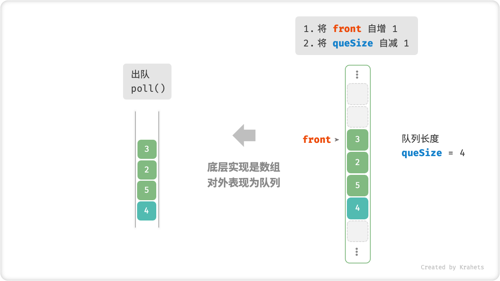

# 队列（Queue）

「队列 Queue」是一种遵循「先入先出 first in, first out」数据操作规则的线性数据结构。顾名思义，队列模拟的是排队现象，即外面的人不断加入队列尾部，而处于队列头部的人不断地离开。

我们将队列头部称为「队首」，队列尾部称为「队尾」，将把元素加入队尾的操作称为「入队」，删除队首元素的操作称为「出队」。


## 队列常用操作

队列的常用操作见下表，方法名需根据特定语言来确定。

<div class="center-table" markdown>

| 方法名     | 描述                        | 时间复杂度 |
| --------- | -------------------------- | -------- |
| push()    | 元素入队，即将元素添加至队尾    | $O(1)$   |
| poll()    | 队首元素出队                 | $O(1)$   |
| front()   | 访问队首元素                 | $O(1)$   |
| size()    | 获取队列的长度               | $O(1)$   |
| isEmpty() | 判断队列是否为空              | $O(1)$   |

</div>

我们可以直接使用编程语言实现好的队列类。

=== "Java"

    ```java title="queue.java"
    /* 初始化队列 */
    Queue<Integer> queue = new LinkedList<>();
    
    /* 元素入队 */
    queue.offer(1);
    queue.offer(3);
    queue.offer(2);
    queue.offer(5);
    queue.offer(4);
    
    /* 访问队首元素 */
    int peek = queue.peek();
    
    /* 元素出队 */
    int poll = queue.poll();
    
    /* 获取队列的长度 */
    int size = queue.size();
    
    /* 判断队列是否为空 */
    boolean isEmpty = queue.isEmpty();
    ```

=== "C++"

    ```cpp title="queue.cpp"
    /* 初始化队列 */
    queue<int> queue;
    
    /* 元素入队 */
    queue.push(1);
    queue.push(3);
    queue.push(2);
    queue.push(5);
    queue.push(4);
    
    /* 访问队首元素 */
    int front = queue.front();
    
    /* 元素出队 */
    queue.pop();
    
    /* 获取队列的长度 */
    int size = queue.size();
    
    /* 判断队列是否为空 */
    bool empty = queue.empty();
    ```

=== "Python"

    ```python title="queue.py"
    """ 初始化队列 """
    # 在 Python 中，我们一般将双向队列类 deque 看作队列使用
    # 虽然 queue.Queue() 是纯正的队列类，但不太好用，因此不建议
    que = collections.deque()
    
    """ 元素入队 """
    que.append(1)
    que.append(3)
    que.append(2)
    que.append(5)
    que.append(4)
    
    """ 访问队首元素 """
    front = que[0];
    
    """ 元素出队 """
    pop = que.popleft()
    
    """ 获取队列的长度 """
    size = len(que)
    
    """ 判断队列是否为空 """
    is_empty = len(que) == 0
    ```

=== "Go"

    ```go title="queue_test.go"
    /* 初始化队列 */
    // 在 Go 中，将 list 作为队列来使用
    queue := list.New()
    
    /* 元素入队 */
    queue.PushBack(1)
    queue.PushBack(3)
    queue.PushBack(2)
    queue.PushBack(5)
    queue.PushBack(4)
    
    /* 访问队首元素 */
    peek := queue.Front()
    
    /* 元素出队 */
    poll := queue.Front()
    queue.Remove(poll)
    
    /* 获取队列的长度 */
    size := queue.Len()
    
    /* 判断队列是否为空 */
    isEmpty := queue.Len() == 0
    ```

=== "JavaScript"

    ```javascript title="queue.js"
    /* 初始化队列 */
    // JavaScript 没有内置的队列，可以把 Array 当作队列来使用
    const queue = [];
    
    /* 元素入队 */
    queue.push(1);
    queue.push(3);
    queue.push(2);
    queue.push(5);
    queue.push(4);
    
    /* 访问队首元素 */
    const peek = queue[0];
    
    /* 元素出队 */
    // 底层是数组，因此 shift() 方法的时间复杂度为 O(n)
    const poll = queue.shift();
    
    /* 获取队列的长度 */
    const size = queue.length;
    
    /* 判断队列是否为空 */
    const empty = queue.length === 0;
    ```

=== "TypeScript"

    ```typescript title="queue.ts"
    /* 初始化队列 */
    // TypeScript 没有内置的队列，可以把 Array 当作队列来使用 
    const queue: number[] = [];
    
    /* 元素入队 */
    queue.push(1);
    queue.push(3);
    queue.push(2);
    queue.push(5);
    queue.push(4);
    
    /* 访问队首元素 */
    const peek = queue[0];
    
    /* 元素出队 */
    // 底层是数组，因此 shift() 方法的时间复杂度为 O(n)
    const poll = queue.shift();
    
    /* 获取队列的长度 */
    const size = queue.length;
    
    /* 判断队列是否为空 */
    const empty = queue.length === 0;
    ```

=== "C"

    ```c title="queue.c"
    
    ```

=== "C#"

    ```csharp title="queue.cs"
    /* 初始化队列 */
    Queue<int> queue = new();
    
    /* 元素入队 */
    queue.Enqueue(1);
    queue.Enqueue(3);
    queue.Enqueue(2);
    queue.Enqueue(5);
    queue.Enqueue(4);
    
    /* 访问队首元素 */
    int peek = queue.Peek();
    
    /* 元素出队 */
    int poll = queue.Dequeue();
    
    /* 获取队列的长度 */
    int size = queue.Count();
    
    /* 判断队列是否为空 */
    bool isEmpty = queue.Count() == 0;
    ```

=== "Swift"

    ```swift title="queue.swift"
    /* 初始化队列 */
    // Swift 没有内置的队列类，可以把 Array 当作队列来使用
    var queue: [Int] = []
    
    /* 元素入队 */
    queue.append(1)
    queue.append(3)
    queue.append(2)
    queue.append(5)
    queue.append(4)
    
    /* 访问队首元素 */
    let peek = queue.first!
    
    /* 元素出队 */
    // 使用 Array 模拟时 poll 的复杂度为 O(n)
    let pool = queue.removeFirst()
    
    /* 获取队列的长度 */
    let size = queue.count
    
    /* 判断队列是否为空 */
    let isEmpty = queue.isEmpty
    ```

=== "Zig"

    ```zig title="queue.zig"

    ```

## 队列实现

队列需要一种可以在一端添加，并在另一端删除的数据结构，也可以使用链表或数组来实现。

### 基于链表的实现

我们将链表的「头结点」和「尾结点」分别看作是队首和队尾，并规定队尾只可添加结点，队首只可删除结点。

=== "LinkedListQueue"
    

=== "push()"
    

=== "poll()"
    

以下是使用链表实现队列的示例代码。

=== "Java"

    ```java title="linkedlist_queue.java"
    [class]{LinkedListQueue}-[func]{}
    ```

=== "C++"

    ```cpp title="linkedlist_queue.cpp"
    [class]{LinkedListQueue}-[func]{}
    ```

=== "Python"

    ```python title="linkedlist_queue.py"
    [class]{LinkedListQueue}-[func]{}
    ```

=== "Go"

    ```go title="linkedlist_queue.go"
    [class]{linkedListQueue}-[func]{}
    ```

=== "JavaScript"

    ```javascript title="linkedlist_queue.js"
    [class]{LinkedListQueue}-[func]{}
    ```

=== "TypeScript"

    ```typescript title="linkedlist_queue.ts"
    [class]{LinkedListQueue}-[func]{}
    ```

=== "C"

    ```c title="linkedlist_queue.c"
    [class]{linkedListQueue}-[func]{}
    ```

=== "C#"

    ```csharp title="linkedlist_queue.cs"
    [class]{LinkedListQueue}-[func]{}
    ```

=== "Swift"

    ```swift title="linkedlist_queue.swift"
    [class]{LinkedListQueue}-[func]{}
    ```

=== "Zig"

    ```zig title="linkedlist_queue.zig"
    [class]{LinkedListQueue}-[func]{}
    ```

### 基于数组的实现

数组的删除首元素的时间复杂度为 $O(n)$ ，这会导致出队操作效率低下。然而，我们可以采取下述的巧妙方法来避免这个问题。

考虑借助一个变量 `front` 来指向队首元素的索引，并维护变量 `queSize` 来记录队列长度。我们定义 `rear = front + queSize` ，该公式计算出来的 `rear` 指向“队尾元素索引 $+1$ ”的位置。

在该设计下，**数组中包含元素的有效区间为 `[front, rear - 1]`** ，进而

- 对于入队操作，将输入元素赋值给 `rear` 索引处，并将 `queSize` 自增 $1$ 即可；
- 对于出队操作，仅需将 `front` 自增 $1$ ，并将 `queSize` 自减 $1$ 即可；

观察发现，入队与出队操作都仅需单次操作即可完成，时间复杂度皆为 $O(1)$ 。

=== "ArrayQueue"
    

=== "push()"
    

=== "poll()"
    

细心的同学可能会发现一个问题：在不断入队与出队的过程中，`front` 和 `rear` 都在向右移动，**在到达数组尾部后就无法继续移动了**。为解决此问题，**我们考虑将数组看作是首尾相接的**，这样的数组被称为「环形数组」。

对于环形数组，我们需要令 `front` 或 `rear` 在越过数组尾部后，直接绕回到数组头部接续遍历。这种周期性规律可以通过「取余操作」来实现，详情请见以下代码。

=== "Java"

    ```java title="array_queue.java"
    [class]{ArrayQueue}-[func]{}
    ```

=== "C++"

    ```cpp title="array_queue.cpp"
    [class]{ArrayQueue}-[func]{}
    ```

=== "Python"

    ```python title="array_queue.py"
    [class]{ArrayQueue}-[func]{}
    ```

=== "Go"

    ```go title="array_queue.go"
    [class]{arrayQueue}-[func]{}
    ```

=== "JavaScript"

    ```javascript title="array_queue.js"
    [class]{ArrayQueue}-[func]{}
    ```

=== "TypeScript"

    ```typescript title="array_queue.ts"
    [class]{ArrayQueue}-[func]{}
    ```

=== "C"

    ```c title="array_queue.c"
    [class]{arrayQueue}-[func]{}
    ```

=== "C#"

    ```csharp title="array_queue.cs"
    [class]{ArrayQueue}-[func]{}
    ```

=== "Swift"

    ```swift title="array_queue.swift"
    [class]{ArrayQueue}-[func]{}
    ```

=== "Zig"

    ```zig title="array_queue.zig"
    [class]{ArrayQueue}-[func]{}
    ```

以上实现的队列仍存在局限性，即长度不可变。不过这个问题很容易解决，我们可以将数组替换为列表（即动态数组），从而引入扩容机制。有兴趣的同学可以尝试自行实现。

## 两种实现对比

与栈的结论一致，在此不再赘述。

## 队列典型应用

- **淘宝订单**。购物者下单后，订单就被加入到队列之中，随后系统再根据顺序依次处理队列中的订单。在双十一时，在短时间内会产生海量的订单，如何处理「高并发」则是工程师们需要重点思考的问题。
- **各种待办事项**。任何需要实现“先来后到”的功能，例如打印机的任务队列、餐厅的出餐队列等等。
