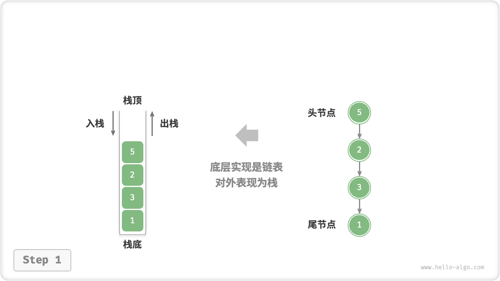
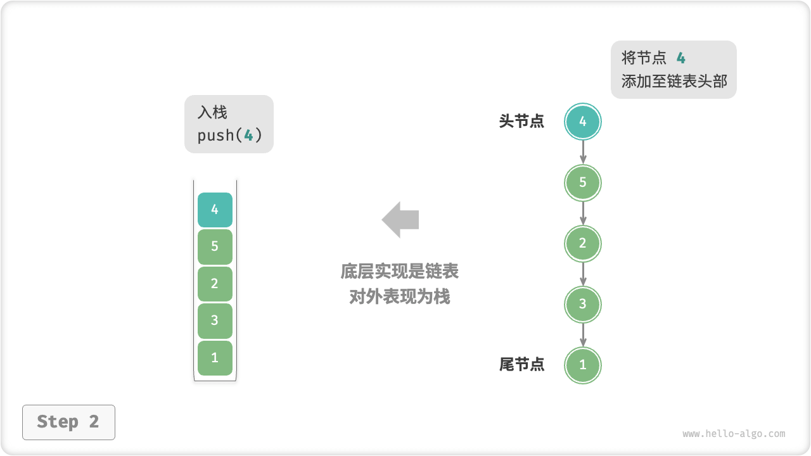
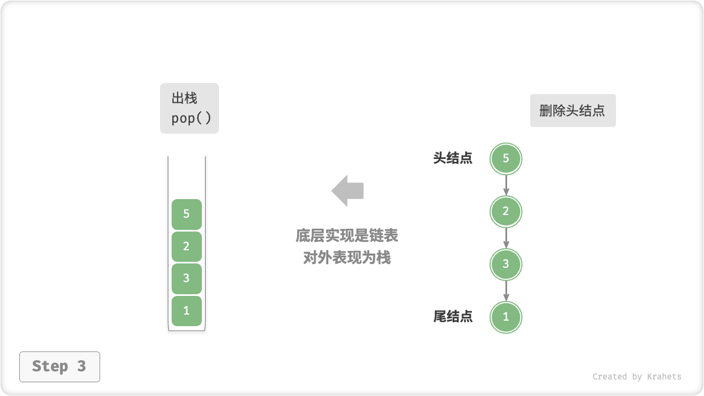
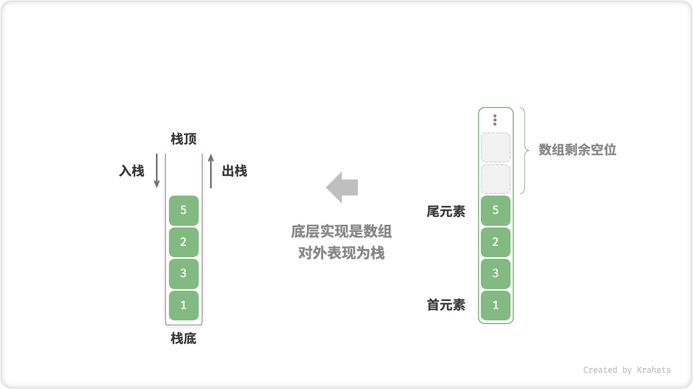
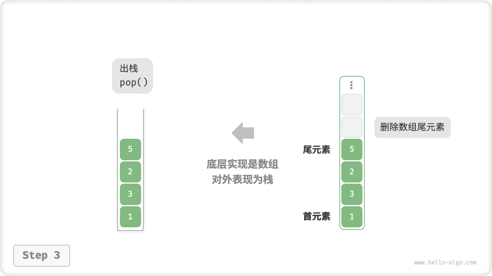

# 栈

「栈 Stack」是一种遵循「先入后出 first in, last out」数据操作规则的线性数据结构。我们可以将栈类比为放在桌面上的一摞盘子，如果需要拿出底部的盘子，则需要先将上面的盘子依次取出。

“盘子”是一种形象比喻，我们将盘子替换为任意一种元素（例如整数、字符、对象等），就得到了栈数据结构。

我们将这一摞元素的顶部称为「栈顶」，将底部称为「栈底」，将把元素添加到栈顶的操作称为「入栈」，将删除栈顶元素的操作称为「出栈」。


<p align="center"> Fig. 栈的先入后出特性 </p>

## 栈常用操作

栈的常用操作见下表（方法命名以 Java 为例）。

<p align="center"> Table. 栈的常用操作 </p>

<div class="center-table" markdown>

| 方法      | 描述                   | 时间复杂度 |
| --------- | ---------------------- | ---------- |
| push()    | 元素入栈（添加至栈顶） | $O(1)$     |
| pop()     | 栈顶元素出栈           | $O(1)$     |
| peek()    | 访问栈顶元素           | $O(1)$     |
| size()    | 获取栈的长度           | $O(1)$     |
| isEmpty() | 判断栈是否为空         | $O(1)$     |

</div>

我们可以直接使用编程语言实现好的栈类。 某些语言并未专门提供栈类，但我们可以直接把该语言的「数组」或「链表」看作栈来使用，并通过“脑补”来屏蔽无关操作。

=== "Java"

    ```java title="stack.java"
    /* 初始化栈 */
    // 在 Java 中，推荐将 ArrayList 当作栈来使用
    List<Integer> stack = new ArrayList<>();
    
    /* 元素入栈 */
    stack.add(1);
    stack.add(3);
    stack.add(2);
    stack.add(5);
    stack.add(4);
    
    /* 访问栈顶元素 */
    int peek = stack.get(stack.size() - 1);
    
    /* 元素出栈 */
    int pop = stack.remove(stack.size() - 1);
    
    /* 获取栈的长度 */
    int size = stack.size();
    
    /* 判断是否为空 */
    boolean isEmpty = stack.isEmpty();
    ```

=== "C++"

    ```cpp title="stack.cpp"
    /* 初始化栈 */
    stack<int> stack;
    
    /* 元素入栈 */
    stack.push(1);
    stack.push(3);
    stack.push(2);
    stack.push(5);
    stack.push(4);
    
    /* 访问栈顶元素 */
    int top = stack.top();
    
    /* 元素出栈 */
    stack.pop();
    
    /* 获取栈的长度 */
    int size = stack.size();
    
    /* 判断是否为空 */
    bool empty = stack.empty();
    ```

=== "Python"

    ```python title="stack.py"
    """ 初始化栈 """
    # Python 没有内置的栈类，可以把 List 当作栈来使用 
    stack = []
    
    """ 元素入栈 """
    stack.append(1)
    stack.append(3)
    stack.append(2)
    stack.append(5)
    stack.append(4)
    
    """ 访问栈顶元素 """
    peek = stack[-1]
    
    """ 元素出栈 """
    pop = stack.pop()
    
    """ 获取栈的长度 """
    size = len(stack)
    
    """ 判断是否为空 """
    is_empty = len(stack) == 0
    ```

=== "Go"

    ```go title="stack_test.go"
    /* 初始化栈 */
    // 在 Go 中，推荐将 Slice 当作栈来使用
    var stack []int
    
    /* 元素入栈 */
    stack = append(stack, 1)
    stack = append(stack, 3)
    stack = append(stack, 2)
    stack = append(stack, 5)
    stack = append(stack, 4)
    
    /* 访问栈顶元素 */
    peek := stack[len(stack)-1]
    
    /* 元素出栈 */
    pop := stack[len(stack)-1]
    stack = stack[:len(stack)-1]
    
    /* 获取栈的长度 */
    size := len(stack)
    
    /* 判断是否为空 */
    isEmpty := len(stack) == 0
    ```

=== "JavaScript"

    ```javascript title="stack.js"
    /* 初始化栈 */
    // Javascript 没有内置的栈类，可以把 Array 当作栈来使用 
    const stack = [];
    
    /* 元素入栈 */
    stack.push(1);
    stack.push(3);
    stack.push(2);
    stack.push(5);
    stack.push(4);
    
    /* 访问栈顶元素 */
    const peek = stack[stack.length-1];
    
    /* 元素出栈 */
    const pop = stack.pop();
    
    /* 获取栈的长度 */
    const size = stack.length;
    
    /* 判断是否为空 */
    const is_empty = stack.length === 0;
    ```

=== "TypeScript"

    ```typescript title="stack.ts"
    /* 初始化栈 */
    // Typescript 没有内置的栈类，可以把 Array 当作栈来使用 
    const stack: number[] = [];
    
    /* 元素入栈 */
    stack.push(1);
    stack.push(3);
    stack.push(2);
    stack.push(5);
    stack.push(4);
    
    /* 访问栈顶元素 */
    const peek = stack[stack.length - 1];
    
    /* 元素出栈 */
    const pop = stack.pop();
    
    /* 获取栈的长度 */
    const size = stack.length;
    
    /* 判断是否为空 */
    const is_empty = stack.length === 0;
    ```

=== "C"

    ```c title="stack.c"
    
    ```

=== "C#"

    ```csharp title="stack.cs"
    /* 初始化栈 */
    Stack<int> stack = new ();
    
    /* 元素入栈 */
    stack.Push(1);
    stack.Push(3);
    stack.Push(2);
    stack.Push(5);
    stack.Push(4);
    
    /* 访问栈顶元素 */
    int peek = stack.Peek();
    
    /* 元素出栈 */
    int pop = stack.Pop();
    
    /* 获取栈的长度 */
    int size = stack.Count();
    
    /* 判断是否为空 */
    bool isEmpty = stack.Count()==0;
    ```

=== "Swift"

    ```swift title="stack.swift"
    /* 初始化栈 */
    // Swift 没有内置的栈类，可以把 Array 当作栈来使用
    var stack: [Int] = []
    
    /* 元素入栈 */
    stack.append(1)
    stack.append(3)
    stack.append(2)
    stack.append(5)
    stack.append(4)
    
    /* 访问栈顶元素 */
    let peek = stack.last!
    
    /* 元素出栈 */
    let pop = stack.removeLast()
    
    /* 获取栈的长度 */
    let size = stack.count
    
    /* 判断是否为空 */
    let isEmpty = stack.isEmpty
    ```

=== "Zig"

    ```zig title="stack.zig"

    ```

## 栈的实现

为了更加清晰地了解栈的运行机制，接下来我们来自己动手实现一个栈类。

栈规定元素是先入后出的，因此我们只能在栈顶添加或删除元素。然而，数组或链表都可以在任意位置添加删除元素，因此 **栈可被看作是一种受约束的数组或链表**。换言之，我们可以“屏蔽”数组或链表的部分无关操作，使之对外的表现逻辑符合栈的规定即可。

### 基于链表的实现

使用「链表」实现栈时，将链表的头结点看作栈顶，将尾结点看作栈底。

对于入栈操作，将元素插入到链表头部即可，这种结点添加方式被称为“头插法”。而对于出栈操作，则将头结点从链表中删除即可。

=== "LinkedListStack"
    

=== "push()"
    

=== "pop()"
    

以下是基于链表实现栈的示例代码。

=== "Java"

    ```java title="linkedlist_stack.java"
    [class]{LinkedListStack}-[func]{}
    ```

=== "C++"

    ```cpp title="linkedlist_stack.cpp"
    [class]{LinkedListStack}-[func]{}
    ```

=== "Python"

    ```python title="linkedlist_stack.py"
    [class]{LinkedListStack}-[func]{}
    ```

=== "Go"

    ```go title="linkedlist_stack.go"
    [class]{linkedListStack}-[func]{}
    ```

=== "JavaScript"

    ```javascript title="linkedlist_stack.js"
    [class]{LinkedListStack}-[func]{}
    ```

=== "TypeScript"

    ```typescript title="linkedlist_stack.ts"
    [class]{LinkedListStack}-[func]{}
    ```

=== "C"

    ```c title="linkedlist_stack.c"
    [class]{linkedListStack}-[func]{}
    ```

=== "C#"

    ```csharp title="linkedlist_stack.cs"
    [class]{LinkedListStack}-[func]{}
    ```

=== "Swift"

    ```swift title="linkedlist_stack.swift"
    [class]{LinkedListStack}-[func]{}
    ```

=== "Zig"

    ```zig title="linkedlist_stack.zig"
    [class]{LinkedListStack}-[func]{}
    ```

### 基于数组的实现

使用「数组」实现栈时，考虑将数组的尾部当作栈顶。这样设计下，「入栈」与「出栈」操作就对应在数组尾部「添加元素」与「删除元素」，时间复杂度都为 $O(1)$ 。

=== "ArrayStack"
    

=== "push()"
    

=== "pop()"
    

由于入栈的元素可能是源源不断的，因此可以使用支持动态扩容的「列表」，这样就无需自行实现数组扩容了。以下是示例代码。

=== "Java"

    ```java title="array_stack.java"
    [class]{ArrayStack}-[func]{}
    ```

=== "C++"

    ```cpp title="array_stack.cpp"
    [class]{ArrayStack}-[func]{}
    ```

=== "Python"

    ```python title="array_stack.py"
    [class]{ArrayStack}-[func]{}
    ```

=== "Go"

    ```go title="array_stack.go"
    [class]{arrayStack}-[func]{}
    ```

=== "JavaScript"

    ```javascript title="array_stack.js"
    [class]{ArrayStack}-[func]{}
    ```

=== "TypeScript"

    ```typescript title="array_stack.ts"
    [class]{ArrayStack}-[func]{}
    ```

=== "C"

    ```c title="array_stack.c"
    [class]{arrayStack}-[func]{}
    ```

=== "C#"

    ```csharp title="array_stack.cs"
    [class]{ArrayStack}-[func]{}
    ```

=== "Swift"

    ```swift title="array_stack.swift"
    [class]{ArrayStack}-[func]{}
    ```

=== "Zig"

    ```zig title="array_stack.zig"
    [class]{ArrayStack}-[func]{}
    ```

## 两种实现对比

### 支持操作

两种实现都支持栈定义中的各项操作，数组实现额外支持随机访问，但这已经超出栈的定义范畴，一般不会用到。

### 时间效率

在数组（列表）实现中，入栈与出栈操作都是在预先分配好的连续内存中操作，具有很好的缓存本地性，效率很好。然而，如果入栈时超出数组容量，则会触发扩容机制，那么该次入栈操作的时间复杂度为 $O(n)$ 。

在链表实现中，链表的扩容非常灵活，不存在上述数组扩容时变慢的问题。然而，入栈操作需要初始化结点对象并修改指针，因而效率不如数组。进一步地思考，如果入栈元素不是 `int` 而是结点对象，那么就可以省去初始化步骤，从而提升效率。

综上所述，当入栈与出栈操作的元素是基本数据类型（例如 `int` , `double` ）时，则结论如下：

- 数组实现的栈在触发扩容时会变慢，但由于扩容是低频操作，因此 **总体效率更高**；
- 链表实现的栈可以提供 **更加稳定的效率表现**；

### 空间效率

在初始化列表时，系统会给列表分配“初始容量”，该容量可能超过我们的需求。并且扩容机制一般是按照特定倍率（比如 2 倍）进行扩容，扩容后的容量也可能超出我们的需求。因此，**数组实现栈会造成一定的空间浪费**。

当然，由于结点需要额外存储指针，因此 **链表结点比数组元素占用更大**。

综上，我们不能简单地确定哪种实现更加省内存，需要 case-by-case 地分析。

## 栈典型应用

- **浏览器中的后退与前进、软件中的撤销与反撤销**。每当我们打开新的网页，浏览器就将上一个网页执行入栈，这样我们就可以通过「后退」操作来回到上一页面，后退操作实际上是在执行出栈。如果要同时支持后退和前进，那么则需要两个栈来配合实现。
- **程序内存管理**。每当调用函数时，系统就会在栈顶添加一个栈帧，用来记录函数的上下文信息。在递归函数中，向下递推会不断执行入栈，向上回溯阶段时出栈。
