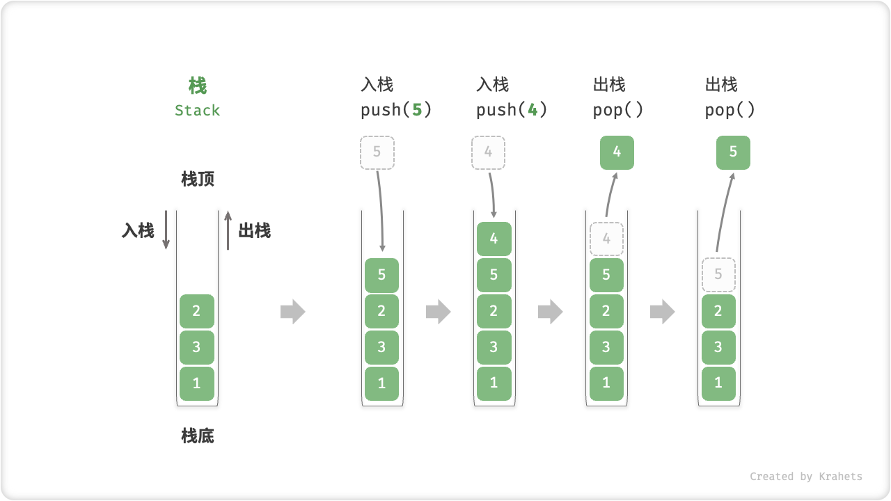
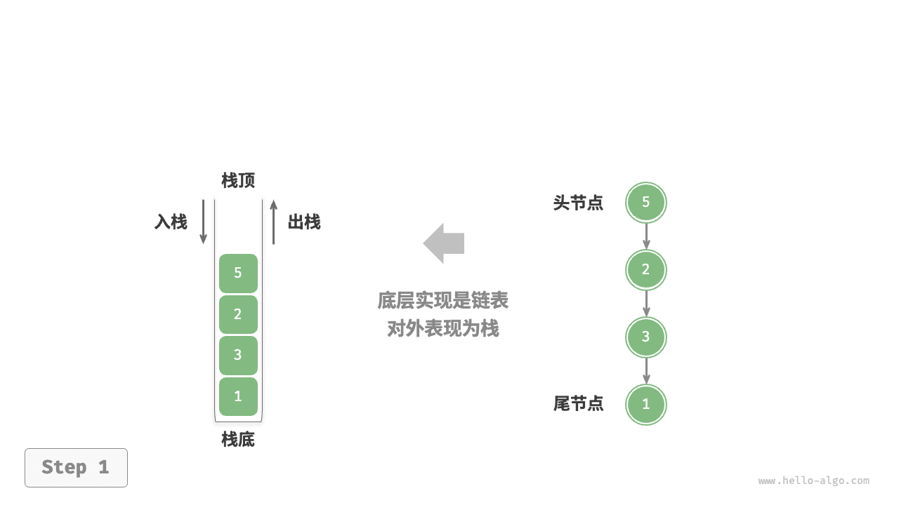
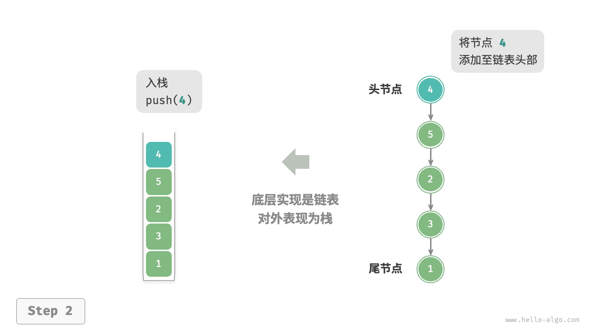
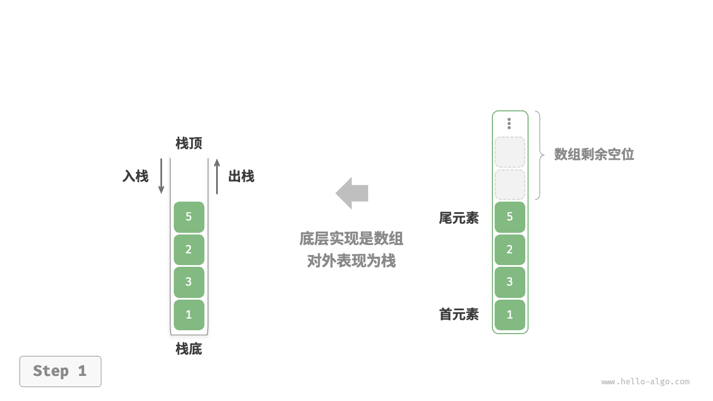
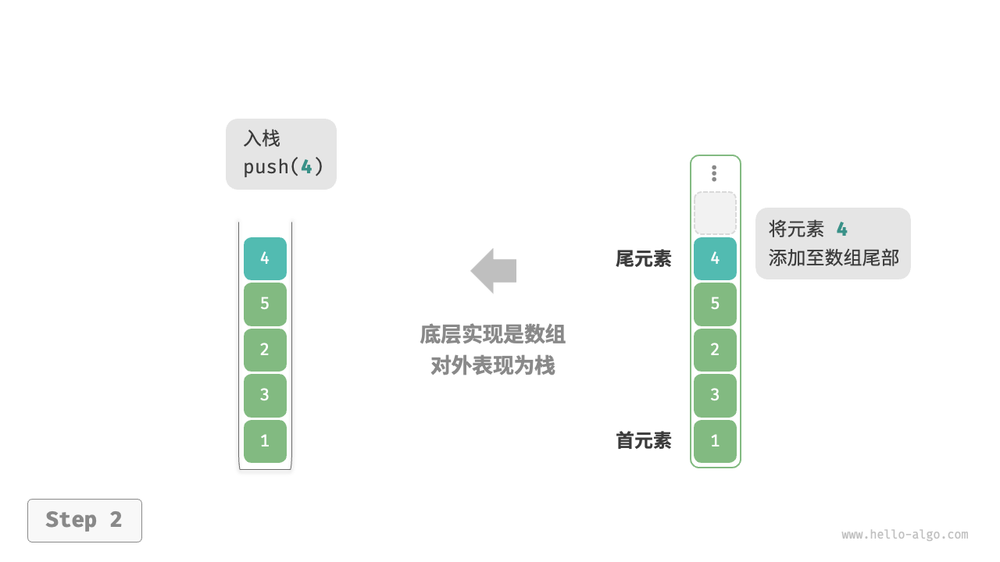
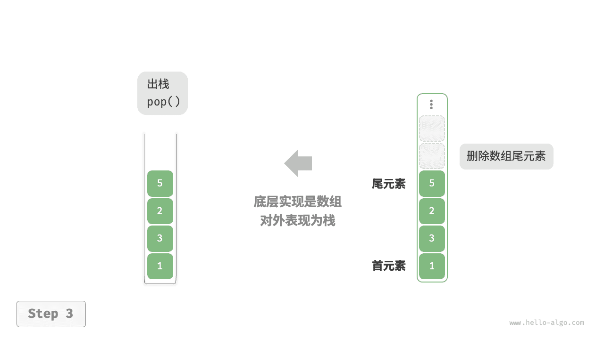

# 栈

<u>栈（stack）</u>是一种遵循先入后出逻辑的线性数据结构。

我们可以将栈类比为桌面上的一摞盘子，如果想取出底部的盘子，则需要先将上面的盘子依次移走。我们将盘子替换为各种类型的元素（如整数、字符、对象等），就得到了栈这种数据结构。

如下图所示，我们把堆叠元素的顶部称为“栈顶”，底部称为“栈底”。将把元素添加到栈顶的操作叫作“入栈”，删除栈顶元素的操作叫作“出栈”。



## 栈的常用操作

栈的常用操作如下表所示，具体的方法名需要根据所使用的编程语言来确定。在此，我们以常见的 `push()`、`pop()`、`peek()` 命名为例。

<p align="center"> 表 <id> &nbsp; 栈的操作效率 </p>

| 方法     | 描述                   | 时间复杂度 |
| -------- | ---------------------- | ---------- |
| `push()` | 元素入栈（添加至栈顶） | $O(1)$     |
| `pop()`  | 栈顶元素出栈           | $O(1)$     |
| `peek()` | 访问栈顶元素           | $O(1)$     |

通常情况下，我们可以直接使用编程语言内置的栈类。然而，某些语言可能没有专门提供栈类，这时我们可以将该语言的“数组”或“链表”当作栈来使用，并在程序逻辑上忽略与栈无关的操作。

=== "Python"

    ```python title="stack.py"
    # 初始化栈
    # Python 没有内置的栈类，可以把 list 当作栈来使用
    stack: list[int] = []

    # 元素入栈
    stack.append(1)
    stack.append(3)
    stack.append(2)
    stack.append(5)
    stack.append(4)

    # 访问栈顶元素
    peek: int = stack[-1]

    # 元素出栈
    pop: int = stack.pop()

    # 获取栈的长度
    size: int = len(stack)

    # 判断是否为空
    is_empty: bool = len(stack) == 0
    ```

=== "C++"

    ```cpp title="stack.cpp"
    /* 初始化栈 */
    stack<int> stack;

    /* 元素入栈 */
    stack.push(1);
    stack.push(3);
    stack.push(2);
    stack.push(5);
    stack.push(4);

    /* 访问栈顶元素 */
    int top = stack.top();

    /* 元素出栈 */
    stack.pop(); // 无返回值

    /* 获取栈的长度 */
    int size = stack.size();

    /* 判断是否为空 */
    bool empty = stack.empty();
    ```

=== "Java"

    ```java title="stack.java"
    /* 初始化栈 */
    Stack<Integer> stack = new Stack<>();

    /* 元素入栈 */
    stack.push(1);
    stack.push(3);
    stack.push(2);
    stack.push(5);
    stack.push(4);

    /* 访问栈顶元素 */
    int peek = stack.peek();

    /* 元素出栈 */
    int pop = stack.pop();

    /* 获取栈的长度 */
    int size = stack.size();

    /* 判断是否为空 */
    boolean isEmpty = stack.isEmpty();
    ```

=== "C#"

    ```csharp title="stack.cs"
    /* 初始化栈 */
    Stack<int> stack = new();

    /* 元素入栈 */
    stack.Push(1);
    stack.Push(3);
    stack.Push(2);
    stack.Push(5);
    stack.Push(4);

    /* 访问栈顶元素 */
    int peek = stack.Peek();

    /* 元素出栈 */
    int pop = stack.Pop();

    /* 获取栈的长度 */
    int size = stack.Count;

    /* 判断是否为空 */
    bool isEmpty = stack.Count == 0;
    ```

=== "Go"

    ```go title="stack_test.go"
    /* 初始化栈 */
    // 在 Go 中，推荐将 Slice 当作栈来使用
    var stack []int

    /* 元素入栈 */
    stack = append(stack, 1)
    stack = append(stack, 3)
    stack = append(stack, 2)
    stack = append(stack, 5)
    stack = append(stack, 4)

    /* 访问栈顶元素 */
    peek := stack[len(stack)-1]

    /* 元素出栈 */
    pop := stack[len(stack)-1]
    stack = stack[:len(stack)-1]

    /* 获取栈的长度 */
    size := len(stack)

    /* 判断是否为空 */
    isEmpty := len(stack) == 0
    ```

=== "Swift"

    ```swift title="stack.swift"
    /* 初始化栈 */
    // Swift 没有内置的栈类，可以把 Array 当作栈来使用
    var stack: [Int] = []

    /* 元素入栈 */
    stack.append(1)
    stack.append(3)
    stack.append(2)
    stack.append(5)
    stack.append(4)

    /* 访问栈顶元素 */
    let peek = stack.last!

    /* 元素出栈 */
    let pop = stack.removeLast()

    /* 获取栈的长度 */
    let size = stack.count

    /* 判断是否为空 */
    let isEmpty = stack.isEmpty
    ```

=== "JS"

    ```javascript title="stack.js"
    /* 初始化栈 */
    // JavaScript 没有内置的栈类，可以把 Array 当作栈来使用
    const stack = [];

    /* 元素入栈 */
    stack.push(1);
    stack.push(3);
    stack.push(2);
    stack.push(5);
    stack.push(4);

    /* 访问栈顶元素 */
    const peek = stack[stack.length-1];

    /* 元素出栈 */
    const pop = stack.pop();

    /* 获取栈的长度 */
    const size = stack.length;

    /* 判断是否为空 */
    const is_empty = stack.length === 0;
    ```

=== "TS"

    ```typescript title="stack.ts"
    /* 初始化栈 */
    // TypeScript 没有内置的栈类，可以把 Array 当作栈来使用
    const stack: number[] = [];

    /* 元素入栈 */
    stack.push(1);
    stack.push(3);
    stack.push(2);
    stack.push(5);
    stack.push(4);

    /* 访问栈顶元素 */
    const peek = stack[stack.length - 1];

    /* 元素出栈 */
    const pop = stack.pop();

    /* 获取栈的长度 */
    const size = stack.length;

    /* 判断是否为空 */
    const is_empty = stack.length === 0;
    ```

=== "Dart"

    ```dart title="stack.dart"
    /* 初始化栈 */
    // Dart 没有内置的栈类，可以把 List 当作栈来使用
    List<int> stack = [];

    /* 元素入栈 */
    stack.add(1);
    stack.add(3);
    stack.add(2);
    stack.add(5);
    stack.add(4);

    /* 访问栈顶元素 */
    int peek = stack.last;

    /* 元素出栈 */
    int pop = stack.removeLast();

    /* 获取栈的长度 */
    int size = stack.length;

    /* 判断是否为空 */
    bool isEmpty = stack.isEmpty;
    ```

=== "Rust"

    ```rust title="stack.rs"
    /* 初始化栈 */
    // 把 Vec 当作栈来使用
    let mut stack: Vec<i32> = Vec::new();

    /* 元素入栈 */
    stack.push(1);
    stack.push(3);
    stack.push(2);
    stack.push(5);
    stack.push(4);

    /* 访问栈顶元素 */
    let top = stack.last().unwrap();

    /* 元素出栈 */
    let pop = stack.pop().unwrap();

    /* 获取栈的长度 */
    let size = stack.len();

    /* 判断是否为空 */
    let is_empty = stack.is_empty();
    ```

=== "C"

    ```c title="stack.c"
    // C 未提供内置栈
    ```

=== "Kotlin"

    ```kotlin title="stack.kt"
    /* 初始化栈 */
    val stack = Stack<Int>()

    /* 元素入栈 */
    stack.push(1)
    stack.push(3)
    stack.push(2)
    stack.push(5)
    stack.push(4)

    /* 访问栈顶元素 */
    val peek = stack.peek()

    /* 元素出栈 */
    val pop = stack.pop()

    /* 获取栈的长度 */
    val size = stack.size

    /* 判断是否为空 */
    val isEmpty = stack.isEmpty()
    ```

=== "Ruby"

    ```ruby title="stack.rb"
    # 初始化栈
    # Ruby 没有内置的栈类，可以把 Array 当作栈来使用
    stack = []

    # 元素入栈
    stack << 1
    stack << 3
    stack << 2
    stack << 5
    stack << 4

    # 访问栈顶元素
    peek = stack.last

    # 元素出栈
    pop = stack.pop

    # 获取栈的长度
    size = stack.length

    # 判断是否为空
    is_empty = stack.empty?
    ```

=== "Zig"

    ```zig title="stack.zig"

    ```

??? pythontutor "可视化运行"

    https://pythontutor.com/render.html#code=%22%22%22Driver%20Code%22%22%22%0Aif%20__name__%20%3D%3D%20%22__main__%22%3A%0A%20%20%20%20%23%20%E5%88%9D%E5%A7%8B%E5%8C%96%E6%A0%88%0A%20%20%20%20%23%20Python%20%E6%B2%A1%E6%9C%89%E5%86%85%E7%BD%AE%E7%9A%84%E6%A0%88%E7%B1%BB%EF%BC%8C%E5%8F%AF%E4%BB%A5%E6%8A%8A%20list%20%E5%BD%93%E4%BD%9C%E6%A0%88%E6%9D%A5%E4%BD%BF%E7%94%A8%0A%20%20%20%20stack%20%3D%20%5B%5D%0A%0A%20%20%20%20%23%20%E5%85%83%E7%B4%A0%E5%85%A5%E6%A0%88%0A%20%20%20%20stack.append%281%29%0A%20%20%20%20stack.append%283%29%0A%20%20%20%20stack.append%282%29%0A%20%20%20%20stack.append%285%29%0A%20%20%20%20stack.append%284%29%0A%20%20%20%20print%28%22%E6%A0%88%20stack%20%3D%22,%20stack%29%0A%0A%20%20%20%20%23%20%E8%AE%BF%E9%97%AE%E6%A0%88%E9%A1%B6%E5%85%83%E7%B4%A0%0A%20%20%20%20peek%20%3D%20stack%5B-1%5D%0A%20%20%20%20print%28%22%E6%A0%88%E9%A1%B6%E5%85%83%E7%B4%A0%20peek%20%3D%22,%20peek%29%0A%0A%20%20%20%20%23%20%E5%85%83%E7%B4%A0%E5%87%BA%E6%A0%88%0A%20%20%20%20pop%20%3D%20stack.pop%28%29%0A%20%20%20%20print%28%22%E5%87%BA%E6%A0%88%E5%85%83%E7%B4%A0%20pop%20%3D%22,%20pop%29%0A%20%20%20%20print%28%22%E5%87%BA%E6%A0%88%E5%90%8E%20stack%20%3D%22,%20stack%29%0A%0A%20%20%20%20%23%20%E8%8E%B7%E5%8F%96%E6%A0%88%E7%9A%84%E9%95%BF%E5%BA%A6%0A%20%20%20%20size%20%3D%20len%28stack%29%0A%20%20%20%20print%28%22%E6%A0%88%E7%9A%84%E9%95%BF%E5%BA%A6%20size%20%3D%22,%20size%29%0A%0A%20%20%20%20%23%20%E5%88%A4%E6%96%AD%E6%98%AF%E5%90%A6%E4%B8%BA%E7%A9%BA%0A%20%20%20%20is_empty%20%3D%20len%28stack%29%20%3D%3D%200%0A%20%20%20%20print%28%22%E6%A0%88%E6%98%AF%E5%90%A6%E4%B8%BA%E7%A9%BA%20%3D%22,%20is_empty%29&cumulative=false&curInstr=2&heapPrimitives=nevernest&mode=display&origin=opt-frontend.js&py=311&rawInputLstJSON=%5B%5D&textReferences=false

## 栈的实现

为了深入了解栈的运行机制，我们来尝试自己实现一个栈类。

栈遵循先入后出的原则，因此我们只能在栈顶添加或删除元素。然而，数组和链表都可以在任意位置添加和删除元素，**因此栈可以视为一种受限制的数组或链表**。换句话说，我们可以“屏蔽”数组或链表的部分无关操作，使其对外表现的逻辑符合栈的特性。

### 基于链表的实现

使用链表实现栈时，我们可以将链表的头节点视为栈顶，尾节点视为栈底。

如下图所示，对于入栈操作，我们只需将元素插入链表头部，这种节点插入方法被称为“头插法”。而对于出栈操作，只需将头节点从链表中删除即可。

=== "LinkedListStack"
    

=== "push()"
    

=== "pop()"
    

以下是基于链表实现栈的示例代码：

```src
[file]{linkedlist_stack}-[class]{linked_list_stack}-[func]{}
```

### 基于数组的实现

使用数组实现栈时，我们可以将数组的尾部作为栈顶。如下图所示，入栈与出栈操作分别对应在数组尾部添加元素与删除元素，时间复杂度都为 $O(1)$ 。

=== "ArrayStack"
    

=== "push()"
    

=== "pop()"
    

由于入栈的元素可能会源源不断地增加，因此我们可以使用动态数组，这样就无须自行处理数组扩容问题。以下为示例代码：

```src
[file]{array_stack}-[class]{array_stack}-[func]{}
```

## 两种实现对比

**支持操作**

两种实现都支持栈定义中的各项操作。数组实现额外支持随机访问，但这已超出了栈的定义范畴，因此一般不会用到。

**时间效率**

在基于数组的实现中，入栈和出栈操作都在预先分配好的连续内存中进行，具有很好的缓存本地性，因此效率较高。然而，如果入栈时超出数组容量，会触发扩容机制，导致该次入栈操作的时间复杂度变为 $O(n)$ 。

在基于链表的实现中，链表的扩容非常灵活，不存在上述数组扩容时效率降低的问题。但是，入栈操作需要初始化节点对象并修改指针，因此效率相对较低。不过，如果入栈元素本身就是节点对象，那么可以省去初始化步骤，从而提高效率。

综上所述，当入栈与出栈操作的元素是基本数据类型时，例如 `int` 或 `double` ，我们可以得出以下结论。

- 基于数组实现的栈在触发扩容时效率会降低，但由于扩容是低频操作，因此平均效率更高。
- 基于链表实现的栈可以提供更加稳定的效率表现。

**空间效率**

在初始化列表时，系统会为列表分配“初始容量”，该容量可能超出实际需求；并且，扩容机制通常是按照特定倍率（例如 2 倍）进行扩容的，扩容后的容量也可能超出实际需求。因此，**基于数组实现的栈可能造成一定的空间浪费**。

然而，由于链表节点需要额外存储指针，**因此链表节点占用的空间相对较大**。

综上，我们不能简单地确定哪种实现更加节省内存，需要针对具体情况进行分析。

## 栈的典型应用

- **浏览器中的后退与前进、软件中的撤销与反撤销**。每当我们打开新的网页，浏览器就会对上一个网页执行入栈，这样我们就可以通过后退操作回到上一个网页。后退操作实际上是在执行出栈。如果要同时支持后退和前进，那么需要两个栈来配合实现。
- **程序内存管理**。每次调用函数时，系统都会在栈顶添加一个栈帧，用于记录函数的上下文信息。在递归函数中，向下递推阶段会不断执行入栈操作，而向上回溯阶段则会不断执行出栈操作。
