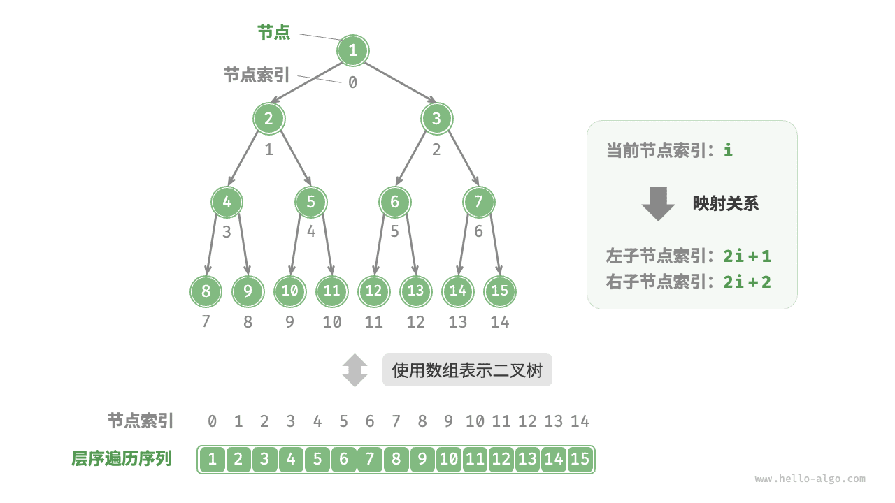
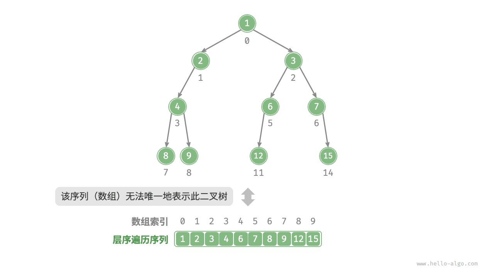
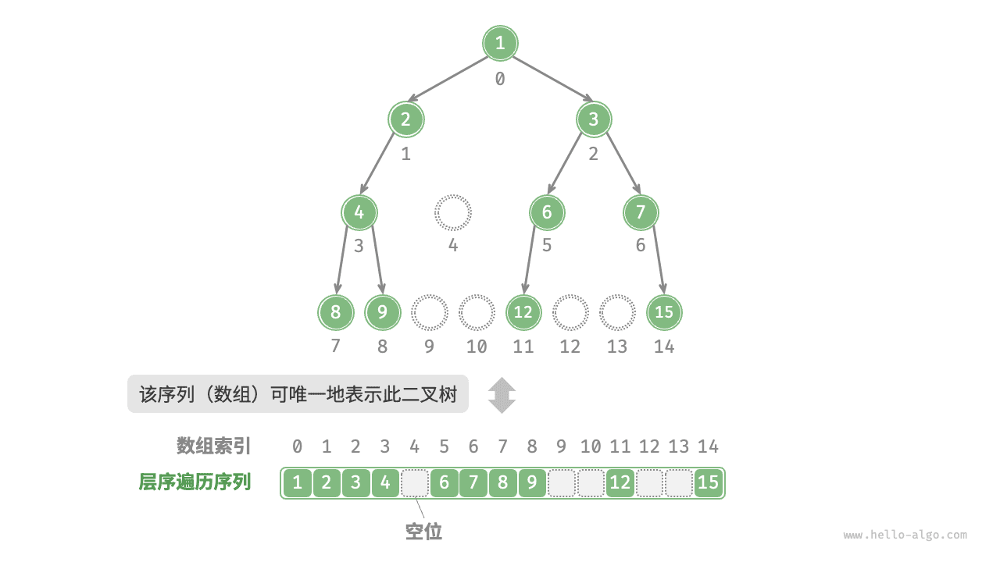
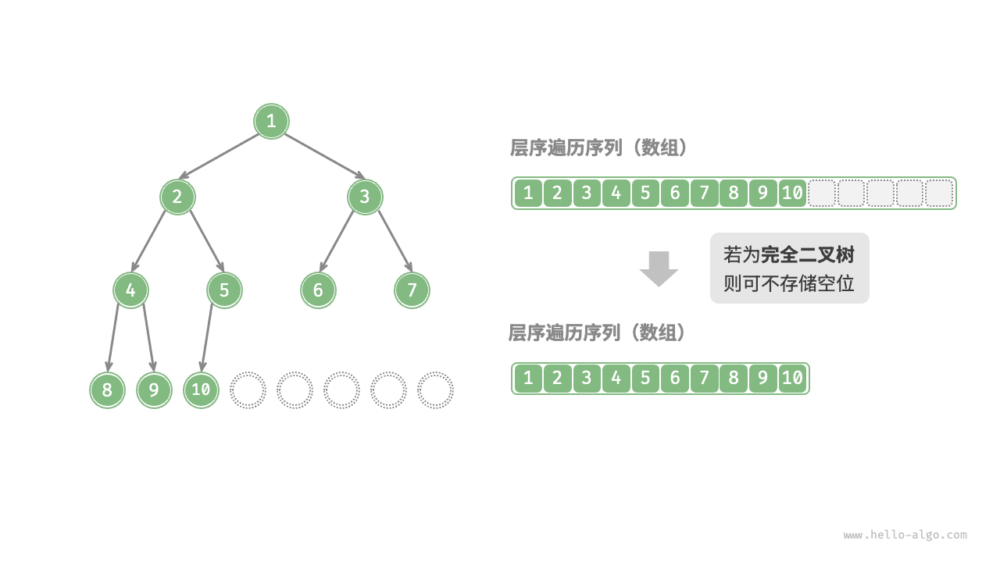

# 二叉树数组表示

在链表表示下，二叉树的存储单元为节点 `TreeNode` ，节点之间通过指针相连接。在上节中，我们学习了在链表表示下的二叉树的各项基本操作。

那么，能否用「数组」来表示二叉树呢？答案是肯定的。

## 表示完美二叉树

先分析一个简单案例，给定一个完美二叉树，我们将节点按照层序遍历的顺序编号（从 $0$ 开始），此时每个节点都对应唯一的索引。

根据层序遍历的特性，我们可以推导出父节点索引与子节点索引之间的“映射公式”：**若节点的索引为 $i$ ，则该节点的左子节点索引为 $2i + 1$ ，右子节点索引为 $2i + 2$** 。



**映射公式的作用相当于链表中的指针**。如果我们将节点按照层序遍历的顺序存储在一个数组中，那么对于数组中的任意节点，我们都可以通过映射公式来访问其子节点。

## 表示任意二叉树

然而，完美二叉树只是一个特例。在二叉树的中间层，通常存在许多 $\text{None}$ ，而层序遍历序列并不包含这些 $\text{None}$ 。我们无法仅凭该序列来推测 $\text{None}$ 的数量和分布位置，**这意味着存在多种二叉树结构都符合该层序遍历序列**。显然在这种情况下，上述的数组表示方法已经失效。



为了解决此问题，**我们可以考虑在层序遍历序列中显式地写出所有 $\text{None}$**。如下图所示，这样处理后，层序遍历序列就可以唯一表示二叉树了。

=== "Java"

    ```java title=""
    /* 二叉树的数组表示 */
    // 使用 int 的包装类 Integer ，就可以使用 null 来标记空位
    Integer[] tree = { 1, 2, 3, 4, null, 6, 7, 8, 9, null, null, 12, null, null, 15 };
    ```

=== "C++"

    ```cpp title=""
    /* 二叉树的数组表示 */
    // 使用 int 最大值标记空位，因此要求节点值不能为 INT_MAX
    vector<int> tree = {1, 2, 3, 4, INT_MAX, 6, 7, 8, 9, INT_MAX, INT_MAX, 12, INT_MAX, INT_MAX, 15};
    ```

=== "Python"

    ```python title=""
    # 二叉树的数组表示
    # 直接使用 None 来表示空位
    tree = [1, 2, 3, 4, None, 6, 7, 8, 9, None, None, 12, None, None, 15]
    ```

=== "Go"

    ```go title=""
    /* 二叉树的数组表示 */
    // 使用 any 类型的切片, 就可以使用 nil 来标记空位
    tree := []any{1, 2, 3, 4, nil, 6, 7, 8, 9, nil, nil, 12, nil, nil, 15}
    ```

=== "JavaScript"

    ```javascript title=""
    /* 二叉树的数组表示 */
    // 直接使用 null 来表示空位
    let tree = [1, 2, 3, 4, null, 6, 7, 8, 9, null, null, 12, null, null, 15];
    ```

=== "TypeScript"

    ```typescript title=""
    /* 二叉树的数组表示 */
    // 直接使用 null 来表示空位
    let tree: (number | null)[] = [1, 2, 3, 4, null, 6, 7, 8, 9, null, null, 12, null, null, 15];
    ```

=== "C"

    ```c title=""
    /* 二叉树的数组表示 */
    // 使用 int 最大值标记空位，因此要求节点值不能为 INT_MAX
    int tree[] = {1, 2, 3, 4, INT_MAX, 6, 7, 8, 9, INT_MAX, INT_MAX, 12, INT_MAX, INT_MAX, 15};
    ```

=== "C#"

    ```csharp title=""
    /* 二叉树的数组表示 */
    // 使用 int? 可空类型 ，就可以使用 null 来标记空位
    int?[] tree = { 1, 2, 3, 4, null, 6, 7, 8, 9, null, null, 12, null, null, 15 };
    ```

=== "Swift"

    ```swift title=""
    /* 二叉树的数组表示 */
    // 使用 Int? 可空类型 ，就可以使用 nil 来标记空位
    let tree: [Int?] = [1, 2, 3, 4, nil, 6, 7, 8, 9, nil, nil, 12, nil, nil, 15]
    ```

=== "Zig"

    ```zig title=""

    ```

=== "Dart"

    ```dart title=""
    /* 二叉树的数组表示 */
    // 使用 int? 可空类型 ，就可以使用 null 来标记空位
    List<int?> tree = [1, 2, 3, 4, null, 6, 7, 8, 9, null, null, 12, null, null, 15];
    ```



## 优势与局限性

二叉树的数组表示存在以下优点：

- 数组存储在连续的内存空间中，缓存友好，访问与遍历速度较快；
- 不需要存储指针，比较节省空间；
- 允许随机访问节点；

然而，数组表示也具有一些局限性：

- 数组存储需要连续内存空间，因此不适合存储数据量过大的树。
- 增删节点需要通过数组插入与删除操作实现，效率较低；
- 当二叉树中存在大量 $\text{None}$ 时，数组中包含的节点数据比重较低，空间利用率较低。

**完全二叉树非常适合使用数组来表示**。回顾完全二叉树的定义，$\text{None}$ 只出现在最底层且靠右的位置，**这意味着所有 $\text{None}$ 一定出现在层序遍历序列的末尾**。因此，在使用数组表示完全二叉树时，可以省略存储所有 $\text{None}$ 。


