# AVL 树

## AVL 树的起源

在「二叉搜索树」章节中提到，如进行多次插入与删除操作后，二叉搜索树可能会退化为链表。此时所有操作的时间复杂度都会由 $O(\log n)$ 劣化至 $O(n)$ 。例如，删除结点 4 后，该二叉搜索树就会退化为链表。

=== "删除前"
    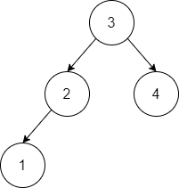
=== "删除后"
    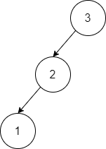

为了解决这一问题，G. M. Adelson-Velsky 和 E. M. Landis 在其 1962 年发表的论文 "An algorithm for the organization of info
rmation" 中提出了「平衡二叉搜索树」，也以两位作者命名，常被称为「AVL 树」。

## AVL 树的性质

「AVL 树」既是「二叉搜索树」又是「平衡二叉树」，同时满足这两种二叉树的所有性质。「平衡二叉树」规定树中任意结点左右子树的高度差的绝对值不能超过 1 。本文定义：

- 「平衡因子 Balance Factor」为 **左子树的高度减右子树的高度** 。
- 空树的高度定义为 0 ，叶结点的高度定义为 1 。

!!! tip

    设「平衡因子」为 $f$ ，则一棵 AVL 树的任意结点的平衡因子满足 $-1 \le f \le 1$

## AVL 树的优势

提出 AVL 树的两位大佬的厉害之处在于，他们设计了一系列操作，使得 AVL 树在不断添加与删除结点后，仍然不会发生退化，进而使得各种操作的时间复杂度均能保持在 $O(\log n)$ 级别。

## AVL 树的操作

### 查找结点

「 AVL 树」的结点查找操作与「二叉搜索树」一致，在此不再赘述。

### 插入结点

由于平衡二叉树需要保证其任意结点的平衡因子满足限制，所以在插入结点后可能会造成 AVL 树的失衡。例如，平衡二叉树在插入结点 0 前 / 后如下图所示（括号内表示当前结点的平衡因子）：

=== "插入前"
    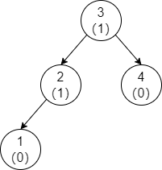
=== "插入后"
    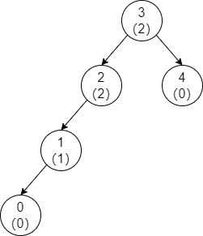

观察发现，插入后结点 2 和 结点 3 已经不满足平衡二叉树的性质，我们将这一现象称为 **失衡** 。为了解决该问题，首先需要分析哪些结点会出现失衡，经过观察可得两条规律：

- 出现失衡的结点都必然出现在新插入结点与根结点的路径上；
- 在这条路径上，该插入结点的父结点一定不会失衡，即首先失衡的结点必然是父节点之上的结点；

!!! tip "证明"

    由于新插入结点必然是叶结点，因此其父结点之前只有 0 个或 1 个孩子结点，
    
    - 当父结点有 0 个孩子结点，那么插入结点后，父结点的平衡因子等于 -1 或 1；
    - 当父结点有 1 个孩子结点，那么由于插入之前满足 AVL 树性质，那么这个孩子结点形成子树高度等于 $1$ ，插入结点后，父结点的平衡因子等于 $0$ ；
    
    因此父结点一定不会失衡，证毕。

现在考虑如何将一个失衡点恢复为平衡点。

我们知道对于二叉搜索树的中序遍历序列一定是严格升序的。在论文中，作者定义了一种被称为「旋转 Rotation」的操作，其可 **在不影响二叉树中序遍历序列的情况下，降低失衡点左右子树的高度差** 。

#### 右旋

以上文中提到的发生失衡的 AVL 树为例，「右旋」的具体操作为：

1. 首先可以找到第一个发生失衡的点是结点 2 。
2. 以该点为轴顺时针旋转，使该点左孩子的右子树指向该点，该点的左子树指向其左孩子的右子树。
3. 将原本的左孩子连接至该点的父结点。

观察得知，经过右旋后，整棵二叉树已经恢复平衡，并且中序遍历序列也保持不变。

=== "Step 1"
    
=== "Step 2"
    
=== "Step 3"
    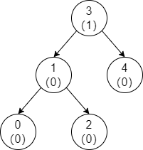

#### 左旋

下面来看与之对应的「左旋」，需要使用左旋的情况与右旋相似，下面以例子来说明左旋的过程：

- Todo

与右旋相同，左旋也可以让失衡的结点恢复平衡，同时不会改变中序遍历序列。

=== "Step 1"
    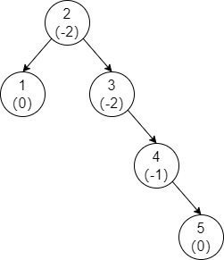
=== "Step 2"
    
=== "Step 3"
    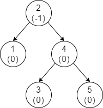

#### 双旋

「双旋」分为两种，一种是「先左旋后右旋」，另一种是「先右旋后左旋」。

以先左后右为例，如果直接对下图二叉树的失衡点执行右旋，会发现并不能使失衡点恢复平衡。

=== "Step 1"
    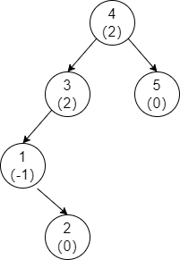
=== "Step 2"
    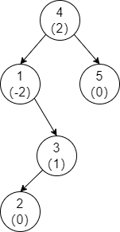


为了解决该问题，需要「先左旋后右旋」，即分为两步：

1. 将失衡点的左孩子执行左旋。
2. 对失衡点执行右旋。

=== "Step 1"
    
=== "Step 2"
    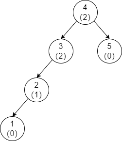
=== "Step 3"
    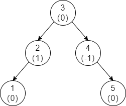

同理，「先左旋后右旋」是先将失衡点的左孩子执行右旋，然后对失衡点执行左旋。

#### 旋转选择

下面我们来看看，如何根据失衡的情形来选择对应的旋转方法。旋转方法的选择是由失衡点的平衡因子以及其较高一侧子树的平衡因子决定的，分为以下四种情形：

| 失衡结点的平衡因子 | 结点的较高子树 | 较高子树的平衡因子 | 应采用的旋转方法 |
| ------------------ | -------------- | ------------------ | ---------------- |
| $>0$               | 左子树         | $>0$               | 右旋             |
| $>0$               | 左子树         | $<0$               | 双旋（先左后右） |
| $<0$               | 右子树         | $<0$               | 左旋             |
| $<0$               | 右子树         | $>0$               | 双旋（先右后左） |

为了方便起见，将 AVL 树修复失衡点封装为一个函数，具体实现如下：

=== "C++"

    ```cpp title="fix_balance.cpp"
    // Comments are required
    TreeNode *&fromParentTo(TreeNode *node) {
        if (isLeftChild(node)) { return node->parent->left; }
        else { return node->parent->right; }
    }
    
    void fixBalance(TreeNode *p) {
        auto rotate_left = [&](TreeNode *node) -> TreeNode * {
            TreeNode *temp = node->right;
            temp->parent = p->parent;
            node->right = temp->left;
            if (temp->left != nullptr) {
                temp->left->parent = node;
            }
            temp->left = node;
            node->parent = temp;
            updateHeight(node);
            updateHeight(temp);
            return temp;
        };
        auto rotate_right = [&](TreeNode *node) -> TreeNode * {
            TreeNode *temp = node->left;
            temp->parent = p->parent;
            node->left = temp->right;
            if (temp->right != nullptr) {
                temp->right->parent = node;
            }
            temp->right = node;
            node->parent = temp;
            updateHeight(node);
            updateHeight(temp);
            return temp;
        };
    
        if (getBalanceFactor(p) > 1) {
            if (getBalanceFactor(p->left) > 0) {
                if (p->parent == nullptr) { root = rotate_right(p); }
                else { fromParentTo(p) = rotate_right(p); }
            } else {
                p->left = rotate_left(p->left);
                if (p->parent == nullptr) { root = rotate_right(p); }
                else { fromParentTo(p) = rotate_right(p); }
            }
        } else {
            if (getBalanceFactor(p->right) < 0) {
                if (p->parent == nullptr) { root = rotate_left(p); }
                else { fromParentTo(p) = rotate_left(p); }
            } else {
                p->right = rotate_right(p->right);
                if (p->parent == nullptr) { root = rotate_left(p); }
                else { fromParentTo(p) = rotate_left(p); }
            }
        }
    }
    ```

有了上文中修复失衡点的函数，平衡二叉树的插入代码也就不难写出了。

=== "C++"

    ```cpp title="avl_tree_insert.cpp"
    // Comments are required
    bool AvlTree::insert(int val) {
        TreeNode *p = root;
        if (p == nullptr) {
            root = new TreeNode(val);
            return true;
        }
        for (;;) {
            if (p->val == val) { return false; }
            else if (p->val > val) {
                if (p->left == nullptr) {
                    p->left = new TreeNode(val, p);
                    break;
                } else {
                    p = p->left;
                }
            } else {
                if (p->right == nullptr) {
                    p->right = new TreeNode(val, p);
                    break;
                } else {
                    p = p->right;
                }
            }
        }
        for (; p != nullptr; p = p->parent) {
            if (!isBalance(p)) {
                fixBalance(p);
                break;
            } else { 
                updateHeight(p);
            }
        }
        return true;
    }
    ```

#### 高度复原

插入结点后，从该结点至根结点的路径上的结点的高度有可能发生变化。因此在向上搜寻失衡点的过程中，需要不断地更新路径上结点的高度。

=== "C++"

    ```cpp title="updateHeight.cpp"
    // Comments are required
    void updateHeight(TreeNode *p) {
        if (p->left == nullptr && p->right == nullptr) { p->height = 1; }
        else if (p->left == nullptr) { p->height = p->right->height + 1; }
        else if (p->right == nullptr) { p->height = p->left->height + 1; }
        else { p->height = std::max(p->left->height, p->right->height) + 1; }
    }
    ```

但可以证明的是，插入操作所造成的结点高度变化最多只会影响到第一个失衡点以下的部分。这也正是上述插入操作的代码中修复第一个失衡点后直接跳出循环的原因。

!!! tip "证明"

    以第一个失衡结点为根，设非新插入结点所在子树的高度为 $h$ 。
    
    通过插入前后子树高度的变化可以得出，将第一个失衡结点的平衡因子修复后，该结点的高度与插入前相等。因此，高度变化只会传播到第一个失衡点下方的结点。

### 删除结点

「AVL 树」删除结点操作与「二叉搜索树」删除结点操作总体相同。在此基础上，「AVL树」在删除结点后，需要从删除结点的父结点开始进行失衡点修复与高度复原，直到树的根节点。

=== "C++"

    ```cpp title="avl_tree_remove.cpp"
    // Comments are required
    bool AvlTree::remove(int val) {
        TreeNode *p = root;
        if (p == nullptr) { return false; }
        while (p != nullptr) {
            if (p->val == val) {
                TreeNode *real_delete_node = p;
                TreeNode *next_node;
                if (p->left == nullptr) {
                    next_node = p->right;
                    if (p->parent == nullptr) { root = next_node; }
                    else { fromParentTo(p) = next_node; }
                } else if (p->right == nullptr) {
                    next_node = p->left;
                    if (p->parent == nullptr) { root = next_node; }
                    else { fromParentTo(p) = next_node; }
                } else {
                    while (real_delete_node->left != nullptr) {
                        real_delete_node = real_delete_node->left;
                    }
                    std::swap(p->val, real_delete_node->val);
                    next_node = real_delete_node->right;
                    if (real_delete_node->parent == p) { p->right = next_node; }
                    else { real_delete_node->parent->left = next_node; }
                }
                if (next_node != nullptr) {
                    next_node->parent = real_delete_node->parent;
                }
                for (p = real_delete_node; p != nullptr; p = p->parent) {
                    if (!isBalance(p)) { fixBalance(p); }
                    updateHeight(p);
                }
                delete real_delete_node;
                return true;
            } else if (p->val > val) {
                p = p->left;
            } else {
                p = p->right;
            }
        }
        return false;
    }
    ```
