# 二叉搜索树

「二叉搜索树 Binary Search Tree」满足以下条件：

1. 对于根节点，左子树中所有节点的值 $<$ 根节点的值 $<$ 右子树中所有节点的值；
2. 任意节点的左、右子树也是二叉搜索树，即同样满足条件 `1.` ；

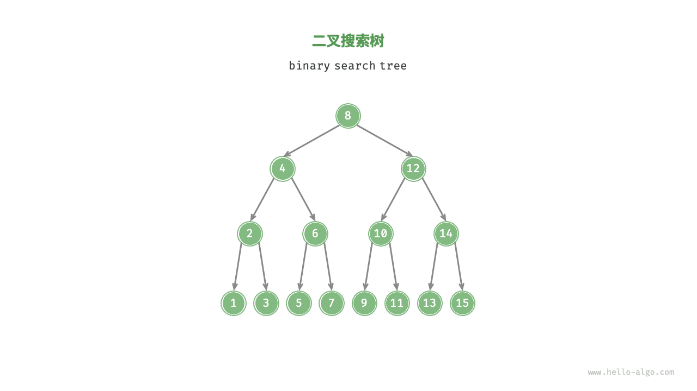

## 二叉搜索树的操作

### 查找节点

给定目标节点值 `num` ，可以根据二叉搜索树的性质来查找。我们声明一个节点 `cur` ，从二叉树的根节点 `root` 出发，循环比较节点值 `cur.val` 和 `num` 之间的大小关系

- 若 `cur.val < num` ，说明目标节点在 `cur` 的右子树中，因此执行 `cur = cur.right` ；
- 若 `cur.val > num` ，说明目标节点在 `cur` 的左子树中，因此执行 `cur = cur.left` ；
- 若 `cur.val = num` ，说明找到目标节点，跳出循环并返回该节点；

=== "<1>"
    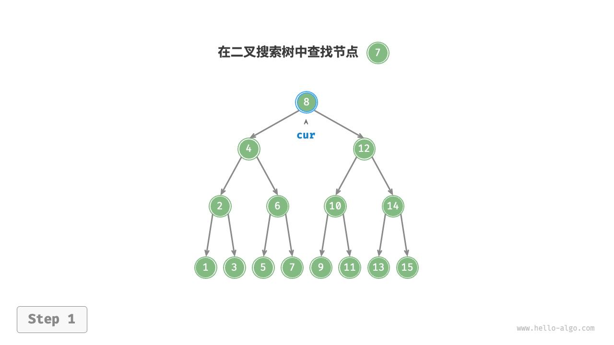

=== "<2>"
    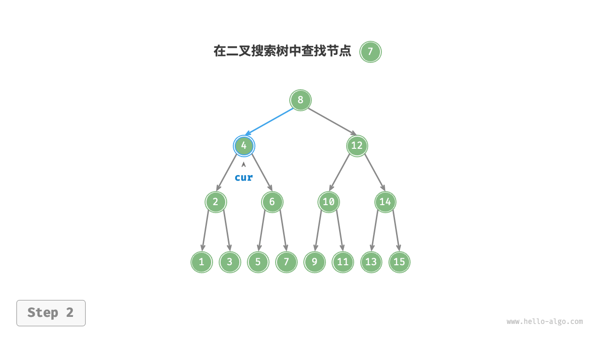

=== "<3>"
    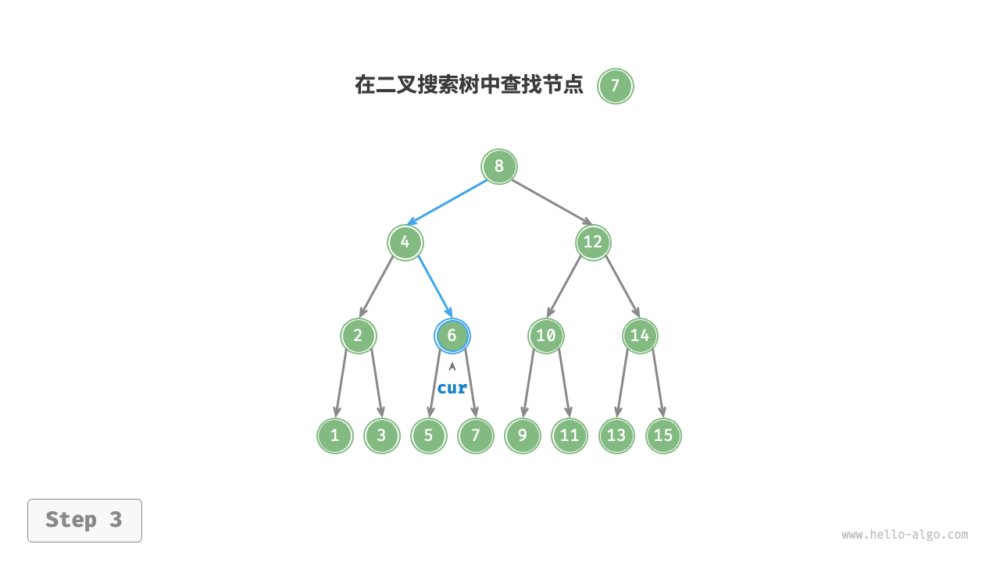

=== "<4>"
    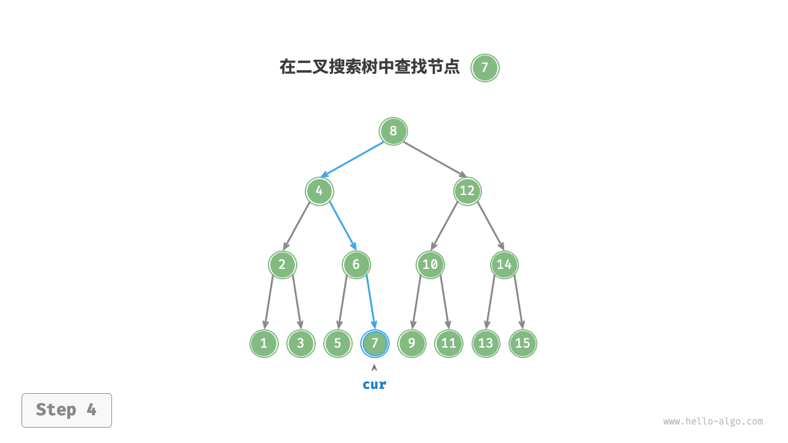

二叉搜索树的查找操作与二分查找算法的工作原理一致，都是每轮排除一半情况。循环次数最多为二叉树的高度，当二叉树平衡时，使用 $O(\log n)$ 时间。

=== "Java"

    ```java title="binary_search_tree.java"
    [class]{BinarySearchTree}-[func]{search}
    ```

=== "C++"

    ```cpp title="binary_search_tree.cpp"
    [class]{BinarySearchTree}-[func]{search}
    ```

=== "Python"

    ```python title="binary_search_tree.py"
    [class]{BinarySearchTree}-[func]{search}
    ```

=== "Go"

    ```go title="binary_search_tree.go"
    [class]{binarySearchTree}-[func]{search}
    ```

=== "JavaScript"

    ```javascript title="binary_search_tree.js"
    [class]{}-[func]{search}
    ```

=== "TypeScript"

    ```typescript title="binary_search_tree.ts"
    [class]{}-[func]{search}
    ```

=== "C"

    ```c title="binary_search_tree.c"
    [class]{binarySearchTree}-[func]{search}
    ```

=== "C#"

    ```csharp title="binary_search_tree.cs"
    [class]{BinarySearchTree}-[func]{search}
    ```

=== "Swift"

    ```swift title="binary_search_tree.swift"
    [class]{BinarySearchTree}-[func]{search}
    ```

=== "Zig"

    ```zig title="binary_search_tree.zig"
    [class]{BinarySearchTree}-[func]{search}
    ```

=== "Dart"

    ```dart title="binary_search_tree.dart"
    [class]{BinarySearchTree}-[func]{search}
    ```

### 插入节点

给定一个待插入元素 `num` ，为了保持二叉搜索树“左子树 < 根节点 < 右子树”的性质，插入操作分为两步：

1. **查找插入位置**：与查找操作相似，从根节点出发，根据当前节点值和 `num` 的大小关系循环向下搜索，直到越过叶节点（遍历至 $\text{None}$ ）时跳出循环；
2. **在该位置插入节点**：初始化节点 `num` ，将该节点置于 $\text{None}$ 的位置；

二叉搜索树不允许存在重复节点，否则将违反其定义。因此，若待插入节点在树中已存在，则不执行插入，直接返回。

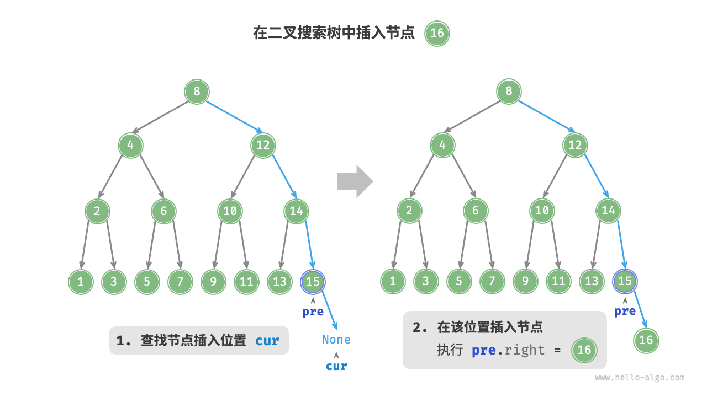

=== "Java"

    ```java title="binary_search_tree.java"
    [class]{BinarySearchTree}-[func]{insert}
    ```

=== "C++"

    ```cpp title="binary_search_tree.cpp"
    [class]{BinarySearchTree}-[func]{insert}
    ```

=== "Python"

    ```python title="binary_search_tree.py"
    [class]{BinarySearchTree}-[func]{insert}
    ```

=== "Go"

    ```go title="binary_search_tree.go"
    [class]{binarySearchTree}-[func]{insert}
    ```

=== "JavaScript"

    ```javascript title="binary_search_tree.js"
    [class]{}-[func]{insert}
    ```

=== "TypeScript"

    ```typescript title="binary_search_tree.ts"
    [class]{}-[func]{insert}
    ```

=== "C"

    ```c title="binary_search_tree.c"
    [class]{binarySearchTree}-[func]{insert}
    ```

=== "C#"

    ```csharp title="binary_search_tree.cs"
    [class]{BinarySearchTree}-[func]{insert}
    ```

=== "Swift"

    ```swift title="binary_search_tree.swift"
    [class]{BinarySearchTree}-[func]{insert}
    ```

=== "Zig"

    ```zig title="binary_search_tree.zig"
    [class]{BinarySearchTree}-[func]{insert}
    ```

=== "Dart"

    ```dart title="binary_search_tree.dart"
    [class]{BinarySearchTree}-[func]{insert}
    ```

为了插入节点，我们需要利用辅助节点 `pre` 保存上一轮循环的节点，这样在遍历至 $\text{None}$ 时，我们可以获取到其父节点，从而完成节点插入操作。

与查找节点相同，插入节点使用 $O(\log n)$ 时间。

### 删除节点

与插入节点类似，我们需要在删除操作后维持二叉搜索树的“左子树 < 根节点 < 右子树”的性质。首先，我们需要在二叉树中执行查找操作，获取待删除节点。接下来，根据待删除节点的子节点数量，删除操作需分为三种情况：

当待删除节点的度为 $0$ 时，表示待删除节点是叶节点，可以直接删除。

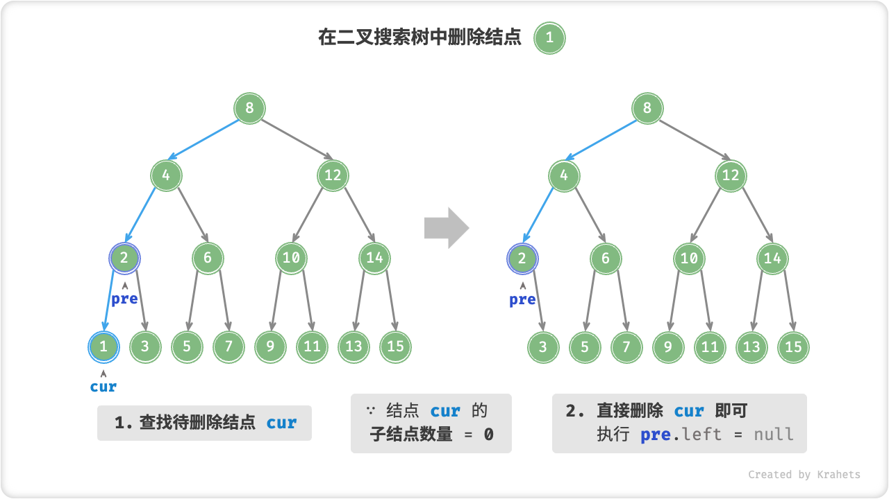

当待删除节点的度为 $1$ 时，将待删除节点替换为其子节点即可。

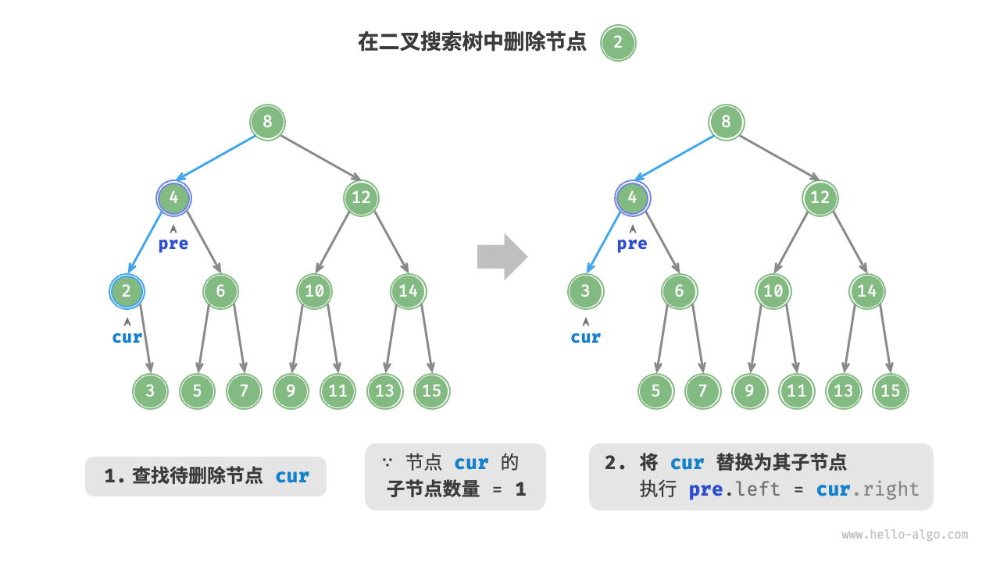

当待删除节点的度为 $2$ 时，我们无法直接删除它，而需要使用一个节点替换该节点。由于要保持二叉搜索树“左 $<$ 根 $<$ 右”的性质，因此这个节点可以是右子树的最小节点或左子树的最大节点。假设我们选择右子树的最小节点（或者称为中序遍历的下个节点），则删除操作为：

1. 找到待删除节点在“中序遍历序列”中的下一个节点，记为 `tmp` ；
2. 将 `tmp` 的值覆盖待删除节点的值，并在树中递归删除节点 `tmp` ；

=== "<1>"
    

=== "<2>"
    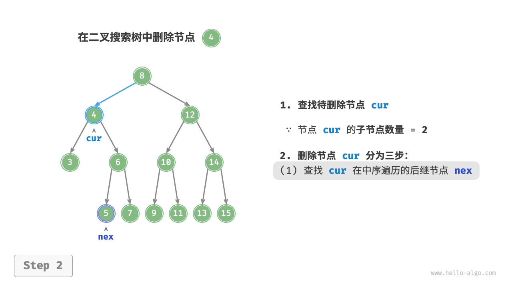

=== "<3>"
    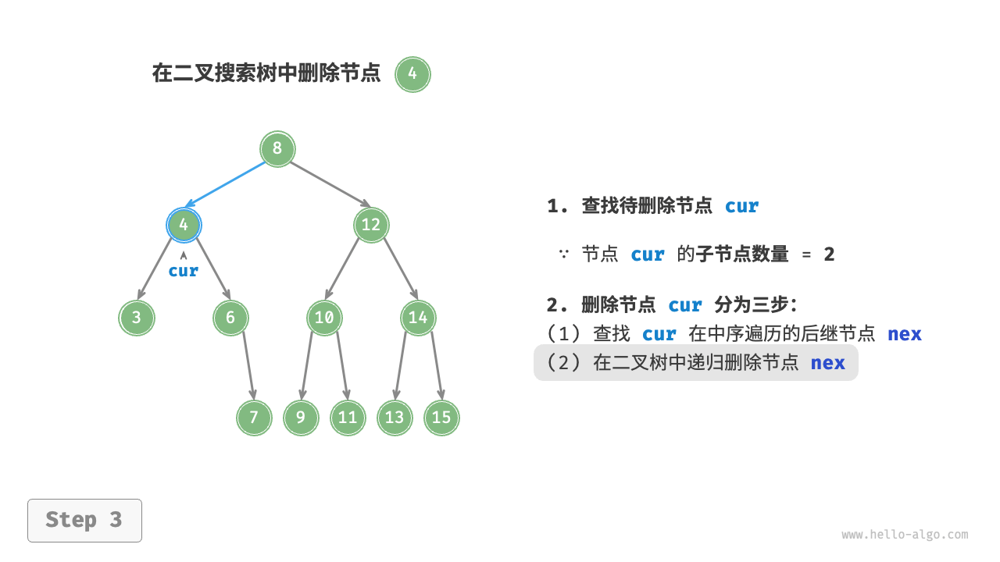

=== "<4>"
    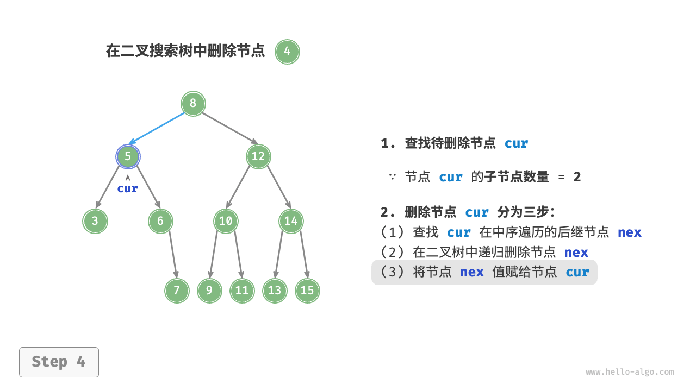

删除节点操作同样使用 $O(\log n)$ 时间，其中查找待删除节点需要 $O(\log n)$ 时间，获取中序遍历后继节点需要 $O(\log n)$ 时间。

=== "Java"

    ```java title="binary_search_tree.java"
    [class]{BinarySearchTree}-[func]{remove}
    ```

=== "C++"

    ```cpp title="binary_search_tree.cpp"
    [class]{BinarySearchTree}-[func]{remove}
    ```

=== "Python"

    ```python title="binary_search_tree.py"
    [class]{BinarySearchTree}-[func]{remove}
    ```

=== "Go"

    ```go title="binary_search_tree.go"
    [class]{binarySearchTree}-[func]{remove}
    ```

=== "JavaScript"

    ```javascript title="binary_search_tree.js"
    [class]{}-[func]{remove}
    ```

=== "TypeScript"

    ```typescript title="binary_search_tree.ts"
    [class]{}-[func]{remove}
    ```

=== "C"

    ```c title="binary_search_tree.c"
    [class]{binarySearchTree}-[func]{removeNode}
    ```

=== "C#"

    ```csharp title="binary_search_tree.cs"
    [class]{BinarySearchTree}-[func]{remove}
    ```

=== "Swift"

    ```swift title="binary_search_tree.swift"
    [class]{BinarySearchTree}-[func]{remove}
    ```

=== "Zig"

    ```zig title="binary_search_tree.zig"
    [class]{BinarySearchTree}-[func]{remove}
    ```

=== "Dart"

    ```dart title="binary_search_tree.dart"
    [class]{BinarySearchTree}-[func]{remove}
    ```

### 排序

我们知道，二叉树的中序遍历遵循“左 $\rightarrow$ 根 $\rightarrow$ 右”的遍历顺序，而二叉搜索树满足“左子节点 $<$ 根节点 $<$ 右子节点”的大小关系。因此，在二叉搜索树中进行中序遍历时，总是会优先遍历下一个最小节点，从而得出一个重要性质：**二叉搜索树的中序遍历序列是升序的**。

利用中序遍历升序的性质，我们在二叉搜索树中获取有序数据仅需 $O(n)$ 时间，无需额外排序，非常高效。

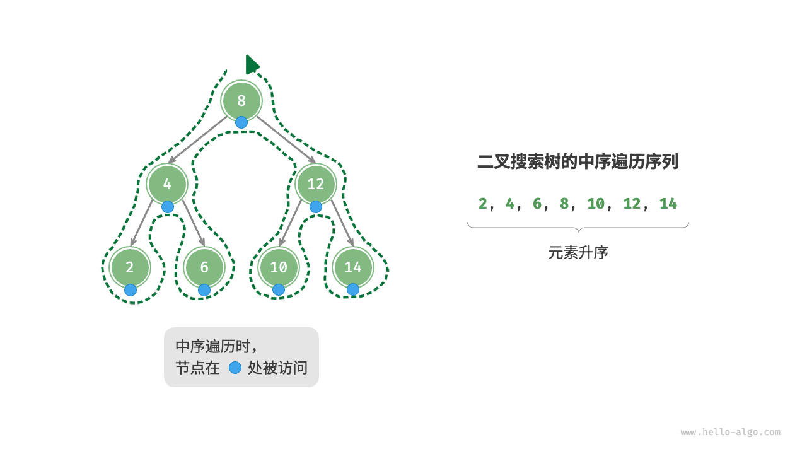

## 二叉搜索树的效率

给定一组数据，我们考虑使用数组或二叉搜索树存储。

观察可知，二叉搜索树的各项操作的时间复杂度都是对数阶，具有稳定且高效的性能表现。只有在高频添加、低频查找删除的数据适用场景下，数组比二叉搜索树的效率更高。

<div class="center-table" markdown>

|          | 无序数组 | 二叉搜索树  |
| -------- | -------- | ----------- |
| 查找元素 | $O(n)$   | $O(\log n)$ |
| 插入元素 | $O(1)$   | $O(\log n)$ |
| 删除元素 | $O(n)$   | $O(\log n)$ |

</div>

在理想情况下，二叉搜索树是“平衡”的，这样就可以在 $\log n$ 轮循环内查找任意节点。

然而，如果我们在二叉搜索树中不断地插入和删除节点，可能导致二叉树退化为链表，这时各种操作的时间复杂度也会退化为 $O(n)$ 。

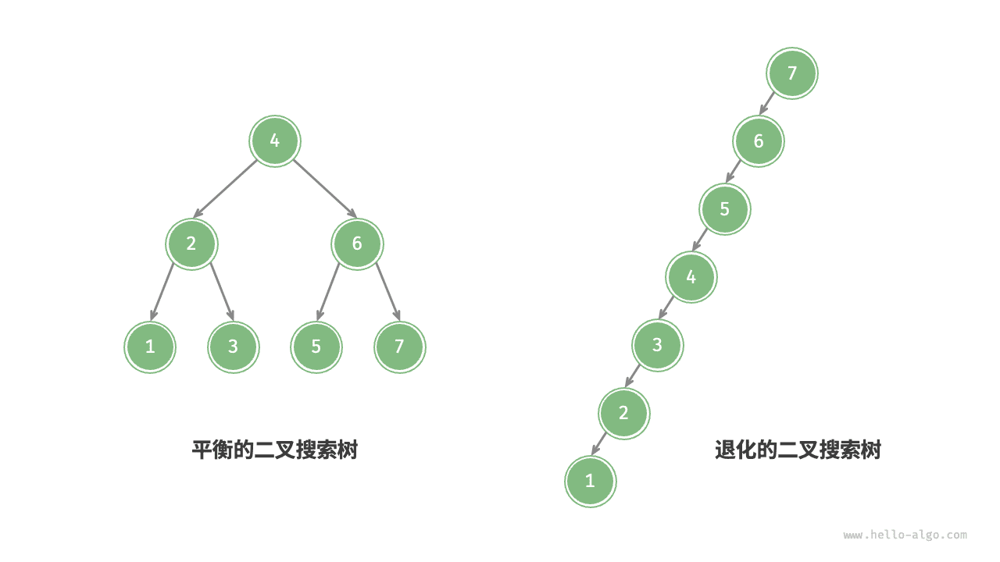

## 二叉搜索树常见应用

- 用作系统中的多级索引，实现高效的查找、插入、删除操作。
- 作为某些搜索算法的底层数据结构。
- 用于存储数据流，以保持其有序状态。
